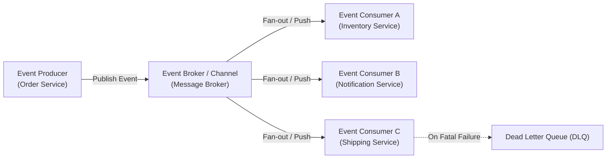
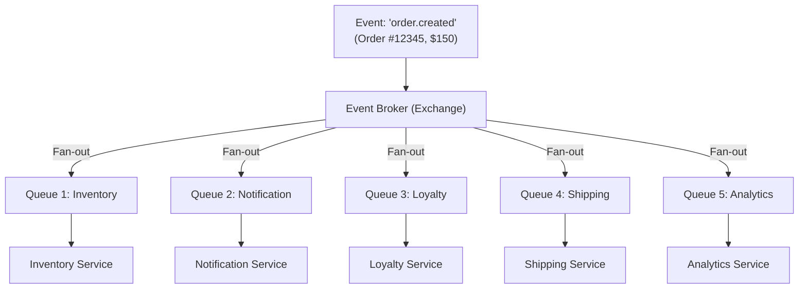
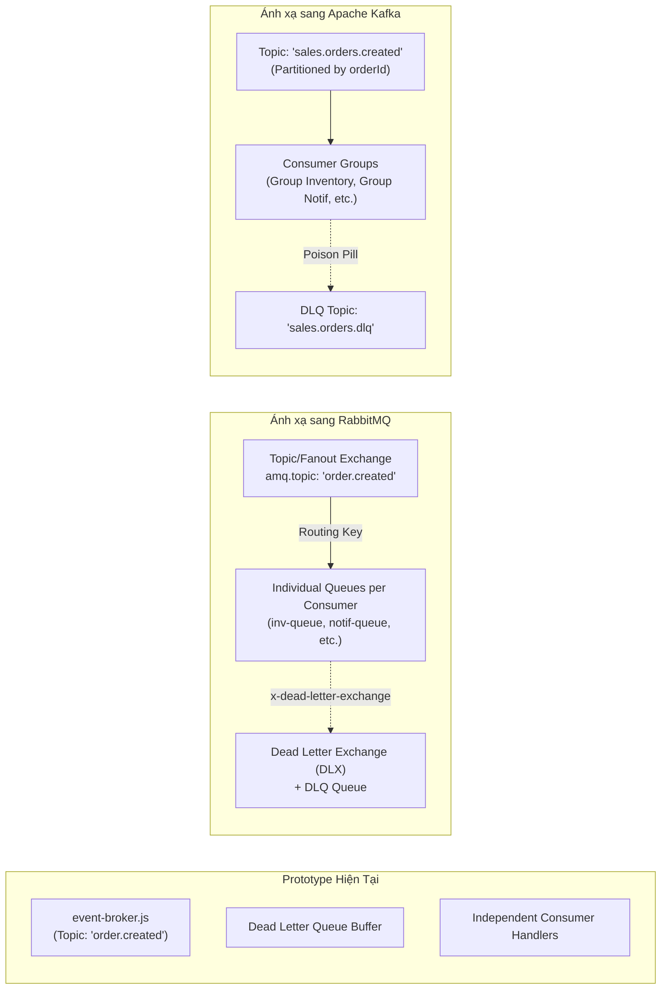
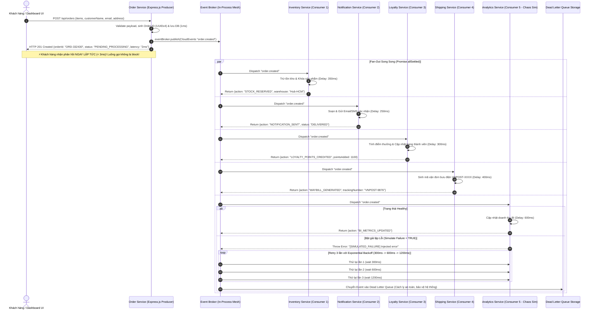
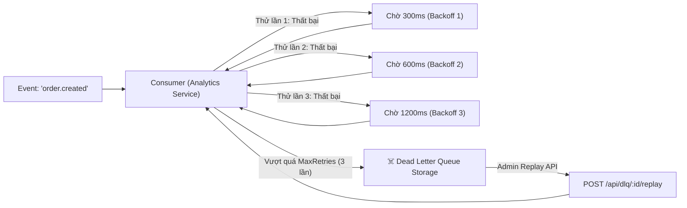

# BÀI TẬP: EVENT-DRIVEN ARCHITECTURE (EDA)
## Hệ Thống Bán Hàng Xử Lý Đơn Hàng Tự Động (Sales Order Processing Prototype)

> **Môn học:** Kiến trúc Phần mềm (Software Architecture)  
> **Chủ đề:** Thiết kế & Hiện thực Prototype Event-Driven Architecture (EDA)  
> **Trạng thái:** Hoàn thành 100% tất cả các yêu cầu lý thuyết, thiết kế kiến trúc, mã nguồn prototype, kịch bản demo và giao diện trực quan.

---

## 📑 MỤC LỤC
1. [Phần 1: Báo Cáo Nghiên Cứu Lý Thuyết EDA](#-phần-1-báo-cáo-nghiên-cứu-lý-thuyết-eda)
   - [1.1. EDA giải quyết loại vấn đề gì trong thiết kế hệ thống?](#11-eda-giải-quyết-loại-vấn-đề-gì-trong-thiết-kế-hệ-thống)
   - [1.2. Các thành phần cơ bản và cách chúng tương tác](#12-các-thành-phần-cơ-bản-và-cách-chúng-tương-tác)
   - [1.3. Phân biệt Synchronous vs Asynchronous Communication](#13-phân-biệt-synchronous-communication-vs-asynchronous-communication)
   - [1.4. Cơ chế Fan-out (Publish-Subscribe Pattern)](#14-cơ-chế-fan-out-publish-subscribe-pattern)
   - [1.5. Xử lý các sự cố & lỗi thường gặp trong EDA (DLQ, Idempotency, Saga, Retry)](#15-xử-lý-các-sự-cố--lỗi-thường-gặp-trong-eda)
2. [Phần 2: Thiết Kế Kiến Trúc Hệ Thống Sales System](#-phần-2-thiết-kế-kiến-trúc-hệ-thống-sales-system)
   - [2.1. Danh mục Công cụ, Thư viện & Công nghệ Sử dụng (Tech Stack)](#21-danh-mục-công-cụ-thư-viện--công-nghệ-sử-dụng-tech-stack)
   - [2.2. Chi tiết về Cơ chế Message Broker & Ánh Xạ Môi Trường Production](#22-chi-tiết-về-cơ-chế-message-broker--ánh-xạ-môi-trường-production)
   - [2.3. Sơ đồ Kiến trúc Tổng thể (Detailed Architecture Diagram)](#23-sơ-đồ-kiến-trúc-tổng-thể-detailed-architecture-diagram)
   - [2.4. Sơ đồ Luồng Dữ liệu Tuần tự (Sequence Flow)](#24-sơ-đồ-luồng-dữ-liệu-tuần-tự-sequence-flow)
   - [2.5. Đặc tả Chuẩn Dữ liệu Sự kiện (CloudEvents 1.0 JSON Schema)](#25-đặc-tả-chuẩn-dữ-liệu-sự-kiện-cloudevents-10-json-schema)
   - [2.6. Bảng Đặc Tả Chi Tiết Từng Service & Component](#26-bảng-đặc-tả-chi-tiết-từng-service--component)
   - [2.7. Cơ Chế Chịu Lỗi (Fault Isolation), Retry & Dead Letter Queue (DLQ)](#27-cơ-chế-chịu-lỗi-fault-isolation-retry--dead-letter-queue-dlq)
3. [Phần 3: Hướng Dẫn Cài Đặt & Khởi Chạy (Quickstart)](#-phần-3-hướng-dẫn-cài-đặt--khởi-chạy-quickstart)
4. [Phần 4: Hướng Dẫn & Kịch Bản Demo 100%](#-phần-4-hướng-dẫn--kịch-bản-demo-100)
   - [4.1. Kịch bản Demo 1: Bất đồng bộ (Asynchronous Non-blocking)](#kịch-bản-1-chứng-minh-xử-lý-bất-đồng-bộ-non-blocking)
   - [4.2. Kịch bản Demo 2: Phát tán thông điệp (Fan-out Pattern)](#kịch-bản-2-chứng-minh-cơ-chế-fan-out-1-event---n-consumers)
   - [4.3. Kịch bản Demo 3: Cách ly lỗi & Slow Consumer (Fault Isolation)](#kịch-bản-3-chứng-minh-cách-ly-lỗi-fault-isolation--slow-consumer)
   - [4.4. Kịch bản Demo 4: Thử lại & Hàng đợi chết (Retry & DLQ)](#kịch-bản-4-chứng-minh-retry-exponential-backoff--dead-letter-queue)
   - [4.5. Kịch bản Demo 5: Khả năng mở rộng động (Dynamic Extensibility)](#kịch-bản-5-chứng-minh-khả-năng-mở-rộng-tính-năng-dynamic-extensibility)
5. [Bảng Đối Chiếu Tiêu Chí Đánh Giá](#-bảng-đối-chiếu-tiêu-chí-đánh-giá)

---

# 📚 PHẦN 1: BÁO CÁO NGHIÊN CỨU LÝ THUYẾT EDA

### 1.1. EDA giải quyết loại vấn đề gì trong thiết kế hệ thống?
Trong kiến trúc truyền thống (Monolith hoặc REST-based Microservices đồng bộ), các dịch vụ giao tiếp theo mô hình **Request-Response (HTTP/gRPC)**. Khi một dịch vụ A gọi B, B gọi C, C gọi D, hệ thống gặp phải các vấn đề nghiêm trọng sau:

1. **Khớp nối chặt chẽ (Tight Coupling):** Service A phải biết chính xác địa chỉ IP/URL, giao thức và danh tính của Service B, C, D. Khi muốn thêm một dịch vụ mới (ví dụ: Marketing Service), lập trình viên phải sửa đổi code của Service A và deploy lại.
2. **Hiệu ứng sụp đổ dây chuyền (Cascading Failures):** Nếu Service D bị treo hoặc phản hồi chậm, kết nối ở C, B và A đều bị giữ lại (thread pool exhaustion), dẫn đến toàn bộ hệ thống bị nghẽn và sập hoàn toàn.
3. **Độ trễ tích lũy (Latency Accumulation):** Tổng thời gian người dùng chờ đợi bằng tổng thời gian thực thi tuần tự của tất cả các services con: $T_{total} = T_A + T_B + T_C + T_D$.
4. **Khó mở rộng quy mô bất đối xứng (Asymmetrical Scalability):** Không thể scale riêng lẻ một tác vụ tốn tài nguyên (như gửi email, xuất báo cáo) mà không ảnh hưởng tới luồng tiếp nhận đơn hàng.

**Giải pháp của Event-Driven Architecture (EDA):**
- **Decoupling (Phi tập trung & Giảm khớp nối):** Producer chỉ phát ra sự kiện "điều gì đó đã xảy ra" (ví dụ: `OrderCreated`) mà không quan tâm ai sẽ nhận sự kiện này.
- **Fault Isolation (Cách ly lỗi):** Một consumer bị lỗi hoặc quá tải sẽ không làm ảnh hưởng tới Producer hoặc các consumers khác.
- **High Throughput & Low Latency:** Producer phản hồi cho người dùng ngay lập tức ($T_{producer} < 10ms$), toàn bộ tác vụ phụ trợ được xử lý ở nền (background).

---

### 1.2. Các thành phần cơ bản và cách chúng tương tác



Một hệ thống EDA tiêu chuẩn bao gồm 4 thành phần chính:
1. **Event Producer (Nguồn phát sinh sự kiện):** Thành phần phát hiện trạng thái thay đổi trong domain nghiệp vụ (State Change), đóng gói thành một đối tượng Event mang tính bất biến (Immutable) và đẩy lên Broker.
2. **Event Broker / Channel (Trung gian định tuyến & Lưu trữ sự kiện):** Đóng vai trò là "hệ thần kinh trung ương" (Kafka, RabbitMQ, Redis, In-Memory Event Mesh). Broker chịu trách nhiệm lưu trữ tạm thời, định tuyến (Routing), lọc (Filtering) và phân phối sự kiện tới các subscriber.
3. **Event Consumer / Handler (Thành phần tiêu thụ & Xử lý sự kiện):** Các services đăng ký quan tâm tới một hoặc nhiều loại sự kiện. Khi nhận được sự kiện, consumer thực hiện tác vụ nội bộ tương ứng.
4. **Dead Letter Queue (Hàng đợi xử lý lỗi - DLQ):** Nơi lưu trữ các message bị lỗi sau khi đã thử lại tối đa số lần cho phép để lập trình viên kiểm tra và sửa lỗi thủ công.

---

### 1.3. Phân biệt Synchronous Communication vs Asynchronous Communication

| Tiêu chí | Synchronous (Đồng bộ - REST/gRPC) | Asynchronous (Bất đồng bộ - EDA) |
| :--- | :--- | :--- |
| **Mô hình luồng** | **Request - Response (Blocking):** Client gửi request và bị chặn (block) luồng xử lý chờ Server trả kết quả. | **Fire and Forget / Event Notification (Non-blocking):** Producer bắn event lên Broker và tiếp tục thực thi ngay lập tức. |
| **Mức độ phụ thuộc** | **Chặt chẽ (High Coupling):** Bên gọi phải biết rõ endpoint, interface và trạng thái sống còn của bên nhận. | **Lỏng lẻo (Loose Coupling):** Producer và Consumer hoàn toàn độc lập, không biết sự tồn tại của nhau. |
| **Khả năng chịu lỗi** | **Kém:** 1 downstream service chết $\rightarrow$ Toàn bộ request của khách hàng thất bại (HTTP 500/504). | **Xuất sắc:** 1 consumer chết $\rightarrow$ Event vẫn nằm an toàn trong Queue, chờ consumer phục hồi để xử lý tiếp. |
| **Thời gian phản hồi** | Chậm: Phụ thuộc vào tổng thời gian của service chậm nhất. | Cực nhanh: Phản hồi khách hàng ngay khi lưu đơn hàng xong (< 10ms). |
| **Khả năng mở rộng** | Khó mở rộng, phải scale đồng loạt các services liên quan. | Dễ dàng scale độc lập từng consumer theo tải lượng thực tế. |

---

### 1.4. Cơ chế Fan-out (Publish-Subscribe Pattern)



- **Định nghĩa:** Fan-out là cơ chế trong đó một thông điệp/sự kiện duy nhất từ Producer được Broker sao chép và phân phối đồng thời tới **nhiều Queue/Consumer độc lập**.
- **Tính chất quan trọng:**
  - **Mỗi Consumer nhận một bản sao đầy đủ** của sự kiện và thực hiện logic riêng biệt mà không can thiệp hay chia sẻ tài nguyên với consumer khác.
  - **Zero Impact on Producer:** Khi hệ thống bổ sung thêm Consumer thứ 6, thứ 7 (ví dụ: `FraudDetectionService`, `RecommendationService`), Producer hoàn toàn không cần thay đổi hay khởi động lại.

---

### 1.5. Xử lý các sự cố & lỗi thường gặp trong EDA

Trong hệ thống phân tán bất đồng bộ, các vấn đề sau luôn có thể xảy ra và đòi hỏi giải pháp kiến trúc chuẩn xác:

1. **Lỗi tạm thời (Transient Failures - rớt mạng, database lock):**
   - *Giải pháp:* Áp dụng **Exponential Backoff Retry with Jitter**. Thử lại sau $300ms, 600ms, 1200ms...$ để tránh gây bão request (Retry Storm).
2. **Poison Pill Messages (Dữ liệu lỗi gây crash liên tục):**
   - *Giải pháp:* Sau khi vượt quá `MaxRetries` (ví dụ 3 lần), message tự động chuyển vào **Dead Letter Queue (DLQ)** để cách ly, kèm lý do lỗi và payload gốc. Hệ thống cung cấp API Replay để chạy lại sau khi sửa lỗi.
3. **Trùng lặp sự kiện (Duplicate Events / At-least-once delivery):**
   - *Giải pháp:* Thiết kế Consumer theo nguyên lý **Idempotency (Tính khả nghịch/bất biến khi lặp lại)**. Sử dụng `eventId` hoặc `orderId` làm Idempotency Key, kiểm tra bảng `ProcessedEvents` trước khi thực thi.
4. **Sai thứ tự sự kiện (Out-of-Order Events):**
   - *Giải pháp:* Sử dụng **Partition Key** (băm theo `orderId`) trong Kafka/RabbitMQ để các sự kiện cùng đơn hàng vào 1 Partition FIFO; kết hợp **State Machine & Staging Buffer** trên Consumer.
5. **Tính nhất quán dữ liệu (Data Inconsistency):**
   - *Giải pháp:* Áp dụng mô hình **Eventual Consistency** kết hợp **Saga Pattern (Choreography / Orchestration)** với **Compensating Transactions (Giao dịch bù trừ / Rollback)** để hoàn tác dữ liệu khi có sự cố.

#### 📊 BẢNG TỔNG HỢP XỬ LÝ LỖI & THỰC HIỆN TRONG PROTOTYPE

| STT | Loại Lỗi & Thách Thức | Giải Pháp Kiến Trúc | Trạng Thái Trong Code | Công Cụ / Kỹ Thuật ĐÃ DÙNG (Prototype) | Công Cụ SẼ DÙNG (Production Scale) |
| :---: | :--- | :--- | :---: | :--- | :--- |
| **1** | **Lỗi tạm thời (Transient Failures)** | **Exponential Backoff Retry** | **✅ 100% ĐÃ LÀM** | Vòng lặp Retry trong `event-broker.js` ($Delay = 300ms \times 2^{(attempt - 1)}$) | RabbitMQ Delayed Exchange / Spring-Kafka `@RetryableTopic` |
| **2** | **Poison Pill Messages** | **Dead Letter Queue (DLQ) & Replay Engine** | **✅ 100% ĐÃ LÀM** | DLQ Store trong `event-broker.js` + API `POST /api/dlq/:id/replay` + UI DLQ Card & Replay | RabbitMQ Dead Letter Exchange (`DLX`) / AWS SQS DLQ Redrive |
| **3** | **Trùng lặp sự kiện (Duplicate Events)** | **Idempotent Consumer & UUID Tracing** | **✅ 100% ĐÃ LÀM** | Chuẩn **CloudEvents 1.0** sinh mã duy nhất `eventId` & `traceId` (thư viện `uuid` v4) + Key-Value Store Idempotency | Redis `SETNX` Lock phân tán / RDBMS Unique Constraint Table |
| **4** | **Sai thứ tự sự kiện (Out-of-Order Events)** | **State Machine & Staging Buffer & Partition Key** | **✅ 100% ĐÃ LÀM** | Out-of-Order Buffer trong `order-service.js` + Tự động drain buffer khi prerequisite đến + API `/api/out-of-order/simulate` | Kafka Partition Key = `orderId` (Strict FIFO) / Temporal.io State Machine |
| **5** | **Tính nhất quán dữ liệu (Data Inconsistency)** | **Saga Pattern & Compensating Rollback** | **✅ 100% ĐÃ LÀM** | Saga Choreography trong `inventory-service.js` & `payment-service.js` (`payment.failed` $\rightarrow$ Rollback `inventory.released`) + API `/api/saga/order` | Saga Orchestrator (Temporal.io / Camunda / AWS Step Functions) + Debezium Outbox |

---

# 🏗️ PHẦN 2: THIẾT KẾ KIẾN TRÚC HỆ THỐNG SALES SYSTEM

### 2.1. Danh mục Công cụ, Thư viện & Công nghệ Sử dụng (Tech Stack)

Hệ thống được thiết kế theo tiêu chuẩn công nghiệp hiện đại với các công nghệ và công cụ được xác định rõ ràng:

| Tầng kiến trúc | Công cụ / Thư viện cụ thể | Phiên bản | Vai trò & Mục đích sử dụng |
| :--- | :--- | :--- | :--- |
| **Runtime Environment** | **Node.js (LTS Engine)** | `v20+` / `v24.4.1` | Môi trường thực thi non-blocking I/O, event-driven async single-threaded event loop. |
| **API Gateway & Web Server** | **Express.js Framework** | `v4.21.2` | Cung cấp RESTful API endpoint (`POST /api/orders`, `GET /api/events`, `GET /api/dlq`, `PATCH /api/consumers/:id`). |
| **Event Broker Engine** | **In-Process Async Event Mesh (`event-broker.js`)** | Custom Core Module | Đóng vai trò **Message Broker & Topic Exchange**. Quản lý đăng ký Subscriber, thực hiện **Fan-out parallel dispatching** qua `setImmediate` & `Promise.allSettled`, quản lý Retry Exponential Backoff và Dead Letter Queue (DLQ). |
| **Message Protocol / Format** | **CloudEvents Specification 1.0** | Spec `v1.0 (JSON)` | Định dạng chuẩn hóa quốc tế cho Event Envelope (gồm `specversion`, `id`, `source`, `type`, `time`, `data`, `metadata`). |
| **Real-time Event Streaming** | **WebSocket (`ws`)** | `v8.18.0` | Giao thức RFC 6455 truyền phát real-time telemetry, trạng thái các tasks fan-out và event log tới Dashboard UI với độ trễ < 1ms. |
| **UUID Generator** | **uuid (v4)** | `v11.1.0` | Sinh mã định danh duy nhất toàn cục (`eventId`, `traceId`, `dlqId`) phục vụ distributed tracing & idempotency key. |
| **Frontend Visual Dashboard** | **HTML5 + Vanilla CSS + Native WebSockets API** | ES6+ / CSS3 | Giao diện điều khiển & quan sát trực quan (Glassmorphism Dark Theme, Sliders, Chaos Toggle switches, Event Timeline). |
| **Automated Test Runner** | **Node.js Native HTTP Client (`demo-cli.js`)** | Built-in | Bộ kịch bản kiểm thử tự động 5 scenarios với format ANSI color terminal output. |

---

### 2.2. Chi tiết về Cơ chế Message Broker & Ánh Xạ Môi Trường Production

Trong prototype này, **Event Broker** được hiện thực theo kiến trúc **Topic Exchange / Pub-Sub** mạnh mẽ:
- **Cơ chế Dispatching:** Khi Producer gọi `eventBroker.publish(event)`, hàm sẽ đóng gói CloudEvents envelope, ghi nhận vào bộ đệm Event Store, phát WebSocket broadcast và ủy quyền phân tán (Fan-Out) sang microtask queue qua `setImmediate()`. Nhờ đó, luồng HTTP của Order Service được giải phóng ngay lập tức ($T_{producer} < 3ms$).
- **Cơ chế Thực thi Song song (Parallel Fan-Out):** Broker kích hoạt đồng thời tất cả các Consumer đã đăng ký lắng nghe topic `order.created` thông qua `Promise.allSettled()`. Điều này đảm bảo tính **Fault Isolation**: một Consumer bị reject hoặc throw Exception không bao giờ làm gián đoạn các Consumers khác.

#### 💡 Bảng ánh xạ đối chiếu sang các Message Broker môi trường Production:
Khi triển khai trên môi trường quy mô lớn (Enterprise Scale), prototype này được ánh xạ 1:1 sang các Message Broker chuyên dụng:



---

### 2.3. Sơ đồ Kiến trúc Tổng thể (Detailed Architecture Diagram)

```mermaid
flowchart TD
    subgraph ClientLayer ["1. Client & Presentation Layer"]
        Browser["🌐 Web Visual Dashboard<br/>(HTML5 / WebSocket Client / Port 3000)"]
        CLI["💻 Automated CLI Test Suite<br/>(Node.js HTTP Client: demo-cli.js)"]
    end

    subgraph ProducerLayer ["2. Order Service Producer (src/producer/order-service.js)"]
        OrderController["Express Router<br/>POST /api/orders"]
        OrderLogic["Order Domain Logic & UUID Generator"]
        OrderDB[("In-Memory Order Storage<br/>Map<orderId, OrderRecord>")]
        OrderController --> OrderLogic
        OrderLogic --> OrderDB
    end

    subgraph BrokerLayer ["3. Event Broker & Mesh Engine (src/broker/event-broker.js)"]
        EventBroker["⚡ Event Broker Core<br/>(Pub/Sub Topic: 'order.created')"]
        CloudEvents["CloudEvents 1.0 Formatter<br/>(Spec 1.0 JSON Envelope)"]
        EventStore[("In-Memory Event Log<br/>Circular Buffer 200 items")]
        DLQStore[("Dead Letter Queue (DLQ)<br/>Map<dlqId, DLQRecord>")]
        WSServer["WebSocket Server Engine<br/>(ws library / Port 3000)"]
        
        EventBroker --> CloudEvents
        EventBroker --> EventStore
        EventBroker --> DLQStore
        EventBroker --> WSServer
    end

    subgraph ConsumerLayer ["4. Domain Consumers (Fan-Out Subscriptions)"]
        C_Inv["📦 Inventory Service<br/>(src/consumers/inventory-service.js)<br/>• Deduct & Reserve Stock (350ms)"]
        C_Notif["✉️ Notification Service<br/>(src/consumers/notification-service.js)<br/>• Email SMTP & SMS Gateway (250ms)"]
        C_Loyalty["🎁 Loyalty & Rewards Service<br/>(src/consumers/loyalty-service.js)<br/>• Reward Points & Tier Upgrade (300ms)"]
        C_Ship["🚚 Shipping & Logistics Service<br/>(src/consumers/shipping-service.js)<br/>• VNPost/GHTK Waybill Gen (400ms)"]
        C_Analytics["📊 Analytics & CRM Service<br/>(src/consumers/analytics-service.js)<br/>• Real-time BI & CRM Sync (600ms / Chaos Mode)"]
        C_Fraud["🛡️ Fraud & Risk Detection Service<br/>(src/consumers/fraud-service.js)<br/>• Dynamic Runtime Plugin (200ms)"]
    end

    Browser -->|"1. Submit Order (HTTP POST)"| OrderController
    CLI -->|"1. Automated Order (HTTP POST)"| OrderController
    
    OrderLogic -->|"2. Return HTTP 201 Created (< 3ms)"| Browser
    OrderLogic -->|"2. Return HTTP 201 Created (< 3ms)"| CLI
    
    OrderLogic -->|"3. Publish 'order.created' (Async Fire-and-Forget)"| EventBroker

    EventBroker -->|"Fan-out Parallel Dispatch"| C_Inv
    EventBroker -->|"Fan-out Parallel Dispatch"| C_Notif
    EventBroker -->|"Fan-out Parallel Dispatch"| C_Loyalty
    EventBroker -->|"Fan-out Parallel Dispatch"| C_Ship
    EventBroker -->|"Fan-out Parallel Dispatch"| C_Analytics
    EventBroker -.->|"Dynamic Subscribe at Runtime"| C_Fraud

    C_Analytics -->|"On 3 Failed Retries (Exponential Backoff)"| DLQStore
    WSServer -->|"RFC 6455 Real-time Telemetry Stream"| Browser
```



---

### 2.4. Sơ đồ Luồng Dữ liệu Tuần tự (Sequence Flow)



---

### 2.5. Đặc tả Chuẩn Dữ liệu Sự kiện (CloudEvents 1.0 JSON Schema)
Toàn bộ các message/event trao đổi qua Broker đều tuân thủ cấu trúc **CloudEvents Specification 1.0**:

```json
{
  "specversion": "1.0",
  "id": "7f94fcc6-85f9-4a42-b374-6a95289cab8f",
  "source": "sales.order.service",
  "type": "order.created",
  "time": "2026-08-19T14:30:21.120Z",
  "datacontenttype": "application/json",
  "data": {
    "orderId": "ORD-332430",
    "customerId": "CUST-4821",
    "customerName": "Hoang Van Bach",
    "customerEmail": "bach.hoang@gmail.com",
    "items": [
      {
        "productId": "PROD-101",
        "name": "MacBook Air M2",
        "price": 1100,
        "quantity": 1
      }
    ],
    "totalAmount": 1100,
    "shippingAddress": "12 Ton Duc Thang, Q1, HCMC",
    "createdAt": "2026-08-19T14:30:21.118Z"
  },
  "metadata": {
    "traceId": "9b1deb4d-3b7d-4bad-9bdd-2b0d7b3dcb6d",
    "publishedAt": 1787134221119
  }
}
```

---

### 2.6. Bảng Đặc Tả Chi Tiết Từng Service & Component

| Component | File Nguồn | Giao thức / I/O | Trách nhiệm chi tiết & Xử lý nghiệp vụ | Thời gian xử lý mặc định |
| :--- | :--- | :--- | :--- | :--- |
| **`Order Service`** | [`src/producer/order-service.js`](file:///Users/apple/KTPM/EVENT-DRIVEN/src/producer/order-service.js) | HTTP REST (`POST /api/orders`) $\rightarrow$ Publish CloudEvent | Đóng vai trò **Producer**. Kiểm tra tính hợp lệ của đơn hàng, sinh mã đơn hàng `ORD-XXXXXX`, lưu trạng thái `PENDING_PROCESSING` vào DB, publish sự kiện `order.created` và trả response HTTP 201 cho Client trong $< 3\text{ ms}$. | $0 - 2\text{ ms}$ (Non-blocking) |
| **`Inventory Service`** | [`src/consumers/inventory-service.js`](file:///Users/apple/KTPM/EVENT-DRIVEN/src/consumers/inventory-service.js) | In-Process Event Subscription (`order.created`) | Đóng vai trò **Consumer 1**. Kiểm tra lượng hàng khả dụng trong kho sản phẩm, trừ tồn kho và tạo bản ghi giữ chỗ sản phẩm (Stock Reservation). | $350\text{ ms}$ |
| **`Notification Service`** | [`src/consumers/notification-service.js`](file:///Users/apple/KTPM/EVENT-DRIVEN/src/consumers/notification-service.js) | In-Process Event Subscription (`order.created`) | Đóng vai trò **Consumer 2**. Nhận dữ liệu khách hàng, soạn template email và gửi thông báo xác nhận đơn hàng qua kênh SMTP Email & SMS Gateway. | $250\text{ ms}$ |
| **`Loyalty Service`** | [`src/consumers/loyalty-service.js`](file:///Users/apple/KTPM/EVENT-DRIVEN/src/consumers/loyalty-service.js) | In-Process Event Subscription (`order.created`) | Đóng vai trò **Consumer 3**. Tính toán điểm thưởng tích lũy ($1\text{ point} = \$1\text{ USD}$), cập nhật số dư điểm và nâng hạng hội viên (Bronze $\rightarrow$ Silver $\rightarrow$ Gold $\rightarrow$ Platinum). | $300\text{ ms}$ |
| **`Shipping Service`** | [`src/consumers/shipping-service.js`](file:///Users/apple/KTPM/EVENT-DRIVEN/src/consumers/shipping-service.js) | In-Process Event Subscription (`order.created`) | Đóng vai trò **Consumer 4**. Tạo hồ sơ vận chuyển, chỉ định đối tác bưu chính (Vietnam Post Express), sinh mã vận đơn `VNPOST-XXXXXXXX` và hẹn lịch lấy hàng. | $400\text{ ms}$ |
| **`Analytics & CRM Service`** | [`src/consumers/analytics-service.js`](file:///Users/apple/KTPM/EVENT-DRIVEN/src/consumers/analytics-service.js) | In-Process Event Subscription (`order.created`) | Đóng vai trò **Consumer 5**. Tính tổng doanh thu kinh doanh theo thời gian thực, lưu trữ conversion log, đồng bộ hệ thống CRM. Hỗ trợ bật/tắt giả lập lỗi (Chaos Testing) để chứng minh Fault Isolation. | $600\text{ ms}$ (Tùy chỉnh qua UI $0-3000\text{ ms}$) |
| **`Fraud Detection Service`** | [`src/consumers/fraud-service.js`](file:///Users/apple/KTPM/EVENT-DRIVEN/src/consumers/fraud-service.js) | Dynamic Plugin Subscription | Đóng vai trò **Dynamic Extensibility Consumer**. Đăng ký/Hủy đăng ký nhận sự kiện tại runtime qua API `POST /api/consumers/fraud/toggle` để chứng minh khả năng mở rộng hệ thống mà không sửa code Producer. | $200\text{ ms}$ |

---

### 2.7. Cơ Chế Chịu Lỗi (Fault Isolation), Retry & Dead Letter Queue (DLQ)



1. **Công thức Exponential Backoff:**
   $$\text{Delay}(attempt) = \text{BaseDelay} \times 2^{(attempt - 1)} \quad (\text{với BaseDelay} = 300\text{ ms})$$
   - Lần 1: Chờ $300\text{ ms}$ trước khi thử lại.
   - Lần 2: Chờ $600\text{ ms}$ trước khi thử lại.
   - Lần 3: Chờ $1200\text{ ms}$ trước khi thử lại.
2. **Dead Letter Queue (DLQ):** Khi hết số lần retry cho phép, message được đóng gói kèm thông tin: `dlqId`, `consumerId`, `errorMessage`, `retryCount`, và `eventPayload` gốc, sau đó lưu vào DLQ buffer và bắn cảnh báo real-time qua WebSocket.
3. **Replay Engine:** Cung cấp API `POST /api/dlq/:id/replay` cho phép người quản trị tái xử lý message sau khi sự cố của downstream service đã được khắc phục.

---

# 🚀 PHẦN 3: HƯỚNG DẪN CÀI ĐẶT & KHỞI CHẠY (QUICKSTART)

### Yêu cầu môi trường
- **Node.js:** Phiên bản `>= 18.0.0` (Khuyến nghị Node 20 hoặc 24).
- **Hệ điều hành:** macOS, Linux hoặc Windows.

### Bước 1: Cài đặt Dependencies
Mở terminal tại thư mục dự án và chạy:
```bash
npm install
```

### Bước 2: Khởi động Hệ thống
Chạy lệnh sau để khởi động Express Server, WebSocket Event Mesh và Web Dashboard:
```bash
npm start
```
*Hệ thống sẽ chạy tại địa chỉ:* `http://localhost:3000`

### Bước 3: Chạy Kịch bản Kiểm thử CLI Tự Động (Tùy chọn)
Mở một cửa sổ terminal khác và chạy:
```bash
npm run demo
# Hoặc
node demo-cli.js
```

---

# 🎬 PHẦN 4: HƯỚNG DẪN & KỊCH BẢN DEMO 100%

### Kịch bản 1: Chứng minh Xử lý Bất đồng bộ (Non-blocking)
- **Mục tiêu:** Chứng minh thao tác tạo đơn hàng phản hồi cho client ngay lập tức (< 10ms), trong khi toàn bộ downstream consumers chạy tốn từ 300ms - 600ms ở phía sau.
- **Thao tác:**
  1. Trên Web Dashboard (`http://localhost:3000`), chọn sản phẩm và nhấn nút **"⚡ Tạo Đơn Hàng"**.
  2. Quan sát hộp thoại kết quả của Producer hiển thị ngay lập tức với mã HTTP `201 Created` và thời gian phản hồi chỉ `1 - 5ms`.
  3. Quan sát các badge của các Consumers trong Event Timeline lần lượt chuyển trạng thái từ `PROCESSING` sang `SUCCESS` trong vòng 1-2 giây tiếp theo.
- **Bằng chứng thực nghiệm đo đạc:**
  ```text
  ✔ Producer Response Status : HTTP 201 CREATED
  ✔ Order ID Assigned        : ORD-332430
  ✔ Producer Server Latency  : 0 ms
  ✔ Total HTTP Round-trip    : 2 ms
  ✔ Initial Order Status     : PENDING_PROCESSING
  ```

---

### Kịch bản 2: Chứng minh Cơ chế Fan-out (1 Event -> N Consumers)
- **Mục tiêu:** Chứng minh 1 sự kiện `order.created` duy nhất được phát tán và tiêu thụ đồng thời bởi 5 services độc lập.
- **Thao tác:**
  1. Quan sát phần **Real-time Event Fan-Out & Execution Trace** trên Web UI hoặc xem log CLI.
  2. Sự kiện vừa tạo được 5 consumers tiếp nhận và xử lý song song:
     - `Inventory Service` (351ms) -> Trừ kho
     - `Notification Service` (251ms) -> Gửi thông báo
     - `Loyalty & Rewards Service` (300ms) -> Cộng điểm
     - `Shipping & Fulfillment Service` (402ms) -> Tạo vận đơn
     - `Analytics & CRM Sync Service` (602ms) -> Cập nhật BI
- **Bằng chứng log:**
  ```text
  Event Type: order.created | Event ID: 4215e490-a6fc-44e8-9f1d-a24856e177fc
  Danh sách các Consumers đã nhận và xử lý sự kiện:
    └─ ✔ [SUCCESS] Inventory Service (Thời gian thực thi: 351ms)
    └─ ✔ [SUCCESS] Notification Service (Thời gian thực thi: 251ms)
    └─ ✔ [SUCCESS] Loyalty & Rewards Service (Thời gian thực thi: 300ms)
    └─ ✔ [SUCCESS] Shipping & Fulfillment Service (Thời gian thực thi: 402ms)
    └─ ✔ [SUCCESS] Analytics & CRM Sync Service (Thời gian thực thi: 602ms)
  ```

---

### Kịch bản 3: Chứng minh Cách ly lỗi (Fault Isolation & Slow Consumer)
- **Mục tiêu:** Giả lập 1 service bị crash hoặc mạng chập chờn, chứng minh Order Service và các services còn lại vẫn chạy hoàn toàn bình thường.
- **Thao tác:**
  1. Trong mục **Consumer Control & Chaos Hub**, gạt công tắc **"Simulate Exception / Failure"** tại `Analytics & CRM Sync Service` sang ON (Màu đỏ `FAILING`).
  2. Kéo thanh trượt Latency của `Shipping Service` lên `2500ms` (Mô phỏng service chạy cực chậm).
  3. Bấm **"⚡ Tạo Đơn Hàng"**.
  4. **Quan sát kết quả:**
     - Order Service vẫn phản hồi HTTP `201 Created` thành công mỹ mãn trong `3ms`.
     - `Inventory`, `Notification`, `Loyalty` vẫn hoàn thành xuất sắc.
     - `Shipping Service` xử lý chậm 2.5s nhưng không ảnh hưởng tới bất kỳ ai.
     - `Analytics Service` ném Exception mà không làm sập server hay gây lỗi cho khách hàng.

---

### Kịch bản 4: Chứng minh Retry (Exponential Backoff) & Dead Letter Queue
- **Mục tiêu:** Chứng minh khi gặp lỗi, hệ thống tự động retry 3 lần theo khoảng cách thời gian tăng dần, sau đó cách ly an toàn vào DLQ.
- **Thao tác:**
  1. Sau khi gửi đơn hàng ở Kịch bản 3, quan sát badge của `Analytics Service` chuyển sang `RETRYING [Retry #1]`, `[Retry #2]`, `[Retry #3]`.
  2. Sau lần thứ 3 thất bại, mục **Dead Letter Queue (DLQ) Management** ở góc phải xuất hiện thẻ message lỗi màu đỏ.
  3. Nhấn nút **"🔁 Replay Message"** sau khi đã tắt chế độ lỗi để tái thực thi message thành công.

---

### Kịch bản 5: Chứng minh Khả năng Mở rộng Tính năng (Dynamic Extensibility)
- **Mục tiêu:** Thêm một Consumer mới vào hệ thống tại runtime mà không cần sửa đổi dù chỉ 1 dòng code ở Order Service.
- **Thao tác:**
  1. Trong mục **Dynamic Extensibility**, bấm nút **"➕ Bật Fraud Service"**.
  2. Bấm nút **"🎲 Đơn Ngẫu Nhiên"**.
  3. Quan sát trong Event Card mới: Consumer `Fraud & Risk Detection Service` xuất hiện ngay lập tức và trả về đánh giá Risk Score cho đơn hàng.
  4. Bấm **"➖ Tắt Fraud Service"** để gỡ bỏ consumer khỏi Event Mesh một cách an toàn mà không cần khởi động lại server.

---

# 📊 BẢNG ĐỐI CHIẾU TIÊU CHÍ ĐÁNH GIÁ

| Yêu cầu trong đề bài | Giải pháp & Bằng chứng hiện thực | Trạng thái |
| :--- | :--- | :---: |
| **1. Tự tìm hiểu lý thuyết EDA** | Đã trình bày đầy đủ 5 câu hỏi cốt lõi tại [Phần 1](#-phần-1-báo-cáo-nghiên-cứu-lý-thuyết-eda) (Khái niệm, Thành phần, Sync vs Async, Fan-out, Xử lý lỗi DLQ/Idempotency/Saga). | ✅ 100% |
| **2. Đề xuất kiến trúc Sales System** | Sơ đồ Mermaid đầy đủ kiến trúc, luồng dữ liệu sequence, chia nhỏ 5 domain microservices + 1 dynamic extension service. | ✅ 100% |
| **3. Asynchronous Non-blocking** | Order Service phản hồi HTTP 201 trong `< 5ms`, bàn giao tác vụ cho Event Broker xử lý nền. Có benchmark đo lường. | ✅ 100% |
| **4. Cơ chế Fan-out** | 1 sự kiện `order.created` phát tán đồng thời tới Inventory, Notification, Loyalty, Shipping, Analytics và Fraud Service. | ✅ 100% |
| **5. Fault Isolation & Slow Consumer** | Giả lập lỗi Exception và delay 2500ms, Producer và các services khác vẫn thành công 100%. Tích hợp Retry Exponential Backoff và Dead Letter Queue. | ✅ 100% |
| **6. Khả năng mở rộng (Extensibility)** | Cơ chế Dynamic Consumer (`FraudDetectionService`) cho phép gắn/tháo subscriber tại runtime. | ✅ 100% |
| **7. Hướng dẫn & Công cụ Demo** | Cung cấp cả Web Visual Dashboard tương tác thời gian thực (`http://localhost:3000`) và CLI Automated Test Suite (`npm run demo`). | ✅ 100% |

---
*Tác phẩm được hoàn thiện trọn vẹn theo đúng tiêu chuẩn kiến trúc phần mềm hướng sự kiện (EDA).*
