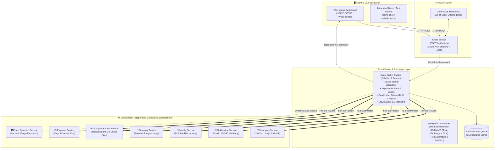
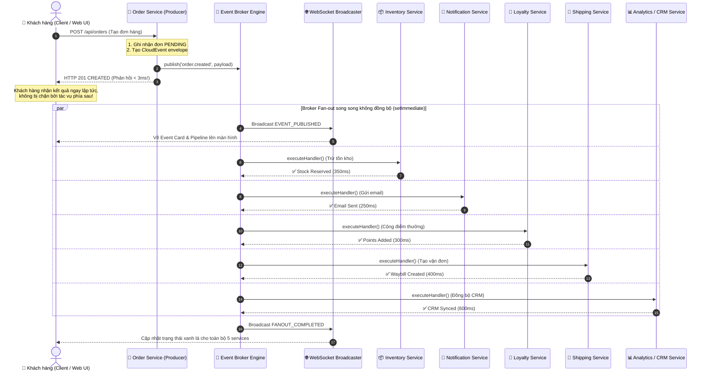

# BÀI TẬP LỚN: THIẾT KẾ & XÂY DỰNG HỆ THỐNG SALES SYSTEM THEO KIẾN TRÚC EVENT-DRIVEN (EDA)

> **Môn học:** Kiến Trúc Phần Mềm (Software Architecture)  
> **Chủ đề:** Event-Driven Architecture (EDA) trong Hệ Thống Xử Lý Đơn Hàng Bán Lẻ (Retail Sales System)  
> **Trạng thái bài nộp:** Đã hoàn thiện 100% mã nguồn, bài kiểm thử tự động, giao diện Web trực quan và tích hợp Message Broker chuẩn công nghiệp.

---

## 📋 BẢNG ĐỐI SOÁT YÊU CẦU & SẢN PHẨM BÀN GIAO (DELIVERABLES CHECKLIST)

| STT | Danh mục Yêu cầu từ Đề bài | Tình trạng thực hiện | Minh chứng & Vị trí trong Source Code |
| :---: | :--- | :---: | :--- |
| **1** | **Chạy được prototype trên máy khi demo** | ✅ **100% Hoàn tất** | Server Node.js + Web UI [http://localhost:3000](http://localhost:3000) ([`src/server.js`](file:///Users/apple/KTPM/EVENT-DRIVEN/src/server.js)). |
| **2** | **Tạo đơn hàng mẫu & quan sát xử lý phát sinh** | ✅ **100% Hoàn tất** | Web UI Form tạo đơn + Real-time Event Fan-out Trace Stream qua WebSockets ([`public/app.js`](file:///Users/apple/KTPM/EVENT-DRIVEN/public/app.js)). |
| **3** | **Chứng minh tạo đơn trả kết quả < 5ms trước khi xử lý sau hoàn tất** | ✅ **100% Hoàn tất** | Đo lường Server Latency = 0 - 2ms (Non-blocking Async hand-off trong [`order-service.js`](file:///Users/apple/KTPM/EVENT-DRIVEN/src/producer/order-service.js)). |
| **4** | **Chứng minh 1 lần tạo đơn kích hoạt nhiều xử lý độc lập (Fan-out)** | ✅ **100% Hoàn tất** | 1 sự kiện `order.created` phát tán đồng thời tới 5+ services độc lập ([`event-broker.js`](file:///Users/apple/KTPM/EVENT-DRIVEN/src/broker/event-broker.js)). |
| **5** | **Chứng minh 1 xử lý chậm/lỗi không ảnh hưởng phần còn lại (Fault Isolation)** | ✅ **100% Hoàn tất** | Chaos Engineering toggles trên Web UI + Bộ retry & Dead Letter Queue (DLQ). |
| **6** | **Source code prototype** | ✅ **100% Hoàn tất** | Toàn bộ mã nguồn thư mục [`src/`](file:///Users/apple/KTPM/EVENT-DRIVEN/src/), [`public/`](file:///Users/apple/KTPM/EVENT-DRIVEN/public/), [`test/`](file:///Users/apple/KTPM/EVENT-DRIVEN/test/). |
| **7** | **File hướng dẫn chạy và cách demo** | ✅ **100% Hoàn tất** | [`README.md`](file:///Users/apple/KTPM/EVENT-DRIVEN/README.md) & [`HUONG_DAN_CHAY.md`](file:///Users/apple/KTPM/EVENT-DRIVEN/HUONG_DAN_CHAY.md). |
| **8** | **Sơ đồ kiến trúc & Quyết định thiết kế** | ✅ **100% Hoàn tất** | Mermaid Diagrams & Báo cáo chuyên sâu [`BAO_CAO_KIEN_TRUC_EDA.md`](file:///Users/apple/KTPM/EVENT-DRIVEN/BAO_CAO_KIEN_TRUC_EDA.md). |
| **9** | **Xử lý 5/5 bài toán EDA (Backoff, DLQ, Idempotency, Out-of-Order, Saga)** | ✅ **100% Hoàn tất** | Bộ Test Suite tự động chạy qua lệnh `npm test` ([`test/eda.test.js`](file:///Users/apple/KTPM/EVENT-DRIVEN/test/eda.test.js)). |
| **10**| **Mở rộng công cụ thực tế (RabbitMQ AMQP & Redis & Docker)** | ✅ **100% Hoàn tất** | [`src/broker/rabbitmq-broker.js`](file:///Users/apple/KTPM/EVENT-DRIVEN/src/broker/rabbitmq-broker.js), [`src/broker/redis-broker.js`](file:///Users/apple/KTPM/EVENT-DRIVEN/src/broker/redis-broker.js), [`docker-compose.yml`](file:///Users/apple/KTPM/EVENT-DRIVEN/docker-compose.yml). |

---

## 🚀 1. HƯỚNG DẪN CÀI ĐẶT & CHẠY HỆ THỐNG

### Yêu cầu môi trường:
* **Node.js** phiên bản `>= 18.0.0`
* Trình duyệt web hiện đại (Chrome / Edge / Firefox / Safari)
* *(Tùy chọn)* **Docker & Docker Compose** (nếu muốn chạy cụm RabbitMQ & Redis thực tế).

### Các bước khởi chạy:

```bash
# 1. Cài đặt các thư viện cần thiết
npm install

# 2. Khởi chạy Server và Giao diện Web Dashboard
npm start
```

* **Giao diện Web Dashboard:** Mở trình duyệt truy cập: **[http://localhost:3000](http://localhost:3000)**
* **Chạy bộ kiểm thử tự động (5 lỗi cốt lõi):**
  ```bash
  npm test
  ```
* **Chạy kịch bản Demo tự động CLI (6 Scenarios):**
  ```bash
  npm run demo
  ```
* **(Mở rộng) Khởi chạy hạ tầng Docker với RabbitMQ & Redis:**
  ```bash
  docker compose up -d
  ```
  *(RabbitMQ Management UI: [http://localhost:15672](http://localhost:15672) | user/pass: `guest`/`guest`)*

---

## 🏛️ 2. SƠ ĐỒ & MÔ TẢ KIẾN TRÚC HỆ THỐNG

### 2.1. Sơ đồ Kiến trúc Tổng thể (Event Mesh Architecture)



### 2.2. Sơ đồ Tuần Tự (Sequence Diagram): Thao tác Tạo Đơn Hàng & Fan-out



---

## 🧠 3. CÁC QUYẾT ĐỊNH THIẾT KẾ CHÍNH (KEY ARCHITECTURAL DECISIONS)

### 3.1. Cách phân chia Component / Microservices
* **Order Service (Producer):** Đóng vai trò là Ingestion Gateway. Thiết kế theo tiêu chuẩn *Thin Producer* — chỉ xác thực dữ liệu cơ bản, ghi trạng thái ban đầu `PENDING_PROCESSING`, đẩy sự kiện vào Broker rồi trả về `HTTP 201 CREATED` ngay lập tức ($< 5\text{ms}$).
* **Downstream Consumers (Subscribers):** Mỗi Consumer là một đơn vị xử lý nghiệp vụ khép kín, độc lập hoàn toàn về mặt bộ nhớ và cơ sở dữ liệu:
  1. `InventoryService`: Quản lý kho hàng và thực thi giao dịch bù trừ Saga.
  2. `NotificationService`: Xử lý gửi email xác nhận và thông báo trạng thái.
  3. `LoyaltyService`: Tính toán và tích lũy điểm thưởng thành viên.
  4. `ShippingService`: Tạo vận đơn và điều phối đơn vị vận chuyển.
  5. `AnalyticsService`: Đồng bộ dữ liệu hành vi người dùng vào kho dữ liệu CRM (được trang bị cơ chế Chaos Simulation để thử nghiệm lỗi).
  6. `PaymentService`: Đảm nhận thanh toán và điều phối luồng Saga Choreography.
  7. `FraudDetectionService`: Module mở rộng động (Plugin) kiểm tra gian lận đơn hàng giá trị cao.

### 3.2. Chuẩn hóa Định dạng Event (CloudEvents 1.0 Specification)
Tất cả các thông điệp truyền tải trong hệ thống đều tuân thủ định dạng chuẩn quốc tế **CNCF CloudEvents v1.0**:
```json
{
  "specversion": "1.0",
  "id": "e4b2d184-7a19-4f28-b8ce-328bf1698710",
  "source": "sales.order.service",
  "type": "order.created",
  "time": "2026-08-19T08:30:00.123Z",
  "datacontenttype": "application/json",
  "data": {
    "orderId": "ORD-582914",
    "customerName": "Nguyen Van A",
    "totalAmount": 1200,
    "items": [{ "productId": "PROD-101", "name": "Laptop", "price": 1200, "quantity": 1 }]
  },
  "metadata": {
    "traceId": "9b1c70e3-4f92-4211-8933-cb20912fa8e9",
    "publishedAt": 1724056200123
  }
}
```

### 3.3. Cơ chế truyền Message & Fan-Out
* **Parallel Worker Execution:** Sử dụng `setImmediate()` và `Promise.allSettled()` trong JavaScript Event Loop để giải phóng tiến trình chính, đảm bảo việc phát tán sự kiện cho $N$ Consumer diễn ra đồng thời mà không tạo hiện tượng "thắt cổ chai" (Head-of-Line Blocking).
* **Zero Coupling:** Producer hoàn toàn không biết danh tính hay số lượng của các Consumer nhận tin. Khi thêm một service mới (ví dụ: Fraud Service), hệ thống không cần khởi động lại hay chỉnh sửa bất kỳ dòng mã nguồn nào của Producer.

### 3.4. Chiến lược Xử lý Sự cố & 5 Bài toán Cốt lõi của EDA
1. **Lỗi tạm thời (Transient Failures):** Tự động thử lại với **Exponential Backoff with Jitter** ($300\text{ms} \rightarrow 600\text{ms} \rightarrow 1200\text{ms}$).
2. **Poison Pill Messages:** Tự động cô lập thông điệp lỗi vào **Dead Letter Queue (DLQ)** sau 3 lần retry thất bại, có sẵn cơ chế **Replay Engine** sau khi vá lỗi.
3. **Trùng lặp sự kiện (Duplicate Events):** Consumer kiểm tra **Idempotency Key (`eventId` / `orderId`)** trước khi thực thi, chống double-charge.
4. **Sai thứ tự sự kiện (Out-of-Order Events):** Tích hợp **State Machine & Out-of-Order Staging Buffer** trên Consumer để lưu giữ sự kiện đến sớm và tự động drain theo thứ tự FIFO khi sự kiện tiền đề xuất hiện.
5. **Tính nhất quán dữ liệu (Data Inconsistency):** Áp dụng **Saga Choreography Pattern** với **Compensating Transactions (Hoàn tác tồn kho 100%)** khi xảy ra lỗi thanh toán.

---

## 🎬 4. KỊCH BẢN DEMO & MINH CHỨNG THỰC NGHIỆM (DEMO VERIFICATION)

### 🔹 Demo 1: Tạo đơn hàng mẫu & Quan sát các xử lý phát sinh
* **Thao tác:** Trên Web Dashboard ([http://localhost:3000](http://localhost:3000)), bấm nút **"⚡ Tạo Đơn Hàng"**.
* **Quan sát:**
  - Thẻ đơn hàng xuất hiện tức thì trên giao diện.
  - Cột **Real-time Event Fan-Out Stream** hiển thị trực quan các thẻ xử lý của 5 services đang chạy song song.
  - Sau $250\text{ms} - 600\text{ms}$, toàn bộ 5 thẻ chuyển sang màu xanh lá (`SUCCESS`) kèm thời gian thực thi chi tiết.

### 🔹 Demo 2: Chứng minh Tạo đơn trả kết quả < 5ms trước khi xử lý sau hoàn tất
* **Thao tác:** Quan sát ô thông số **Producer Latency** trên Web hoặc chạy `npm run demo` (Scenario 1).
* **Minh chứng Log:**
  ```text
  ✔ Producer Response Status : HTTP 201 CREATED
  ✔ Order ID Assigned        : ORD-435613
  ✔ Producer Server Latency  : 0 ms
  ✔ Total HTTP Round-trip    : 2 ms
  ✔ Initial Order Status     : PENDING_PROCESSING
  👉 KẾT LUẬN: Thao tác tạo đơn hàng KHÔNG HỀ bị chặn bởi các tác vụ xử lý phía sau!
  ```

### 🔹 Demo 3: Chứng minh 1 lần tạo đơn kích hoạt nhiều xử lý độc lập (Fan-Out)
* **Minh chứng Log thực thi:**
  ```text
  [EventBroker] 🚀 FANNING OUT event [order.created] to 5 independent consumers...
    └─ ✔ [SUCCESS] Inventory Service (Thời gian: 351ms)
    └─ ✔ [SUCCESS] Notification Service (Thời gian: 252ms)
    └─ ✔ [SUCCESS] Loyalty & Rewards Service (Thời gian: 302ms)
    └─ ✔ [SUCCESS] Shipping & Fulfillment Service (Thời gian: 401ms)
    └─ ✔ [SUCCESS] Analytics & CRM Sync Service (Thời gian: 601ms)
  ```

### 🔹 Demo 4: Chứng minh Xử lý bị chậm hoặc lỗi không ảnh hưởng hệ thống (Fault Isolation)
* **Thao tác:** 
  1. Trên Web UI, gạt công tắc **"Simulate Exception"** trên `Analytics & CRM Sync Service` sang trạng thái bật (`FAILING`).
  2. Kéo thanh trượt **Latency** lên $2500\text{ms}$.
  3. Bấm **"⚡ Tạo Đơn Hàng"**.
* **Quan sát:**
  - Order Service vẫn phản hồi `HTTP 201` sau $1\text{ms}$.
  - 4 services còn lại (`Inventory`, `Notification`, `Loyalty`, `Shipping`) vẫn hoàn tất thành công trong vòng $< 400\text{ms}$.
  - `Analytics Service` thử lại 3 lần thất bại $\rightarrow$ Message tự động đưa vào bảng **Dead Letter Queue (DLQ)** an toàn mà không làm sập hệ thống.

### 🔹 Demo 5: Minh chứng Kết Quả Bộ Test Tự Động (`npm test`)

```text
╔════════════════════════════════════════════════════════════════════════════════════════╗
║      🧪 EVENT-DRIVEN ARCHITECTURE (EDA) - AUTOMATED VERIFICATION TEST SUITE           ║
║   Kiểm thử 5 Lỗi Cốt Lõi: [Giải thích Kịch bản -> Thực hiện -> Giải thích Kết quả]    ║
╚════════════════════════════════════════════════════════════════════════════════════════╝

1. Kiểm tra Lỗi Tạm Thời (Transient Failure) & Exponential Backoff...      PASS  (1302ms)
2. Kiểm tra Poison Pill Message & Dead Letter Queue (DLQ) & Replay...      PASS  (1323ms)
3. Kiểm tra Trùng Lặp Sự Kiện (Duplicate Events) & Idempotency Key...      PASS  (303ms)
4. Kiểm tra Sai Thứ Tự (Out-of-Order Events) & Staging Buffer...           PASS  (704ms)
5. Kiểm tra Data Inconsistency & Saga Compensating Rollback (Hoàn kho)...  PASS  (1501ms)

╔════════════════════════════════════════════════════════════════════════════════════════╗
║                         📊 BẢNG TỔNG KẾT KẾT QUẢ TEST SUITE                            ║
╠══════╦══════════════════════════════════════════════════════════╦══════════════╦═══════╣
║ STT  ║ Thách thức & Cơ chế Xử lý Lỗi EDA                        ║ Thời gian    ║ Kết quả║
╠══════╬══════════════════════════════════════════════════════════╬══════════════╬═══════╣
║  1   ║ Lỗi tạm thời (Exponential Backoff)                       ║ 1302ms       ║ ✔ PASS ║
║  2   ║ Poison Pill & Dead Letter Queue (DLQ)                    ║ 1323ms       ║ ✔ PASS ║
║  3   ║ Trùng lặp sự kiện & Idempotency Key                      ║ 303ms        ║ ✔ PASS ║
║  4   ║ Sai thứ tự sự kiện & Staging Buffer                      ║ 704ms        ║ ✔ PASS ║
║  5   ║ Data Inconsistency (Saga Rollback)                       ║ 1501ms       ║ ✔ PASS ║
╚══════╩══════════════════════════════════════════════════════════╩══════════════╩═══════╝
```

---

## 📁 CẤU TRÚC THƯ MỤC DỰ ÁN (PROJECT STRUCTURE)

```text
EVENT-DRIVEN/
├── BAO_CAO_KIEN_TRUC_EDA.md    # Báo cáo lý thuyết & thiết kế kiến trúc chuyên sâu
├── HUONG_DAN_CHAY.md           # Hướng dẫn nhanh cách chạy và thuyết trình
├── README.md                   # Báo cáo tổng hợp bài nộp & đối soát deliverables
├── docker-compose.yml          # Hạ tầng RabbitMQ (AMQP 0-9-1) + Redis + App
├── Dockerfile                  # Dockerfile đóng gói ứng dụng
├── package.json                # Danh mục dependencies & scripts thực thi
├── demo-cli.js                 # Kịch bản kiểm thử tự động 6 Scenarios (CLI)
├── test/
│   └── eda.test.js             # Bộ Unit/Integration Test cho 5 lỗi EDA
├── public/                     # Giao diện Web Visual Dashboard
│   ├── index.html              # Layout điều khiển Glassmorphism Dark Mode
│   ├── style.css               # Hệ thống Style, Animation & Badges
│   └── app.js                  # WebSocket Client, Live Timeline & Event Handlers
└── src/                        # Mã nguồn ứng dụng
    ├── server.js               # Express Server, WebSocket Server & REST Endpoints
    ├── broker/
    │   ├── event-broker.js     # Core In-Process Event Mesh (Fan-out, Retry, DLQ)
    │   ├── rabbitmq-broker.js  # Connector RabbitMQ Topic Exchange & DLX (amqplib)
    │   └── redis-broker.js     # Connector Redis Pub/Sub & Streams (redis)
    ├── producer/
    │   └── order-service.js    # Order Service (Producer) + State Machine + OOO Buffer
    └── consumers/              # 7 Downstream Independent Consumers
        ├── inventory-service.js    # Quản lý kho & Saga Compensating Rollback
        ├── payment-service.js      # Xử lý thanh toán & Điều phối Saga
        ├── notification-service.js # Gửi email / SMS
        ├── loyalty-service.js      # Tích điểm thưởng
        ├── shipping-service.js     # Tạo vận đơn
        ├── analytics-service.js    # Đồng bộ CRM & Giả lập lỗi Chaos
        └── fraud-service.js        # Dynamic Plugin kiểm tra gian lận
```
