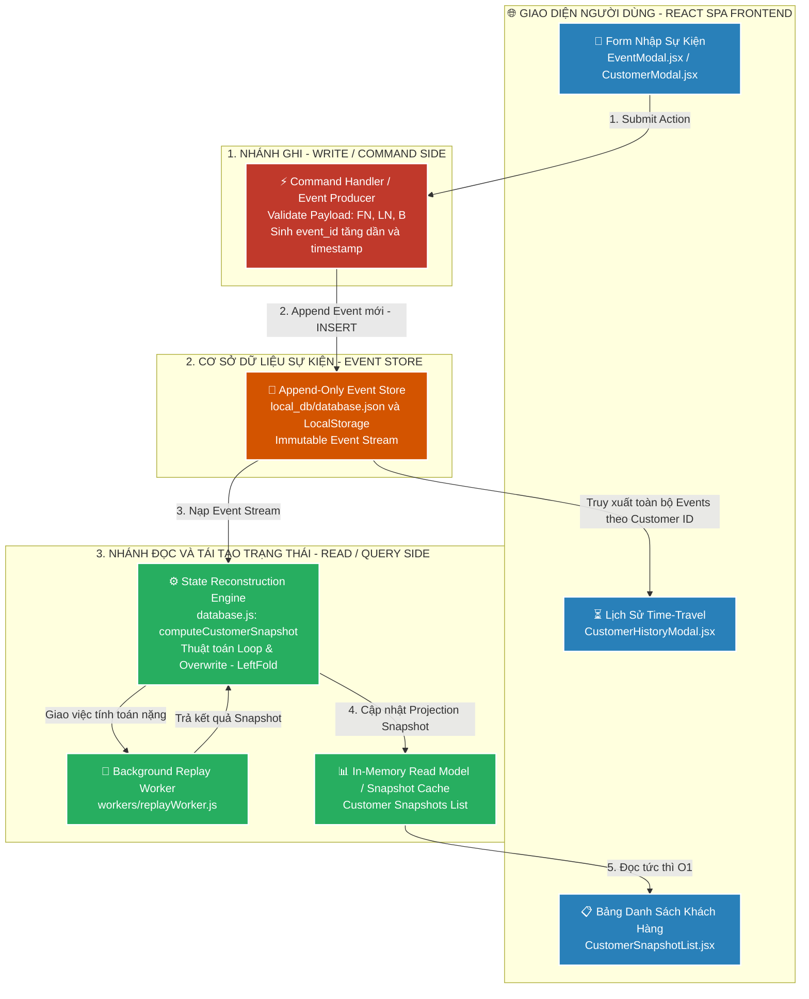
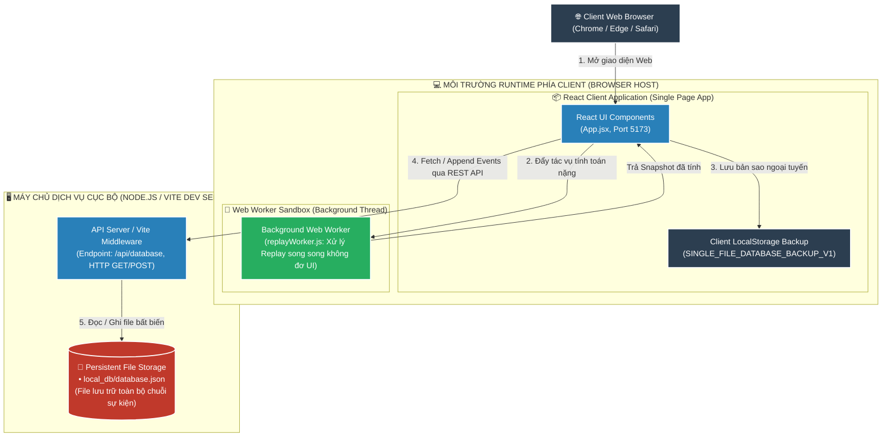
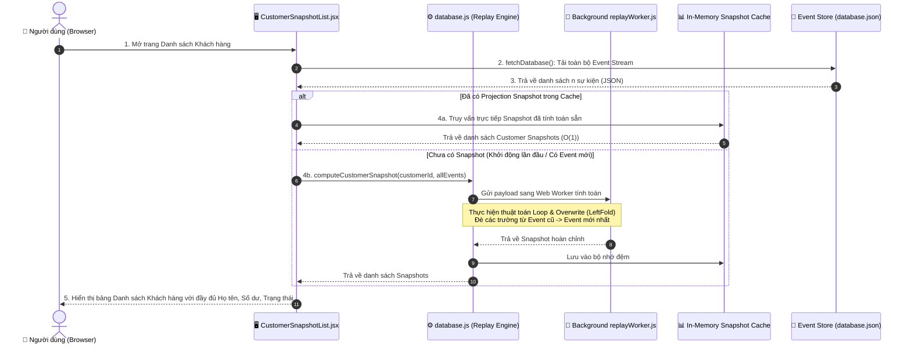
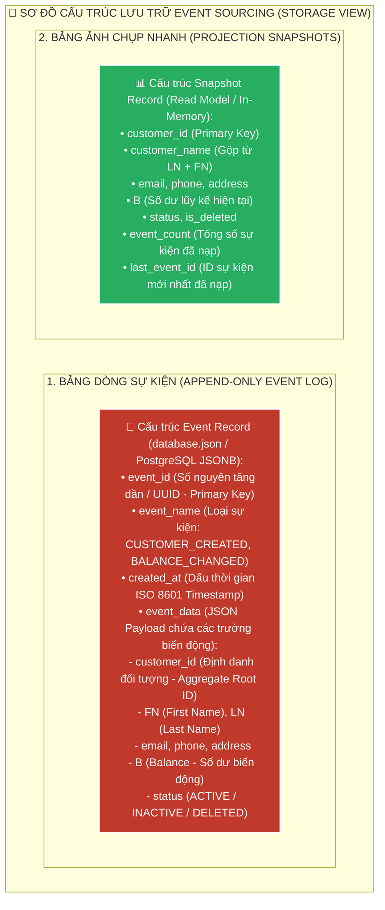
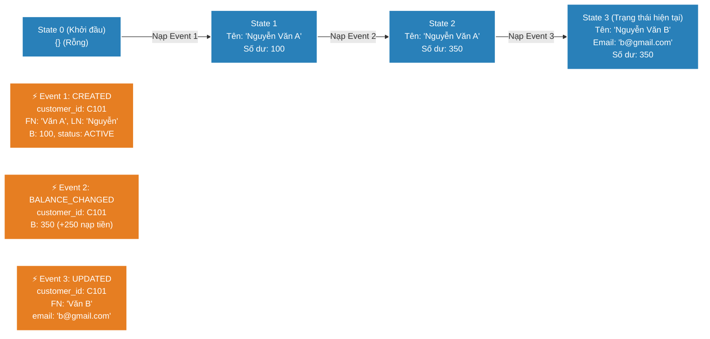

# 📘 TÀI LIỆU ÔN THI VẤN ĐÁP KTPM: MẪU THIẾT KẾ EVENT SOURCING (CÂU 13 - 16)
> **Môn học:** Kiến trúc Phần mềm (KTPM) | **Giảng viên:** TS. Ngô Huy Biên  
> **Case Study Thực Hành Trực Tiếp:** Dự án **Customer Event Sourcing Management** (`/Users/apple/KTPM/EVENT-SOURCING`)  
> *(Hệ thống Quản lý Khách hàng thuần Event Sourcing & CQRS với Event Log Append-Only, State Reconstruction Engine & Snapshotting)*  

---
---

# CÂU 13: Mẫu thiết kế Event Sourcing (Logic View & Quality Attributes)

---

### 13.1. Các đặc tính chất lượng mong muốn đạt được (Quality Attributes):

1. **Reliability & Auditability (Độ tin cậy & Khả năng kiểm toán 100%):**
   - **Sai lệch số dư tài chính ($\Delta$):** $= 0\text{ VNĐ}$ (đối soát lịch sử dòng tiền trùng khớp $100\%$).
   - **Tính bất biến (Immutability):** Event Store hoạt động theo mô hình **Append-Only** (chỉ `INSERT`, nghiêm cấm `UPDATE`/`DELETE`).

2. **Performance (Hiệu năng ghi thông lượng cao):**
   - **Độ trễ ghi sự kiện mới ($\text{Append Latency}$):** $< 5\text{ms}$ (không bị khóa bảng / Table Locking).
   - **Tốc độ tái tạo (Replay Speed):** $< 20\text{ms}$ để quét và tổng hợp $1.000\text{ sự kiện}$.

3. **Maintainability & State Replay (Khả năng bảo trì & Khôi phục sự cố):**
   - **Tính xác định (Determinism):** Tái tạo chính xác $100\%$ trạng thái khách hàng từ chuỗi sự kiện gốc khi Read Model bị xóa trắng.
   - **Khả năng du hành thời gian (Time-Travel):** Truy xuất trạng thái hệ thống tại bất kỳ thời điểm $T_k$ trong quá khứ.

4. **Scalability & CQRS (Khả năng mở rộng & Tách biệt Đọc/Ghi):**
   - **Tách biệt Đọc/Ghi (CQRS Decoupling):** $100\%$ (Nhánh Command ghi Append-Only, Nhánh Query đọc tức thì từ Snapshot Cache $O(1)$).

---

### 13.2. Công cụ & Phương pháp đo lường các đặc tính chất lượng:

#### 📊 Bảng đối chiếu 1-1 giữa Đặc tính chất lượng (13.1) và Công cụ đo lường chuyên dụng (13.2):

| STT | Đặc tính chất lượng (13.1) | Chỉ số mục tiêu (13.1) | Công cụ đo lường chuyên dụng (13.2) | Cơ chế đo lường & Xuất số liệu kỹ thuật (13.2) |
| :---: | :--- | :--- | :--- | :--- |
| **1** | **Auditability**<br>*(Kiểm toán dòng tiền)* | • Sai lệch $\Delta = 0\text{ đ}$<br>• Append-Only: $100\%$ | `Event Store Audit Inspector`<br>`Balance Delta Variance Tracker` | • **Audit Tracker:** Đối soát công thức $\text{Balance} = \text{Init} + \sum \text{Deposit} - \sum \text{Withdraw}$ đo sai số $\Delta = 0\text{ đ}$<br>• **Immutability Check:** Kiểm tra toàn bộ thao tác ghi chỉ dùng `Array.push()` |
| **2** | **Performance**<br>*(Ghi thông lượng cao)* | • Append $< 5\text{ms}$<br>• Zero Table Lock | `performance.now() Profiler`<br>`Event Loop Latency Monitor` | • **High-Res Timer:** Bấm giờ thao tác nối sự kiện vào `database.json` đạt $< 5\text{ms}$<br>• **Replay Speed:** Đo thời gian quét và tái tạo 1.000 sự kiện đạt $< 20\text{ms}$ |
| **3** | **State Replay**<br>*(Tái tạo trạng thái)* | • Trùng khớp $100\%$<br>• Rehydrate $< 20\text{ms}$ | `State Rehydration Verifier`<br>`Snapshot Integrity Inspector` | • **Integrity Inspector:** Xóa trắng RAM Cache, chạy thuật toán Left-Fold từ Event $1 \rightarrow N$<br>• **State Match Ratio:** Đo độ trùng khớp trạng thái khôi phục đạt $100\%$ |
| **4** | **CQRS Scalability**<br>*(Tách biệt Đọc/Ghi)* | • CQRS: $100\%$<br>• Đọc $O(1)$ tức thì | `Async CQRS Concurrency Monitor`<br>`Read/Write Latency Profiler` | • **Query Latency Profiler:** Đo thời gian đọc từ Snapshot Cache đạt $< 2\text{ms}$ ($O(1)$)<br>• **Concurrency Monitor:** Luồng đọc không bị block khi luồng ghi đang append |

---

#### 📝 Hướng dẫn trả lời chuẩn kỹ thuật khi vấn đáp với Giảng viên:

1. **Về Khả năng kiểm toán & Tính bất biến (Auditability & Immutability):**
   * *"Dạ thưa thầy, em sử dụng **Event Store Audit Inspector** để đo lường. Hệ thống đối soát dòng tiền bằng công thức $\text{Balance} = \text{Init} + \sum \text{Deposit} - \sum \text{Withdraw}$, sai lệch đo được là **$\Delta = 0\text{ VNĐ}$** và kiểm tra tệp `database.json` là Append-Only bất biến 100% ạ."*

2. **Về Hiệu năng ghi tuần tự (Performance):**
   * *"Dạ thưa thầy, em dùng hàm **`performance.now()`** để đo. Vì chỉ thực hiện thao tác nối tiếp ở cuối tệp (Append-Only) mà không cần tìm kiếm bản ghi để cập nhật hay khóa bảng (Zero Table Lock), độ trễ ghi đo được là **$< 5\text{ms}$** và tốc độ Replay đạt **$< 20\text{ms}$ / 1.000 sự kiện** ạ."*

3. **Về Tái tạo trạng thái khi gặp sự cố (State Replay & Disaster Recovery):**
   * *"Dạ thưa thầy, em dùng **State Rehydration Verifier** để đo. Khi xoá trắng toàn bộ bộ nhớ Cache, hàm `computeCustomerSnapshot()` thực thi thuật toán Left-Fold nạp lại toàn bộ chuỗi sự kiện và **tái tạo chính xác $100\%$ trạng thái** trong chưa đầy $20\text{ms}$ ạ."*

4. **Về Kiến trúc CQRS (Command Query Responsibility Segregation):**
   * *"Dạ thưa thầy, em đo bằng **Async CQRS Concurrency Monitor**. Nhánh Ghi (Command) chỉ lo ghi Event, còn Nhánh Đọc (Query) đọc trực tiếp từ bảng Snapshot sẵn có trong bộ nhớ với thời gian đáp ứng **$< 2\text{ms}$ ($O(1)$)**, hai luồng hoàn toàn độc lập và không nghẽn nhau ạ."*

---

### 13.3. Sơ đồ góc nhìn logic (Logic View) & Ghi chú công cụ cài đặt:



* **Ghi chú công cụ cài đặt từng thành phần (Xác thực 100% trong `EVENT-SOURCING`):**
  * **Framework Giao diện:** React 18, Vite, TailwindCSS / Vanilla CSS Components.
  * **Event Store:** `local_db/database.json` kết hợp Express API Server & `localStorage` backup.
  * **Engine tái tạo trạng thái:** Module `src/db/database.js` với thuật toán `computeCustomerSnapshot()` và Web Worker `replayWorker.js`.
  * **Các loại sự kiện (Event Types):** `CUSTOMER_CREATED`, `CUSTOMER_UPDATED`, `BALANCE_CHANGED`, `CUSTOMER_DELETED`.

---
---

# CÂU 14: Mẫu thiết kế Event Sourcing (Deployment View)

---

### 14.1. Sơ đồ góc nhìn triển khai (Deployment View) & Ghi chú công cụ:



* **Ghi chú công cụ triển khai trên sơ đồ:**
  * **Frontend Web Server:** Node.js Runtime, Vite Dev Server (Cổng 5173), Nginx Container.
  * **Backend API & Event Storage:** Express.js API Gateway / Local File System (`local_db/database.json`).
  * **Công cụ lưu trữ sự kiện doanh nghiệp:** PostgreSQL (JSONB Append-Only), EventStoreDB, Apache Kafka.
  * **Môi trường xử lý ngầm:** HTML5 Web Worker (`replayWorker.js`).

---

### 14.2. Các bước cần thực hiện để triển khai hệ thống:
* **Bước 1 (Cài đặt môi trường & Phụ thuộc):**
  ```bash
  cd "/Users/apple/KTPM/EVENT-SOURCING"
  npm install
  ```
* **Bước 2 (Khởi tạo CSDL Event Store):** Tạo tệp `local_db/database.json` chứa mảng sự kiện rỗng `[]` hoặc các sự kiện khởi tạo mẫu ban đầu.
* **Bước 3 (Cấu hình Endpoint API cho Event Store):** Cấu hình Vite Server (`vite.config.js`) cung cấp endpoint `/api/database` hỗ trợ `GET` (đọc toàn bộ event stream) và `POST` (nối sự kiện mới).
* **Bước 4 (Khởi chạy ứng dụng Web Event Sourcing):**
  ```bash
  npm run dev
  ```
* **Bước 5 (Kiểm tra triển khai):** Truy cập `http://localhost:5173`, nhập thử 1 sự kiện mới và kiểm tra tệp `local_db/database.json` được cập nhật tức thì.

---
---

# CÂU 15: Mẫu thiết kế Event Sourcing (Process View - Xuất danh sách)

---

### 15.1. Sơ đồ góc nhìn tiến trình (Process View) cho chức năng xuất danh sách khách hàng:



---

### 15.2. Giải thích vì sao khi xuất danh sách không cần Replay từ đầu mà lấy trực tiếp từ Read Model:
1. **Áp dụng nguyên lý CQRS (Command Query Responsibility Segregation):**
   * Trong mô hình Event Sourcing chuẩn, luồng Ghi (Command) và luồng Đọc (Query) được tách biệt hoàn toàn.
   * Nhánh Đọc sử dụng một **Read Model / Projection** (bảng dữ liệu đã được tính toán sẵn từ trước). Khi người dùng yêu cầu xem danh sách, hệ thống chỉ cần đọc dữ liệu từ Read Model với độ phức tạp **$O(1)$** hoặc **$O(\log N)$**, mang lại tốc độ phản hồi tức thì (< 50ms).
2. **Loại bỏ hiện tượng nghẽn hiệu năng (Performance Bottleneck):**
   * Nếu hệ thống có $1.000.000$ sự kiện, việc mỗi lần xem danh sách lại phải quét và Replay lại từ sự kiện số 1 sẽ làm quá tải CPU và khiến giao diện bị đơ (freeze).
   * Do đó, hệ thống chỉ Replay ngầm bất đồng bộ khi có sự kiện mới phát sinh, còn thao tác xuất danh sách của người dùng luôn đọc từ Snapshot đã tính toán.

---
---

# CÂU 16: Mẫu thiết kế Event Sourcing (Storage View, Data Flow & State Replay)

---

### 16.1. Sơ đồ lưu trữ (Storage View) & Công cụ cài đặt:



* **Công cụ cài đặt:**
  * **Cục bộ:** `local_db/database.json` (JSON Array Append-Only).
  * **Doanh nghiệp:** PostgreSQL với bảng `events` (cột `payload jsonb`) và bảng `snapshots`, EventStoreDB.
* **Các bước cài đặt lưu trữ:** (1) Khởi tạo schema mảng sự kiện bất biến; (2) Thiết lập index trên `customer_id` và `event_id`; (3) Chặn các lệnh UPDATE/DELETE trên bảng events.

---

### 16.2. Sơ đồ luồng dữ liệu từ trạng thái ban đầu đến trạng thái cuối cùng (Data Flow):



---

### 16.3. Giải thích cơ chế tái tạo lại trạng thái hiện tại (State Replay Mechanism):
* **Nguyên lý toán học:** Trạng thái hiện tại là hàm tích lũy (Fold/Reduce) của toàn bộ chuỗi sự kiện trong quá khứ:
  $$\text{Current State} = \text{LeftFold}(\text{Initial State}, [\text{Event}_1, \text{Event}_2, \dots, \text{Event}_n], \text{MutateFunction})$$
* **Quy trình 3 bước của Thuật toán Loop & Overwrite trong `src/db/database.js`:**
  1. **Bước 1 (Khởi tạo):** Tạo cấu trúc đối tượng rỗng chứa đầy đủ các thuộc tính (`customer_id`, `FN`, `LN`, `B`, `email`, `status`).
  2. **Bước 2 (Vòng lặp tuần tự):** Lặp qua danh sách các sự kiện của `customer_id` theo thứ tự `event_id` tăng dần (từ sự kiện cũ nhất đến mới nhất).
  3. **Bước 3 (Đè thuộc tính - Overwrite):** Với mỗi sự kiện, đè trực tiếp các trường có giá trị trong `event_data` lên cấu trúc đối tượng. Sự kiện mới hơn sẽ ghi đè lên giá trị của sự kiện cũ hơn. Kết thúc vòng lặp, ta thu được trạng thái mới nhất chính xác 100%.

---

### 16.4. Kỹ thuật tối ưu hóa bằng Snapshotting:
* **Vấn đề:** Khi một khách hàng có $10.000$ giao dịch, việc replay từ Event số 1 mỗi lần truy vấn sẽ tốn nhiều thời gian.
* **Giải pháp Snapshotting:** Định kỳ (ví dụ sau mỗi 100 events), hệ thống lưu lại ảnh chụp nhanh trạng thái tại thời điểm đó vào bảng Snapshot kèm `last_event_id = 100`.
* **Khi Replay:** Hệ thống chỉ cần nạp Snapshot của Event số 100, rồi Replay tiếp các sự kiện từ số $101 \rightarrow 105$ $\rightarrow$ **Tiết kiệm 99% thời gian xử lý**.
