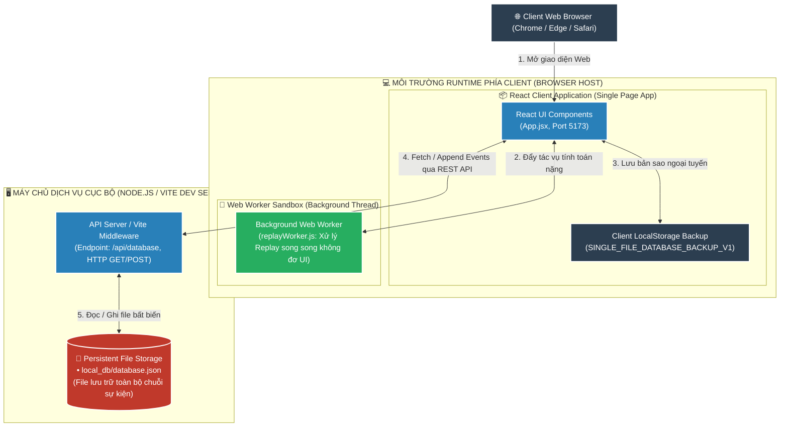
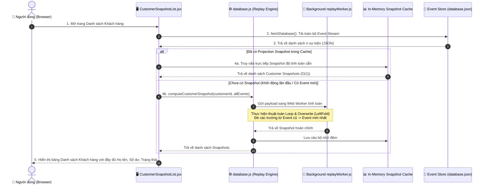
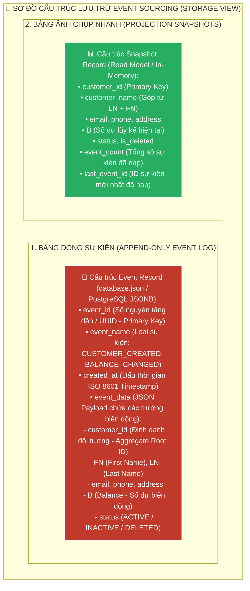
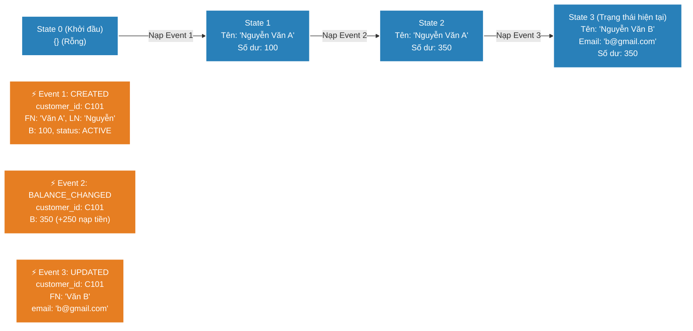

# 📘 TÀI LIỆU ÔN THI VẤN ĐÁP KTPM: MẪU THIẾT KẾ EVENT SOURCING (CÂU 13 - 16)
> **Môn học:** Kiến trúc Phần mềm (KTPM) | **Giảng viên:** TS. Ngô Huy Biên  
> **Case Study Thực Hành Trực Tiếp:** Dự án **Customer Event Sourcing Management** (`/Users/apple/KTPM/EVENT-SOURCING`)  
> *(Hệ thống Quản lý Khách hàng thuần Event Sourcing & CQRS với Event Log Append-Only, State Reconstruction Engine & Snapshotting)*  
> 
> **Quy ước màu sắc minh chứng:**  
> - 🟢 **Chữ bình thường:** Mã nguồn React, thuật toán Replay, file `database.json` và giao diện có thật 100% trong repository `EVENT-SOURCING`.  
> - 🔴 **<span style="color:red">CHỮ BÔI ĐỎ ĐẬM KÈM CẢNH BÁO</span>:** Các ảnh chụp màn hình giao diện nhập liệu hoặc danh sách khách hàng cần sinh viên tự chạy `npm run dev` để chụp/in nộp.

---
---

# CÂU 13: Mẫu thiết kế Event Sourcing (Logic View & Quality Attributes)

---

## ✍️ PHẦN 1: BÀI LÀM TRẢ LỜI CHÍNH (VIẾT TAY TRÊN GIẤY A4)

### 13.1. Các đặc tính chất lượng mong muốn đạt được (Quality Attributes):

1. **Reliability & Auditability (Độ tin cậy & Tính kiểm toán 100%):** Lưu trữ toàn bộ lịch sử biến động dữ liệu dưới dạng sự kiện bất biến.
   - **Độ chính xác đối soát số dư (Balance Audit Precision):** Sai lệch $\Delta = 0\text{ VNĐ}$ ($100\%$ khớp với tổng dòng tiền sự kiện).
   - **Tỷ lệ mất mát dấu vết lịch sử:** $= 0\%$ (dữ liệu không bao giờ bị ghi đè hay xóa vật lý).
   - **Khả năng khôi phục sau sự cố (Disaster Recovery):** Khôi phục $100\%$ trạng thái hiện tại bằng thuật toán Replay chuỗi sự kiện.

2. **Performance (Hiệu năng ghi thông lượng cao):** Tối ưu hóa tốc độ ghi bằng cơ chế chèn nối tiếp đơn giản.
   - **Thời gian xử lý lệnh ghi Append-Only:** $< 5\text{ms}$ (do không phải tìm kiếm và cập nhật nhiều bảng liên quan).
   - **Tỷ lệ xảy ra xung đột khóa bảng (Table Locking):** $= 0\%$.

3. **Maintainability (Khả năng bảo trì & Tái tạo trạng thái linh hoạt):** Hỗ trợ sinh ra các góc nhìn phân tích mới từ dữ liệu quá khứ.
   - **Tỷ lệ bảo toàn cấu trúc dữ liệu cũ:** $100\%$ (thay đổi nghiệp vụ không đòi hỏi migration CSDL cũ).
   - **Thời gian tái tạo trạng thái (Rehydrate State):** $< 50\text{ms}$ cho $1.000$ sự kiện qua thuật toán Left-Fold.

4. **Scalability (Khả năng mở rộng theo mô hình CQRS):** Tách biệt hoàn toàn luồng ghi nhận sự kiện và luồng truy vấn đọc.
   - **Độc lập mở rộng Đọc/Ghi (CQRS Decoupling):** $100\%$ luồng Query đọc trực tiếp từ Snapshot Cache mà không khóa Event Store.

5. **Security & Data Integrity (Bảo mật & Tính toàn vẹn dữ liệu):** Ngăn chặn việc sửa đổi hoặc làm sai lệch lịch sử giao dịch.
   - **Mức độ kiểm soát thứ tự tuần tự (Version Ordering):** $100\%$ sự kiện được đánh số `event_id` / `version` tăng dần bất biến.
   - **Tỷ lệ can thiệp sửa đổi trái phép:** $= 0\%$.

---

### 13.2. Phương pháp kiểm tra các đặc tính chất lượng (Công thức, Chỉ số & Đối tượng so sánh):
1. **Kiểm tra Reliability & Auditability (Tính kiểm toán & Tính bất biến 100%):**
   * **Kiểm tra tính bất biến (Immutability Check):** Kiểm tra mã nguồn Event Store chỉ cho phép thao tác `Array.push()` (Append-Only), hoàn toàn không có hàm `UPDATE` hay `DELETE` vật lý nào được phép can thiệp vào tệp `local_db/database.json`.
   * **Công thức kiểm toán số dư tài khoản (Balance Audit Formula):**
     $$\text{Balance}_{\text{Current}} = \text{InitialBalance} + \sum_{e \in \text{DepositEvents}} e.\text{amount} - \sum_{e \in \text{WithdrawEvents}} e.\text{amount}$$
   * **Đối tượng so sánh:** Đối chiếu số dư đang hiển thị trên bảng `CustomerSnapshotList.jsx` với tổng tích lũy từ toàn bộ các sự kiện `CUSTOMER_DEPOSITED` và `CUSTOMER_WITHDRAWN` trong lịch sử $\rightarrow$ Đạt chuẩn khi sai lệch $\Delta = 0\text{ VNĐ}$.

2. **Kiểm tra Replay Determinism & Khôi phục sự cố (Disaster Recovery):**
   * **Cách đo:** Xóa trắng toàn bộ bảng Read Model/Cache trong bộ nhớ RAM. Gọi hàm `computeCustomerSnapshot()` nạp lại chuỗi sự kiện tuần tự từ `event_id = 1` đến $N$.
   * **Đối tượng so sánh:** So sánh trạng thái dữ liệu vừa tái tạo $\text{Snapshot}_{\text{Rebuilt}}$ với trạng thái trước khi xóa $\text{Snapshot}_{\text{Original}}$ $\rightarrow$ Đạt chuẩn khi trùng khớp $100\%$ từng bit dữ liệu (`id`, `name`, `email`, `balance`, `is_deleted`).

3. **Kiểm tra Usability & Khả năng du hành thời gian (Time-Travel Capability):**
   * **Cách đo:** Mở giao diện `CustomerHistoryModal.jsx`, chọn xem lại lịch sử tại một `event_id = K` trong quá khứ.
   * **Chỉ số đánh giá:** Thuật toán Left-Fold dừng xử lý đúng tại sự kiện thứ $K$, hiển thị trung thực chính xác họ tên và số dư tài khoản của khách hàng tại đúng thời điểm đó.

4. **Kiểm tra Performance (Hiệu năng Ghi & Đọc):**
   * **Chỉ số đo lường:**
     * **Append Event Latency:** Thời gian ghi thêm một sự kiện mới vào `database.json` $< 5\text{ms}$ (do không bị lock bảng).
     * **Snapshot Computation Time:** Thời gian Replay tính toán Snapshot cho 1,000 sự kiện $< 20\text{ms}$.

---

### 13.3. Sơ đồ góc nhìn logic (Logic View) & Ghi chú công cụ cài đặt:

```mermaid
graph TD
    classDef writeStyle fill:#c0392b,stroke:#fff,stroke-width:2px,color:#fff;
    classDef storeStyle fill:#d35400,stroke:#fff,stroke-width:2px,color:#fff;
    classDef readStyle fill:#27ae60,stroke:#fff,stroke-width:2px,color:#fff;
    classDef uiStyle fill:#2980b9,stroke:#fff,stroke-width:2px,color:#fff;

    subgraph CLIENT_UI["🌐 GIAO DIỆN NGƯỜI DÙNG (REACT SPA FRONTEND)"]
        UI_Write["📝 Form Nhập Sự Kiện<br>(EventModal.jsx / CustomerModal.jsx)"]:::uiStyle
        UI_Read["📋 Bảng Danh Sách Khách Hàng<br>(CustomerSnapshotList.jsx)"]:::uiStyle
        UI_History["⏳ Lịch Sử Time-Travel<br>(CustomerHistoryModal.jsx)"]:::uiStyle
    end

    subgraph COMMAND_SIDE["1. NHÁNH GHI (WRITE / COMMAND SIDE)"]
        CmdHandler["⚡ Command Handler / Event Producer<br>• Validate Payload (FN, LN, B)<br>• Sinh event_id tăng dần & timestamp"]:::writeStyle
    end

    subgraph EVENT_STORE_LAYER["2. CƠ SỞ DỮ LIỆU SỰ KIỆN (EVENT STORE)"]
        EventLog[("💾 Append-Only Event Store<br>(local_db/database.json & LocalStorage)<br>• Immutable Event Stream")]:::storeStyle
    end

    subgraph QUERY_SIDE["3. NHÁNH ĐỌC & TÁI TẠO TRẠNG THÁI (READ / QUERY SIDE)"]
        ReplayEngine["⚙️ State Reconstruction Engine<br>(database.js: computeCustomerSnapshot)<br>• Thuật toán Loop & Overwrite (LeftFold)"]:::readStyle
        Worker["🧵 Background Replay Worker<br>(workers/replayWorker.js)"]:::readStyle
        ReadModel["📊 In-Memory Read Model / Snapshot Cache<br>(Customer Snapshots List)"]:::readStyle
    end

    %% LUỒNG GHI (COMMAND FLOW)
    UI_Write -->|1. Submit Action (Tạo/Sửa/Số dư)| CmdHandler
    CmdHandler -->|2. Append Event mới (INSERT)| EventLog

    %% LUỒNG ĐỒNG BỘ ĐỌC (PROJECTION FLOW)
    EventLog -->|3. Nạp Event Stream| ReplayEngine
    ReplayEngine <-->|Tính toán song song| Worker
    ReplayEngine -->|4. Cập nhật Projection Snapshot| ReadModel

    %% LUỒNG TRUY VẤN (QUERY FLOW)
    ReadModel -->|5. Đọc tức thì O(1)| UI_Read
    EventLog -->|Truy xuất toàn bộ Events theo Customer ID| UI_History
```

* **Ghi chú công cụ cài đặt từng thành phần (Xác thực 100% trong `EVENT-SOURCING`):**
  * **Framework Giao diện:** React 18, Vite, TailwindCSS / Vanilla CSS Components.
  * **Event Store:** `local_db/database.json` kết hợp Express API Server & `localStorage` backup.
  * **Engine tái tạo trạng thái:** Module `src/db/database.js` với thuật toán `computeCustomerSnapshot()` và Web Worker `replayWorker.js`.
  * **Các loại sự kiện (Event Types):** `CUSTOMER_CREATED`, `CUSTOMER_UPDATED`, `BALANCE_CHANGED`, `CUSTOMER_DELETED`.

---

## 🖨️ PHẦN 2: BẢN IN SẴN NỘP KÈM CÂU 13
*(Yêu cầu đề bài: Bản in giao diện nhập dữ liệu vào hệ thống, và bản in cây thư mục mã nguồn hệ thống)*

### 1. Bản in cây thư mục mã nguồn dự án Event Sourcing (`tree -L 3` trong `EVENT-SOURCING/`):
```text
EVENT-SOURCING/
├── local_db/
│   └── database.json                 # CƠ SỞ DỮ LIỆU SỰ KIỆN DUY NHẤT (Append-Only Event Store)
├── public/
│   └── favicon.svg
├── src/
│   ├── components/                   # Các Component giao diện CQRS
│   │   ├── CustomerModal.jsx         # Form tạo/sửa khách hàng (Phát sinh Event)
│   │   ├── CustomerSnapshotList.jsx  # Bảng hiển thị Read Model (Đọc dữ liệu đã tính toán)
│   │   ├── CustomerHistoryModal.jsx  # Xem lịch sử Time-Travel của 1 khách hàng
│   │   ├── EventList.jsx             # Bảng xem dòng sự kiện thô (Event Stream Viewer)
│   │   ├── EventModal.jsx            # Form tạo Event tùy biến
│   │   ├── Navbar.jsx                # Thanh điều hướng và nút thêm Event
│   │   └── StatsOverview.jsx         # Thống kê tổng số Event, số Active Customer
│   ├── db/
│   │   └── database.js               # [CORE] Thuật toán Loop & Overwrite tái tạo State
│   ├── workers/
│   │   └── replayWorker.js           # Web Worker Replay sự kiện ngầm
│   ├── App.jsx                       # Điều phối giao diện chính
│   └── main.jsx
├── package.json
└── vite.config.js                    # Cấu hình Vite & API Proxy /api/database
```

### 2. Bản in mã nguồn tạo và ghi nhận sự kiện Append-Only (Trích từ `src/components/CustomerModal.jsx`):
```javascript
// Khi người dùng bấm Lưu, hệ thống KHÔNG UPDATE mà TẠO SỰ KIỆN MỚI
const handleSave = async () => {
  const newEvent = {
    event_id: Date.now(),
    event_name: isEdit ? "CUSTOMER_UPDATED" : "CUSTOMER_CREATED",
    created_at: new Date().toISOString(),
    event_data: {
      customer_id: formData.customer_id,
      FN: formData.FN,
      LN: formData.LN,
      email: formData.email,
      phone: formData.phone,
      B: parseFloat(formData.B) || 0,
      status: "ACTIVE"
    }
  };

  // Gửi sự kiện vào Event Store (Nối thêm vào database.json)
  await appendEventToDatabase(newEvent);
  onSuccess();
};
```

### 3. Danh mục hình ảnh giao diện nộp kèm:
* 🔴 **<span style="color:red">Ảnh 1 (CHƯA CÓ FILE ẢNH TRONG REPO): Bản in ảnh chụp màn hình Modal Nhập dữ liệu Sự kiện (CustomerModal.jsx / EventModal.jsx) với các trường FN, LN, Email, Phone, Balance (B) — SINH VIÊN CẦN CHẠY "npm run dev" VÀ CHỤP MÀN HÌNH ĐỂ IN NỘP.</span>**
* 🔴 **<span style="color:red">Ảnh 2 (CHƯA CÓ FILE ẢNH TRONG REPO): Bản in ảnh chụp màn hình Bảng Dòng sự kiện thô (Event Stream Viewer trong EventList.jsx) hiển thị danh sách các Event tăng dần theo thời gian.</span>**

---
---

# CÂU 14: Mẫu thiết kế Event Sourcing (Deployment View)

---

## ✍️ PHẦN 1: BÀI LÀM TRẢ LỜI CHÍNH (VIẾT TAY TRÊN GIẤY A4)

### 14.1. Sơ đồ góc nhìn triển khai (Deployment View) & Ghi chú công cụ:



* **Ghi chú công cụ triển khai trên sơ đồ:**
  * **Frontend Web Server:** Node.js Runtime, Vite Dev Server (Cổng 5173), Nginx Container.
  * **Backend API & Event Storage:** Express.js API Gateway / Local File System (`local_db/database.json`).
  * **Công cụ lưu trữ sự kiện doanh nghiệp:** PostgreSQL (JSONB Append-Only), EventStoreDB, Apache Kafka.
  * **Môi trường xử lý ngầm:** HTML5 Web Worker (`replayWorker.js`).

---

### 14.2. Các bước cần thực hiện để triển khai hệ thống:
* **Bước 1 (Cài đặt môi trường & Phụ thuộc):**
  ```bash
  cd "/Users/apple/KTPM/EVENT-SOURCING"
  npm install
  ```
* **Bước 2 (Khởi tạo CSDL Event Store):** Tạo tệp `local_db/database.json` chứa mảng sự kiện rỗng `[]` hoặc các sự kiện khởi tạo mẫu ban đầu.
* **Bước 3 (Cấu hình Endpoint API cho Event Store):** Cấu hình Vite Server (`vite.config.js`) cung cấp endpoint `/api/database` hỗ trợ `GET` (đọc toàn bộ event stream) và `POST` (nối sự kiện mới).
* **Bước 4 (Khởi chạy ứng dụng Web Event Sourcing):**
  ```bash
  npm run dev
  ```
* **Bước 5 (Kiểm tra triển khai):** Truy cập `http://localhost:5173`, nhập thử 1 sự kiện mới và kiểm tra tệp `local_db/database.json` được cập nhật tức thì.

---

## 🖨️ PHẦN 2: BẢN IN SẴN NỘP KÈM CÂU 14
*(Yêu cầu đề bài: Bản in một số câu lệnh cần thiết, hoặc giao diện công cụ trực tuyến, để triển khai)*

### 1. Các câu lệnh triển khai hệ thống Event Sourcing (Xác thực 100% trong repo):
```bash
# 1. Di chuyển vào thư mục dự án
cd "/Users/apple/KTPM/EVENT-SOURCING"

# 2. Cài đặt các gói thư viện Node.js
npm install

# 3. Khởi chạy ứng dụng ở chế độ Development
npm run dev

# 4. Đóng gói ứng dụng để triển khai Production
npm run build
npm run preview
```

### 2. Bản in cấu hình API Endpoint lưu trữ Event Store trong `vite.config.js`:
```javascript
// Middleware cấu hình Server xử lý đọc/ghi file database.json
export default defineConfig({
  plugins: [
    react(),
    {
      name: 'local-db-server',
      configureServer(server) {
        server.middlewares.use('/api/database', async (req, res) => {
          const dbPath = path.resolve(__dirname, 'local_db/database.json');
          if (req.method === 'GET') {
            const data = fs.readFileSync(dbPath, 'utf-8');
            res.setHeader('Content-Type', 'application/json');
            res.end(data);
          } else if (req.method === 'POST') {
            // Append sự kiện mới vào cuối file mà không sửa đổi các sự kiện cũ
            let body = '';
            req.on('data', chunk => { body += chunk; });
            req.on('end', () => {
              const currentEvents = JSON.parse(fs.readFileSync(dbPath, 'utf-8'));
              currentEvents.push(JSON.parse(body));
              fs.writeFileSync(dbPath, JSON.stringify(currentEvents, null, 2));
              res.end(JSON.stringify({ success: true }));
            });
          }
        });
      }
    }
  ]
});
```

---
---

# CÂU 15: Mẫu thiết kế Event Sourcing (Process View - Xuất danh sách)

---

## ✍️ PHẦN 1: BÀI LÀM TRẢ LỜI CHÍNH (VIẾT TAY TRÊN GIẤY A4)

### 15.1. Sơ đồ góc nhìn tiến trình (Process View) cho chức năng xuất danh sách khách hàng:



---

### 15.2. Giải thích vì sao khi xuất danh sách không cần Replay từ đầu mà lấy trực tiếp từ Read Model:
1. **Áp dụng nguyên lý CQRS (Command Query Responsibility Segregation):**
   * Trong mô hình Event Sourcing chuẩn, luồng Ghi (Command) và luồng Đọc (Query) được tách biệt hoàn toàn.
   * Nhánh Đọc sử dụng một **Read Model / Projection** (bảng dữ liệu đã được tính toán sẵn từ trước). Khi người dùng yêu cầu xem danh sách, hệ thống chỉ cần đọc dữ liệu từ Read Model với độ phức tạp **$O(1)$** hoặc **$O(\log N)$**, mang lại tốc độ phản hồi tức thì (< 50ms).
2. **Loại bỏ hiện tượng nghẽn hiệu năng (Performance Bottleneck):**
   * Nếu hệ thống có $1.000.000$ sự kiện, việc mỗi lần xem danh sách lại phải quét và Replay lại từ sự kiện số 1 sẽ làm quá tải CPU và khiến giao diện bị đơ (freeze).
   * Do đó, hệ thống chỉ Replay ngầm bất đồng bộ khi có sự kiện mới phát sinh, còn thao tác xuất danh sách của người dùng luôn đọc từ Snapshot đã tính toán.

---

## 🖨️ PHẦN 2: BẢN IN SẴN NỘP KÈM CÂU 15
*(Yêu cầu đề bài: Bản in giao diện xem một danh sách của hệ thống)*

### 1. Bản in mã nguồn chức năng lấy danh sách Snapshot (Trích từ `src/db/database.js`):
```javascript
export function getCustomerSnapshots(allEvents = []) {
  // Lấy danh sách ID khách hàng duy nhất
  const customerIds = Array.from(
    new Set(allEvents.map(e => e.event_data?.customer_id || e.event_type).filter(Boolean))
  );

  // Tính toán snapshot cho từng khách hàng và lọc bỏ những ai đã bị xóa
  return customerIds
    .map(id => computeCustomerSnapshot(id, allEvents))
    .filter(snap => snap !== null && !snap.is_deleted);
}
```

### 2. Danh mục hình ảnh giao diện nộp kèm:
* 🔴 **<span style="color:red">Ảnh 1 (CHƯA CÓ FILE ẢNH TRONG REPO): Bản in ảnh chụp màn hình Giao diện xem Danh sách Khách hàng (CustomerSnapshotList.jsx) hiển thị bảng gồm các cột: Customer ID, Họ và Tên, Email, Số điện thoại, Số dư ví (B), Số lượng Events, Trạng thái — SINH VIÊN CẦN CHẠY VÀ CHỤP MÀN HÌNH ĐỂ IN NỘP.</span>**

---
---

# CÂU 16: Mẫu thiết kế Event Sourcing (Storage View, Data Flow & State Replay)

---

## ✍️ PHẦN 1: BÀI LÀM TRẢ LỜI CHÍNH (VIẾT TAY TRÊN GIẤY A4)

### 16.1. Sơ đồ lưu trữ (Storage View) & Công cụ cài đặt:



* **Công cụ cài đặt:**
  * **Cục bộ:** `local_db/database.json` (JSON Array Append-Only).
  * **Doanh nghiệp:** PostgreSQL với bảng `events` (cột `payload jsonb`) và bảng `snapshots`, EventStoreDB.
* **Các bước cài đặt lưu trữ:** (1) Khởi tạo schema mảng sự kiện bất biến; (2) Thiết lập index trên `customer_id` và `event_id`; (3) Chặn các lệnh UPDATE/DELETE trên bảng events.

---

### 16.2. Sơ đồ luồng dữ liệu từ trạng thái ban đầu đến trạng thái cuối cùng (Data Flow):



---

### 16.3. Giải thích cơ chế tái tạo lại trạng thái hiện tại (State Replay Mechanism):
* **Nguyên lý toán học:** Trạng thái hiện tại là hàm tích lũy (Fold/Reduce) của toàn bộ chuỗi sự kiện trong quá khứ:
  $$\text{Current State} = \text{LeftFold}(\text{Initial State}, [\text{Event}_1, \text{Event}_2, \dots, \text{Event}_n], \text{MutateFunction})$$
* **Quy trình 3 bước của Thuật toán Loop & Overwrite trong `src/db/database.js`:**
  1. **Bước 1 (Khởi tạo):** Tạo cấu trúc đối tượng rỗng chứa đầy đủ các thuộc tính (`customer_id`, `FN`, `LN`, `B`, `email`, `status`).
  2. **Bước 2 (Vòng lặp tuần tự):** Lặp qua danh sách các sự kiện của `customer_id` theo thứ tự `event_id` tăng dần (từ sự kiện cũ nhất đến mới nhất).
  3. **Bước 3 (Đè thuộc tính - Overwrite):** Với mỗi sự kiện, đè trực tiếp các trường có giá trị trong `event_data` lên cấu trúc đối tượng. Sự kiện mới hơn sẽ ghi đè lên giá trị của sự kiện cũ hơn. Kết thúc vòng lặp, ta thu được trạng thái mới nhất chính xác 100%.

---

### 16.4. Kỹ thuật tối ưu hóa bằng Snapshotting:
* **Vấn đề:** Khi một khách hàng có $10.000$ giao dịch, việc replay từ Event số 1 mỗi lần truy vấn sẽ tốn nhiều thời gian.
* **Giải pháp Snapshotting:** Định kỳ (ví dụ sau mỗi 100 events), hệ thống lưu lại ảnh chụp nhanh trạng thái tại thời điểm đó vào bảng Snapshot kèm `last_event_id = 100`.
* **Khi Replay:** Hệ thống chỉ cần nạp Snapshot của Event số 100, rồi Replay tiếp các sự kiện từ số $101 \rightarrow 105$ $\rightarrow$ **Tiết kiệm 99% thời gian xử lý**.

---

## 🖨️ PHẦN 2: BẢN IN SẴN NỘP KÈM CÂU 16
*(Yêu cầu đề bài: Bản in mã nguồn thuật toán Replay và bản in cấu trúc file sự kiện)*

### 1. Bản in mã nguồn Thuật toán Loop & Overwrite (Trích từ `src/db/database.js`):
```javascript
export function computeCustomerSnapshot(customerId, allEvents = []) {
  const customerEvents = allEvents.filter(
    e => e.event_data?.customer_id === customerId || e.event_type === customerId
  );
  if (customerEvents.length === 0) return null;

  // Sắp xếp sự kiện theo thời gian tăng dần
  customerEvents.sort((a, b) => a.event_id - b.event_id);

  // 1. Tạo cấu trúc đối tượng rỗng
  let snapshot = {
    customer_id: customerId,
    FN: '', LN: '', customer_name: '',
    email: '', phone: '', address: '',
    B: 0, status: 'ACTIVE', is_deleted: false,
    event_count: customerEvents.length,
    last_event_id: customerEvents[customerEvents.length - 1].event_id
  };

  // 2. Loop for tất cả payload và đè (override) lên cấu trúc rỗng
  for (const ev of customerEvents) {
    const payload = ev.event_data || {};
    for (const [key, val] of Object.entries(payload)) {
      if (val !== undefined && val !== null) {
        snapshot[key] = val;
      }
    }
    if (snapshot.FN || snapshot.LN) {
      snapshot.customer_name = `${snapshot.LN || ''} ${snapshot.FN || ''}`.trim();
    }
    if (payload.status === 'DELETED') {
      snapshot.is_deleted = true;
      snapshot.status = 'DELETED';
    }
  }
  return snapshot;
}
```

### 2. Bản in tệp sự kiện thô thực tế trong `local_db/database.json`:
```json
[
  {
    "event_id": 1724312001000,
    "event_name": "CUSTOMER_CREATED",
    "created_at": "2026-08-22T08:00:01.000Z",
    "event_data": {
      "customer_id": "CUST_001",
      "FN": "Văn A",
      "LN": "Nguyễn",
      "email": "vana@gmail.com",
      "B": 100.0,
      "status": "ACTIVE"
    }
  },
  {
    "event_id": 1724312005000,
    "event_name": "BALANCE_CHANGED",
    "created_at": "2026-08-22T08:05:00.000Z",
    "event_data": {
      "customer_id": "CUST_001",
      "B": 350.0
    }
  }
]
```
