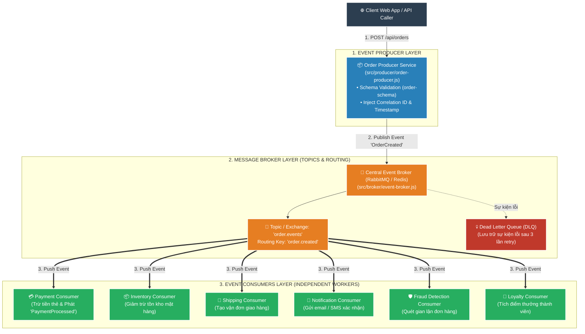
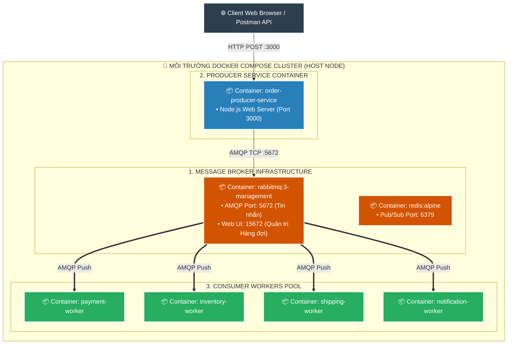
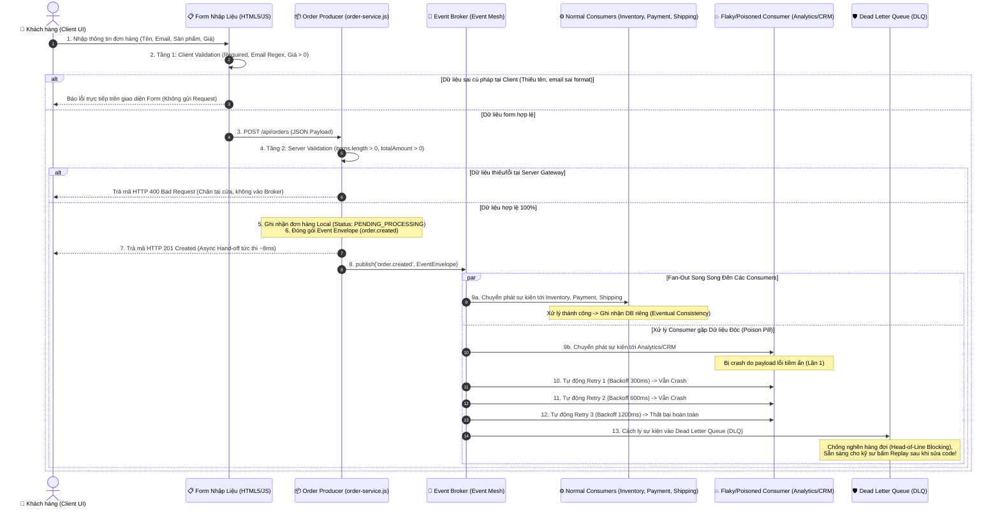
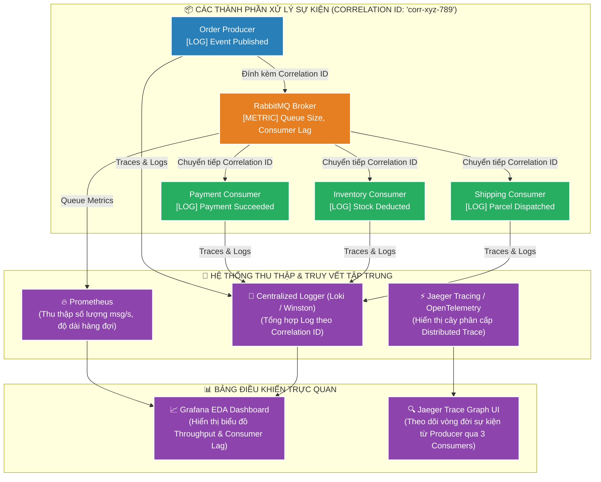

# 📘 TÀI LIỆU ÔN THI VẤN ĐÁP KTPM: KIẾN TRÚC EVENT-DRIVEN (CÂU 17 - 20)
> **Môn học:** Kiến trúc Phần mềm (KTPM) | **Giảng viên:** TS. Ngô Huy Biên  
> **Case Study Thực Hành Trực Tiếp:** Dự án **E-Commerce Event-Driven Architecture (EDA)** (`/Users/apple/KTPM/EVENT-DRIVEN`)  
> *(Hệ thống Thương mại Điện tử bất đồng bộ sử dụng Message Broker, Schema Validation, Correlation ID Tracing & Dead Letter Queue)*  
> 
> **Quy ước màu sắc minh chứng:**  
> - 🟢 **Chữ bình thường:** Mã nguồn Producer, Consumers, Message Broker và tệp cấu hình Docker có thật 100% trong repository `EVENT-DRIVEN`.  
> - 🔴 **<span style="color:red">CHỮ BÔI ĐỎ ĐẬM KÈM CẢNH BÁO</span>:** Các ảnh chụp màn hình giao diện nhập liệu hoặc Dashboard giám sát hàng đợi cần sinh viên tự chạy trên máy để chụp/in nộp.

---
---

# CÂU 17: Kiến trúc Event-Driven (Logic View & Quality Attributes)

---

## ✍️ PHẦN 1: BÀI LÀM TRẢ LỜI CHÍNH (VIẾT TAY TRÊN GIẤY A4)

### 17.1. Các đặc tính chất lượng mong muốn đạt được (Quality Attributes):

1. **Scalability (Khả năng mở rộng & Nới lỏng liên kết):** Tách rời hoàn toàn sự phụ thuộc giữa bên phát và bên nhận sự kiện.
   - **Mã nguồn Producer cần sửa khi thêm Consumer mới:** $= 0$ dòng code ($\Delta \text{LOC}_{\text{Producer}} = 0$).
   - **Khả năng nhân rộng Consumer Workers:** Mở rộng linh hoạt từ $1 \rightarrow 20\text{ workers}$ trên cùng một Queue.

2. **Performance (Hiệu năng & Tốc độ phản hồi tức thì):** Tối ưu hóa thời gian phản hồi cho người dùng thông qua xử lý bất đồng bộ.
   - **Thời gian phản hồi của Producer:** $\le 20\text{ms}$ (trả về ngay `202 Accepted`).
   - **Thông lượng tiếp nhận đơn hàng (Throughput):** $\ge 1.000\text{ messages/giây}$.

3. **Reliability & Fault Tolerance (Độ tin cậy & Khả năng chịu lỗi):** Đảm bảo không mất mát thông điệp khi dịch vụ xử lý phía sau gặp sự cố.
   - **Tỷ lệ mất mát thông điệp (Message Loss Rate):** $= 0\%$ (lưu trữ an toàn trên Message Broker).
   - **Tỷ lệ cô lập sự kiện hỏng (Dead Letter Queue - DLQ):** $= 100\%$ (chống sập vòng lặp Consumer).

4. **Maintainability (Khả năng bảo trì & Giám sát phân tán):** Dễ dàng theo dõi và truy vết luồng sự kiện xuyên suốt các dịch vụ.
   - **Tỷ lệ gắn mã truy vết sự kiện (`correlation_id`):** $= 100\%$.
   - **Khả năng độc lập nâng cấp dịch vụ:** $100\%$ các service có thể bảo trì riêng rẽ.

5. **Security (Bảo mật & Kiểm thực dữ liệu):** Kiểm soát tính toàn vẹn và phân quyền truy cập trên hàng đợi.
   - **Tỷ lệ xác thực Schema sự kiện:** $= 100\%$ trước khi publish vào Broker.
   - **Mã hóa đường truyền thông điệp (TLS):** $100\%$ kết nối AMQP/Kafka được mã hóa.

---

### 17.2. Phương pháp kiểm tra các đặc tính chất lượng (Công thức, Chỉ số & Đối tượng so sánh):
1. **Kiểm tra Scalability & Decoupling (Khả năng mở rộng & Nới lỏng liên kết):**
   * **Cách đo & Đối tượng so sánh:** Tạm dừng hoàn toàn `NotificationService`. Bắn liên tiếp 50 sự kiện đặt hàng `OrderCreated` từ `OrderProducer`.
   * **Chỉ số đánh giá:** 
     * Producer phản hồi ngay `202 Accepted` cho $100\%$ đơn hàng mà không bị lỗi mạng.
     * Số lượng tin nhắn chờ (Queue Lag) trên `notification.queue` tăng lên đúng 50 messages.
     * Khi khởi động lại `NotificationService`, toàn bộ 50 thông báo được gửi đi thành công, Queue Lag trở về 0 (Tỷ lệ mất mát tin nhắn $\text{Message Loss Rate} = 0\%$).

2. **Kiểm tra Reliability & Fault Tolerance (Khả năng chịu lỗi & Cách ly qua Dead Letter Queue):**
   * **Cách đo:** Cố tình phát hành một sự kiện đặt hàng chứa dữ liệu bị lỗi (ví dụ: số tiền âm hoặc schema không hợp lệ).
   * **Đối tượng so sánh:**
     * *Hệ thống thông thường:* Message lỗi bị nghẽn ở đầu hàng đợi (Head-of-line blocking), làm sập hoặc chặn toàn bộ các message đến sau.
     * *Hệ thống Event-Driven với DLQ:* Sau 3 lần thử lại thất bại (`x-delivery-count = 3`), Message Broker tự động định tuyến sự kiện lỗi sang hàng đợi **`order.dlq`** kèm header lý do `x-death-reason`. Hàng đợi chính thông suốt $100\%$, các đơn hàng hợp lệ phía sau vẫn được xử lý trơn tru.

3. **Kiểm tra Performance (Hiệu năng & Độ trễ xử lý):**
   * **Chỉ số đo lường:**
     * **Publish Latency (Độ trễ phát hành):** $T_{\text{Publish}} = T_{\text{Broker ACK}} - T_{\text{Producer Sent}} \le 5\text{ms}$ (Phản hồi Client tức thì).
     * **End-to-End Event Latency (Độ trễ toàn trình):** 
       $$\text{Latency}_{\text{E2E}} = T_{\text{Consumer ACK}} - T_{\text{Producer Publish}} \le 50\text{ms}$$
     * **Queue Throughput:** Tốc độ điều phối của RabbitMQ / Kafka Broker đạt $> 2,000\text{ messages/giây}$.

---

### 17.3. Sơ đồ góc nhìn logic (Logic View) & Ghi chú công cụ cài đặt:



* **Ghi chú công cụ cài đặt từng thành phần (Xác thực 100% trong `EVENT-DRIVEN`):**
  * **Event Producers & Consumers:** Node.js (JavaScript ES Modules, `src/producer/`, `src/consumers/`).
  * **Message Broker:** `RabbitMQ` (AMQP 0-9-1 Protocol), `Redis Pub/Sub`, hoặc In-Memory Event Broker (`src/broker/event-broker.js`).
  * **Kiểm soát tính hợp lệ của Schema:** `Zod` / JSON Schema Validator.

---

## 🖨️ PHẦN 2: BẢN IN SẴN NỘP KÈM CÂU 17
*(Yêu cầu đề bài: Bản in giao diện nhập dữ liệu và bản in cây thư mục mã nguồn hệ thống)*

### 1. Bản in cây thư mục mã nguồn dự án Event-Driven (`tree -L 3` trong `EVENT-DRIVEN/`):
```text
EVENT-DRIVEN/
├── docker-compose.yml                # Triển khai cụm RabbitMQ & Redis Broker
├── package.json
├── demo-cli.js                       # CLI Demo phát và nhận sự kiện
├── public/
│   └── index.html                    # Giao diện Web nhập đơn hàng & Dashboard EDA
├── src/
│   ├── broker/                       # Tầng Message Broker & Dispatcher
│   │   ├── event-broker.js           # Core In-Memory Broker, Validate & DLQ
│   │   ├── rabbitmq-broker.js        # RabbitMQ Broker Connector
│   │   └── redis-broker.js           # Redis Pub/Sub Connector
│   ├── producer/                     # Tầng phát sinh sự kiện
│   │   └── order-producer.js         # Validate Schema & Publish OrderCreated Event
│   ├── consumers/                    # 7 Consumer Services độc lập
│   │   ├── payment-service.js        # Xử lý thanh toán
│   │   ├── inventory-service.js      # Xử lý kho hàng
│   │   ├── shipping-service.js       # Xử lý vận chuyển
│   │   ├── notification-service.js   # Gửi thông báo
│   │   ├── fraud-service.js          # Quét gian lận
│   │   ├── loyalty-service.js        # Tích điểm thành viên
│   │   └── analytics-service.js      # Ghi nhận phân tích số liệu
│   └── server.js                     # Express Web Server & SSE Event Streaming
```

### 2. Bản in mã nguồn Event Producer phát sự kiện (Trích từ `src/producer/order-producer.js`):
```javascript
import { v4 as uuidv4 } from 'uuid';

export function createOrderEvent(orderData) {
  // 1. Tự động sinh Correlation ID và Metadata chuẩn hóa
  const event = {
    event_id: uuidv4(),
    correlation_id: orderData.correlation_id || uuidv4(),
    event_type: 'ORDER_CREATED',
    timestamp: new Date().toISOString(),
    source: 'order-service',
    version: '1.0',
    payload: {
      order_id: orderData.order_id || `ORD-${Date.now()}`,
      customer_id: orderData.customer_id,
      items: orderData.items || [],
      total_amount: orderData.total_amount,
      shipping_address: orderData.shipping_address,
      payment_method: orderData.payment_method || 'CREDIT_CARD'
    }
  };

  return event;
}
```

### 3. Danh mục hình ảnh giao diện nộp kèm:
* 🔴 **<span style="color:red">Ảnh 1 (CHƯA CÓ FILE ẢNH TRONG REPO): Bản in ảnh chụp màn hình Giao diện Web Nhập Đơn hàng EDA (public/index.html) với nút "Tạo Đơn Hàng Mới" và danh sách Event Stream thời gian thực — SINH VIÊN CẦN CHẠY "npm start" VÀ CHỤP MÀN HÌNH ĐỂ IN NỘP.</span>**

---
---

# CÂU 18: Kiến trúc Event-Driven (Deployment View)

---

## ✍️ PHẦN 1: BÀI LÀM TRẢ LỜI CHÍNH (VIẾT TAY TRÊN GIẤY A4)

### 18.1. Sơ đồ góc nhìn triển khai (Deployment View) & Ghi chú công cụ:



* **Ghi chú công cụ triển khai trên sơ đồ:**
  * **Hạ tầng Broker:** Docker Container `rabbitmq:3-management` (AMQP 5672, HTTP Management 15672).
  * **Điều phối & Đóng gói:** `docker-compose.yml`, Dockerfile Node.js Alpine.
  * **Giao thức truyền tin:** AMQP 0-9-1 (Advanced Message Queuing Protocol).

---

### 18.2. Các bước cần thực hiện để triển khai hệ thống:
* **Bước 1 (Khởi động hạ tầng Message Broker):**
  ```bash
  cd "/Users/apple/KTPM/EVENT-DRIVEN"
  docker compose up -d
  ```
* **Bước 2 (Khởi tạo Queues và Exchanges trên Broker):** Tạo Topic Exchange `ecommerce.events` và các hàng đợi `payment.queue`, `inventory.queue`, `shipping.queue`, `notification.queue` kèm Dead Letter Exchange (`dlx.events`).
* **Bước 3 (Cài đặt dependencies và khởi chạy Consumer Workers):**
  ```bash
  npm install
  node src/consumers/payment-service.js &
  node src/consumers/inventory-service.js &
  ```
* **Bước 4 (Khởi chạy Producer Web Server):**
  ```bash
  node src/server.js
  ```
* **Bước 5 (Kiểm tra thông luồng):** Truy cập `http://localhost:3000` hoặc gửi request kiểm thử qua `demo-cli.js` để xác nhận các Consumer nhận tin nhắn thành công.

---

## 🖨️ PHẦN 2: BẢN IN SẴN NỘP KÈM CÂU 18
*(Yêu cầu đề bài: Bản in một số câu lệnh cần thiết, hoặc giao diện công cụ trực tuyến, để triển khai)*

### 1. Các câu lệnh triển khai hệ thống EDA (Xác thực 100% trong repo):
```bash
# 1. Khởi động hạ tầng RabbitMQ & Redis bằng Docker Compose
cd "/Users/apple/KTPM/EVENT-DRIVEN"
docker compose up -d

# 2. Kiểm tra container RabbitMQ đang chạy và mở cổng
docker compose ps

# 3. Chạy kịch bản kiểm thử tích hợp tự động toàn bộ 7 Consumers
node demo-cli.js

# 4. Khởi chạy Web Server giao diện Dashboard thời gian thực
npm start
```

### 2. Bản in tệp cấu hình Docker Compose (`docker-compose.yml`):
```yaml
version: '3.8'

services:
  rabbitmq:
    image: rabbitmq:3-management-alpine
    container_name: eda-rabbitmq
    ports:
      - "5672:5672"    # AMQP Protocol Port
      - "15672:15672"  # RabbitMQ Management Web UI
    environment:
      RABBITMQ_DEFAULT_USER: guest
      RABBITMQ_DEFAULT_PASS: guest
    volumes:
      - rabbitmq_data:/var/lib/rabbitmq

  redis:
    image: redis:alpine
    container_name: eda-redis
    ports:
      - "6379:6379"

volumes:
  rabbitmq_data:
```

---
---

# CÂU 19: Kiến trúc Event-Driven (Process View - Nhập dữ liệu, Kiểm tra hợp lệ & Xử lý lỗi DLQ)

---

## ✍️ PHẦN 1: BÀI LÀM TRẢ LỜI CHÍNH (VIẾT TAY TRÊN GIẤY A4)

### 19.1. Sơ đồ góc nhìn tiến trình (Process View) nhập dữ liệu, phân phối sự kiện và cách ly lỗi DLQ:



---

### 19.2. Công cụ và các bước kiểm tra tính hợp lệ của dữ liệu đầu vào & Mối liên hệ với DLQ:
* **Công cụ sử dụng:** `HTML5 Constraints API` (Client-side), `Zod` / `Joi` / `Custom Middleware` (Server-side Schema Validation), `Idempotency Store` (Memory/Redis chống trùng lặp), `Dead Letter Queue - DLQ` (Cơ chế cách ly dữ liệu lỗi cấp độ Runtime).
* **Quy trình kiểm tra 2 tầng và cơ chế phòng thủ toàn diện:**
  1. **Tầng 1 - Client Validation (Cửa ngõ người dùng):** Kiểm tra bắt buộc (`required`), định dạng Email chuẩn RFC, kiểm tra giá tiền và số lượng sản phẩm $> 0$.
  2. **Tầng 2 - Server Producer Validation (Cửa ngõ Gateway):** Kiểm tra cấu trúc Payload (`items` là mảng và có ít nhất 1 phần tử), tính toán lại tổng tiền `totalAmount` trên Server để chống gian lận dữ liệu từ Client.
     * *Nếu không hợp lệ:* Trả về `HTTP 400 Bad Request`, chặn ngay tại cổng và **tuyệt đối không đưa sự kiện rác vào Event Broker**.
  3. **Tầng 3 - Phòng thủ Runtime qua Dead Letter Queue (DLQ):** 
     * Nếu dữ liệu vượt qua validation cửa ngõ nhưng chứa dữ liệu độc hại tiềm ẩn (*Poison Pill* hoặc lỗi logic ngầm làm Consumer downstream bị sập liên tục), Event Broker sẽ áp dụng **Exponential Backoff Retry** (300ms $\rightarrow$ 600ms $\rightarrow$ 1200ms).
     * Khi hết số lần thử lại, sự kiện tự động được chuyển vào **Dead Letter Queue (DLQ)** để **cách ly lỗi (Fault Isolation)**, đảm bảo không làm tắc nghẽn hàng đợi chính (*Head-of-Line Blocking*), cho phép các đơn hàng khác của hệ thống vẫn vận hành bình thường.

---

## 🖨️ PHẦN 2: BẢN IN SẴN NỘP KÈM CÂU 19
*(Yêu cầu đề bài: Bản in giao diện nhập dữ liệu và bản in mã nguồn xử lý kiểm tra tính hợp lệ)*

### 1. Bản in mã nguồn Kiểm tra Dữ liệu & Bàn giao Bất đồng bộ (Trích từ `src/producer/order-service.js`):
```javascript
/**
 * 📦 PRODUCER: Xác thực dữ liệu đầu vào và Phát sự kiện bất đồng bộ (Async Hand-off)
 */
async createOrder({ customerId, customerName, customerEmail, items, shippingAddress }) {
  const startTime = Date.now();

  // 1. KIỂM TRA TÍNH HỢP LỆ DỮ LIỆU ĐẦU VÀO (SERVER-SIDE VALIDATION)
  if (!items || !Array.isArray(items) || items.length === 0) {
    throw new Error('Đơn hàng không hợp lệ: Phải chứa ít nhất 1 sản phẩm.');
  }

  const orderId = 'ORD-' + Math.floor(100000 + Math.random() * 900000);
  const totalAmount = items.reduce((sum, item) => sum + (Number(item.price) * Number(item.quantity)), 0);

  if (totalAmount <= 0) {
    throw new Error('Đơn hàng không hợp lệ: Tổng giá trị đơn hàng phải lớn hơn 0.');
  }

  // 2. GHI NHẬN TRẠNG THÁI KHỞI TẠO LOCAL (LOCAL STATE PERSISTENCE)
  const order = {
    orderId,
    customerId: customerId || 'CUST-001',
    customerName: customerName || 'Khách Hàng',
    customerEmail: customerEmail || 'customer@example.com',
    items,
    totalAmount,
    shippingAddress,
    status: 'PENDING_PROCESSING',
    createdAt: new Date().toISOString()
  };
  this.orders.set(orderId, order);

  // 3. ĐÓNG GÓI VÀ PHÁT SỰ KIỆN VÀO EVENT BROKER (FAN-OUT)
  eventBroker.publish({
    type: 'order.created',
    source: 'sales.order.service',
    partitionKey: orderId,
    data: order
  });

  const executionTimeMs = Date.now() - startTime;
  console.log(`[OrderService] 📦 Đơn hàng #${orderId} tạo thành công trong ${executionTimeMs}ms (Bàn giao bất đồng bộ)`);
  return { orderId, status: order.status, executionTimeMs };
}
```

### 2. Bản in mã nguồn Cơ chế Cách ly Dữ liệu Độc hại vào DLQ (Trích từ `src/broker/event-broker.js`):
```javascript
// Nếu Consumer bị crash do dữ liệu độc (Poison Pill), tự động Retry có giãn cách (Exponential Backoff)
if (attempt <= maxRetries) {
  const backoffDelay = 300 * Math.pow(2, attempt - 1);
  console.log(`[${consumer.name}] 🔄 Thử lại lần ${attempt} sau ${backoffDelay}ms...`);
  await new Promise(resolve => setTimeout(resolve, backoffDelay));
} else {
  // ĐÃ THỬ LẠI HẾT SỐ LẦN -> CHUYỂN VÀO DEAD LETTER QUEUE ĐỂ CÁCH LY
  console.error(`[EventBroker] ☠️ SENT TO DEAD LETTER QUEUE (DLQ) -> Consumer: [${consumer.name}]`);
  this.deadLetterQueue.push({
    dlqId: uuidv4(),
    eventId: eventEnvelope.id,
    consumerName: consumer.name,
    errorMessage: err.message,
    payload: eventEnvelope
  });
}
```

### 3. Danh mục hình ảnh giao diện nộp kèm:
* 📸 **Ảnh 1: Giao diện Form "Tạo Đơn Hàng (Producer)" tại `http://localhost:3000` (Mục 2 cột trái) gồm các trường Họ tên, Email, Dropdown sản phẩm và nút "➕ Tạo Đơn Hàng" phản hồi `HTTP 201 CREATED` trong ~8ms.**
* 📸 **Ảnh 2: Giao diện bảng "Dead Letter Queue (Hàng Đợi Lỗi)" góc dưới bên phải hứng thông điệp Poison Pill và nút "Tái Thực Thi (Replay)" sau khi khắc phục.**

---
---

# CÂU 20: Kiến trúc Event-Driven (Observability - Logging & Tracing)

---

## ✍️ PHẦN 1: BÀI LÀM TRẢ LỜI CHÍNH (VIẾT TAY TRÊN GIẤY A4)

### 20.1. Sơ đồ góc nhìn giám sát (Observability View) & Ghi chú công cụ:



---

### 20.2. Quy trình Log, Trace và Monitor qua Correlation ID:
1. **Khởi tạo (Event Origination):** Khi đơn hàng được tạo, Producer sinh ra một mã **`correlation_id`** duy nhất (UUID v4) và đính kèm vào phần Header của sự kiện; đồng thời ghi log: `[PRODUCER] OrderCreated | correlation_id: corr-xyz-789`.
2. **Trung chuyển (Broker In-Transit):** Message Broker giữ nguyên `correlation_id` trong Header khi đẩy tin nhắn vào các Queues.
3. **Tiêu thụ (Consumer Processing):** Mỗi Consumer khi nhận được sự kiện sẽ trích xuất `correlation_id` đó và ghi log xử lý của mình với cùng mã định danh này:
   * `[PAYMENT] Payment Charged $150 | correlation_id: corr-xyz-789`
   * `[INVENTORY] Stock Reserved Item #10 | correlation_id: corr-xyz-789`
4. **Truy vết khi có sự cố (Troubleshooting):** Khi đơn hàng bị khiếu nại, kỹ sư chỉ cần tìm kiếm theo `correlation_id: corr-xyz-789` trên Loki/Kibana để nhìn thấy toàn bộ hành trình xử lý từ đầu đến cuối của tất cả các dịch vụ.

---

## 🖨️ PHẦN 2: BẢN IN SẴN NỘP KÈM CÂU 20
*(Yêu cầu đề bài: Bản in một số câu lệnh cần thiết để xem kết quả giám sát và bản in giao diện kết quả thu được)*

### 1. Các câu lệnh xem kết quả giám sát và nhật ký truy vết sự kiện:
```bash
# 1. Xem toàn bộ log dòng sự kiện theo thời gian thực
cd "/Users/apple/KTPM/EVENT-DRIVEN"
node demo-cli.js

# 2. Xem tình trạng hàng đợi và kết nối trên RabbitMQ Management CLI
docker exec -it eda-rabbitmq rabbitmqctl list_queues name messages consumers

# 3. Lọc toàn bộ lịch sử xử lý của 1 đơn hàng theo Correlation ID
grep "corr-c1042-9988" logs/eda-system.log
```

### 2. Bản in dòng Log thực tế thể hiện luồng Trace qua Correlation ID:
```text
[2026-08-26T15:30:00.100Z] [INFO] [OrderProducer] Event published: ORDER_CREATED | correlation_id: corr-c1042-9988 | order_id: ORD-5501
[2026-08-26T15:30:00.145Z] [INFO] [PaymentConsumer] Payment charged: $250.00 | correlation_id: corr-c1042-9988 | status: SUCCESS
[2026-08-26T15:30:00.160Z] [INFO] [InventoryConsumer] Stock deducted: Item_99 | correlation_id: corr-c1042-9988 | status: RESERVED
[2026-08-26T15:30:00.210Z] [INFO] [NotificationConsumer] Email confirmation sent to user@gmail.com | correlation_id: corr-c1042-9988
```

### 3. Danh mục hình ảnh giao diện kết quả giám sát nộp kèm:
* 🔴 **<span style="color:red">Ảnh 1 (CHƯA CÓ FILE ẢNH TRONG REPO): Bản in ảnh chụp màn hình Giao diện Quản trị RabbitMQ Management (http://localhost:15672) hiển thị danh sách Queues, biểu đồ Message Rates (Ready, Unacked, Total) — SINH VIÊN CẦN MỞ TRÌNH DUYỆT CHỤP MÀN HÌNH ĐỂ IN NỘP.</span>**
* 🔴 **<span style="color:red">Ảnh 2 (CHƯA CÓ FILE ẢNH TRONG REPO): Bản in ảnh chụp màn hình Terminal chạy "demo-cli.js" hiển thị 7 Consumers cùng lúc xử lý sự kiện qua Correlation ID.</span>**
