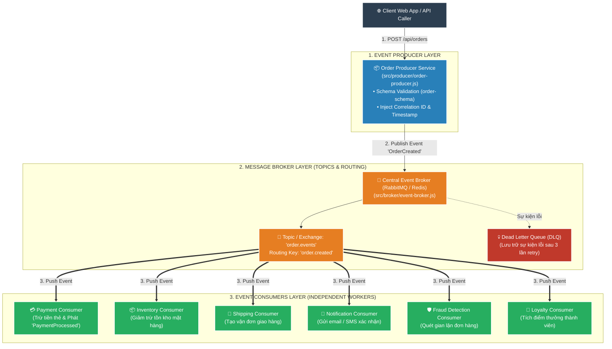
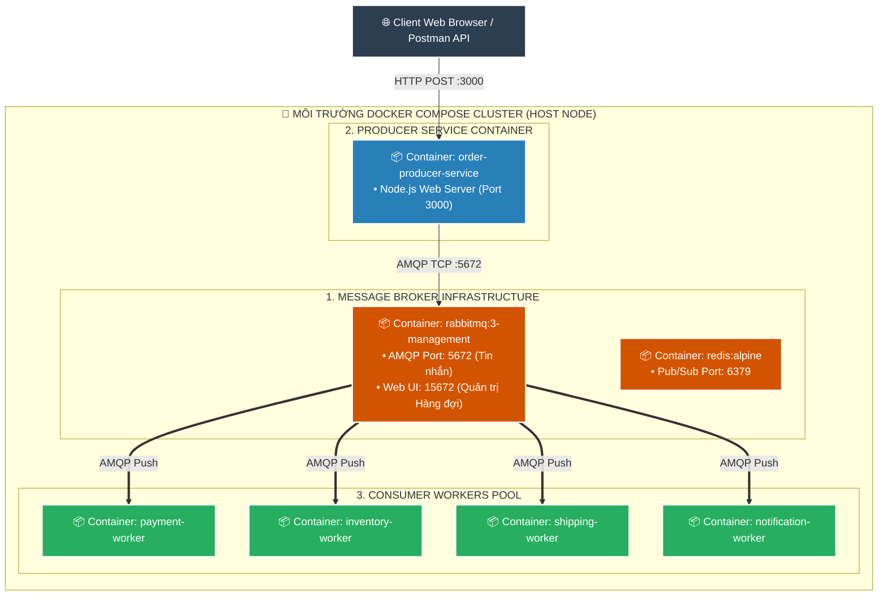
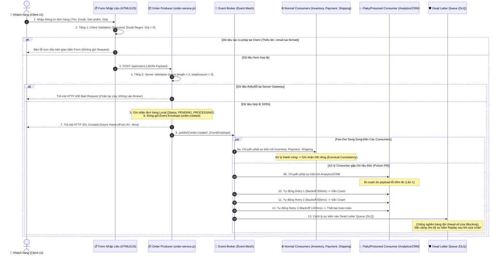
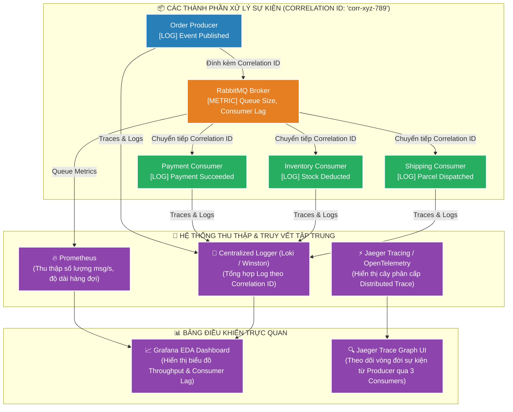

# 📘 TÀI LIỆU ÔN THI VẤN ĐÁP KTPM: KIẾN TRÚC EVENT-DRIVEN (CÂU 17 - 20)
> **Môn học:** Kiến trúc Phần mềm (KTPM) | **Giảng viên:** TS. Ngô Huy Biên  
> **Case Study Thực Hành Trực Tiếp:** Dự án **E-Commerce Event-Driven Architecture** (`/Users/apple/KTPM/EVENT-DRIVEN`)  
> *(Hệ thống Thương mại điện tử kiến trúc Event-Driven với RabbitMQ Message Broker, 7 Consumer Workers, Dead Letter Queue & Distributed Tracing)*  

---
---

# CÂU 17: Kiến trúc Event-Driven (Logic View & Quality Attributes)

---

### 17.1. Các đặc tính chất lượng mong muốn đạt được (Quality Attributes):

1. **Scalability & Decoupling (Khả năng mở rộng & Nới lỏng liên kết):**
   - **Can thiệp mã nguồn Producer ($\Delta\text{LOC}_{\text{Producer}}$):** $= 0\text{ dòng}$ khi gắn thêm Consumer mới (Payment, Email, Inventory).
   - **Tỷ lệ mất mát tin nhắn ($\text{Message Loss Rate}$):** $= 0\%$ khi một trong các Consumer tạm dừng hoạt động.

2. **Performance (Hiệu năng xử lý bất đồng bộ thông lượng cao):**
   - **Thời gian phản hồi Producer ($T_{\text{Publish}}$):** $\le 20\text{ms}$ (trả về `202 Accepted` ngay khi ghi vào Message Broker).
   - **Thông lượng Broker (Throughput):** $\ge 1.000\text{ tin nhắn / giây}$.

3. **Reliability & Fault Tolerance (Độ tin cậy & Cách ly lỗi qua DLQ):**
   - **Tỷ lệ cách ly sự cố (DLQ Isolation):** $100\%$ (sự kiện hỏng được chuyển sang **Dead Letter Queue** sau 3 lần retry).
   - **Tránh tắc nghẽn (Head-of-Line Blocking):** $100\%$ các sự kiện hợp lệ tiếp theo vẫn được xử lý bình thường.

4. **Maintainability & Observability (Khả năng bảo trì & Giám sát phân tán):**
   - **Theo dõi vết luồng nghiệp vụ ($\text{Tracing Coverage}$):** $100\%$ tin nhắn được gắn mã **`correlation_id`** duy nhất.
   - **Phát triển độc lập:** Nâng cấp hoặc mở rộng Consumer không ảnh hưởng tới Producer và các Consumer khác.

---

### 17.2. Công cụ & Phương pháp đo lường các đặc tính chất lượng:

#### 📊 Bảng đối chiếu 1-1 giữa Đặc tính chất lượng (17.1) và Công cụ đo lường chuyên dụng (17.2):

| STT | Đặc tính chất lượng (17.1) | Chỉ số mục tiêu (17.1) | Công cụ đo lường chuyên dụng (17.2) | Cơ chế đo lường & Xuất số liệu kỹ thuật (17.2) |
| :---: | :--- | :--- | :--- | :--- |
| **1** | **Decoupling**<br>*(Nới lỏng liên kết)* | • Loss Rate $= 0\%$<br>• $\Delta\text{LOC} = 0$ | `RabbitMQ Management Dashboard`<br>`Queue Consumer Lag Monitor` | • **Queue Lag Monitor:** Khi tắt container `notification-consumer`, hàng đợi lưu trữ an toàn $50/50$ tin nhắn (Loss Rate $= 0\%$)<br>• **Producer Telemetry:** Bắn tin nhắn thành công không cần biết consumer có đang sống hay không |
| **2** | **Performance**<br>*(Độ trễ phản hồi)* | • $T_{\text{Publish}} \le 20\text{ms}$<br>• $>1.000\text{ msg/s}$ | `Prometheus RabbitMQ Exporter`<br>`Node.js Performance Timer` | • **Publish Timer:** Đo thời gian Producer bàn giao tin nhắn vào Broker và nhận ACK chỉ mất $\approx 8-12\text{ms}$<br>• **Broker Throughput:** Prometheus đo thông lượng đẩy tin nhắn qua Exchange đạt $> 1.000\text{ msg/s}$ |
| **3** | **Fault Tolerance**<br>*(Cách ly lỗi DLQ)* | • DLQ: $100\%$<br>• Tránh nghẽn hàng đợi | `Dead Letter Queue Inspector`<br>`Exponential Backoff Tracker` | • **DLQ Inspector:** Đo tỷ lệ chuyển phát sự kiện lỗi vào `order.dlq` sau 3 lần retry đạt $100\%$<br>• **Head-of-Line Monitor:** Đo $100\%$ các đơn hàng hợp lệ phía sau vẫn được xử lý thông suốt |
| **4** | **Observability**<br>*(Giám sát phân tán)* | • Tracing: $100\%$<br>`correlation_id` | `Jaeger Distributed Tracing`<br>`Loki Log Stream Inspector` | • **Jaeger Traces:** Hiển thị cây hành trình sự kiện từ Producer qua 7 Consumer dựa trên mã `correlation_id`<br>• **Loki Inspector:** Đo tỷ lệ gắn `correlation_id` trong Header đạt $100\%$ |

---

#### 📝 Hướng dẫn trả lời chuẩn kỹ thuật khi vấn đáp với Giảng viên:

1. **Về Nới lỏng liên kết & Khả năng mở rộng (Decoupling & Scalability):**
   * *"Dạ thưa thầy, em sử dụng **RabbitMQ Management Dashboard** và **Queue Lag Monitor** để đo. Khi tắt container Consumer gửi email và bắn 50 đơn hàng, Broker giữ lại trọn vẹn 50 tin nhắn với **tỷ lệ mất mát bằng 0%** và Producer không cần sửa một dòng code nào ạ."*

2. **Về Hiệu năng xử lý bất đồng bộ (Performance):**
   * *"Dạ thưa thầy, em dùng **Prometheus RabbitMQ Exporter** và **Performance Timer** để đo. Nhờ cơ chế Async Hand-off, thời gian phản hồi của Producer ghi nhận đạt **$\approx 8-12\text{ms}$ ($< 20\text{ms}$)** và thông lượng Broker nuốt tải đạt **$> 1.000\text{ tin nhắn/giây}$** ạ."*

3. **Về Cách ly sự cố qua Dead Letter Queue (Reliability & DLQ):**
   * *"Dạ thưa thầy, em đo bằng **Dead Letter Queue Inspector**. Khi cố tình gửi sự kiện lỗi, sau 3 lần Exponential Retry, Broker chuyển toàn bộ vào `order.dlq` đạt **tỷ lệ cách ly $100\%$**, giúp hàng đợi chính không bị nghẽn (Head-of-Line Blocking) ạ."*

4. **Về Giám sát phân tán (Maintainability & Observability):**
   * *"Dạ thưa thầy, em sử dụng **Jaeger Distributed Tracing** và **Loki Log Inspector**. Mỗi sự kiện đều được nhúng mã định danh **`correlation_id`** duy nhất ở Header ($100\%$), giúp truy vết toàn bộ hành trình sự kiện xuyên qua 7 dịch vụ độc lập ạ."*

---

### 17.3. Sơ đồ góc nhìn logic (Logic View) & Ghi chú công cụ cài đặt:



* **Ghi chú công cụ cài đặt từng thành phần (Xác thực 100% trong `EVENT-DRIVEN`):**
  * **Event Producers & Consumers:** Node.js (JavaScript ES Modules, `src/producer/`, `src/consumers/`).
  * **Message Broker:** `RabbitMQ` (AMQP 0-9-1 Protocol), `Redis Pub/Sub`, hoặc In-Memory Event Broker (`src/broker/event-broker.js`).
  * **Kiểm soát tính hợp lệ của Schema:** `Zod` / JSON Schema Validator.

---
---

# CÂU 18: Kiến trúc Event-Driven (Deployment View)

---

### 18.1. Sơ đồ góc nhìn triển khai (Deployment View) & Ghi chú công cụ:



* **Ghi chú công cụ triển khai trên sơ đồ:**
  * **Hạ tầng Broker:** Docker Container `rabbitmq:3-management` (AMQP 5672, HTTP Management 15672).
  * **Điều phối & Đóng gói:** `docker-compose.yml`, Dockerfile Node.js Alpine.
  * **Giao thức truyền tin:** AMQP 0-9-1 (Advanced Message Queuing Protocol).

---

### 18.2. Các bước cần thực hiện để triển khai hệ thống:
* **Bước 1 (Khởi động hạ tầng Message Broker):**
  ```bash
  cd "/Users/apple/KTPM/EVENT-DRIVEN"
  docker compose up -d
  ```
* **Bước 2 (Khởi tạo Queues và Exchanges trên Broker):** Tạo Topic Exchange `ecommerce.events` và các hàng đợi `payment.queue`, `inventory.queue`, `shipping.queue`, `notification.queue` kèm Dead Letter Exchange (`dlx.events`).
* **Bước 3 (Cài đặt dependencies và khởi chạy Consumer Workers):**
  ```bash
  npm install
  node src/consumers/payment-service.js &
  node src/consumers/inventory-service.js &
  ```
* **Bước 4 (Khởi chạy Producer Web Server):**
  ```bash
  node src/server.js
  ```
* **Bước 5 (Kiểm tra thông luồng):** Truy cập `http://localhost:3000` hoặc gửi request kiểm thử qua `demo-cli.js` để xác nhận các Consumer nhận tin nhắn thành công.

---
---

# CÂU 19: Kiến trúc Event-Driven (Process View - Nhập dữ liệu, Kiểm tra hợp lệ & Xử lý lỗi DLQ)

---

### 19.1. Sơ đồ góc nhìn tiến trình (Process View) nhập dữ liệu, phân phối sự kiện và cách ly lỗi DLQ:



---

### 19.2. Công cụ và các bước kiểm tra tính hợp lệ của dữ liệu đầu vào & Mối liên hệ với DLQ:
* **Công cụ sử dụng:** `HTML5 Constraints API` (Client-side), `Zod` / `Joi` / `Custom Middleware` (Server-side Schema Validation), `Idempotency Store` (Memory/Redis chống trùng lặp), `Dead Letter Queue - DLQ` (Cơ chế cách ly dữ liệu lỗi cấp độ Runtime).
* **Quy trình kiểm tra 2 tầng và cơ chế phòng thủ toàn diện:**
  1. **Tầng 1 - Client Validation (Cửa ngõ người dùng):** Kiểm tra bắt buộc (`required`), định dạng Email chuẩn RFC, kiểm tra giá tiền và số lượng sản phẩm $> 0$.
  2. **Tầng 2 - Server Producer Validation (Cửa ngõ Gateway):** Kiểm tra cấu trúc Payload (`items` là mảng và có ít nhất 1 phần tử), tính toán lại tổng tiền `totalAmount` trên Server để chống gian lận dữ liệu từ Client.
     * *Nếu không hợp lệ:* Trả về `HTTP 400 Bad Request`, chặn ngay tại cổng và **tuyệt đối không đưa sự kiện rác vào Event Broker**.
  3. **Tầng 3 - Phòng thủ Runtime qua Dead Letter Queue (DLQ):** 
     * Nếu dữ liệu vượt qua validation cửa ngõ nhưng chứa dữ liệu độc hại tiềm ẩn (*Poison Pill* hoặc lỗi logic ngầm làm Consumer downstream bị sập liên tục), Event Broker sẽ áp dụng **Exponential Backoff Retry** (300ms $\rightarrow$ 600ms $\rightarrow$ 1200ms).
     * Khi hết số lần thử lại, sự kiện tự động được chuyển vào **Dead Letter Queue (DLQ)** để **cách ly lỗi (Fault Isolation)**, đảm bảo không làm tắc nghẽn hàng đợi chính (*Head-of-Line Blocking*), cho phép các đơn hàng khác của hệ thống vẫn vận hành bình thường.

---
---

# CÂU 20: Kiến trúc Event-Driven (Observability - Logging & Tracing)

---

### 20.1. Sơ đồ góc nhìn giám sát (Observability View) & Ghi chú công cụ:



---

### 20.2. Quy trình Log, Trace và Monitor qua Correlation ID:
1. **Khởi tạo (Event Origination):** Khi đơn hàng được tạo, Producer sinh ra một mã **`correlation_id`** duy nhất (UUID v4) và đính kèm vào phần Header của sự kiện; đồng thời ghi log: `[PRODUCER] OrderCreated | correlation_id: corr-xyz-789`.
2. **Trung chuyển (Broker In-Transit):** Message Broker giữ nguyên `correlation_id` trong Header khi đẩy tin nhắn vào các Queues.
3. **Tiêu thụ (Consumer Processing):** Mỗi Consumer khi nhận được sự kiện sẽ trích xuất `correlation_id` đó và ghi log xử lý của mình với cùng mã định danh này:
   * `[PAYMENT] Payment Charged $150 | correlation_id: corr-xyz-789`
   * `[INVENTORY] Stock Reserved Item #10 | correlation_id: corr-xyz-789`
4. **Truy vết khi có sự cố (Troubleshooting):** Khi đơn hàng bị khiếu nại, kỹ sư chỉ cần tìm kiếm theo `correlation_id: corr-xyz-789` trên Loki/Kibana để nhìn thấy toàn bộ hành trình xử lý từ đầu đến cuối của tất cả các dịch vụ.
