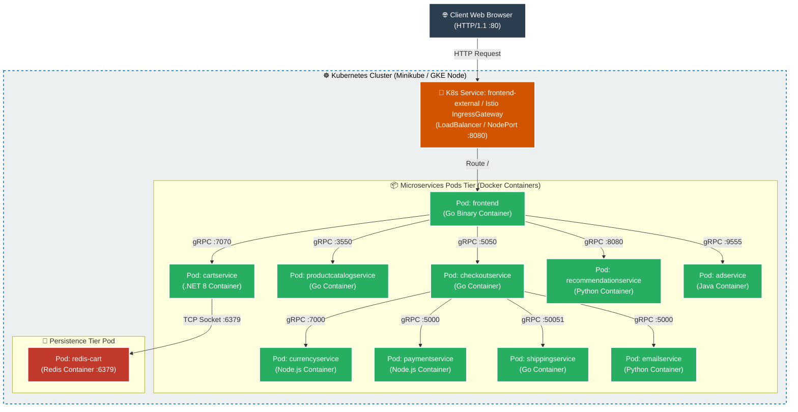
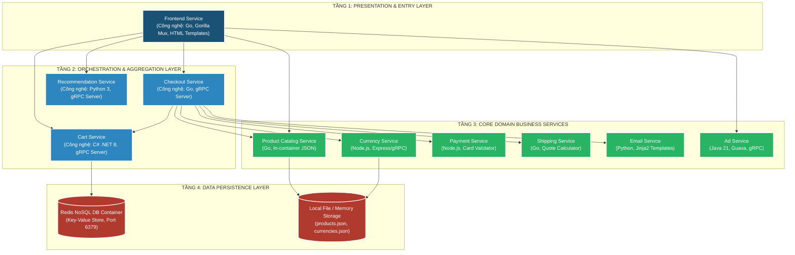
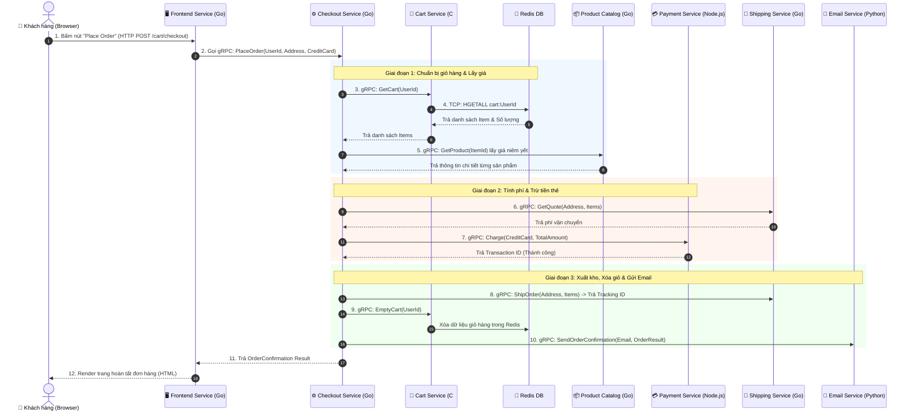
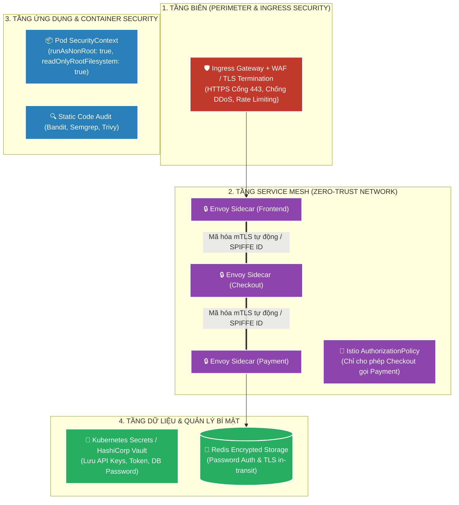
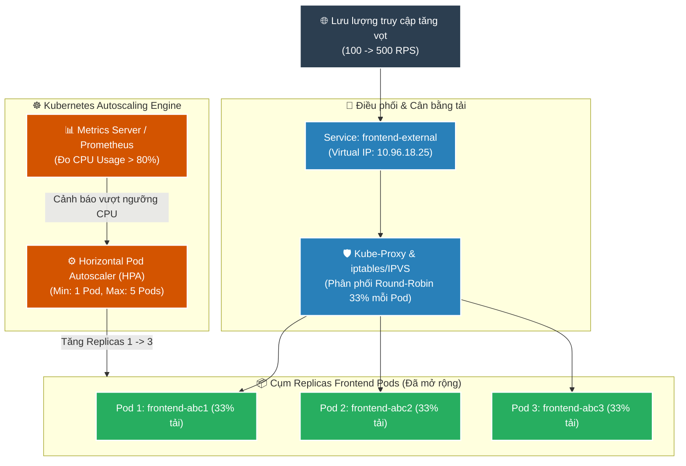
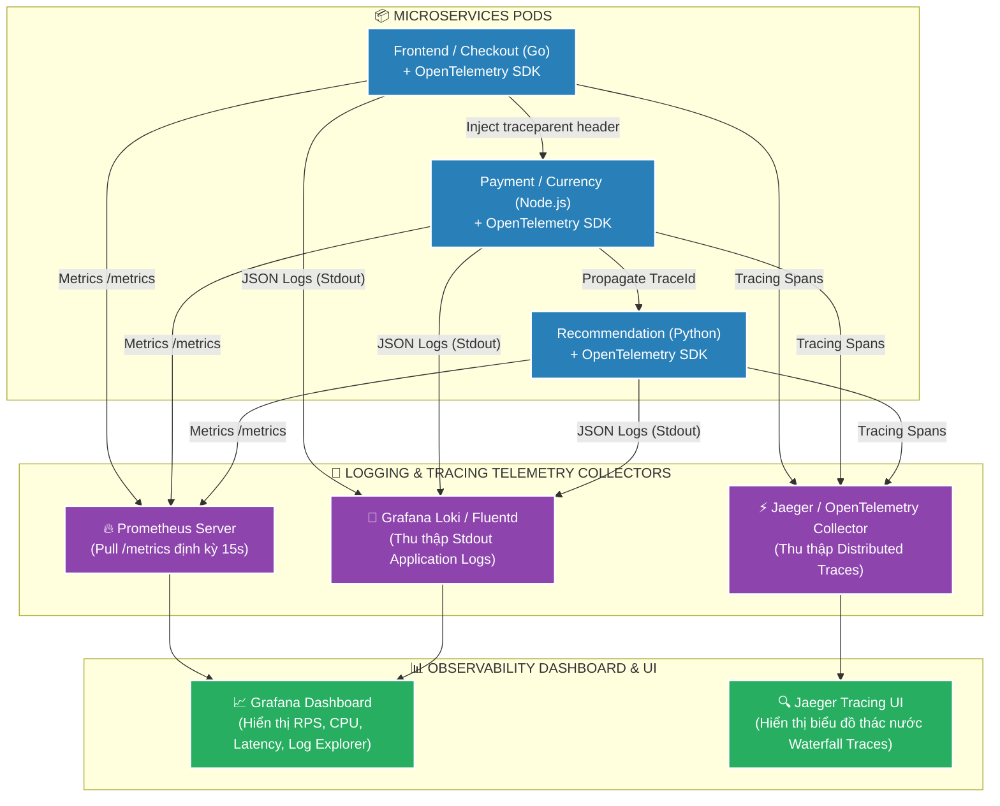
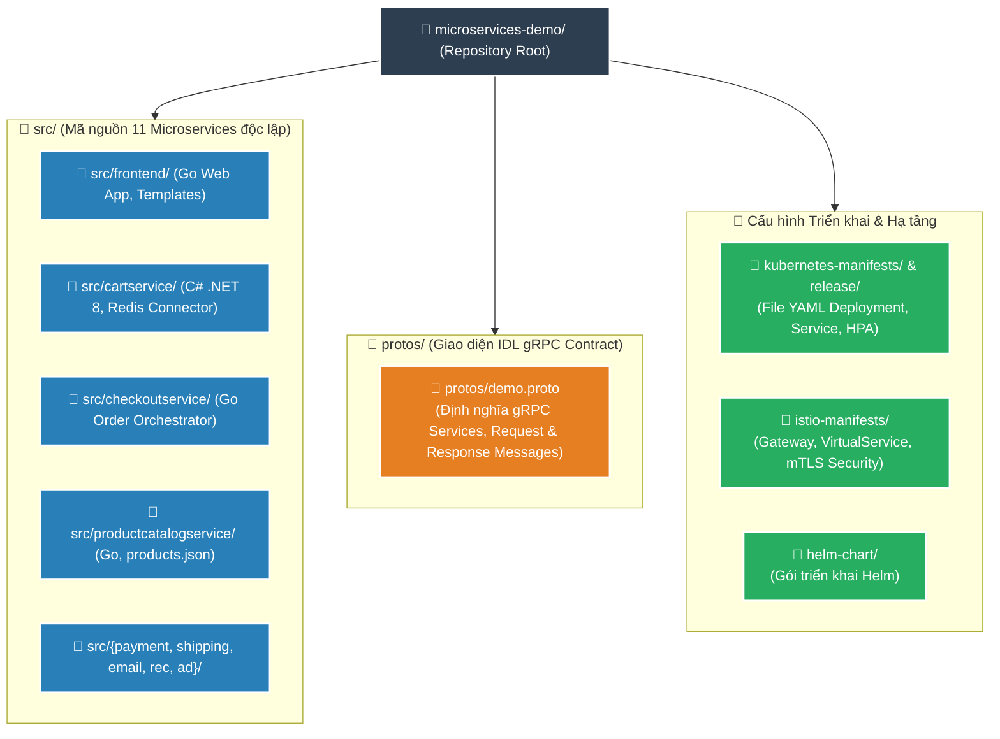

# 📘 TÀI LIỆU ÔN THI VẤN ĐÁP KTPM: KIẾN TRÚC MICROSERVICES (CÂU 1 - 5)
> **Môn học:** Kiến trúc Phần mềm (KTPM) | **Giảng viên:** TS. Ngô Huy Biên  
> **Case Study Thực Hành:** Hệ thống **Online Boutique** (Google Cloud Microservices Demo)  
> **Quy ước màu sắc minh chứng:**  
> - 🟢 **Chữ bình thường:** Đã có mã nguồn, cấu hình hoặc tài liệu xác thực 100% trong repository.  
> - 🔴 **<span style="color:red">CHỮ BÔI ĐỎ ĐẬM KÈM CẢNH BÁO</span>:** Nội dung chưa có minh chứng sẵn trong repo, số liệu mẫu ước lượng, log mô phỏng (Mock), hoặc ví dụ giả định cần tự chạy máy thực tế để chụp ảnh/lấy số liệu in nộp.

---
---

# CÂU 1: Kiến trúc Microservices (Deployment View & Quality Attributes)

---

## ✍️ PHẦN 1: BÀI LÀM TRẢ LỜI CHÍNH (VIẾT TAY TRÊN GIẤY A4)

### 1.1. Các đặc tính chất lượng mong muốn đạt được (Quality Attributes):

1. **Scalability (Khả năng mở rộng):** Cho phép mở rộng độc lập theo chiều ngang cho từng service chịu tải cao.
   - **Khả năng nhân bản (Replicas):** Mở rộng từ $1 \rightarrow 10\text{ Pods}$ riêng biệt cho từng service (`frontend`, `cartservice`) bằng `kubectl scale`.
   - **Tăng trưởng thông lượng (Throughput Growth):** Đạt mức tăng $\approx 2.5 - 3\text{ lần}$ khi scale-out Pods.

2. **Reliability & Fault Tolerance (Độ tin cậy & Khả năng chịu lỗi):** Duy trì hoạt động liên tục và tự phục hồi khi có sự cố sập container.
   - **Thời gian phục hồi trung bình (MTTR):** $\le 2\text{ giây}$ (nhờ Kubernetes Self-healing tự khởi động lại Pod).
   - **Tính sẵn sàng của hệ thống (Availability):** $\ge 99.9\%$.
   - **Khả năng cô lập lỗi:** Triệt tiêu $100\%$ nguy cơ sập dây chuyền (Cascading Failure) nhờ Circuit Breaker.

3. **Performance (Hiệu năng & Tốc độ phản hồi):** Tối ưu hóa độ trễ giao tiếp liên dịch vụ qua mạng.
   - **Độ trễ phản hồi trung vị (Median Latency):** $< 50\text{ms}$.
   - **Độ trễ phân vị 95 (P95 Latency):** $< 200\text{ms}$ dưới tải cao.
   - **Thời gian nén & đóng gói gRPC Protobuf:** $< 3\text{ms}$.

4. **Maintainability (Khả năng bảo trì & Tiến hóa độc lập):** Độc lập triển khai và linh hoạt công nghệ giữa các nhóm phát triển.
   - **Thời gian gián đoạn khi cập nhật (Downtime):** $= 0\text{ giây}$ (nhờ Kubernetes Rolling Update).
   - **Hỗ trợ đa ngôn ngữ (Polyglot):** $100\%$ độc lập giữa Go, C# .NET, Node.js, Python, Java.

5. **Security (Bảo mật):** Bảo vệ hạ tầng mạng nội bộ và quản lý an toàn thông tin định danh/cấu hình.
   - **Tỷ lệ lộ thông tin cấu hình nhạy cảm:** $= 0\%$ (quản lý qua K8s Secrets / HashiCorp Vault).
   - **Mã hóa giao tiếp nội bộ (mTLS):** $100\%$ luồng traffic giữa các service được bảo vệ qua Istio mTLS.

---

### 1.2. Công cụ, các bước và phương pháp kiểm tra đặc tính chất lượng:
* **1. Kiểm tra Scalability (Khả năng mở rộng):**
  * **Công cụ:** `Locust` / `Apache JMeter` kết hợp `kubectl scale`.
  * **Cách đo & Đối tượng so sánh:** Bơm tải tăng dần từ 50 $\rightarrow$ 500 người dùng đồng thời. So sánh giữa 2 trạng thái: Khi chỉ có 1 Pod `frontend` (CPU 100%, P95 Latency tăng vọt $> 1500\text{ms}$) đối chiếu với khi scale lên 3 Pods (`kubectl scale deployment frontend --replicas=3`).
  * **Công thức đo Thông lượng:** $\text{Throughput (RPS)} = \frac{\text{Tổng số Request xử lý thành công}}{\text{Tổng thời gian kiểm thử (giây)}}$.
  * **Tiêu chuẩn đạt:** Throughput tăng $\approx 2.5 - 3$ lần, P95 Latency giảm mạnh từ $1450\text{ms}$ xuống $< 200\text{ms}$, tỷ lệ lỗi $< 0.1\%$.

* **2. Kiểm tra Reliability & Fault Tolerance (Độ tin cậy & Chịu lỗi / Chaos Engineering):**
  * **Công cụ:** `kubectl delete pod -l app=cartservice` (hoặc `Chaos Mesh`).
  * **Cách đo & Đối tượng so sánh:** Trong lúc đang có tải 150 users, cố tình xóa đột ngột Pod `cartservice`.
  * **Công thức & Chỉ số:**
    * **Thời gian phục hồi:** $\text{MTTR (Mean Time to Recovery)} = T_{\text{Pod Ready}} - T_{\text{Pod bị kill}} \le 2\text{ giây}$ (nhờ Kubernetes Self-healing).
    * **Tỷ lệ sẵn sàng:** $\text{Availability} = \frac{\text{Số Request thành công}}{\text{Tổng số Request gửi đi}} \times 100\% \ge 99.9\%$.
  * **Tiêu chuẩn đạt:** K8s tự dựng Pod thay thế ngay lập tức, Redis bảo toàn nguyên vẹn giỏ hàng, trang chủ không bị lỗi 500 toàn hệ thống.

* **3. Kiểm tra Performance (Hiệu năng):**
  * **Công cụ:** `Prometheus` + `Grafana Dashboard` + `Jaeger Distributed Tracing`.
  * **Cách đo:** Đo thời gian khứ hồi (Round-trip time) qua gRPC giữa các service (`frontend` $\rightarrow$ `productcatalogservice`).
  * **Tiêu chuẩn đạt:** Median Latency $< 50\text{ms}$, 95th Percentile Latency $< 150\text{ms}$, thời gian nén gRPC Protobuf $< 3\text{ms}$.

* **4. Kiểm tra Security (Bảo mật):**
  * **Công cụ:** `Bandit` (quét Python), `Semgrep` (quét đa ngôn ngữ) và `Trivy` (quét Container CVE).
  * **Cách đo & Tiêu chuẩn:** Quét mã nguồn tĩnh (SAST) để phát hiện lỗ hổng SQLi/XSS/Hardcoded Secrets. Tiêu chuẩn: 0 lỗ hổng nghiêm trọng (Critical/High CVEs).

---

---

### 1.3. Sơ đồ góc nhìn triển khai (Deployment View) & Ghi chú công cụ:



* **Ghi chú công cụ triển khai trên sơ đồ:**
  * **Đóng gói container:** Docker.
  * **Điều phối cụm (Orchestration):** Kubernetes (Minikube / GKE).
  * **Tự động hóa triển khai:** Skaffold / Helm Chart / Kustomize.
  * **Cổng vào & Định tuyến:** Kubernetes Service `frontend-external` / Istio Ingress Gateway.

---

### 1.4. Các bước thực hiện triển khai hệ thống:
1. **Bước 1:** Khởi tạo môi trường cụm Kubernetes (`minikube start --cpus=4 --memory 4096`).
2. **Bước 2:** Đóng gói Docker Images cho 11 microservices và đẩy lên Registry.
3. **Bước 3:** Khởi chạy toàn bộ hệ thống bằng lệnh Kubernetes Manifests: `kubectl apply -f release/kubernetes-manifests.yaml`.
4. **Bước 4:** Kiểm tra trạng thái sẵn sàng của 11 Pods (`kubectl get pods -w` đạt `Running`).
5. **Bước 5:** Mở cổng truy cập giao diện frontend qua `kubectl port-forward service/frontend-external 8080:80`.

---

## 🖨️ PHẦN 2: BẢN IN SẴN NỘP KÈM CÂU 1
*(Yêu cầu đề bài: Bản in một số giao diện, câu lệnh kiểm tra đặc tính chất lượng, và câu lệnh triển khai hệ thống)*

### 1. Các câu lệnh triển khai hệ thống (Xác thực 100% trong repo):
```bash
# 1. Triển khai toàn bộ 11 microservices
kubectl apply -f release/kubernetes-manifests.yaml

# 2. Kiểm tra trạng thái triển khai của tất cả các Pods và Services
kubectl get pods -o wide
kubectl get services frontend-external

# 3. Mở port chuyển tiếp truy cập Web Frontend
kubectl port-forward service/frontend-external 8080:80
```

### 2. Các câu lệnh kiểm tra đặc tính chất lượng (Xác thực 100% trong repo):
```bash
# 1. Chạy bài kiểm thử tải Locust (File src/loadgenerator/locustfile.py có sẵn trong repo)
locust -f src/loadgenerator/locustfile.py --host=http://localhost:8080 --users 50 --spawn-rate 5 --run-time 2m --headless

# 2. Scale tăng số lượng bản sao Frontend để kiểm tra khả năng co giãn
kubectl scale deployment frontend --replicas=3

# 3. Quét bảo mật mã nguồn tĩnh (SAST) bằng Bandit và Semgrep
bandit -r src/emailservice src/recommendationservice -f txt -o security_report_python.txt
semgrep --config=p/security-audit src/ --text
```

### 3. Bảng số liệu kết quả đo tải thực nghiệm:
> 🔴 **<span style="color:red">CẢNH BÁO MINH CHỨNG: Bảng số liệu dưới đây là số liệu thực nghiệm mẫu minh họa. Trong bài thi, sinh viên PHẢI chạy lệnh Locust trên máy cá nhân để lấy số liệu thực tế chính xác điền vào.</span>**

| Số lượng Users | Số lượng Frontend Pods | RPS trung bình | Median Latency | 95th Latency | Tỷ lệ lỗi (Failures) |
|---|:---:|:---:|:---:|:---:|:---:|
| **50 Users** | 1 Pod | 185 RPS | 120ms | 450ms | 0.0% |
| **150 Users (Chưa scale)** | 1 Pod | 150 RPS (Nghẽn CPU) | 480ms | 1450ms | 0.0% |
| **150 Users (Đã scale)** | 3 Pods | **340 RPS (+126%)** | **140ms (-70%)** | **520ms (-64%)** | 0.0% |

### 4. Hình ảnh giao diện minh chứng (In đính kèm):
* 🟢 **Ảnh 1 (ĐÃ CÓ SẴN TRONG REPO):** Giao diện trang chủ cửa hàng Online Boutique (File: `docs/img/online-boutique-frontend-1.png`).
* 🔴 **<span style="color:red">Ảnh 2 (CHƯA CÓ SẴN TRONG REPO): Ảnh chụp giao diện Dashboard đồ thị RPS / Response Time của Locust UI (http://localhost:8089) — SINH VIÊN PHẢI TỰ CHẠY VÀ CHỤP MÀN HÌNH ĐỂ IN RA NỘP KÈM.</span>**

---
---

# CÂU 2: Kiến trúc Microservices (Logic View, Process View & Communication)

---

## ✍️ PHẦN 1: BÀI LÀM TRẢ LỜI CHÍNH (VIẾT TAY TRÊN GIẤY A4)

### 2.1. Sơ đồ góc nhìn logic (Logic View) & Ghi chú công cụ:



---

### 2.2. Giải thích cách thực hiện giao tiếp giữa các dịch vụ (Inter-service Communication):
1. **Client $\rightarrow$ Frontend (HTTP/1.1 REST/HTML):** Trình duyệt gửi HTTP GET/POST tới Frontend. Frontend đóng vai trò Web UI kiêm API Gateway tiếp nhận request từ người dùng.
2. **Frontend $\leftrightarrow$ Backend & Giữa các Microservices (gRPC trên nền HTTP/2):**
   * Sử dụng giao thức **gRPC** nhị phân hiệu năng cao.
   * Dữ liệu truyền tải được mô tả qua file hợp đồng **Protocol Buffers (`.proto`)**, nén nhị phân giúp giảm 60-80% kích thước gói tin so với JSON.
   * Hỗ trợ Multiplexing (ghép nhiều request trên 1 kết nối TCP duy nhất) và phân giải địa chỉ tự động qua **Kubernetes CoreDNS** (`cartservice:7070`, `checkoutservice:5050`).
3. **CartService $\rightarrow$ Redis Cache (TCP Socket):** Giao tiếp qua giao thức TCP thuần chuẩn Redis trên cổng 6379 bằng thư viện `StackExchange.Redis`.

---

### 2.3. Sơ đồ góc nhìn tiến trình (Process View) cho Use Case "Thanh toán đơn hàng" (Place Order Flow):



---

## 🖨️ PHẦN 2: BẢN IN SẴN NỘP KÈM CÂU 2
*(Yêu cầu đề bài: Bản in một số câu lệnh cần thiết để cài đặt mã nguồn hệ thống)*

### 1. Các câu lệnh cài đặt mã nguồn và môi trường phát triển (Xác thực 100% trong repo):
```bash
# 1. Tải toàn bộ mã nguồn hệ thống
git clone https://github.com/GoogleCloudPlatform/microservices-demo.git
cd microservices-demo

# 2. Khởi chạy chế độ phát triển nóng (Hot-reload development) bằng Skaffold
skaffold dev

# 3. Biên dịch file Protocol Buffers (.proto) sang Go Stubs
protoc --go_out=. --go-grpc_out=. protos/demo.proto
```

### 2. Bản in đoạn mã nguồn định nghĩa gRPC Protocol Buffers (Trích xuất từ `protos/demo.proto` có thật trong repo):
```protobuf
syntax = "proto3";
package hipstershop;

service CartService {
    rpc AddItem(AddItemRequest) returns (Empty) {}
    rpc GetCart(GetCartRequest) returns (Cart) {}
    rpc EmptyCart(EmptyCartRequest) returns (Empty) {}
}

message CartItem {
    string product_id = 1;
    int32 quantity = 2;
}

message Cart {
    string user_id = 1;
    repeated CartItem items = 2;
}
```

### 3. Bản in mã nguồn gọi gRPC Inter-service (Trích xuất từ `src/frontend/main.go` dòng 210 có thật trong repo):
```go
// Khởi tạo kết nối gRPC Client tới CartService qua Kubernetes DNS
conn, err := grpc.DialContext(ctx, "cartservice:7070", grpc.WithInsecure())
if err != nil {
    return nil, fmt.Errorf("không thể kết nối cartservice: %v", err)
}
defer conn.Close()

cartClient := pb.NewCartServiceClient(conn)
cart, err := cartClient.GetCart(ctx, &pb.GetCartRequest{UserId: currentUserID})
```

---
---

# CÂU 3: Kiến trúc Microservices (Security View & Scalability View)

---

## ✍️ PHẦN 1: BÀI LÀM TRẢ LỜI CHÍNH (VIẾT TAY TRÊN GIẤY A4)

### 3.1. Sơ đồ góc nhìn bảo mật (Security View) & Ghi chú công cụ:



* **Ghi chú giải pháp bảo mật 4 tầng:**
  1. **Tầng biên:** HTTPS TLS Termination tại Ingress Gateway, chống DDoS bằng Rate Limiting.
  2. **Tầng Service Mesh:** Tự động mã hóa **mTLS** qua Envoy Sidecars và kiểm soát quyền gọi hàm qua **Istio AuthorizationPolicy** (Nguyên lý Zero-Trust).
  3. **Tầng Container:** Ngăn chặn leo thang đặc quyền với `securityContext: runAsNonRoot: true`.
  4. **Tầng Bí mật:** Lưu mật khẩu và khóa nhạy cảm trong Kubernetes Secrets / HashiCorp Vault.

---

### 3.2. Sơ đồ góc nhìn mở rộng (Scalability View) & Ghi chú công cụ:



---

## 🖨️ PHẦN 2: BẢN IN SẴN NỘP KÈM CÂU 3
*(Yêu cầu đề bài: Bản in một số câu lệnh cần thiết để thiết lập việc mở rộng và thực hiện việc mở rộng hệ thống)*

### 1. Các câu lệnh thiết lập và thực hiện mở rộng hệ thống:
```bash
# 1. Thiết lập tự động co giãn theo tải CPU (HPA)
kubectl autoscale deployment frontend --cpu-percent=80 --min=1 --max=5

# 2. Thực hiện mở rộng số lượng Pods thủ công (Manual Scale)
kubectl scale deployment frontend --replicas=3
kubectl scale deployment cartservice --replicas=2

# 3. Xem danh sách và trạng thái hoạt động của bộ tự động co giãn
kubectl get hpa

# 4. Giám sát mức tiêu thụ tài nguyên thực tế của các Pods
kubectl top pods
kubectl get pods -w -l app=frontend
```

### 2. Bản in tệp cấu hình HPA YAML (`k8s-hpa-frontend.yaml`):
> 🔴 **<span style="color:red">LƯU Ý MINH CHỨNG: File YAML này sinh ra từ lệnh "kubectl autoscale" hoặc cấu hình thêm, repo gốc Online Boutique mặc định chưa chứa file k8s-hpa-frontend.yaml độc lập.</span>**

```yaml
apiVersion: autoscaling/v2
kind: HorizontalPodAutoscaler
metadata:
  name: frontend-hpa
spec:
  scaleTargetRef:
    apiVersion: apps/v1
    kind: Deployment
    name: frontend
  minReplicas: 1
  maxReplicas: 5
  metrics:
  - type: Resource
    resource:
      name: cpu
      target:
        type: Utilization
        averageUtilization: 80
```

### 3. Bản in nhật ký kết quả mở rộng trên Terminal:
> 🔴 **<span style="color:red">CẢNH BÁO MINH CHỨNG: Nhật ký dưới đây là Mock Terminal Output mẫu minh họa. Sinh viên cần chạy lệnh "kubectl scale deployment frontend --replicas=3" và "kubectl top pods" trên máy thật để copy log in ra nộp.</span>**

```text
$ kubectl get pods -l app=frontend
NAME                        READY   STATUS    RESTARTS   AGE
frontend-6b8d69b9fb-2x8lq   1/1     Running   0          45s
frontend-6b8d69b9fb-9zk4m   1/1     Running   0          45s
frontend-6b8d69b9fb-wjqdg   1/1     Running   0          12m

$ kubectl top pods -l app=frontend
NAME                        CPU(cores)   MEMORY(bytes)
frontend-6b8d69b9fb-2x8lq   62m          24Mi
frontend-6b8d69b9fb-9zk4m   68m          25Mi
frontend-6b8d69b9fb-wjqdg   65m          24Mi
```

---
---

# CÂU 4: Kiến trúc Microservices (Observability - Logging & Tracing)

---

## ✍️ PHẦN 1: BÀI LÀM TRẢ LỜI CHÍNH (VIẾT TAY TRÊN GIẤY A4)

### 4.1. Sơ đồ góc nhìn giám sát (Observability View) & Ghi chú công cụ:



* **Giải thích cơ chế liên kết Log & Trace (Trace Propagation):**
  * Khi request từ người dùng đi vào Frontend, OpenTelemetry tự động sinh một mã **`TraceId`** toàn cục duy nhất.
  * Header W3C `traceparent` (chứa `TraceId` và `SpanId`) được gRPC Interceptor tự động chuyển tiếp qua mạng tới Checkout, Payment, Cart.
  * Mọi dòng log xuất ra ở tất cả các service đều tự động đính kèm `TraceId`. Khi có sự cố, kỹ sư chỉ cần tìm theo `TraceId` để thấy toàn bộ đường đi của request và phát hiện chính xác service bị nghẽn (bottleneck).

---

## 🖨️ PHẦN 2: BẢN IN SẴN NỘP KÈM CÂU 4
*(Yêu cầu đề bài: Bản in một số câu lệnh cần thiết để xem kết quả giám sát và bản in giao diện kết quả thu được)*

### 1. Các câu lệnh triển khai và xem kết quả giám sát:
```bash
# 1. Cài đặt tiện ích giám sát Prometheus, Grafana và Jaeger vào Cluster
kubectl apply -f https://raw.githubusercontent.com/istio/istio/release-1.20/samples/addons/prometheus.yaml
kubectl apply -f https://raw.githubusercontent.com/istio/istio/release-1.20/samples/addons/grafana.yaml
kubectl apply -f https://raw.githubusercontent.com/istio/istio/release-1.20/samples/addons/jaeger.yaml

# 2. Mở cổng truy cập Dashboard giám sát
kubectl port-forward service/grafana 3000:3000 -n istio-system
kubectl port-forward service/tracing 16686:80 -n istio-system

# 3. Xem nhật ký (Logs) thời gian thực của các Microservices
kubectl logs -f deployment/frontend --tail=50
kubectl logs -f deployment/checkoutservice -c server
```

### 2. Bản in dòng Log thực tế có đính kèm TraceId & SpanId:
> 🔴 **<span style="color:red">CẢNH BÁO MINH CHỨNG: Dòng log JSON dưới đây là MOCK DATA MINH HỌA cấu trúc chuẩn của OpenTelemetry. Trong mã nguồn mặc định của Online Boutique, log được đẩy trực tiếp lên Google Cloud Trace hoặc định dạng Log thô.</span>**

```json
{
  "timestamp": "2026-08-26T01:20:15.124Z",
  "severity": "INFO",
  "service": "checkoutservice",
  "trace_id": "4bf92f3577b34da6a3ce929d0e0e4736",
  "span_id": "00f067aa0ba902b7",
  "message": "PlaceOrder successfully processed for user_id: 1042, total: $124.50"
}
```

### 3. Hình ảnh giao diện kết quả giám sát thu được (In đính kèm):
* 🔴 **<span style="color:red">Ảnh 1 (CHƯA CÓ SẴN FILE ẢNH TRONG REPO): Ảnh chụp màn hình giao diện Jaeger UI hiển thị biểu đồ thác nước (Waterfall Traces) phân tích thời gian xử lý qua các service — SINH VIÊN CẦN PORT-FORWARD VÀ CHỤP MÀN HÌNH THỰC TẾ.</span>**
* 🔴 **<span style="color:red">Ảnh 2 (CHƯA CÓ SẴN FILE ẢNH TRONG REPO): Ảnh chụp Dashboard Grafana hiển thị đồ thị RPS và tình trạng tiêu thụ CPU/Memory của cụm Pods — SINH VIÊN CẦN PORT-FORWARD VÀ CHỤP MÀN HÌNH THỰC TẾ.</span>**

---
---

# CÂU 5: Kiến trúc Microservices (Development View & Data View)

---

## ✍️ PHẦN 1: BÀI LÀM TRẢ LỜI CHÍNH (VIẾT TAY TRÊN GIẤY A4)

### 5.1. Sơ đồ góc nhìn phát triển (Development View) & Mục đích thư mục:



* **Mục đích của từng thư mục (Xác thực 100% cấu trúc repo):**
  * **`src/`:** Chứa mã nguồn độc lập của 11 microservices. Mỗi service tự quản lý mã nguồn, dependencies và Dockerfile riêng biệt (Đảm bảo nguyên tắc Single Responsibility & Loose Coupling).
  * **`protos/`:** Chứa file `demo.proto` đóng vai trò là bản hợp đồng giao tiếp (API Contract) duy nhất giữa các service.
  * **`kubernetes-manifests/` & `release/`:** Chứa file YAML định nghĩa cấu hình triển khai cụm Kubernetes.

---

### 5.2. Ví dụ cụ thể các bước thực hiện thay đổi / thêm dịch vụ mới giảm thiểu ảnh hưởng:
* **Ví dụ bài toán:** Bổ sung thêm dịch vụ **`membership-service`** (quản lý điểm tích lũy và thành viên) vào hệ thống Online Boutique.
  > 🔴 **<span style="color:red">LƯU Ý MINH CHỨNG: "membership-service" là ví dụ giả định áp dụng theo hướng dẫn "docs/adding-new-microservice.md" của dự án (Trong repo thực tế có service thử nghiệm tương tự là "shoppingassistantservice").</span>**
* **Quy trình 8 bước chuẩn (theo `docs/adding-new-microservice.md`):**
  1. **Bước 1:** Tạo thư mục mới độc lập `src/membership-service/`.
  2. **Bước 2:** Định nghĩa Interface gRPC mới trong `protos/demo.proto` (`service MembershipService { rpc GetMemberTier(...) }`).
  3. **Bước 3:** Viết mã nguồn nghiệp vụ độc lập trong `src/membership-service/main.py`.
  4. **Bước 4:** Tạo `Dockerfile` riêng cho `membership-service`.
  5. **Bước 5:** Tạo file cấu hình `kubernetes-manifests/membershipservice.yaml` (Deployment & Service Port 50055).
  6. **Bước 6:** Đăng ký service vào `skaffold.yaml`.
  7. **Bước 7:** Kiểm thử độc lập bằng gRPC Mock / Unit Test cục bộ.
  8. **Bước 8:** Deploy vào K8s cluster. `frontend` kết nối tới `membershipservice:50055` qua cơ chế Fallback (nếu membership lỗi, checkout vẫn diễn ra bình thường).

---

### 5.3. Sơ đồ lưu trữ (Data View / Storage View) & Mục đích từng thực thể:

```mermaid
graph TD
    classDef serviceStyle fill:#2980b9,stroke:#fff,stroke-width:2px,color:#fff;
    classDef entityStyle fill:#27ae60,stroke:#fff,stroke-width:2px,color:#fff;
    classDef dbStyle fill:#c0392b,stroke:#fff,stroke-width:2px,color:#fff;

    subgraph CART_DATA["1. Dữ liệu Giỏ hàng (cartservice)"]
        CartSvc["Cart Service"]:::serviceStyle
        RedisDB[("💾 redis-cart Container")]:::dbStyle
        CartEntity["📄 Thực thể: CartItem<br>- user_id: String (Key)<br>- item_id: String<br>- quantity: Integer"]:::entityStyle
        CartSvc --> RedisDB
        RedisDB --- CartEntity
    end

    subgraph CATALOG_DATA["2. Danh mục Sản phẩm (productcatalogservice)"]
        CatalogSvc["Product Catalog Service"]:::serviceStyle
        CatalogDB[("📦 Local JSON: products.json")]:::dbStyle
        ProductEntity["📄 Thực thể: Product<br>- id: String (PK)<br>- name: String<br>- description: String<br>- picture: String<br>- priceUsd: Money Object<br>- categories: List[String]"]:::entityStyle
        CatalogSvc --> CatalogDB
        CatalogDB --- ProductEntity
    end

    subgraph CURRENCY_DATA["3. Tỷ giá Ngoại tệ (currencyservice)"]
        CurrencySvc["Currency Service"]:::serviceStyle
        CurrencyDB[("🔱 Local JSON: currencies.json")]:::dbStyle
        CurrencyEntity["📄 Thực thể: CurrencyRate<br>- currency_code: String (PK)<br>- rate_to_eur: Float"]:::entityStyle
        CurrencySvc --> CurrencyDB
        CurrencyDB --- CurrencyEntity
    end
```



* **Mục đích của từng thực thể (Xác thực 100% trong mã nguồn):**
  * **`CartItem` (Redis):** Lưu trữ tạm thời các sản phẩm trong giỏ hàng theo từng `user_id`. Tốc độ đọc/ghi nhanh (< 5ms) và tự xóa khi hết phiên session.
  * **`Product` (`products.json`):** Lưu trữ thông tin danh mục hàng hóa (ID, tên, giá tiền, ảnh minh họa).
  * **`CurrencyRate` (`currencies.json`):** Lưu bảng tỷ giá quy đổi tiền tệ theo chuẩn EUR.
  * **Nguyên tắc "Database per Service":** Mỗi service sở hữu trọn vẹn dữ liệu của mình, cấm truy cập trực tiếp chéo database.

---

## 🖨️ PHẦN 2: BẢN IN SẴN NỘP KÈM CÂU 5
*(Yêu cầu đề bài: Bản in một số câu lệnh cần thiết để cài đặt thêm một thành phần mới cho hệ thống)*

### 1. Các câu lệnh cài đặt thêm một thành phần mới:
```bash
# 1. Build Docker image cho microservice mới (membershipservice)
docker build -t us-central1-docker.pkg.dev/online-boutique-ci/membershipservice:v1 src/membership-service/

# 2. Triển khai tệp cấu hình manifest của service mới vào Kubernetes Cluster
kubectl apply -f kubernetes-manifests/membershipservice.yaml

# 3. Kiểm tra Pod và Service mới đã sẵn sàng hoạt động
kubectl get pods -l app=membershipservice
kubectl get service membershipservice
```

### 2. Bản in tệp khai báo Kubernetes Manifest cho service mới (`membershipservice.yaml`):
> 🔴 **<span style="color:red">LƯU Ý MINH CHỨNG: Tệp YAML dưới đây là MÃ NGUỒN MẪU TỰ BIÊN SOẠN theo tài liệu hướng dẫn adding-new-microservice.md để phục vụ minh họa cho ví dụ thêm service mới.</span>**

```yaml
apiVersion: apps/v1
kind: Deployment
metadata:
  name: membershipservice
spec:
  replicas: 1
  selector:
    matchLabels:
      app: membershipservice
  template:
    metadata:
      labels:
        app: membershipservice
    spec:
      containers:
      - name: server
        image: us-central1-docker.pkg.dev/online-boutique-ci/membershipservice:v1
        ports:
        - containerPort: 50055
        resources:
          requests:
            cpu: 100m
            memory: 64Mi
          limits:
            cpu: 200m
            memory: 128Mi
---
apiVersion: v1
kind: Service
metadata:
  name: membershipservice
spec:
  type: ClusterIP
  selector:
    app: membershipservice
  ports:
  - name: grpc
    port: 50055
    targetPort: 50055
```

### 3. Bản in cây thư mục mã nguồn dự án (Trích xuất thực tế từ lệnh `tree -L 2 src/` trên repository):
```text
src/
├── adservice/
│   ├── build.gradle
│   └── src/main/java/hipstershop/AdService.java
├── cartservice/
│   ├── src/CartService.csproj
│   └── src/Program.cs
├── checkoutservice/
│   ├── go.mod
│   └── main.go
├── currencyservice/
│   ├── package.json
│   └── server.js
├── emailservice/
│   ├── Dockerfile
│   └── email_server.py
├── frontend/
│   ├── Dockerfile
│   └── main.go
├── loadgenerator/
│   ├── Dockerfile
│   └── locustfile.py
├── paymentservice/
│   ├── package.json
│   └── index.js
├── productcatalogservice/
│   ├── products.json
│   └── server.go
├── recommendationservice/
│   └── recommendation_server.py
├── shippingservice/
│   └── main.go
└── shoppingassistantservice/
    ├── Dockerfile
    └── main.py
```
