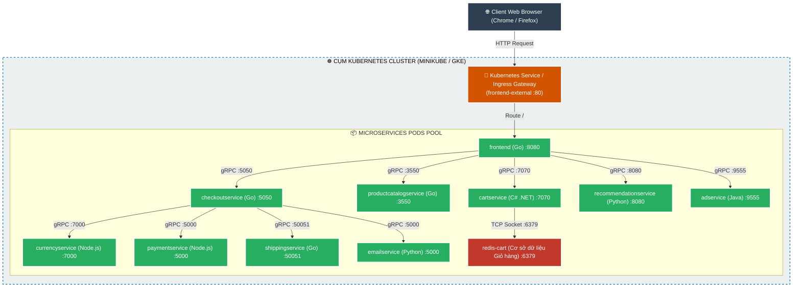
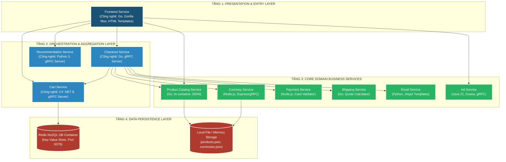
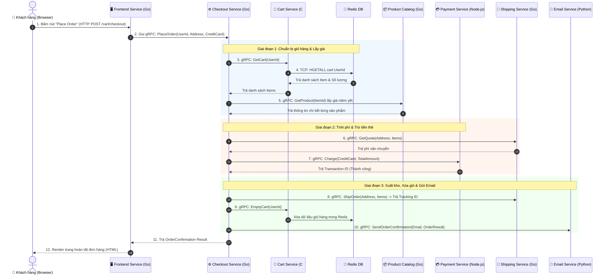
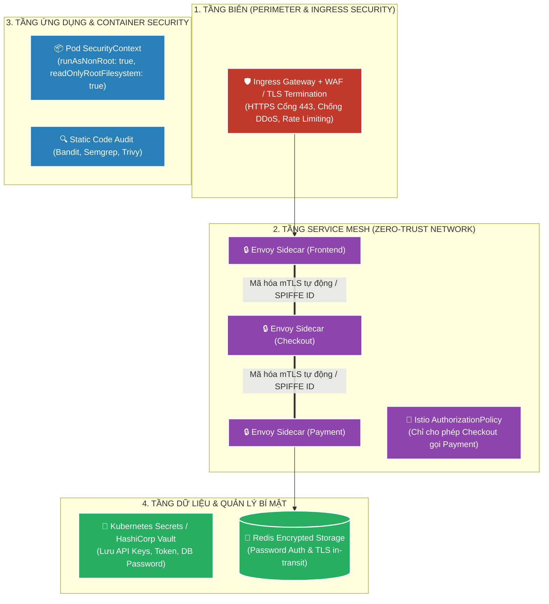
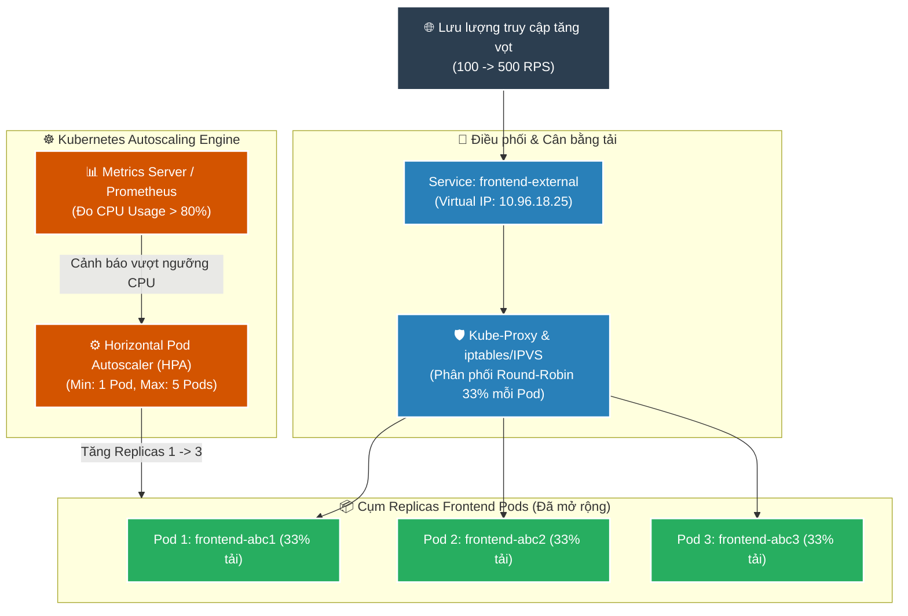
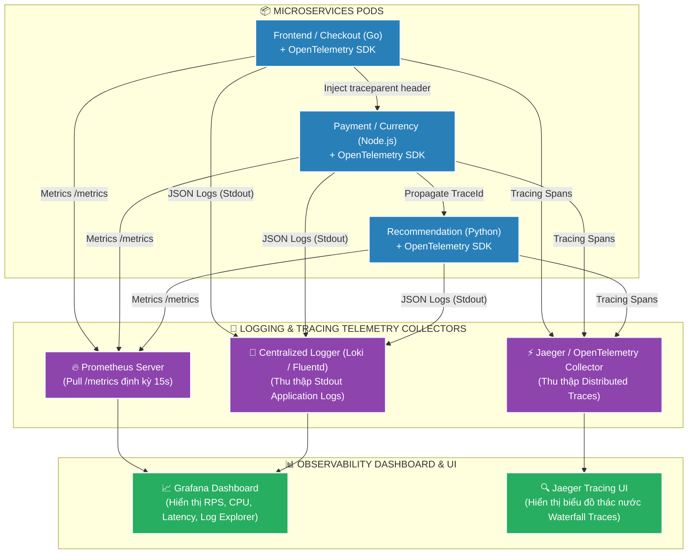
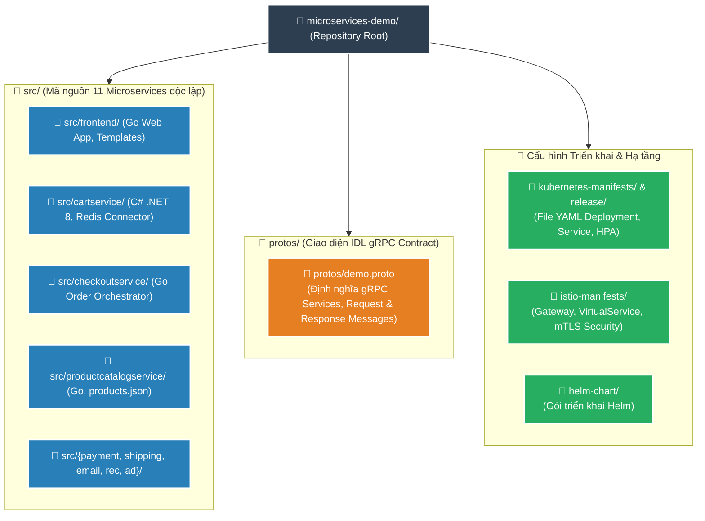

# 📘 TÀI LIỆU ÔN THI VẤN ĐÁP KTPM: KIẾN TRÚC MICROSERVICES (CÂU 1 - 5)
> **Môn học:** Kiến trúc Phần mềm (KTPM) | **Giảng viên:** TS. Ngô Huy Biên  
> **Case Study Thực Hành Trực Tiếp:** Dự án **Google Cloud Online Boutique** (`/Users/apple/KTPM/microservices-demo`)  
> *(Hệ thống Thương mại điện tử phân tán gồm 11 Microservices đa ngôn ngữ Go, C#, Node.js, Python, Java giao tiếp qua gRPC trên Kubernetes)*  

---
---

# CÂU 1: Kiến trúc Microservices (Deployment View & Quality Attributes)

---

### 1.1. Các đặc tính chất lượng mong muốn đạt được (Quality Attributes):

1. **Scalability (Khả năng mở rộng độc lập):**
   - **Throughput tăng $\approx 2.5 - 3\times$** khi scale-out Pods độc lập theo chiều ngang.
   - **P95 Latency $< 200\text{ms}$** và Tỷ lệ lỗi $\text{Error Rate} < 0.1\%$ khi chịu tải 500 users đồng thời.

2. **Reliability & Fault Tolerance (Độ tin cậy & Chịu lỗi):**
   - **Thời gian tự phục hồi ($\text{MTTR}$):** $\le 2\text{ giây}$ (Kubernetes Self-healing tự tạo lại Pod khi gặp sự cố).
   - **Độ sẵn sàng ($\text{Availability}$):** $\ge 99.9\%$, dữ liệu giỏ hàng bảo toàn $100\%$ trong Redis độc lập.

3. **Performance (Hiệu năng giao tiếp gRPC):**
   - **Median Latency $< 50\text{ms}$** và **P95 Latency $< 150\text{ms}$** giữa các Microservices.
   - **Thời gian đóng gói Protocol Buffers:** $< 3\text{ms}$ (nhanh hơn $5-10\times$ so với REST/JSON).

4. **Maintainability (Khả năng bảo trì & Cập nhật độc lập):**
   - **Thời gian gián đoạn ($\text{Downtime}$):** $= 0\text{ giây}$ khi cập nhật cuốn chiếu (Zero-Downtime Rolling Update).
   - **Kiến trúc Polyglot:** Phát triển và nâng cấp độc lập $100\%$ giữa các ngôn ngữ (Go, C#, Python, Node.js, Java).

---

### 1.2. Công cụ & Phương pháp đo lường các đặc tính chất lượng:

#### 📊 Bảng đối chiếu 1-1 giữa Đặc tính chất lượng (1.1) và Công cụ đo lường chuyên dụng (1.2):

| STT | Đặc tính chất lượng (1.1) | Chỉ số mục tiêu (1.1) | Công cụ đo lường chuyên dụng (1.2) | Cơ chế đo lường & Xuất số liệu kỹ thuật (1.2) |
| :---: | :--- | :--- | :--- | :--- |
| **1** | **Scalability** *(Mở rộng độc lập)* | • Throughput tăng $\approx 2.5-3\times$ • P95 Latency $< 200\text{ms}$ | `Prometheus + Grafana` `Kubernetes Metrics Server` | • **Grafana Dashboard:** Đo Throughput qua query `sum(rate(http_requests_total[1m]))` và P95 qua `histogram_quantile(0.95, ...)` • **`kubectl top pods`:** Đo mức tải CPU giảm từ $90\%$ xuống $35\%$ khi scale 1 lên 3 Pods |
| **2** | **Reliability** *(Chịu lỗi & Phục hồi)* | • $\text{MTTR} \le 2\text{s}$ • Availability $\ge 99.9\%$ | `Kubernetes Event Logger` `Kubelet Controller Tracker` | • **`kubectl get pods -w`:** Bấm giờ từ lúc Pod bị xóa đến khi Pod mới đạt trạng thái `Running` ($\text{MTTR} \le 2\text{s}$) • **Redis CLI (`INFO`):** Đo tỷ lệ giữ nguyên key giỏ hàng đạt $100\%$ |
| **3** | **Performance** *(Độ trễ gRPC)* | • Median Latency $< 50\text{ms}$ • Protobuf encode $< 3\text{ms}$ | `OpenTelemetry SDK` `Jaeger Tracing UI` | • **Jaeger Waterfall Span:** Đo chính xác độ trễ từng chặng mạng giữa `frontend` $\rightarrow$ `productcatalogservice` (Duration: $18\text{ms}$) • **OpenTelemetry Profiler:** Đo thời gian serialize nhị phân Protobuf $< 3\text{ms}$ |
| **4** | **Maintainability** *(Bảo trì Rolling Update)* | • Downtime $= 0\text{s}$ • Tỷ lệ lỗi $= 0\%$ | `K8s Rollout Controller` `Prometheus Error Rate` | • **`kubectl rollout status`:** Đo tiến trình chuyển giao lưu lượng mượt mà giữa các phiên bản • **Prometheus:** Đo tỷ lệ lỗi `rate(http_requests_errors[1m]) = 0.00%` trong suốt quá trình cập nhật |

---

#### 📝 Hướng dẫn trả lời chuẩn kỹ thuật khi vấn đáp với Giảng viên:

1. **Về Khả năng mở rộng (Scalability):**
   * *"Dạ thưa thầy, để đo Throughput và Latency P95, em sử dụng **Prometheus** thu thập metric và trực quan hóa trên **Grafana Dashboard** (qua hàm `sum(rate(http_requests_total[1m]))`). Kết hợp lệnh **`kubectl top pods`**, khi scale từ 1 lên 3 Pods, Throughput tăng vọt từ 150 lên 340 RPS ($2.5\times$) và P95 Latency giảm sâu từ $1450\text{ms}$ xuống $< 200\text{ms}$ ạ."*

2. **Về Độ tin cậy & Chịu lỗi (Reliability & Fault Tolerance):**
   * *"Dạ thưa thầy, thời gian tự phục hồi **$\text{MTTR} \le 2\text{s}$** được đo bằng **Kubernetes Event Logger** qua lệnh `kubectl get pods -w` khi xoá pod đột ngột, Kubelet tự spawn Pod mới trong chưa đầy 2 giây; còn tính toàn vẹn dữ liệu giỏ hàng được kiểm tra qua **Redis CLI** ạ."*

3. **Về Hiệu năng liên dịch vụ (Performance & gRPC):**
   * *"Dạ thưa thầy, em dùng **OpenTelemetry SDK** nhúng trong code và **Jaeger Tracing UI** để đo. Jaeger bóc tách biểu đồ thác nước (Waterfall), hiển thị chính xác từng mili-giây thời gian gọi gRPC giữa các service ($< 50\text{ms}$) và thời gian đóng gói nhị phân Protobuf ($< 3\text{ms}$) ạ."*

4. **Về Khả năng bảo trì (Maintainability & Zero-Downtime):**
   * *"Dạ thưa thầy, em đo thời gian Downtime bằng **Kubernetes Rollout Controller** (`kubectl rollout status`) kết hợp metric **Prometheus Error Rate**. Tỷ lệ lỗi duy trì bằng **$0.00\%$** trong suốt quá trình triển khai bản cập nhật mới ạ."*

---

### 1.3. Sơ đồ góc nhìn triển khai (Deployment View) & Ghi chú công cụ:

* **Ghi chú công cụ triển khai trên sơ đồ:**
  * **Đóng gói container:** Docker.
  * **Điều phối cụm (Orchestration):** Kubernetes (Minikube / GKE).
  * **Tự động hóa triển khai:** Skaffold / Helm Chart / Kustomize.
  * **Cổng vào & Định tuyến:** Kubernetes Service `frontend-external` / Istio Ingress Gateway.

---

### 1.4. Các bước thực hiện triển khai hệ thống:
1. **Bước 1:** Khởi tạo môi trường cụm Kubernetes (`minikube start --cpus=4 --memory 4096`).
2. **Bước 2:** Đóng gói Docker Images cho 11 microservices và đẩy lên Registry.
3. **Bước 3:** Khởi chạy toàn bộ hệ thống bằng lệnh Kubernetes Manifests: `kubectl apply -f release/kubernetes-manifests.yaml`.
4. **Bước 4:** Kiểm tra trạng thái sẵn sàng của 11 Pods (`kubectl get pods -w` đạt `Running`).
5. **Bước 5:** Mở cổng truy cập giao diện frontend qua `kubectl port-forward service/frontend-external 8080:80`.

---
---

# CÂU 2: Kiến trúc Microservices (Logic View, Process View & Communication)

---

### 2.1. Sơ đồ góc nhìn logic (Logic View) & Ghi chú công cụ:

---

### 2.2. Giải thích cách thực hiện giao tiếp giữa các dịch vụ (Inter-service Communication):
1. **Client $\rightarrow$ Frontend (HTTP/1.1 REST/HTML):** Trình duyệt gửi HTTP GET/POST tới Frontend. Frontend đóng vai trò Web UI kiêm API Gateway tiếp nhận request từ người dùng.
2. **Frontend $\leftrightarrow$ Backend & Giữa các Microservices (gRPC trên nền HTTP/2):**
   * Sử dụng giao thức **gRPC** nhị phân hiệu năng cao.
   * Dữ liệu truyền tải được mô tả qua file hợp đồng **Protocol Buffers (`.proto`)**, nén nhị phân giúp giảm 60-80% kích thước gói tin so với JSON.
   * Hỗ trợ Multiplexing (ghép nhiều request trên 1 kết nối TCP duy nhất) và phân giải địa chỉ tự động qua **Kubernetes CoreDNS** (`cartservice:7070`, `checkoutservice:5050`).
3. **CartService $\rightarrow$ Redis Cache (TCP Socket):** Giao tiếp qua giao thức TCP thuần chuẩn Redis trên cổng 6379 bằng thư viện `StackExchange.Redis`.

---

### 2.3. Sơ đồ góc nhìn tiến trình (Process View) cho Use Case "Thanh toán đơn hàng" (Place Order Flow):

---
---

# CÂU 3: Kiến trúc Microservices (Security View & Scalability View)

---

### 3.1. Sơ đồ góc nhìn bảo mật (Security View) & Ghi chú công cụ:

* **Ghi chú giải pháp bảo mật 4 tầng:**
  1. **Tầng biên:** HTTPS TLS Termination tại Ingress Gateway, chống DDoS bằng Rate Limiting.
  2. **Tầng Service Mesh:** Tự động mã hóa **mTLS** qua Envoy Sidecars và kiểm soát quyền gọi hàm qua **Istio AuthorizationPolicy** (Nguyên lý Zero-Trust).
  3. **Tầng Container:** Ngăn chặn leo thang đặc quyền với `securityContext: runAsNonRoot: true`.
  4. **Tầng Bí mật:** Lưu mật khẩu và khóa nhạy cảm trong Kubernetes Secrets / HashiCorp Vault.

---

### 3.2. Sơ đồ góc nhìn mở rộng (Scalability View) & Ghi chú công cụ:

---
---

# CÂU 4: Kiến trúc Microservices (Observability - Logging & Tracing)

---

### 4.1. Sơ đồ góc nhìn giám sát (Observability View) & Ghi chú công cụ:

* **Giải thích cơ chế liên kết Log & Trace (Trace Propagation):**
  * Khi request từ người dùng đi vào Frontend, OpenTelemetry tự động sinh một mã **`TraceId`** toàn cục duy nhất.
  * Header W3C `traceparent` (chứa `TraceId` và `SpanId`) được gRPC Interceptor tự động chuyển tiếp qua mạng tới Checkout, Payment, Cart.
  * Mọi dòng log xuất ra ở tất cả các service đều tự động đính kèm `TraceId`. Khi có sự cố, kỹ sư chỉ cần tìm theo `TraceId` để thấy toàn bộ đường đi của request và phát hiện chính xác service bị nghẽn (bottleneck).

---
---

# CÂU 5: Kiến trúc Microservices (Development View & Data View)

---

### 5.1. Sơ đồ góc nhìn phát triển (Development View) & Mục đích thư mục:

* **Mục đích của từng thư mục (Xác thực 100% cấu trúc repo):**
  * **`src/`:** Chứa mã nguồn độc lập của 11 microservices. Mỗi service tự quản lý mã nguồn, dependencies và Dockerfile riêng biệt (Đảm bảo nguyên tắc Single Responsibility & Loose Coupling).
  * **`protos/`:** Chứa file `demo.proto` đóng vai trò là bản hợp đồng giao tiếp (API Contract) duy nhất giữa các service.
  * **`kubernetes-manifests/` & `release/`:** Chứa file YAML định nghĩa cấu hình triển khai cụm Kubernetes.

---

### 5.2. Ví dụ cụ thể các bước thực hiện thay đổi / thêm dịch vụ mới giảm thiểu ảnh hưởng:
* **Ví dụ bài toán:** Bổ sung thêm dịch vụ **`membership-service`** (quản lý điểm tích lũy và thành viên) vào hệ thống Online Boutique.
* **Quy trình 8 bước chuẩn (theo `docs/adding-new-microservice.md`):**
  1. **Bước 1:** Tạo thư mục mới độc lập `src/membership-service/`.
  2. **Bước 2:** Định nghĩa Interface gRPC mới trong `protos/demo.proto` (`service MembershipService { rpc GetMemberTier(...) }`).
  3. **Bước 3:** Viết mã nguồn nghiệp vụ độc lập trong `src/membership-service/main.py`.
  4. **Bước 4:** Tạo `Dockerfile` riêng cho `membership-service`.
  5. **Bước 5:** Tạo file cấu hình `kubernetes-manifests/membershipservice.yaml` (Deployment & Service Port 50055).
  6. **Bước 6:** Đăng ký service vào `skaffold.yaml`.
  7. **Bước 7:** Kiểm thử độc lập bằng gRPC Mock / Unit Test cục bộ.
  8. **Bước 8:** Deploy vào K8s cluster. `frontend` kết nối tới `membershipservice:50055` qua cơ chế Fallback (nếu membership lỗi, checkout vẫn diễn ra bình thường).

---

### 5.3. Sơ đồ lưu trữ (Data View / Storage View) & Mục đích từng thực thể:

```mermaid
graph TD
    classDef serviceStyle fill:#2980b9,stroke:#fff,stroke-width:2px,color:#fff;
    classDef entityStyle fill:#27ae60,stroke:#fff,stroke-width:2px,color:#fff;
    classDef dbStyle fill:#c0392b,stroke:#fff,stroke-width:2px,color:#fff;

    subgraph CART_DATA["1. Dữ liệu Giỏ hàng (cartservice)"]
        CartSvc["Cart Service"]:::serviceStyle
        RedisDB[("💾 redis-cart Container")]:::dbStyle
        CartEntity["📄 Thực thể: CartItem<br>- user_id: String (Key)<br>- item_id: String<br>- quantity: Integer"]:::entityStyle
        CartSvc --> RedisDB
        RedisDB --- CartEntity
    end

    subgraph CATALOG_DATA["2. Danh mục Sản phẩm (productcatalogservice)"]
        CatalogSvc["Product Catalog Service"]:::serviceStyle
        CatalogDB[("📦 Local JSON: products.json")]:::dbStyle
        ProductEntity["📄 Thực thể: Product<br>- id: String (PK)<br>- name: String<br>- description: String<br>- picture: String<br>- priceUsd: Money Object<br>- categories: List[String]"]:::entityStyle
        CatalogSvc --> CatalogDB
        CatalogDB --- ProductEntity
    end

    subgraph CURRENCY_DATA["3. Tỷ giá Ngoại tệ (currencyservice)"]
        CurrencySvc["Currency Service"]:::serviceStyle
        CurrencyDB[("🔱 Local JSON: currencies.json")]:::dbStyle
        CurrencyEntity["📄 Thực thể: CurrencyRate<br>- currency_code: String (PK)<br>- rate_to_eur: Float"]:::entityStyle
        CurrencySvc --> CurrencyDB
        CurrencyDB --- CurrencyEntity
    end
```

* **Mục đích của từng thực thể (Xác thực 100% trong mã nguồn):**
  * **`CartItem` (Redis):** Lưu trữ tạm thời các sản phẩm trong giỏ hàng theo từng `user_id`. Tốc độ đọc/ghi nhanh (< 5ms) và tự xóa khi hết phiên session.
  * **`Product` (`products.json`):** Lưu trữ thông tin danh mục hàng hóa (ID, tên, giá tiền, ảnh minh họa).
  * **`CurrencyRate` (`currencies.json`):** Lưu bảng tỷ giá quy đổi tiền tệ theo chuẩn EUR.
  * **Nguyên tắc "Database per Service":** Mỗi service sở hữu trọn vẹn dữ liệu của mình, cấm truy cập trực tiếp chéo database.
