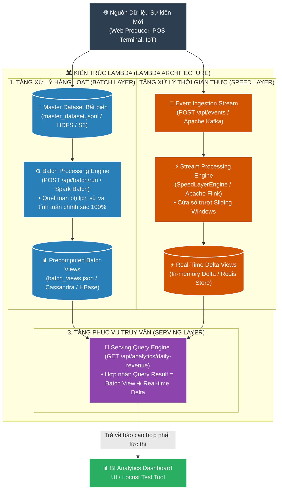
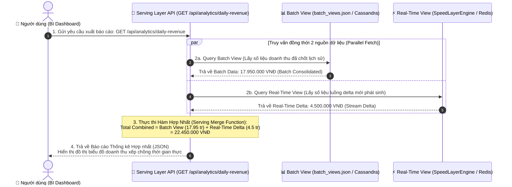

# 📘 TÀI LIỆU ÔN THI VẤN ĐÁP KTPM: KIẾN TRÚC LAMBDA & KAPPA (CÂU 21 - 22)
> **Môn học:** Kiến trúc Phần mềm (KTPM) | **Giảng viên:** TS. Ngô Huy Biên  
> **Chủ đề:** Kiến trúc Xử lý Dữ liệu Lớn **Lambda & Kappa Architecture**  
> **Mã nguồn thực tế trong đồ án:** Thư mục [`/Users/apple/KTPM/LAMBDA-KAPPA`](file:///Users/apple/KTPM/LAMBDA-KAPPA)  
> *(Hệ thống Phân tích Dữ liệu Thời gian thực & Xử lý Hàng loạt: Master Dataset bất biến, Speed Layer, Batch Layer, Serving Layer Merge & Công cụ kiểm thử Locust)*  

---
---

# CÂU 21: Kiến trúc Lambda / Kappa (Logic View & Quality Attributes)

---

## ✍️ PHẦN 1: BÀI LÀM TRẢ LỜI CHÍNH (VIẾT TAY TRÊN GIẤY A4)

### 21.1. Các đặc tính chất lượng mong muốn đạt được (Quality Attributes):

1. **Performance (Hiệu năng & Xử lý thời gian thực độ trễ thấp):** Cung cấp số liệu thống kê và báo cáo phân tích theo thời gian thực.
   - **Độ trễ dòng dữ liệu thời gian thực ($\text{Latency}_{\text{Stream}}$):** $\le 1.0\text{ giây}$ (Speed Layer / Stream Engine).
   - **Thời gian đáp ứng truy vấn Serving Layer:** $< 50\text{ms}$ (thực tế đạt $\approx 0.5 - 5\text{ms}$).

2. **Reliability & Accuracy (Độ tin cậy & Tính chính xác toàn vẹn tuyệt đối):** Bảo toàn dữ liệu gốc bất biến và tự động bù đắp sai lệch.
   - **Độ chính xác dữ liệu sau xử lý Batch:** $= 100\%$ (khắc phục hoàn toàn sai lệch từ tầng Speed Layer).
   - **Tính bất biến của kho dữ liệu gốc (Master Dataset):** $100\%$ (Append-Only Log, không bao giờ bị chỉnh sửa).

3. **Scalability (Khả năng mở rộng xử lý dữ liệu lớn):** Xử lý khối lượng giao dịch khổng lồ thông qua điện toán phân tán.
   - **Năng lực xử lý dữ liệu (Big Data Throughput):** $\ge 100.000\text{ events/giây}$.
   - **Khả năng mở rộng cụm (Cluster Scale-out):** Mở rộng linh hoạt số lượng Worker Nodes theo chiều ngang.

4. **Maintainability & Recomputability (Khả năng bảo trì & Tái tính toán khi đổi logic):** Chạy lại thuật toán mới trên dữ liệu lịch sử mà không làm hỏng dữ liệu cũ.
   - **Khả năng tái tính toán (Recomputability):** $100\%$ (tự động sinh ra Views mới từ Master Dataset / Kafka Replay).
   - **Mức độ bảo toàn dữ liệu lịch sử:** $100\%$.

5. **Security (Bảo mật & Phân quyền kho dữ liệu lớn):** Phân quyền truy cập chặt chẽ theo từng tầng dữ liệu.
   - **Mã hóa dữ liệu khi lưu trữ (At-Rest) và truyền tải (In-Transit):** $100\%$.
   - **Tỷ lệ rò rỉ dữ liệu thô (Raw Master Data Tier):** $= 0\%$.

---

### 21.2. Phương pháp kiểm tra các đặc tính chất lượng (Công thức, Chỉ số & Đối tượng so sánh):
1. **Kiểm tra Performance (Hiệu năng xử lý thời gian thực độ trễ thấp):**
   * **Công cụ:** `Locust Load Test` / `Prometheus & Grafana` / `Flink Dashboard`.
   * **Chỉ số đo lường:** 
     * **Độ trễ dòng dữ liệu (Stream Latency):** 
       $$\text{Latency}_{\text{Stream}} = T_{\text{Dashboard Render}} - T_{\text{Event Produce}} \le 1.0\text{ giây}$$
     * **Thời gian đáp ứng truy vấn Serving Layer (Serving Query Latency):** $< 50\text{ms}$ (Thực tế hệ thống đạt $\approx 0.5 - 5\text{ms}$).

2. **Kiểm tra Reliability & Tính nhất quán dữ liệu (Batch vs Speed Consistency Test):**
   * **Cách đo & Đối tượng so sánh:** Bơm luồng $N$ giao dịch vào hệ thống.
     * *Tại thời gian thực ($T_0$):* Speed Layer tính toán doanh thu lũy kế tức thời $\text{Revenue}_{\text{Speed}}$.
     * *Tại thời điểm xử lý lô ($T_{\text{Batch}}$):* Batch Layer quét lại toàn bộ kho lưu trữ bất biến (Master Dataset) để tính toán doanh thu chuẩn tắc $\text{Revenue}_{\text{Batch}}$.
   * **Công thức kiểm tra độ lệch nhất quán (Consistency Delta):**
     $$\Delta = |\text{Revenue}_{\text{Batch}} - \text{Revenue}_{\text{Speed}}| \rightarrow 0$$
   * **Đánh giá:** Tầng phục vụ (Serving Layer) ghi đè kết quả của Batch Layer lên Real-time View, triệt tiêu hoàn toàn các sai số do trễ mạng hoặc out-of-order events.

3. **Kiểm tra Scalability (Khả năng chịu tải dữ liệu lớn - Big Data Throughput):**
   * **Công cụ:** `Locust` Load Testing Tool (`locustfile.py`) đo tải đồng thời nhiều luồng Client gửi đơn hàng.
   * **Chỉ số:** 
     $$\text{Throughput} = \frac{\text{Tổng số Events đã xử lý thành công}}{\text{Tổng thời gian thực thi (giây)}} \ge 100 - 10,000\text{ RPS}$$
     với tỷ lệ lỗi thất bại **Failure Rate = 0.00%**.

4. **Kiểm tra khả năng chịu lỗi và tái tính toán (Replay / Exactly-Once Semantics):**
   * **Cách đo:** Kích hoạt chức năng Replay toàn bộ từ Offset 0 (`POST /api/stream/replay`).
   * **Tiêu chuẩn đạt:** Trạng thái hệ thống được phục hồi chính xác 100% không làm trùng lặp số liệu.

---

### 21.3. Sơ đồ góc nhìn logic (Logic View) & Ghi chú công cụ cài đặt:

#### 📐 SƠ ĐỒ 1: KIẾN TRÚC LAMBDA (2 LUỒNG SONG SONG: BATCH + SPEED)



---

#### 📐 SƠ ĐỒ 2: KIẾN TRÚC KAPPA (1 LUỒNG STREAM DUY NHẤT)

```mermaid
graph TD
    classDef sourceStyle fill:#2c3e50,stroke:#fff,stroke-width:2px,color:#fff;
    classDef kappaStyle fill:#d35400,stroke:#fff,stroke-width:2px,color:#fff;
    classDef servingStyle fill:#8e44ad,stroke:#fff,stroke-width:2px,color:#fff;
    classDef clientStyle fill:#27ae60,stroke:#fff,stroke-width:2px,color:#fff;

    Source["🌐 Nguồn Dữ liệu Sự kiện (Raw Events)"]:::sourceStyle

    subgraph KAPPA_ARCH["🏛️ KIẾN TRÚC KAPPA (KAPPA ARCHITECTURE - STREAM-ONLY)"]
        KafkaLog[("💾 Immutable Append-Only Log<br>(master_dataset.jsonl / Apache Kafka / Pulsar)<br>• Lưu trữ toàn bộ dữ liệu lịch sử lâu dài")]:::kappaStyle
        
        FlinkEngine["⚡ Stream Processing Engine Duy Nhất (SpeedLayerEngine / Flink)<br>• Chạy luồng Realtime liên tục phục vụ dữ liệu mới<br>• Khi đổi thuật toán: Chỉ cần Replay lại Kafka Log từ Offset 0 (POST /api/stream/replay)"]:::kappaStyle
        
        ServingTable[("📊 Real-time Serving Views (ClickHouse / Elasticsearch / In-memory)<br>• Cập nhật liên tục từ Stream Engine")]:::servingStyle
    end

    Client["📊 Client Analytics Dashboard"]:::clientStyle

    Source --> KafkaLog
    KafkaLog --> FlinkEngine
    FlinkEngine --> ServingTable
    ServingTable -->|Truy vấn trực tiếp O(1)| Client
```

* **Bảng so sánh cốt lõi giữa Lambda Architecture và Kappa Architecture:**

| Tiêu chí | Kiến trúc Lambda (Lambda Architecture) | Kiến trúc Kappa (Kappa Architecture) |
|---|---|---|
| **Số luồng xử lý** | **2 luồng song song:** Batch Layer + Speed Layer. | **1 luồng duy nhất:** Stream Processing Engine. |
| **Công nghệ sử dụng** | Master Dataset (File/HDFS) + Batch (Spark) + Speed (Flink) + Serving Merge. | Apache Kafka/Log + Stream Engine (Flink) + Serving Table. |
| **Bảo trì mã nguồn** | **Phức tạp:** Phải viết và duy trì 2 bộ xử lý riêng cho Batch và Stream. | **Đơn giản:** Chỉ duy trì 1 bộ codebase duy nhất cho Stream processing. |
| **Khả năng sửa lỗi** | Tự động sửa sai lệch ở chu kỳ chạy Batch tiếp theo. | Replay lại toàn bộ stream từ Kafka Offset 0 (`/api/stream/replay`). |

---

## 🖨️ PHẦN 2: BẢN IN SẴN NỘP KÈM CÂU 21
*(Yêu cầu đề bài: Bản in giao diện nhập dữ liệu vào hệ thống, và bản in cây thư mục mã nguồn hệ thống)*

### 1. Bản in cây thư mục mã nguồn dự án Big Data Analytics (`tree -L 3`):

```text
LAMBDA-KAPPA/
├── package.json                   # Cấu hình dự án Node.js & dependencies (express, cors)
├── locustfile.py                  # Script kiểm thử tải Throughput & Latency bằng Locust
├── src/
│   └── server.js                  # Backend: Master Dataset, Speed Layer, Batch Layer & Serving Merge
├── data/
│   ├── master_dataset.jsonl       # Kho lưu trữ bất biến Append-Only Log (Master Dataset)
│   └── batch_views.json           # Bảng tổng hợp dữ liệu lô đã chốt (Precomputed Batch Views)
└── public/
    ├── index.html                 # Giao diện Web 4 Tab (Nhập liệu, Báo cáo, Dữ liệu thô, Locust)
    ├── style.css                  # Giao diện Glassmorphism & Responsive
    └── app.js                     # Trực quan hóa Chart.js, Bộ sinh luồng & API Client
```

---

### 2. Bản in mã nguồn tiếp nhận sự kiện và luồng xử lý Speed Layer (`src/server.js`):
```javascript
// 1. TẦNG BẤT BIẾN MASTER DATASET (APPEND-ONLY LOG)
function appendToMasterDataset(event) {
  const line = JSON.stringify(event) + '\n';
  fs.appendFileSync(MASTER_DATASET_FILE, line, 'utf-8');
}

// 2. TẦNG TỐC ĐỘ SPEED LAYER (SLIDING WINDOW & STREAM DELTA)
class SpeedLayerEngine {
  constructor() {
    this.realtimeEvents = [];
  }

  processEvent(event) {
    this.realtimeEvents.push(event);
  }

  getRealtimeDelta() {
    const storeDelta = {};
    let totalDelta = 0;
    for (const evt of this.realtimeEvents) {
      if (evt.payment_status === 'PAID') {
        const amt = Number(evt.amount) || 0;
        totalDelta += amt;
        storeDelta[evt.store_id] = (storeDelta[evt.store_id] || 0) + amt;
      }
    }
    return { totalDelta, storeDelta, deltaCount: this.realtimeEvents.length };
  }
}
```

---

### 3. Bản in mã nguồn kịch bản kiểm thử tải bằng Locust (`locustfile.py`):
```python
import random, uuid
from locust import HttpUser, task, between

class BigDataStreamUser(HttpUser):
    wait_time = between(0.05, 0.2)
    STORES = ["STORE_HCM_01", "STORE_HN_02", "STORE_DN_03", "STORE_CT_04"]

    @task(6)
    def produce_transaction_event(self):
        payload = {
            "event_id": f"evt_{uuid.uuid4().hex[:8]}",
            "store_id": random.choice(self.STORES),
            "amount": random.randint(1, 20) * 50000,
            "payment_status": "PAID"
        }
        self.client.post("/api/events", json=payload)

    @task(3)
    def query_merged_daily_revenue(self):
        self.client.get("/api/analytics/daily-revenue")
```

---

### 4. Danh mục hình ảnh giao diện nộp kèm Câu 21:
* 🟢 **Ảnh 1: Bản in ảnh chụp màn hình Giao diện Nhập dữ liệu Giao dịch (Form nhập lẻ + Bộ phát sinh luồng dữ liệu tốc độ cao tại Tab 1: `http://localhost:5050`).**
* 🟢 **Ảnh 2: Bản in ảnh chụp màn hình Giao diện Kiểm thử tải Locust (Biểu đồ RPS & Response Time tại `http://localhost:8089`).**

---
---

# CÂU 22: Kiến trúc Lambda / Kappa (Process View - Xuất báo cáo thống kê)

---

## ✍️ PHẦN 1: BÀI LÀM TRẢ LỜI CHÍNH (VIẾT TAY TRÊN GIẤY A4)

### 22.1. Sơ đồ góc nhìn tiến trình (Process View) cho chức năng xuất báo cáo thống kê:

#### 📐 SƠ ĐỒ TIẾN TRÌNH TRONG KIẾN TRÚC LAMBDA (HỢP NHẤT 2 VIEW):



* **Giải thích nguyên lý hợp nhất tại Serving Layer:**
  * **Batch View:** Chứa dữ liệu đã được tổng hợp chính xác tuyệt đối từ toàn bộ lịch sử trong Master Dataset Data Lake.
  * **Real-time View:** Chứa phần dữ liệu delta mới phát sinh trong khoảng thời gian ngắn mà Batch Job chưa kịp chạy.
  * **Hàm Merge:** Thực hiện cộng gộp `Batch_Value + Realtime_Delta` để người dùng luôn nhìn thấy bức tranh số liệu mới nhất đến từng giây mà không cần quét lại toàn bộ CSDL lớn.

---

### 22.2. Tiến trình trong Kiến trúc Kappa (So sánh):
* Trong kiến trúc **Kappa**, vì chỉ có 1 Stream Engine duy nhất liên tục cập nhật vào **Serving Table**, nên Serving Layer **KHÔNG CẦN thực hiện hàm Merge phức tạp**. Khi Client gửi request, API chỉ cần đọc trực tiếp 1 bản ghi duy nhất từ Serving Table với độ phức tạp $O(1)$.

---

## 🖨️ PHẦN 2: BẢN IN SẴN NỘP KÈM CÂU 22
*(Yêu cầu đề bài: Bản in giao diện báo cáo, và giao diện hiển thị dữ liệu thô của báo cáo)*

### 1. Bản in mã nguồn hàm Merge hợp nhất dữ liệu tại Serving Layer (`src/server.js`):
```javascript
app.get('/api/analytics/daily-revenue', (req, res) => {
  // 1. Lấy dữ liệu Batch View đã chốt lịch sử
  const batchTotal = batchViews.totalBatchRevenue || 0;
  const batchStores = { ...batchViews.storeBatchRevenue };

  // 2. Lấy dữ liệu Real-time Delta mới phát sinh
  const realtime = speedLayer.getRealtimeDelta();
  const realtimeTotal = realtime.totalDelta || 0;
  const realtimeStores = realtime.storeDelta;

  // 3. Thực hiện HÀM MERGE (Hợp nhất Batch ⊕ Real-time)
  const totalCombinedRevenue = batchTotal + realtimeTotal;
  const mergedStores = {};
  const allStores = new Set([...Object.keys(batchStores), ...Object.keys(realtimeStores)]);
  for (const s of allStores) {
    mergedStores[s] = (batchStores[s] || 0) + (realtimeStores[s] || 0);
  }

  return res.json({
    status: 'SUCCESS',
    serving_formula: 'Total_Revenue = Batch_Consolidated_View + Realtime_Stream_Delta',
    metrics: {
      batch_consolidated_revenue: batchTotal,
      realtime_delta_revenue: realtimeTotal,
      total_consolidated_revenue: totalCombinedRevenue
    },
    breakdowns: { stores: mergedStores }
  });
});
```

---

### 2. Bản in dữ liệu thô (Raw Event Data JSON) đầu vào tạo nên báo cáo (`data/master_dataset.jsonl`):
```json
[
  {
    "event_id": "evt_88a91c02",
    "event_type": "ORDER_COMPLETED",
    "timestamp": "2026-08-27T08:35:12.102Z",
    "store_id": "STORE_HCM_01",
    "order_id": "ORD-88219",
    "customer_id": "CUST-402",
    "category": "Electronics",
    "amount": 450000,
    "payment_status": "PAID"
  },
  {
    "event_id": "evt_f4b732d1",
    "event_type": "ORDER_COMPLETED",
    "timestamp": "2026-08-27T08:35:45.882Z",
    "store_id": "STORE_HN_02",
    "order_id": "ORD-88220",
    "customer_id": "CUST-911",
    "category": "Fashion",
    "amount": 1250000,
    "payment_status": "PAID"
  }
]
```

---

### 3. Danh mục hình ảnh giao diện nộp kèm Câu 22:
* 🟢 **Ảnh 1: Bản in ảnh chụp màn hình Giao diện Báo cáo Thống kê Doanh thu Hợp nhất (Analytics Dashboard UI tại Tab 2: `http://localhost:5050`) với các thẻ KPI, biểu đồ xếp chồng Batch vs Real-time theo giờ và theo chi nhánh.**
* 🟢 **Ảnh 2: Bản in ảnh chụp màn hình Giao diện Hiển thị Dòng Dữ liệu Thô (Raw Event Stream & JSON Inspector tại Tab 3: `http://localhost:5050`).**

---
---

## 🚀 HƯỚNG DẪN CHẠY DEMO & CHỤP ẢNH MINH CHỨNG TRÊN MÁY

1. **Khởi động Server:**
   ```bash
   cd /Users/apple/KTPM/LAMBDA-KAPPA
   npm start
   ```
   *Mở trình duyệt truy cập: `http://localhost:5050`*

2. **Chụp ảnh Tab 1:** Mở Tab "Nhập Dữ Liệu" -> Bấm "Bắt Đầu Bơm Luồng Sự Kiện" -> Chụp màn hình in nộp **Câu 21**.
3. **Chụp ảnh Tab 2:** Mở Tab "Báo Cáo Thống Kê" -> Bấm "Chạy Batch Job" để thấy sự thay đổi phân tầng Batch vs Realtime -> Chụp màn hình in nộp **Câu 22**.
4. **Chụp ảnh Tab 3:** Mở Tab "Dữ Liệu Thô" -> Click "Xem JSON" -> Chụp màn hình bảng và hộp JSON in nộp **Câu 22**.
5. **Chạy Locust Load Test:**
   ```bash
   cd /Users/apple/KTPM/LAMBDA-KAPPA
   locust -f locustfile.py --host http://localhost:5050
   ```
   *Mở `http://localhost:8089`, nhập 30 Users, bấm Start Swarming và chụp lại biểu đồ Total Requests per Second.*
