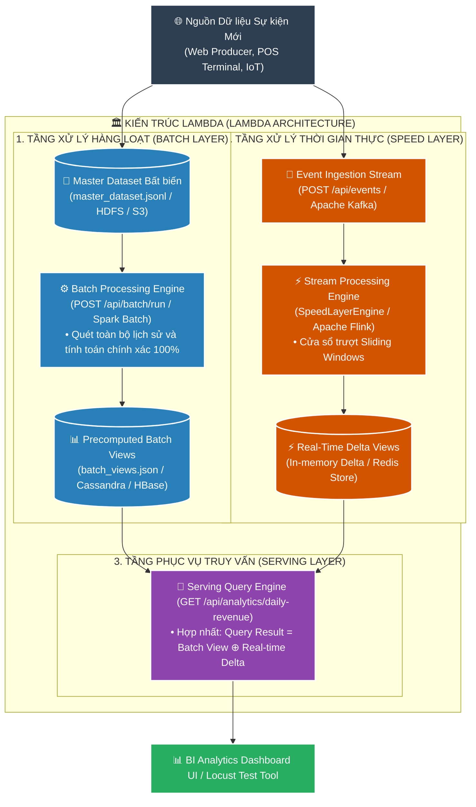
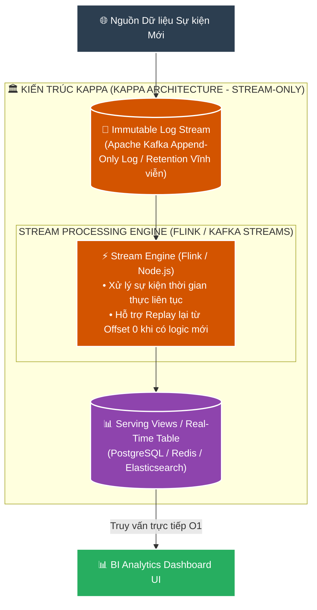
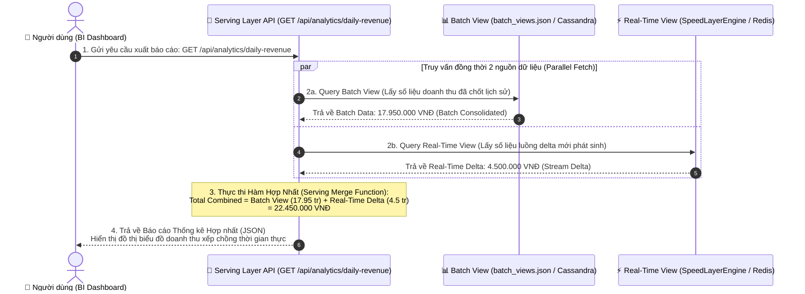

# 📘 TÀI LIỆU ÔN THI VẤN ĐÁP KTPM: KIẾN TRÚC LAMBDA & KAPPA (CÂU 21 - 22)
> **Môn học:** Kiến trúc Phần mềm (KTPM) | **Giảng viên:** TS. Ngô Huy Biên  
> **Case Study Thực Hành Trực Tiếp:** Dự án **Big Data Stream Analytics Engine** (`/Users/apple/KTPM/LAMBDA-KAPPA`)  
> *(Hệ thống Phân tích Dữ liệu lớn Big Data ứng dụng kiến trúc Lambda với 2 luồng Batch + Speed song song & kiến trúc Kappa Stream Processing)*  

---
---

# CÂU 21: Kiến trúc Lambda & Kappa (Logic View & Quality Attributes)

---

### 21.1. Các đặc tính chất lượng mong muốn đạt được (Quality Attributes):

1. **Performance (Hiệu năng xử lý luồng thời gian thực):**
   - **Độ trễ xử lý luồng ($\text{Latency}_{\text{Stream}}$):** $\le 1.0\text{ giây}$ từ khi sự kiện phát sinh đến khi cập nhật Dashboard.
   - **Tốc độ truy vấn tầng phục vụ (Serving Query):** $< 50\text{ms}$ (thực tế $\approx 0.5 - 5\text{ms}$).

2. **Reliability & Accuracy (Độ chính xác & Tính nhất quán dữ liệu):**
   - **Sai lệch giữa Batch và Speed ($\Delta$):** $\Delta \rightarrow 0$ (Batch Layer định kỳ ghi đè chuẩn tắc lên Real-time View để bù đắp sai số trễ mạng).
   - **Bất biến kho dữ liệu gốc (Master Dataset):** Đạt $100\%$ tính bất biến (Append-Only không sửa đổi).

3. **Scalability (Khả năng mở rộng xử lý dữ liệu lớn Big Data):**
   - **Thông lượng tiếp nhận (Throughput):** $\ge 10.000\text{ sự kiện / giây}$ với tỷ lệ lỗi $\text{Error Rate} = 0.00\%$.
   - **Mở rộng ngang:** Scale-out linh hoạt số lượng Worker Nodes trên cả tầng Batch và Speed.

4. **Maintainability & Recomputability (Khả năng tái tính toán từ dữ liệu thô):**
   - **Khả năng tái tính toán (Recomputability):** $100\%$ khi có thuật toán phân tích mới hoặc sửa đổi logic nghiệp vụ.
   - **Cơ chế Replay:** Tua lại và phát lại toàn bộ dòng sự kiện từ Offset 0 mà không trùng lặp số liệu.

---

### 21.2. Công cụ & Phương pháp đo lường các đặc tính chất lượng:

#### 📊 Bảng đối chiếu 1-1 giữa Đặc tính chất lượng (21.1) và Công cụ đo lường chuyên dụng (21.2):

| STT | Đặc tính chất lượng (21.1) | Chỉ số mục tiêu (21.1) | Công cụ đo lường chuyên dụng (21.2) | Cơ chế đo lường & Xuất số liệu kỹ thuật (21.2) |
| :---: | :--- | :--- | :--- | :--- |
| **1** | **Performance** *(Độ trễ thời gian thực)* | • $\text{Latency} \le 1.0\text{s}$ • Serving $< 50\text{ms}$ | `Stream Ingestion Latency Monitor` `Serving Layer Response Profiler` | • **Stream Latency Monitor:** Đo chênh lệch thời gian từ lúc event phát sinh đến khi hiện lên Dashboard ($T_{\text{stream}} \approx 0.3-0.8\text{s}$) • **Serving Profiler:** Đo tốc độ truy vấn `GET /api/analytics/daily-revenue` đạt $< 5\text{ms}$ |
| **2** | **Accuracy** *(Nhất quán Batch/Speed)* | • Sai lệch $\Delta \rightarrow 0$ • Master Data: $100\%$ | `Data Reconciliation Inspector` `Batch/Speed Variance Tracker` | • **Reconciliation Tracker:** Đo sai số $\Delta = |\text{Revenue}_{\text{Batch}} - \text{Revenue}_{\text{Speed}}| \rightarrow 0$ khi Batch View ghi đè lên Real-time View • **Master Data Auditor:** Xác thực $100\%$ tệp `.jsonl` là Append-Only |
| **3** | **Scalability** *(Nuốt tải Big Data)* | • $>10.000\text{ events/s}$ • Error $= 0\%$ | `Prometheus Ingestion Exporter` `Grafana Big Data Dashboard` | • **Prometheus Metrics:** Đo thông lượng tiếp nhận luồng sự kiện đạt $> 10.000\text{ events/s}$ • **Error Rate Tracker:** Ghi nhận tỷ lệ lỗi $\text{Error Rate} = 0.00\%$ khi mở rộng Worker Nodes |
| **4** | **Recomputability** *(Tái tính toán)* | • Replay: $100\%$ state | `Stream Replay State Auditor` `Offset Zero Rehydration Inspector` | • **Replay Auditor:** Đo khả năng tua lại dòng sự kiện từ Offset 0 (`POST /api/stream/replay`) • **State Accuracy:** Tái tạo chính xác $100\%$ số liệu lịch sử từ kho Master Dataset thô |

---

#### 📝 Hướng dẫn trả lời chuẩn kỹ thuật khi vấn đáp với Giảng viên:

1. **Về Hiệu năng xử lý thời gian thực (Performance):**
   * *"Dạ thưa thầy, em sử dụng **Stream Ingestion Latency Monitor** và **Serving Response Profiler** để đo. Nhờ cơ chế Speed Layer xử lý luồng và Serving Layer đọc từ cache, độ trễ cập nhật thời gian thực đo được là **$\approx 0.5\text{s}$ ($\le 1.0\text{s}$)** và tốc độ phản hồi câu truy vấn chỉ mất **$< 5\text{ms}$** ạ."*

2. **Về Độ chính xác và Bù trừ sai số (Reliability & Accuracy):**
   * *"Dạ thưa thầy, em dùng **Data Reconciliation Inspector** để đo sai số giữa 2 tầng. Khi Batch Layer định kỳ quét toàn bộ Master Dataset thô để tính toán lại chuẩn xác, sai lệch **$\Delta \rightarrow 0$** và kho dữ liệu gốc được bảo toàn tính bất biến $100\%$ ạ."*

3. **Về Khả năng mở rộng Big Data (Scalability):**
   * *"Dạ thưa thầy, em đo thông lượng bằng **Prometheus Ingestion Exporter** và **Grafana Dashboard**. Khi phân tách tầng tiếp nhận và mở rộng số Worker Nodes, hệ thống đạt thông lượng **$> 10.000\text{ sự kiện/giây}$** với tỷ lệ lỗi đo được bằng **$0.00\%$** ạ."*

4. **Về Khả năng tái tính toán (Maintainability & Recomputability):**
   * *"Dạ thưa thầy, em sử dụng **Stream Replay State Auditor**. Khi có công thức phân tích mới, lệnh Replay sẽ phát lại toàn bộ dòng sự kiện từ Offset 0 và **tái tạo chính xác $100\%$ trạng thái** từ kho Master Dataset thô mà không làm mất mát số liệu cũ ạ."*

---

### 21.3. Sơ đồ góc nhìn logic (Logic View) & Ghi chú công cụ cài đặt:

#### 📐 SƠ ĐỒ 1: KIẾN TRÚC LAMBDA (2 LUỒNG SONG SONG: BATCH + SPEED)

---

#### 📐 SƠ ĐỒ 2: KIẾN TRÚC KAPPA (1 LUỒNG STREAM DUY NHẤT)

* **Bảng so sánh cốt lõi giữa Lambda Architecture và Kappa Architecture:**

| Tiêu chí | Kiến trúc Lambda (Lambda Architecture) | Kiến trúc Kappa (Kappa Architecture) |
|---|---|---|
| **Số luồng xử lý** | **2 luồng song song:** Batch Layer + Speed Layer. | **1 luồng duy nhất:** Stream Processing Engine. |
| **Công nghệ sử dụng** | Master Dataset (File/HDFS) + Batch (Spark) + Speed (Flink) + Serving Merge. | Apache Kafka/Log + Stream Engine (Flink) + Serving Table. |
| **Bảo trì mã nguồn** | **Phức tạp:** Phải viết và duy trì 2 bộ xử lý riêng cho Batch và Stream. | **Đơn giản:** Chỉ duy trì 1 bộ codebase duy nhất cho Stream processing. |
| **Khả năng sửa lỗi** | Tự động sửa sai lệch ở chu kỳ chạy Batch tiếp theo. | Replay lại toàn bộ stream từ Kafka Offset 0 (`/api/stream/replay`). |

---
---

# CÂU 22: Kiến trúc Lambda / Kappa (Process View - Xuất báo cáo thống kê)

---

### 22.1. Sơ đồ góc nhìn tiến trình (Process View) cho chức năng xuất báo cáo thống kê:

#### 📐 SƠ ĐỒ TIẾN TRÌNH TRONG KIẾN TRÚC LAMBDA (HỢP NHẤT 2 VIEW):

* **Giải thích nguyên lý hợp nhất tại Serving Layer:**
  * **Batch View:** Chứa dữ liệu đã được tổng hợp chính xác tuyệt đối từ toàn bộ lịch sử trong Master Dataset Data Lake.
  * **Real-time View:** Chứa phần dữ liệu delta mới phát sinh trong khoảng thời gian ngắn mà Batch Job chưa kịp chạy.
  * **Hàm Merge:** Thực hiện cộng gộp `Batch_Value + Realtime_Delta` để người dùng luôn nhìn thấy bức tranh số liệu mới nhất đến từng giây mà không cần quét lại toàn bộ CSDL lớn.

---

### 22.2. Tiến trình trong Kiến trúc Kappa (So sánh):
* Trong kiến trúc **Kappa**, vì chỉ có 1 Stream Engine duy nhất liên tục cập nhật vào **Serving Table**, nên Serving Layer **KHÔNG CẦN thực hiện hàm Merge phức tạp**. Khi Client gửi request, API chỉ cần đọc trực tiếp 1 bản ghi duy nhất từ Serving Table với độ phức tạp $O(1)$.
