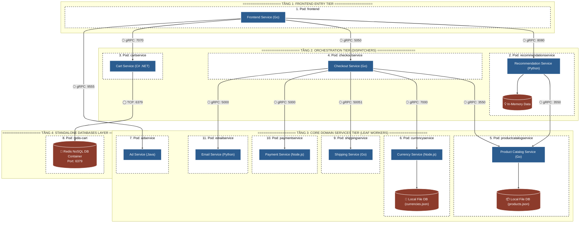

# 🏛️ PART 2: CHUYÊN ĐỀ BIỂU DIỄN KIẾN TRÚC & MICRO-FRONTEND (MFE)

> **File vị trí:** `docs_exam/PART2_ARCHITECTURE_REPRESENTATION.md`  
> **Phạm vi phủ kín 100%:**  
> - `Exam.md` (Phần 2: Biểu diễn kiến trúc, 4+1 Views, C4 Models, Diagrams)  
> - `Question.md` (Thực hành Tái cấu trúc & Micro-Frontend MFE, Single vs Multiprocess, Storage & Sync)

---

## 1. BỘ SƠ ĐỒ KIẾN TRÚC CHUẨN (TRƯỚC VÀ SAU DEMO)

👉 **File Sơ Đồ Phần 1 độc lập:** [part1_architecture_diagram.md](./part1_architecture_diagram.md)  
👉 **File Sơ Đồ Phần 2 độc lập:** [part2_architecture_diagram.md](./part2_architecture_diagram.md)

### 🟢 Sơ Đồ Phần 1 (Trước Demo — 11 Microservices Gốc - 4 Tầng Ngang):

---

## 2. ĐÁP ÁN LÝ THUYẾT BIỂU DIỄN KIẾN TRÚC (SECTION 2 EXAM.MD)

### ❓ Câu 1: Sơ đồ kiến trúc đang vẽ theo mô hình gì? So sánh C4 Model vs 4+1 Views?
* **Mô hình chọn:** Kết hợp **C4 Model (Level 2 Container Diagram)** và **Physical/Deployment View (Mô hình 4+1 Views)**.
* **So sánh C4 Model vs 4+1 Views:**

| Đặc tính | Mô hình C4 (C4 Model) | Mô hình 4+1 Views (Kruchten) |
|---|---|---|
| **Mục đích** | Phân rã độ phức tạp kiến trúc theo 4 tầng chi tiết phân cấp (Context $\rightarrow$ Container $\rightarrow$ Component $\rightarrow$ Code). | Tách biệt các mối bận tâm (Separation of Concerns) của các đối tượng Stakeholders khác nhau. |
| **Các Views/Levels** | Level 1 Context, Level 2 Container, Level 3 Component, Level 4 Code. | Logical View, Process View, Development View, Physical/Deployment View + Scenarios. |
| **Hình thức biểu diễn** | Ký hiệu **Boxes and Arrows** trực quan, đơn giản. | Sử dụng chuẩn ký hiệu **UML Diagrams**. |

---

### ❓ Câu 2: Có phải chỉ cần 4 mô hình UML (Package, Component, Deployment, Artifact) là đủ?
* **Trả lời:** **KHÔNG ĐỦ.**
* **Giải thích:** 
  - 4 mô hình này chỉ biểu diễn cấu trúc tĩnh (Static Structure) và môi trường hạ tầng.
  - Kiến trúc phần mềm bắt buộc phải có **Process View (Dynamic View)** với Sequence Diagram để thể hiện luồng chạy dữ liệu theo thời gian, và **Use-Case View / Scenarios** để kiểm thử đối chiếu nghiệp vụ người dùng.

---

### ❓ Câu 3: Sự khác biệt giữa "View" (Góc nhìn) và "UML Model" (Mô hình UML)?
* **View (Góc nhìn):** Là góc nhìn phản ánh một **mối bận tâm (Concern)** của một nhóm người dùng (End-user xem Logical View, Dev xem Development View, DevOps xem Physical View).
* **UML Model (Mô hình UML):** Chỉ là **bộ quy tắc và ký hiệu đồ họa (Notations & Syntax)** do tổ chức OMG quy chuẩn để vẽ nên View đó.

---

### ❓ Câu 4: Cần tối thiểu bao nhiêu Views? Khi nào dừng lại không vẽ thêm?
* **Số lượng tối thiểu:** Bộ **4+1 Views** kết hợp với **Database Schema**.
* **Điều kiện dừng:** Dừng lại khi **Lập trình viên có thể dựa vào sơ đồ để bắt đầu viết code ngay** mà không mơ hồ, và **Ban quản lý (PM/Architect) không còn thắc mắc chưa làm rõ**.

---

## 3. CHUYÊN ĐỀ TÁI CẤU TRÚC MICRO-FRONTEND (MFE)

### ❓ Câu 5: Micro-Frontend (MFE) đóng vai trò gì trên kiến trúc hiện tại?
* **Vai trò:** Phân rã giao diện Monolithic Frontend duy nhất thành các khối ứng dụng UI nhỏ (Ví dụ: Header MFE, Catalog MFE, Cart MFE, Member MFE). Cho phép các team phát triển, deploy và scale giao diện độc lập mà không ảnh hưởng lẫn nhau.

---

### ❓ Câu 6: Hệ thống Micro-Frontend đang chạy trên mấy tiến trình ($1/n$ process)?
* **Trước khi tái tạo (Monolithic Frontend):** Chạy trên **1 tiến trình đơn lẻ (Single Process)** của Go Web Server.
* **Sau khi tái tạo Micro-Frontend:** Chạy trên **$N$ tiến trình độc lập (Multiprocess)**. Mỗi micro-frontend container/pod chạy một Node.js/Go process riêng biệt.

---

### ❓ Câu 7: Mã nguồn Frontend lưu ở đâu và cơ chế đồng bộ giữa các MFE?
* **Vị trí lưu mã nguồn:**
  - Monolithic gốc: Lưu tại `src/frontend/`.
  - Micro-frontend phân rã: Lưu độc lập tại `src/mfe-catalog/`, `src/mfe-cart/`, `src/mfe-member/`.
* **Cơ chế lưu trữ & Đồng bộ dữ liệu (Storage & Sync):**
  - **Client Storage:** Sử dụng `LocalStorage`, `SessionStorage`, hoặc `IndexedDB` để lưu transient cart & session state trên trình duyệt.
  - **Đồng bộ nội bộ Browser:** Dùng **`Event Bus / Custom Window Events`** (`window.dispatchEvent(new CustomEvent('cart-updated'))`) giúp các MFE re-render giao diện realtime mà không reload trang.
  - **Đồng bộ Backend:** Gửi request bất đồng bộ qua REST / gRPC-Web xuống các backend microservices.
