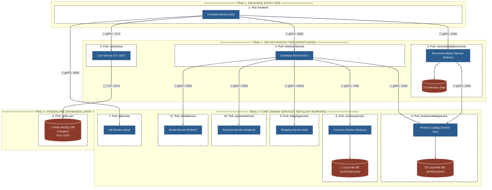
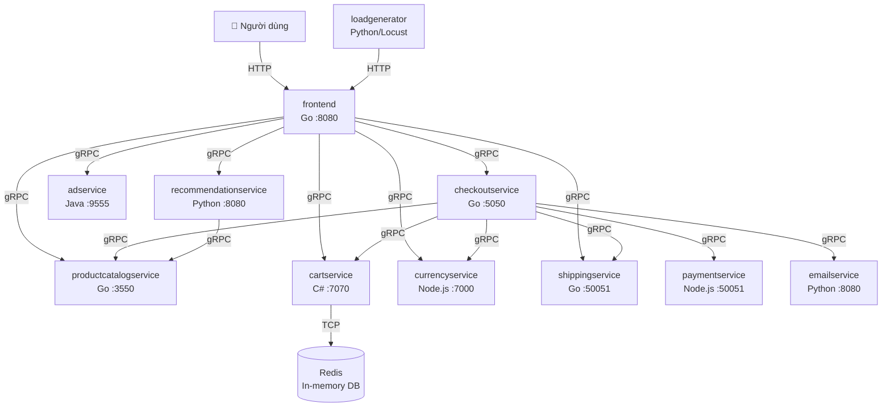
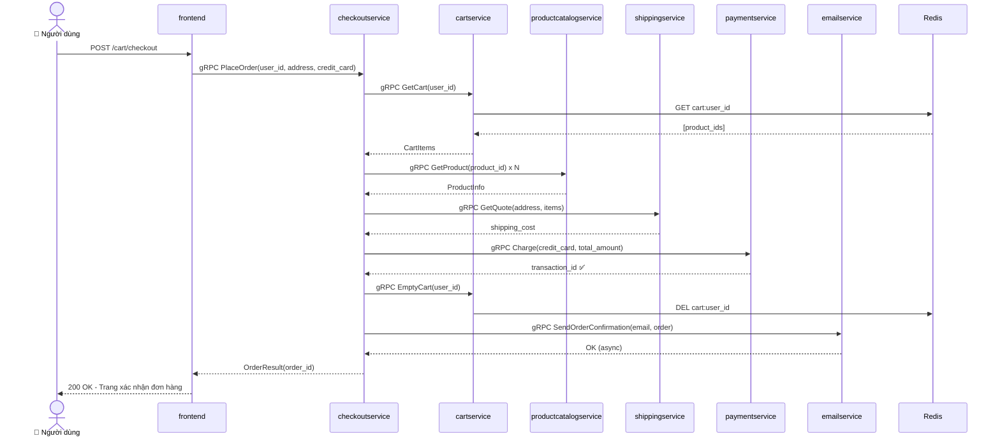
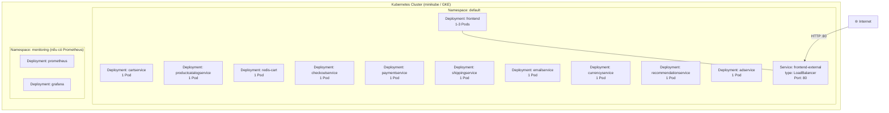
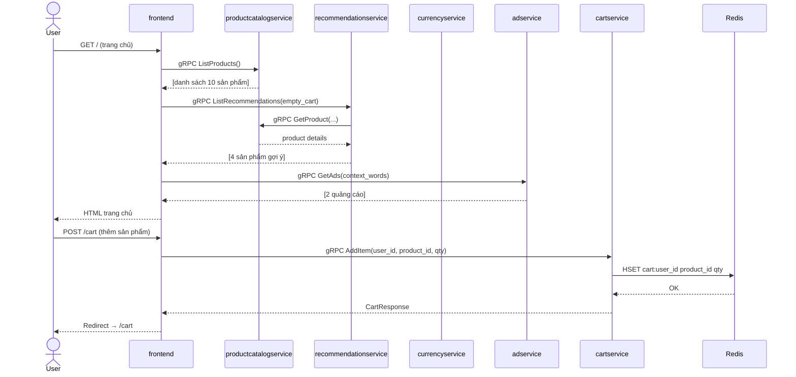

# 🏗️ Biểu Diễn Kiến Trúc - Online Boutique (microservices-demo)

> **Yêu cầu Exam.md:** Demo tái tạo và giải thích kiến trúc dùng UML + Views hoặc C4 Models.  
> **Phương pháp chọn:** Boxes & Arrows + **4+1 Views** + Database Schema.

---

## 📑 SƠ ĐỒ KIẾN TRÚC MẪU MERMAID (TRƯỚC VÀ SAU DEMO)

👉 **[MASTER FILE] - Tổng Hợp Tất Cả 3 Phần Của Exam.md (Gồm Đáp Án & Sơ Đồ):**  
[MASTER_EXAM_GUIDE.md](../MASTER_EXAM_GUIDE.md)

👉 **Link mở file Sơ Đồ Phần 1 độc lập (Trước Demo):**  
[part1_architecture_diagram.md](./part1_architecture_diagram.md)

👉 **Link mở file Sơ Đồ Phần 2 độc lập (Sau Demo):**  
[part2_architecture_diagram.md](./part2_architecture_diagram.md)

---

### 🟢 PHẦN 1: SƠ ĐỒ KIẾN TRÚC NGUYÊN BẢN (TRƯỚC DEMO — 11 MICROSERVICES GỐC)



---

### 🔵 PHẦN 2: SƠ ĐỒ KIẾN TRÚC HOÀN THÀNH DEMO (MỞ RỘNG ENVOY SIDECARS & TEAM SERVICE)

```mermaid
graph TD
    classDef podDashed stroke:#000000,stroke-width:2px,stroke-dasharray: 5 5,fill:#ffffff,color:#000000;
    classDef serviceBox fill:#2b5c8f,stroke:#fff,stroke-width:2px,color:#fff;
    classDef newService fill:#17a2b8,stroke:#fff,stroke-width:2px,color:#fff;
    classDef envoySidecar fill:#d9534f,stroke:#fff,stroke-width:2px,color:#fff;
    classDef controlPlane fill:#6a2c91,stroke:#fff,stroke-width:2px,color:#fff;
    classDef dbShape fill:#8c3b2b,stroke:#fff,stroke-width:1.5px,color:#fff;

    %% TẦNG 0: ISTIO CONTROL & MONITORING
    subgraph TIER0_MESH["==================== TẦNG 0: ISTIO CONTROL PLANE & MONITORING ===================="]
        Istiod["⚙️ Istiod"]:::controlPlane
        Prometheus["🔥 Prometheus Operator"]:::controlPlane
        Grafana["📊 Grafana Dashboard"]:::controlPlane
        Prometheus --> Grafana
    end

    %% TẦNG 1: FRONTEND LAYER (3 REPLICAS)
    subgraph TIER1_MESH["==================== TẦNG 1: FRONTEND ENTRY TIER (3 REPLICAS) ===================="]
        subgraph Pod1_A["1A. Pod: frontend-1"]
            Frontend1["Frontend App 1"]:::serviceBox
            Envoy1["🛡️ Envoy Proxy 1"]:::envoySidecar
            Frontend1 <--> Envoy1
        end

        subgraph Pod1_B["1B. Pod: frontend-2"]
            Frontend2["Frontend App 2"]:::serviceBox
            Envoy2["🛡️ Envoy Proxy 2"]:::envoySidecar
            Frontend2 <--> Envoy2
        end

        subgraph Pod1_C["1C. Pod: frontend-3 (Member UI)"]
            Frontend3["Frontend App 3"]:::serviceBox
            Envoy3["🛡️ Envoy Proxy 3"]:::envoySidecar
            Frontend3 <--> Envoy3
        end
    end

    %% TẦNG 2: TẦNG ĐIỀU PHỐI (ORCHESTRATION TIER - KHUNG RIÊNG TRÊN)
    subgraph TIER2_MESH["==================== TẦNG 2: ORCHESTRATION TIER (DISPATCHERS) ===================="]
        subgraph Pod4_Mesh["4. Pod: checkoutservice"]
            CheckoutApp["Checkout App"]:::serviceBox
            Envoy4["🛡️ Envoy Proxy 4"]:::envoySidecar
            CheckoutApp <--> Envoy4
        end

        subgraph Pod2_Mesh["2. Pod: recommendationservice"]
            RecommendApp["Recommendation App"]:::serviceBox
            Envoy2_Svc["🛡️ Envoy Proxy 2"]:::envoySidecar
            RecommendApp <--> Envoy2_Svc
            DB_Recommend[("💡 In-Memory Data")]:::dbShape
            RecommendApp --> DB_Recommend
        end

        subgraph Pod3_Mesh["3. Pod: cartservice"]
            CartApp["Cart App"]:::serviceBox
            EnvoyCart["🛡️ Envoy Proxy 3"]:::envoySidecar
            CartApp <--> EnvoyCart
        end
    end

    %% TẦNG 3: TẦNG NGHIỆP VỤ (DOMAINS TIER - KHUNG RIÊNG NẰM DƯỚI TẦNG 2)
    subgraph TIER3_MESH["==================== TẦNG 3: CORE DOMAIN SERVICES TIER (LEAF WORKERS) ===================="]
        subgraph Pod5_Mesh["5. Pod: productcatalogservice"]
            CatalogApp["Product Catalog App"]:::serviceBox
            EnvoyCatalog["🛡️ Envoy Proxy 5"]:::envoySidecar
            CatalogApp <--> EnvoyCatalog
            DB_Catalog[("📦 Local File DB (products.json)")]:::dbShape
            CatalogApp --> DB_Catalog
        end

        subgraph Pod6_Mesh["6. Pod: currencyservice"]
            CurrencyApp["Currency App"]:::serviceBox
            EnvoyCurrency["🛡️ Envoy Proxy 6"]:::envoySidecar
            CurrencyApp <--> EnvoyCurrency
            DB_Currency[("🔱 Local File DB (currencies.json)")]:::dbShape
            CurrencyApp --> DB_Currency
        end

        subgraph Pod9_Mesh["9. Pod: shippingservice"]
            ShippingApp["Shipping App"]:::serviceBox
            EnvoyShipping["🛡️ Envoy Proxy 9"]:::envoySidecar
            ShippingApp <--> EnvoyShipping
        end

        subgraph Pod10_Mesh["10. Pod: paymentservice"]
            PaymentApp["Payment App"]:::serviceBox
            EnvoyPayment["🛡️ Envoy Proxy 10"]:::envoySidecar
            PaymentApp <--> EnvoyPayment
        end

        subgraph Pod11_Mesh["11. Pod: emailservice"]
            EmailApp["Email App"]:::serviceBox
            EnvoyEmail["🛡️ Envoy Proxy 11"]:::envoySidecar
            EmailApp <--> EnvoyEmail
        end

        subgraph Pod7_Mesh["7. Pod: adservice"]
            AdApp["Ad App"]:::serviceBox
            EnvoyAd["🛡️ Envoy Proxy 7"]:::envoySidecar
            AdApp <--> EnvoyAd
        end

        subgraph Pod12_New["12. NEW Pod: team-member-service"]
            TeamSVC["✨ Team Member Service<br>(Random 5 Members)"]:::newService
            Envoy12["🛡️ Envoy Proxy 12"]:::envoySidecar
            TeamSVC <--> Envoy12
        end
    end

    %% TẦNG 4: TẦNG DATABASES (DATABASES TIER - KHUNG RIÊNG DƯỚI CÙNG)
    subgraph TIER4_MESH["==================== TẦNG 4: STANDALONE DATABASES LAYER (PERSISTENCE) ===================="]
        subgraph Pod8_Mesh["8. Pod: redis-cart"]
            RedisDB[("💾 Redis NoSQL DB Container<br>Port: 6379")]:::dbShape
        end

        subgraph Pod13_NewDB["13. NEW Pod: postgresql-db"]
            PostgresDB[("💾 PostgreSQL Relational DB Container")]:::dbShape
        end
    end

    %% LUỒNG N NỐI THẲNG TỪ TẦNG TRÊN XUỐNG TẦNG DƯỚI (KHÔNG CẮT NGANG)
    Frontend1 ==>|mTLS gRPC: 5050| Envoy4
    Frontend2 ==>|mTLS gRPC: 8080| Envoy2_Svc
    Frontend3 ==>|mTLS gRPC: 7070| EnvoyCart
    Frontend3 --->|🔘 Click: Random 5 Members| Envoy12

    Envoy4 --->|mTLS gRPC: 3550| EnvoyCatalog
    Envoy4 --->|mTLS gRPC: 7000| EnvoyCurrency
    Envoy4 --->|mTLS gRPC: 50051| EnvoyShipping
    Envoy4 --->|mTLS gRPC: 5000| EnvoyPayment
    Envoy4 --->|mTLS gRPC: 5000| EnvoyEmail

    Envoy2_Svc --->|mTLS gRPC: 3550| EnvoyCatalog
    EnvoyCart --->|TCP: 6379| RedisDB
    Envoy12 --->|SQL Query| PostgresDB

    Istiod -.-|Control mTLS| Envoy12
    Prometheus -.-|Pull Metrics| Envoy12

    %% STYLING
    linkStyle default stroke:#444444,stroke-width:2px;
    class Pod1_A,Pod1_B,Pod1_C,Pod2_Mesh,Pod3_Mesh,Pod4_Mesh,Pod5_Mesh,Pod6_Mesh,Pod7_Mesh,Pod8_Mesh,Pod9_Mesh,Pod10_Mesh,Pod11_Mesh,Pod12_New,Pod13_NewDB podDashed;
```



---

## 📑 Danh Sách ViewsKhác

| View | File | Trạng thái |
|---|---|---|
| Master Architecture & Q&A Guide | [unified_architecture_and_exam_guide.md](file:///Users/apple/.gemini/antigravity-ide/brain/84b38aca-e256-4b53-a897-7cac42d6b450/unified_architecture_and_exam_guide.md) | ✅ |
| Logical View & Micro-frontend | [logical_view_and_microfrontend.md](file:///Users/apple/.gemini/antigravity-ide/brain/84b38aca-e256-4b53-a897-7cac42d6b450/logical_view_and_microfrontend.md) | ✅ |
| Logical View (Component) | [logical_view.md](./logical_view.md) | ✅ |
| Process View (Sequence) | [process_view.md](./process_view.md) | ✅ |
| Development View (Package) | [development_view.md](./development_view.md) | ✅ |
| Physical/Deployment View | [deployment_view.md](./deployment_view.md) | ✅ |
| Scenario View (+1) | [scenario_view.md](./scenario_view.md) | ✅ |
| Database Schema | [database_schema.md](./database_schema.md) | ✅ |

---

## 🧩 Tổng Quan Hệ Thống

**Online Boutique** là ứng dụng e-commerce demo của Google Cloud, gồm **11 microservices** viết bằng nhiều ngôn ngữ khác nhau (Go, Python, Java, C#, Node.js), giao tiếp chủ yếu qua **gRPC**.

### Danh sách 11 services:

| Service | Ngôn ngữ | Chức năng | Port |
|---|---|---|---|
| `frontend` | Go | Serve giao diện web, điểm vào duy nhất cho người dùng | 8080 |
| `cartservice` | C# | Lưu giỏ hàng trong Redis | 7070 |
| `productcatalogservice` | Go | Danh sách sản phẩm từ JSON file | 3550 |
| `currencyservice` | Node.js | Chuyển đổi tiền tệ | 7000 |
| `paymentservice` | Node.js | Xử lý thanh toán (mock) | 50051 |
| `shippingservice` | Go | Tính phí vận chuyển (mock) | 50051 |
| `emailservice` | Python | Gửi email xác nhận (mock) | 8080 |
| `checkoutservice` | Go | Điều phối toàn bộ luồng thanh toán | 5050 |
| `recommendationservice` | Python | Gợi ý sản phẩm liên quan | 8080 |
| `adservice` | Java | Hiển thị quảng cáo theo context | 9555 |
| `loadgenerator` | Python/Locust | Sinh traffic test tự động | N/A |

### Giao thức giao tiếp:

```
Người dùng (Browser)
       │ HTTP/REST
       ▼
   frontend (Go)
       │ gRPC  ◄─── Giao tiếp nội bộ giữa TẤT CẢ services
       ▼
[cartservice, productcatalogservice, currencyservice,
 checkoutservice, recommendationservice, adservice,
 shippingservice, paymentservice, emailservice]
       │ TCP
       ▼
   Redis (cartservice dùng để lưu giỏ hàng)
```

---

## 1. LOGICAL VIEW (Component View)

Mô tả các thành phần phần mềm và mối quan hệ phụ thuộc giữa chúng.



**Giải thích:**
- `frontend` là điểm vào duy nhất, không có direct DB — nó chỉ tổng hợp dữ liệu từ các service khác.
- `checkoutservice` là service phức tạp nhất — điều phối toàn bộ luồng: giỏ hàng → sản phẩm → tính phí ship → thanh toán → gửi email.
- Chỉ `cartservice` có database riêng (Redis). Các service còn lại là stateless.

---

## 2. PROCESS VIEW (Sequence Diagram — Luồng đặt hàng)

Mô tả chuỗi các tiến trình xảy ra khi người dùng thực hiện một hành động cụ thể.



---

## 3. DEPLOYMENT VIEW (Physical View)

Mô tả cách các thành phần được triển khai trên hạ tầng vật lý (Kubernetes).



**File cấu hình tham chiếu:**
- [`kubernetes-manifests/frontend.yaml`](../../../kubernetes-manifests/frontend.yaml) — Deployment + Service + ServiceAccount
- [`kubernetes-manifests/cartservice.yaml`](../../../kubernetes-manifests/cartservice.yaml) — Deployment có kết nối Redis
- [`kubernetes-manifests/`](../../../kubernetes-manifests/) — Toàn bộ 13 files yaml

---

## 4. DATABASE SCHEMA

Online Boutique chỉ có **1 database** là **Redis** (dùng bởi `cartservice`).

### Redis — Cấu trúc lưu trữ:

```
Key format:  "cart:{user_session_id}"
Value type:  Hash (field: value)

Ví dụ:
KEY:   cart:abc123xyz
VALUE: {
  "OLJCESPC7Z": "2",    # product_id: quantity
  "L9ECAV7KIM": "1",
  "2ZYFJ3GM2N": "3"
}
```

**File cấu hình Redis trong K8s:**
```yaml
# Trong kubernetes-manifests/cartservice.yaml
env:
- name: REDIS_ADDR
  value: "redis-cart:6379"
```

Ngoài Redis, các service khác như `productcatalogservice` đọc dữ liệu sản phẩm trực tiếp từ file:
- [`src/productcatalogservice/products.json`](../../../src/productcatalogservice/products.json) — Danh sách sản phẩm tĩnh

---

## 5. SCENARIO VIEW (+1)

Kịch bản: Người dùng truy cập trang chủ và thêm sản phẩm vào giỏ hàng.



---

## ❓ Câu hỏi vấn đáp về Architecture

**Q: Tại sao gRPC thay vì REST?**
> A: gRPC dùng Protocol Buffers (binary) thay vì JSON → nhanh hơn ~10x, ít bandwidth hơn. Quan trọng hơn, gRPC hỗ trợ strong typing — các `.proto` files định nghĩa contract API rõ ràng, giúp đa ngôn ngữ (Go, Python, Java, Node.js) hiểu nhau mà không cần viết lại. Xem tại: [`protos/`](../../../protos/)

**Q: Service nào là single point of failure (SPOF)?**
> A: `frontend` là điểm vào duy nhất, nhưng K8s đã cấu hình `replicas` và `readinessProbe` để tự động phục hồi. `redis-cart` là SPOF thực sự — nếu Redis chết, toàn bộ giỏ hàng bị mất.

**Q: Micro-Frontend ở đây là gì?**
> A: Online Boutique không dùng Micro-Frontend — đây là Monolithic Frontend (1 process Go duy nhất serve toàn bộ UI). Để chuyển sang Micro-Frontend, mỗi trang (product listing, cart, checkout) sẽ là 1 frontend riêng biệt được kết hợp lại qua Module Federation hoặc iframe.
