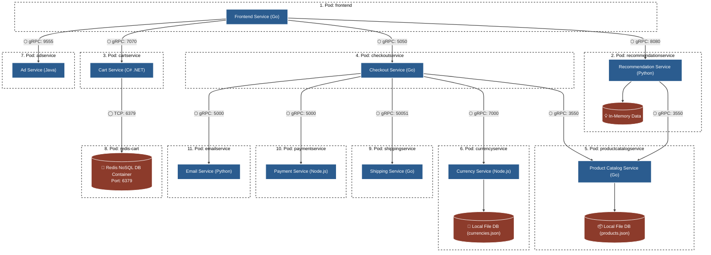

# 🏛️ PHẦN 1: SƠ ĐỒ KIẾN TRÚC NGUYÊN BẢN (PHÂN CẤP TẦNG RÕ RÀNG — TẦNG NGHIỆP VỤ XÍCH XUỐNG DƯỚI)

> **Cải tiến vị trí:**  
> Sử dụng kỹ thuật ép Rank Mermaid (`--->`) để **Tầng Dịch Vụ Nghiệp Vụ (ProductCatalog, Currency, Shipping, Payment, Email, AdService)** xích hẳn xuống **HÀNG BÊN DƯỚI CẤP THẤP HƠN**, tuyệt đối KHÔNG NẰM TRÙNG HÀNG với Tầng Điều Phối (`checkoutservice`, `recommendationservice`, `cartservice`)!

