# 🏛️ PHẦN 2: SƠ ĐỒ KIẾN TRÚC HOÀN THÀNH DEMO (KHUNG SUBGRAPH PHÂN TẦNG ĐỒNG BỘ 100% VỚI PHẦN 1)

> **Sửa lỗi triệt để:**  
> Đưa toàn bộ các Pods vào đúng **4 Khung Tầng Ngang (`subgraph TIER...`)** riêng biệt giống hệt Phần 1, giúp các tầng tuyệt đối KHÔNG GIAO NHAU HÀNG và dây nối chạy thẳng tắp 100%!

```mermaid
graph TD
    classDef podDashed stroke:#444444,stroke-width:2px,stroke-dasharray: 5 5,fill:#ffffff,color:#000000;
    classDef serviceBox fill:#2b5c8f,stroke:#fff,stroke-width:2px,color:#fff;
    classDef newService fill:#17a2b8,stroke:#fff,stroke-width:2px,color:#fff;
    classDef envoySidecar fill:#d9534f,stroke:#fff,stroke-width:2px,color:#fff;
    classDef controlPlane fill:#6a2c91,stroke:#fff,stroke-width:2px,color:#fff;
    classDef dbShape fill:#8c3b2b,stroke:#fff,stroke-width:1.5px,color:#fff;

    %% TẦNG 0: ISTIO CONTROL & MONITORING
    subgraph TIER0_MESH["==================== TẦNG 0: ISTIO CONTROL PLANE & MONITORING ===================="]
        Istiod["⚙️ Istiod"]:::controlPlane
        Prometheus["🔥 Prometheus Operator"]:::controlPlane
        Grafana["📊 Grafana Dashboard"]:::controlPlane
        Prometheus --> Grafana
    end

    %% TẦNG 1: FRONTEND LAYER (3 REPLICAS)
    subgraph TIER1_MESH["==================== TẦNG 1: FRONTEND ENTRY TIER (3 REPLICAS) ===================="]
        subgraph Pod1_A["1A. Pod: frontend-1"]
            Frontend1["Frontend App 1"]:::serviceBox
            Envoy1["🛡️ Envoy Proxy 1"]:::envoySidecar
            Frontend1 <--> Envoy1
        end

        subgraph Pod1_B["1B. Pod: frontend-2"]
            Frontend2["Frontend App 2"]:::serviceBox
            Envoy2["🛡️ Envoy Proxy 2"]:::envoySidecar
            Frontend2 <--> Envoy2
        end

        subgraph Pod1_C["1C. Pod: frontend-3 (Member UI)"]
            Frontend3["Frontend App 3"]:::serviceBox
            Envoy3["🛡️ Envoy Proxy 3"]:::envoySidecar
            Frontend3 <--> Envoy3
        end
    end

    %% TẦNG 2: TẦNG ĐIỀU PHỐI (ORCHESTRATION TIER - KHUNG RIÊNG TRÊN)
    subgraph TIER2_MESH["==================== TẦNG 2: ORCHESTRATION TIER (DISPATCHERS) ===================="]
        subgraph Pod4_Mesh["4. Pod: checkoutservice"]
            CheckoutApp["Checkout App"]:::serviceBox
            Envoy4["🛡️ Envoy Proxy 4"]:::envoySidecar
            CheckoutApp <--> Envoy4
        end

        subgraph Pod2_Mesh["2. Pod: recommendationservice"]
            RecommendApp["Recommendation App"]:::serviceBox
            Envoy2_Svc["🛡️ Envoy Proxy 2"]:::envoySidecar
            RecommendApp <--> Envoy2_Svc
            DB_Recommend[("💡 In-Memory Data")]:::dbShape
            RecommendApp --> DB_Recommend
        end

        subgraph Pod3_Mesh["3. Pod: cartservice"]
            CartApp["Cart App"]:::serviceBox
            EnvoyCart["🛡️ Envoy Proxy 3"]:::envoySidecar
            CartApp <--> EnvoyCart
        end
    end

    %% TẦNG 3: TẦNG NGHIỆP VỤ (DOMAINS TIER - KHUNG RIÊNG NẰM DƯỚI TẦNG 2)
    subgraph TIER3_MESH["==================== TẦNG 3: CORE DOMAIN SERVICES TIER (LEAF WORKERS) ===================="]
        subgraph Pod5_Mesh["5. Pod: productcatalogservice"]
            CatalogApp["Product Catalog App"]:::serviceBox
            EnvoyCatalog["🛡️ Envoy Proxy 5"]:::envoySidecar
            CatalogApp <--> EnvoyCatalog
            DB_Catalog[("📦 Local File DB (products.json)")]:::dbShape
            CatalogApp --> DB_Catalog
        end

        subgraph Pod6_Mesh["6. Pod: currencyservice"]
            CurrencyApp["Currency App"]:::serviceBox
            EnvoyCurrency["🛡️ Envoy Proxy 6"]:::envoySidecar
            CurrencyApp <--> EnvoyCurrency
            DB_Currency[("🔱 Local File DB (currencies.json)")]:::dbShape
            CurrencyApp --> DB_Currency
        end

        subgraph Pod9_Mesh["9. Pod: shippingservice"]
            ShippingApp["Shipping App"]:::serviceBox
            EnvoyShipping["🛡️ Envoy Proxy 9"]:::envoySidecar
            ShippingApp <--> EnvoyShipping
        end

        subgraph Pod10_Mesh["10. Pod: paymentservice"]
            PaymentApp["Payment App"]:::serviceBox
            EnvoyPayment["🛡️ Envoy Proxy 10"]:::envoySidecar
            PaymentApp <--> EnvoyPayment
        end

        subgraph Pod11_Mesh["11. Pod: emailservice"]
            EmailApp["Email App"]:::serviceBox
            EnvoyEmail["🛡️ Envoy Proxy 11"]:::envoySidecar
            EmailApp <--> EnvoyEmail
        end

        subgraph Pod7_Mesh["7. Pod: adservice"]
            AdApp["Ad App"]:::serviceBox
            EnvoyAd["🛡️ Envoy Proxy 7"]:::envoySidecar
            AdApp <--> EnvoyAd
        end

        subgraph Pod12_New["12. NEW Pod: team-member-service"]
            TeamSVC["✨ Team Member Service<br>(Random 5 Members)"]:::newService
            Envoy12["🛡️ Envoy Proxy 12"]:::envoySidecar
            TeamSVC <--> Envoy12
        end
    end

    %% TẦNG 4: TẦNG DATABASES (DATABASES TIER - KHUNG RIÊNG DƯỚI CÙNG)
    subgraph TIER4_MESH["==================== TẦNG 4: STANDALONE DATABASES LAYER (PERSISTENCE) ===================="]
        subgraph Pod8_Mesh["8. Pod: redis-cart"]
            RedisDB[("💾 Redis NoSQL DB Container<br>Port: 6379")]:::dbShape
        end

        subgraph Pod13_NewDB["13. NEW Pod: postgresql-db"]
            PostgresDB[("💾 PostgreSQL Relational DB Container")]:::dbShape
        end
    end

    %% LUỒNG N NỐI THẲNG TỪ TẦNG TRÊN XUỐNG TẦNG DƯỚI (KHÔNG CẮT NGANG)
    Frontend1 ==>|mTLS gRPC: 5050| Envoy4
    Frontend2 ==>|mTLS gRPC: 8080| Envoy2_Svc
    Frontend3 ==>|mTLS gRPC: 7070| EnvoyCart
    Frontend3 --->|🔘 Click: Random 5 Members| Envoy12

    Envoy4 --->|mTLS gRPC: 3550| EnvoyCatalog
    Envoy4 --->|mTLS gRPC: 7000| EnvoyCurrency
    Envoy4 --->|mTLS gRPC: 50051| EnvoyShipping
    Envoy4 --->|mTLS gRPC: 5000| EnvoyPayment
    Envoy4 --->|mTLS gRPC: 5000| EnvoyEmail

    Envoy2_Svc --->|mTLS gRPC: 3550| EnvoyCatalog
    EnvoyCart --->|TCP: 6379| RedisDB
    Envoy12 --->|SQL Query| PostgresDB

    Istiod -.-|Control mTLS| Envoy12
    Prometheus -.-|Pull Metrics| Envoy12

    %% STYLING
    linkStyle default stroke:#444444,stroke-width:2px;
    class Pod1_A,Pod1_B,Pod1_C,Pod2_Mesh,Pod3_Mesh,Pod4_Mesh,Pod5_Mesh,Pod6_Mesh,Pod7_Mesh,Pod8_Mesh,Pod9_Mesh,Pod10_Mesh,Pod11_Mesh,Pod12_New,Pod13_NewDB podDashed;
```

