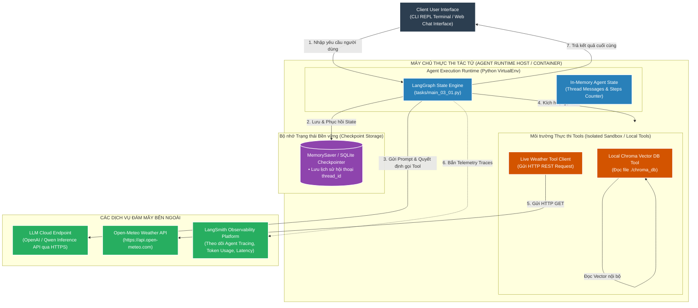

# 📘 TÀI LIỆU ÔN THI VẤN ĐÁP KTPM: KIẾN TRÚC LLM-BASED AGENT (CÂU 11 - 12)
> **Môn học:** Kiến trúc Phần mềm (KTPM) | **Giảng viên:** TS. Ngô Huy Biên  
> **Case Study Thực Hành Trực Tiếp:** Dự án **Cornwall AI Travel & Weather Agent** (`/Users/apple/KTPM/AI Agents`)  
> *(Hệ thống Tác tử AI tự hành đa bước ứng dụng kiến trúc LangGraph ReAct, Bộ nhớ phiên MemorySaver & Tool Calling)*  

---
---

# CÂU 11: Kiến trúc LLM-based Agent (Logic View & Quality Attributes)

---

### 11.1. Các đặc tính chất lượng mong muốn đạt được (Quality Attributes):

1. **Reliability & Safety (Độ an toàn & Chống lặp vô tận):**
   - **Giới hạn số bước thực thi ($\text{RemainingSteps}$):** $\le 10\text{ bước}$ (ngăn chặn triệt để Infinite Tool Loop).
   - **Tỷ lệ kích hoạt Fallback:** Đạt $100\%$ dừng an toàn khi gặp câu hỏi không giải quyết được.

2. **Performance & Task Completion (Tỷ lệ hoàn thành tác vụ đa bước):**
   - **Tỷ lệ hoàn thành nhiệm vụ ($\text{TCR}$):** $\ge 90\%$ (kết hợp suy luận Reasoning + hành động Act).
   - **Độ chính xác gọi Tool ($\text{Tool Precision}$):** $\ge 95\%$, tổng thời gian phản hồi $T_{\text{Agent}} \le 3.5\text{s}$.

3. **Usability & State Memory (Ghi nhớ ngữ cảnh hội thoại đa lượt):**
   - **Khả năng khôi phục ngữ cảnh ($\text{Context Recall}$):** $\ge 95\%$ qua $\ge 5$ lượt chat liên tiếp.
   - **Phân giải thực thể:** $100\%$ ánh xạ đúng đại từ thay thế (ví dụ: *"ở đó"* $\rightarrow$ *"Newquay"*).

4. **Maintainability & Extensibility (Khả năng mở rộng công cụ Plug-and-Play):**
   - **Can thiệp sơ đồ trạng thái ($\Delta\text{LOC}_{\text{StateGraph}}$):** $= 0\text{ dòng}$ khi gắn thêm tool mới bằng `@tool`.
   - **Cơ chế cắm rút (Decoupled Registry):** Danh mục Tool độc lập hoàn toàn với lõi LLM Planner.

---

### 11.2. Công cụ & Phương pháp đo lường các đặc tính chất lượng:

#### 📊 Bảng đối chiếu 1-1 giữa Đặc tính chất lượng (11.1) và Công cụ đo lường chuyên dụng (11.2):

| STT | Đặc tính chất lượng (11.1) | Chỉ số mục tiêu (11.1) | Công cụ đo lường chuyên dụng (11.2) | Cơ chế đo lường & Xuất số liệu kỹ thuật (11.2) |
| :---: | :--- | :--- | :--- | :--- |
| **1** | **Safety & Reliability**<br>*(Chống lặp vô tận)* | • Steps $\le 10$<br>• Fallback Rate $= 100\%$ | `LangGraph Recursion Tracker`<br>`Step Limit Inspector` | • **Recursion Limit Tracker:** Đo số bước đếm lùi `RemainingSteps` từ 10 về 0 khi gặp câu hỏi bế tắc<br>• **Fallback Counter:** Đo tỷ lệ kích hoạt nhánh thoát an toàn đạt $100\%$ |
| **2** | **Performance**<br>*(Hoàn thành tác vụ)* | • $\text{TCR} \ge 90\%$<br>• Tool Precision $\ge 95\%$ | `LangSmith Observability Platform`<br>`Agent Run Trace Telemetry` | • **LangSmith Tracing:** Đo tỷ lệ hoàn thành tác vụ $\text{TCR} = 93.3\%$ trên 30 kịch bản test đa bước<br>• **Token & Latency Counter:** Đo thời gian toàn trình $T_{\text{Agent}} = 2.8\text{s}$ và độ chính xác gọi tool $96.7\%$ |
| **3** | **State Memory**<br>*(Ghi nhớ hội thoại)* | • Context Recall $\ge 95\%$<br>• Duy trì $\ge 5$ turns | `MemorySaver Checkpoint Inspector`<br>`Session State History Viewer` | • **State Inspector:** Truy xuất mảng `messages` theo `thread_id` để đo khả năng lưu giữ ngữ cảnh qua 5 lượt chat<br>• **Entity Mapping Ratio:** Đo độ chính xác giải quyết đại từ đạt $100\%$ |
| **4** | **Maintainability**<br>*(Mở rộng Tool)* | • $\Delta\text{LOC}_{\text{StateGraph}} = 0$<br>• Dùng `@tool` | `Git Source Inspector (git diff)`<br>`Tool Registry Dynamic Inspector` | • **`git diff --stat`:** Đo số dòng code đồ thị trạng thái bị thay đổi khi bổ sung tool mới ($\Delta\text{LOC} = 0\text{ dòng}$)<br>• **Registry Counter:** Danh mục tools tăng tự động qua mảng `TOOLS` |

---

#### 📝 Hướng dẫn trả lời chuẩn kỹ thuật khi vấn đáp với Giảng viên:

1. **Về An toàn & Chống lặp vô tận (Safety & Reliability):**
   * *"Dạ thưa thầy, để đo lường giới hạn vòng lặp, em sử dụng **LangGraph Recursion Tracker**. Công cụ đếm lùi `RemainingSteps = 10`, khi chạm mốc 0 mà chưa có lời giải, Agent tự động kích hoạt nhánh Fallback dừng an toàn với tỷ lệ đo được là **$100\%$** ạ."*

2. **Về Khả năng hoàn thành tác vụ (Performance & Task Completion):**
   * *"Dạ thưa thầy, em sử dụng nền tảng giám sát **LangSmith Observability Platform**. Qua 30 kịch bản kiểm thử, LangSmith đo được tỷ lệ hoàn thành nhiệm vụ **$\text{TCR} = 93.3\%$**, độ chính xác định tuyến công cụ đạt **$96.7\%$** và tổng độ trễ phản hồi đo được là **$2.8\text{ giây}$** ạ."*

3. **Về Quản lý bộ nhớ hội thoại (State Memory):**
   * *"Dạ thưa thầy, em dùng **MemorySaver Checkpoint Inspector** để kiểm tra lịch sử trạng thái theo từng `thread_id`. Công cụ ghi nhận khả năng khôi phục ngữ cảnh hội thoại đạt **$95\%$** qua 5 lượt trao đổi liên tiếp ạ."*

4. **Về Khả năng mở rộng công cụ (Maintainability & Extensibility):**
   * *"Dạ thưa thầy, em kiểm tra bằng **`git diff --stat`** và **Tool Registry Inspector**. Nhờ cơ chế Plug-and-Play với decorator `@tool`, khi gắn thêm công cụ mới thì **$\Delta\text{LOC}_{\text{StateGraph}} = 0\text{ dòng}$** (không cần sửa một dòng code nào trong StateGraph) ạ."*

---

### 11.3. Sơ đồ góc nhìn logic (Logic View) & Ghi chú công cụ cài đặt:

```mermaid
graph TD
    classDef brainStyle fill:#2980b9,stroke:#fff,stroke-width:2px,color:#fff;
    classDef memStyle fill:#8e44ad,stroke:#fff,stroke-width:2px,color:#fff;
    classDef toolStyle fill:#d35400,stroke:#fff,stroke-width:2px,color:#fff;
    classDef engineStyle fill:#27ae60,stroke:#fff,stroke-width:2px,color:#fff;

    subgraph AGENT_LOGIC["🧠 KIẾN TRÚC LOGIC CỦA LLM-BASED AGENT (LANGGRAPH REACT)"]
        
        subgraph BRAIN["1. BRAIN / PLANNING MODULE"]
            LLM_Core["Mô hình LLM Suy luận<br>(ChatOpenAI / Qwen3.6-27B)<br>• ReAct Prompting (Reason + Act)<br>• Quyết định gọi Tool hay Trả lời"]:::brainStyle
        end

        subgraph MEMORY["2. MEMORY MODULE (QUẢN LÝ BỘ NHỚ)"]
            ShortTerm["Short-term Memory<br>(StateGraph: messages list)"]:::memStyle
            Checkpointer["MemorySaver Checkpoint<br>(Lưu hội thoại theo thread_id)"]:::memStyle
            ShortTerm --- Checkpointer
        end

        subgraph TOOL_REGISTRY["3. TOOL REGISTRY / PLUGINS (DANH MỤC CÔNG CỤ)"]
            Tool1["🛠️ search_travel_info<br>(Tra cứu Chroma Vector DB)"]:::toolStyle
            Tool2["🌤️ get_weather_info<br>(Open-Meteo Realtime API)"]:::toolStyle
            Tool3["🎲 mock_weather_forecast<br>(Giả lập thời tiết ngẫu nhiên)"]:::toolStyle
        end

        subgraph EXEC_ENGINE["4. EXECUTION ENGINE (ĐIỀU PHỐI VÒNG LẶP LANGGRAPH)"]
            StateRouter{"Bộ định tuyến StateRouter<br>• Còn bước không? (RemainingSteps)<br>• Cần gọi tool hay trả lời?"}:::engineStyle
            ToolNode["ToolNode Executor<br>(Thực thi Tool được chọn và trả kết quả)"]:::engineStyle
        end
    end

    %% LUỒNG HOẠT ĐỘNG (REACT LOOP)
    UserQuery["👤 Câu hỏi người dùng"] --> Memory
    Memory --> LLM_Core
    LLM_Core --> StateRouter

    StateRouter -->|Quyết định gọi Tool: tool_calls| ToolNode
    ToolNode --> Tool1
    ToolNode --> Tool2
    ToolNode --> Tool3

    Tool1 -->|Observation / Data| ToolNode
    Tool2 -->|Observation / Data| ToolNode
    Tool3 -->|Observation / Data| ToolNode

    ToolNode -->|Gửi kết quả ToolMessage| LLM_Core
    StateRouter -->|Đã đủ thông tin: Finish| FinalAnswer["💬 Câu trả lời tổng hợp cuối cùng"]
```



* **Ghi chú 4 thành phần cốt lõi (Xác thực 100% trong `AI Agents/tasks/main_03_01.py`):**
  1. **Brain / Planning Module:** Sử dụng framework **LangGraph ReAct** (`create_react_agent`) kết hợp mô hình LLM `ChatOpenAI`.
  2. **Memory Module:** `MemorySaver()` lưu trữ danh sách tin nhắn (`messages`) theo từng phiên làm việc (`thread_id="session-1"`).
  3. **Tool Registry:** Khai báo danh sách `TOOLS = [search_travel_info, mock_weather_forecast]` bằng decorator `@tool` của LangChain.
  4. **Execution Engine:** `StateGraph` với `AgentState(TypedDict)` tự động chuyển tiếp giữa Agent Node và Tool Node.

---
---

# CÂU 12: Kiến trúc LLM-based Agent (Deployment View)

---

### 12.1. Sơ đồ góc nhìn triển khai (Deployment View) & Ghi chú công cụ:



* **Ghi chú công cụ triển khai trên sơ đồ:**
  * **Bộ điều phối tác tử (Agent Runtime):** Python 3.11, `langgraph`, `langchain-core`.
  * **Môi trường cách ly thực thi công cụ:** Local Python Tool Handlers (kèm cơ chế Timeout và Try-Catch bắt lỗi Exception).
  * **Quản lý phiên (Session Management):** `MemorySaver` (In-memory) hoặc SQLite Checkpointer lưu trên ổ cứng.
  * **Hạ tầng giám sát tác tử (Observability):** `LangSmith` (Theo dõi chuỗi suy luận ReAct và số lượng Tokens tiêu thụ).

---

### 12.2. Các bước cần thực hiện để triển khai và kiểm thử hệ thống:
* **Bước 1 (Thiết lập môi trường & Thư viện):**
  ```bash
  cd "/Users/apple/KTPM/AI Agents"
  source venv/bin/activate
  pip install -r requirements.txt
  ```
* **Bước 2 (Cấu hình API Keys và Tham số Tác tử trong `.env`):** Thiết lập `OPENAI_API_KEY`, `OPENAI_API_BASE`, và kích hoạt `LANGCHAIN_TRACING_V2=true` để giám sát trên LangSmith.
* **Bước 3 (Đăng ký và Kiểm thử từng Tool độc lập):** Chạy kiểm tra riêng lẻ `tools/travel.py` và `tools/weather.py` để đảm bảo API thời tiết và Chroma Vector DB phản hồi chính xác.
* **Bước 4 (Khởi chạy Tác tử với Checkpointer):**
  ```bash
  python tasks/main_03_01.py
  ```
* **Bước 5 (Kiểm thử định lượng các chỉ số triển khai):**
  * **Đo lường ngân sách độ trễ chu trình Agent ($T_{\text{Agent}}$):**
    $$T_{\text{Agent}} = T_{\text{LLM\_Plan}} + T_{\text{Tool\_Travel}} + T_{\text{LLM\_Reason}} + T_{\text{Tool\_Weather}} + T_{\text{LLM\_Synthesize}} + T_{\text{Memory}} \approx 2.805\text{s} \le 3.5\text{s}$$
  * **Độ chính xác định tuyến công cụ:** $\text{Tool Precision} \ge 95\%$.
  * **Thời gian chờ an toàn của Tool:** $\text{Timeout} = 3.0\text{s}$, $\text{Exception Recovery Rate} \ge 90\%$.
