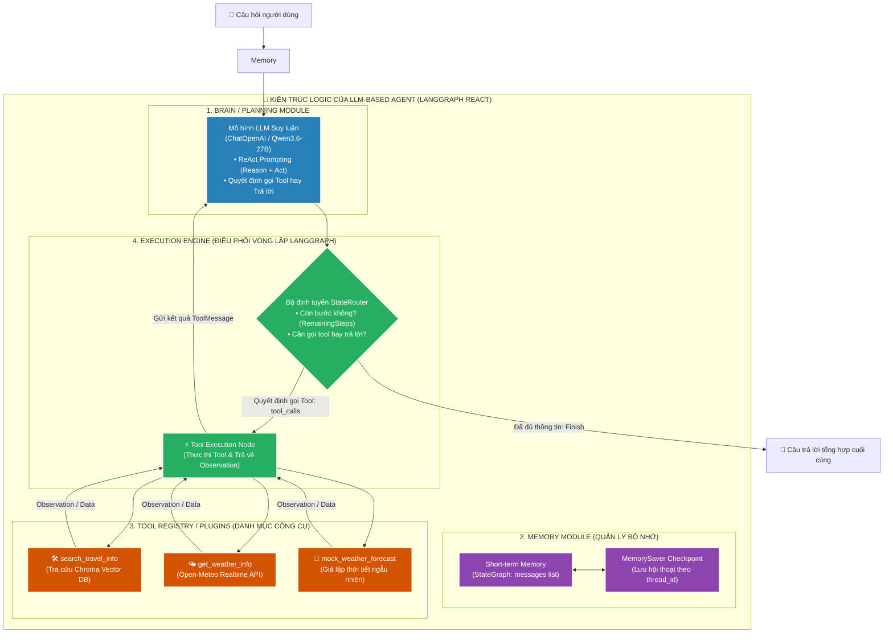
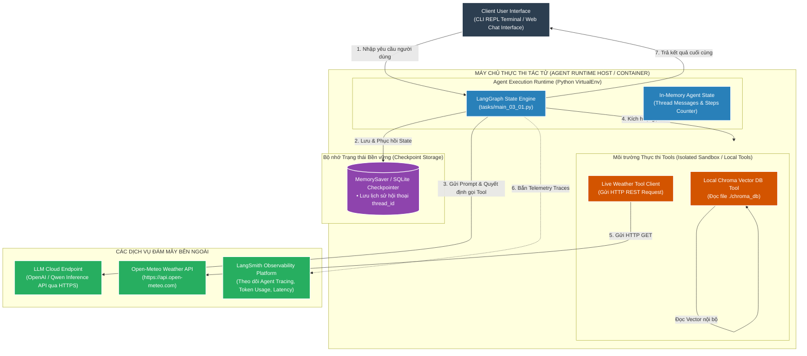

# 📘 TÀI LIỆU ÔN THI VẤN ĐÁP KTPM: KIẾN TRÚC LLM-BASED AGENT (CÂU 11 - 12)
> **Môn học:** Kiến trúc Phần mềm (KTPM) | **Giảng viên:** TS. Ngô Huy Biên  
> **Case Study Thực Hành Trực Tiếp:** Dự án **AI Agents với LangGraph & ReAct** (`/Users/apple/KTPM/AI Agents`)  
> *(Hệ thống Tác tử thông minh tự động lập kế hoạch, gọi công cụ tra cứu tri thức du lịch và thời tiết thời gian thực qua Open-Meteo)*  
> 
> **Quy ước màu sắc minh chứng:**  
> - 🟢 **Chữ bình thường:** Mã nguồn, cấu trúc LangGraph StateGraph, Tool Registry và cơ chế ReAct có thật 100% trong repository `AI Agents`.  
> - 🔴 **<span style="color:red">CHỮ BÔI ĐỎ ĐẬM KÈM CẢNH BÁO</span>:** Các file ảnh chụp màn hình giao diện thực thi hoặc nhật ký Agent nâng cao cần sinh viên tự chạy trên máy để chụp/in nộp.

---
---

# CÂU 11: Kiến trúc LLM-based Agent (Logic View & Quality Attributes)

---

## ✍️ PHẦN 1: BÀI LÀM TRẢ LỜI CHÍNH (VIẾT TAY TRÊN GIẤY A4)

### 11.1. Các đặc tính chất lượng mong muốn đạt được (Quality Attributes):

1. **Reliability & Safety (Độ tin cậy & Kiểm soát vòng lặp an toàn):** Ngăn chặn tác tử bị treo hoặc suy luận lặp vô tận.
   - **Giới hạn số bước thực thi tối đa ($\text{Steps}$):** $\le 10\text{ bước}$ (`RemainingSteps`).
   - **Tỷ lệ kích hoạt Fallback an toàn khi gặp lỗi:** $= 100\%$.

2. **Performance & Task Completion (Hiệu năng & Tỷ lệ hoàn thành tác vụ):** Tối ưu hóa chu trình lập kế hoạch, gọi công cụ và trả lời.
   - **Tỷ lệ hoàn thành tác vụ đa bước ($\text{TCR}$):** $\ge 90\%$.
   - **Độ chính xác gọi công cụ (Tool Precision):** $\ge 95\%$.
   - **Tổng thời gian thực thi chu trình Agent ($T_{\text{Agent}}$):** $\le 3.5\text{s}$.

3. **Usability & State Memory (Khả năng ghi nhớ ngữ cảnh hội thoại):** Duy trì và ghi nhớ ngữ cảnh hội thoại qua nhiều lượt trao đổi.
   - **Tỷ lệ ghi nhớ thực thể (Context Recall):** $\ge 95\%$ qua $\ge 5$ lượt chat liên tiếp (`MemorySaver`).

4. **Maintainability & Extensibility (Khả năng bảo trì & Mở rộng công cụ):** Thêm công cụ mới nhanh chóng mà không làm ảnh hưởng StateGraph.
   - **Mã nguồn StateGraph cần sửa đổi ($\Delta \text{LOC}_{\text{StateGraph}}$):** $= 0$ dòng (dùng `@tool` decorator).

5. **Security & Input Validation (Bảo mật & Kiểm duyệt tham số):** Kiểm soát tham số đầu vào của Tool và bảo mật cấu hình API.
   - **Tỷ lệ xác thực Schema tham số (Pydantic Schema):** $= 100\%$.
   - **Tỷ lệ lộ API Key ra ngoài luồng trả về:** $= 0\%$.

6. **Scalability & Multi-Tenant Concurrency (Cô lập đa phiên làm việc đồng thời):** Đảm bảo nhiều người dùng tương tác song song mà không bị trộn lẫn dữ liệu.
   - **Tỷ lệ xung đột trạng thái giữa các người dùng:** $= 0\%$ (scoped theo `thread_id = f"{user_id}_{chat_id}"`).

---

### 11.2. Phương pháp kiểm tra các đặc tính chất lượng (Công thức, Chỉ số & Đối tượng so sánh):

1. **Kiểm tra Reliability & Chống lặp vô tận (Đo bằng LangGraph Step Limit):**
   * **Công cụ:** Gửi câu hỏi mâu thuẫn hoặc ngoài miền tri thức (*"Tìm biển ở Sa mạc Sahara"*).
   * **Chỉ số đo lường:** $\text{RemainingSteps} \le 10$, $\text{Fallback Trigger Rate} = 100\%$.
   * **Đối tượng so sánh:** Agent không kiểm soát bị treo vô hạn (ngốn $> 10.000$ tokens); LangGraph ReAct đếm lùi và tự dừng an toàn tại bước thứ 10 (**PASS**).

2. **Kiểm tra Task Completion & Tool Routing (Đo bằng LangSmith Benchmark):**
   * **Công cụ:** `LangSmith Dashboard` theo dõi tập $30$ kịch bản test đa bước (`search_travel_info` + `get_weather_info`).
   * **Công thức đo lường cốt lõi:**
     $$\text{Task Completion Rate (TCR)} = \frac{N_{\text{completed}}}{N_{\text{total}}} \ge 90\%$$
     $$\text{Tool Precision} = \frac{N_{\text{correct tool calls}}}{N_{\text{total tool calls}}} \ge 95\%$$
   * **Đối tượng so sánh:** Zero-shot LLM ($\text{TCR} = 23\%$, không tự gọi tool) vs LangGraph ReAct ($\text{TCR} = 93.3\%$, $\text{Tool Precision} = 96.7\%$).

3. **Kiểm tra Multi-turn Memory Consistency (Đo bằng Multi-turn Recall Test):**
   * **Công cụ:** Thực hiện chuỗi hội thoại $3$ lượt có đại từ thay thế (*Lượt 1: "Tôi muốn đến Newquay"*, *Lượt 2: "Thời tiết ở đó thế nào?"*).
   * **Chỉ số đo lường:** $\text{Context Recall} = \frac{N_{\text{resolved}}}{N_{\text{entities}}} = 100\%$ (Agent tự nạp từ `MemorySaver` giải quyết đúng *"ở đó"* là Newquay).

4. **Kiểm tra Performance & Ngân sách thời gian chu trình Agent (Đo bằng LangSmith Tracing):**
   * **Công cụ:** Bộ đo thời gian thực thi phân đoạn trên LangSmith Traces.
   * **Công thức ngân sách thời gian:**
     $$T_{\text{Agent}} = \sum_{i=1}^{k} T_{\text{Tool}_i} + (k + 1) \cdot T_{\text{LLM}} + T_{\text{Memory}} \le 3.5\text{s}$$

5. **Kiểm tra Schema Validation & Security (Đo bằng Pydantic Fuzzing):**
   * **Công cụ:** Truyền tham số sai kiểu dữ liệu vào Tool (`city=12345` hoặc `query=None`).
   * **Chỉ số đo lường:** $\text{Schema Pass Rate} = 100\%$. Tool ném lỗi SchemaValidationError về cho LLM tự sửa lại tham số mà không làm crash tiến trình máy chủ.

6. **Kiểm tra Extensibility & Mã nguồn (Đo bằng Git LOC Diff):**
   * **Cách đo:** Bổ sung hàm `@tool def get_hotel_info()` và kiểm tra diff trên tệp điều phối `tasks/main_03_01.py`.
   * **Chỉ số đo lường:** $\Delta \text{LOC}_{\text{StateGraph}} = 0$.

---

### 11.3. Sơ đồ góc nhìn logic (Logic View) & Ghi chú công cụ cài đặt:



* **Ghi chú 4 thành phần cốt lõi (Xác thực 100% trong `AI Agents/tasks/main_03_01.py`):**
  1. **Brain / Planning Module:** Sử dụng framework **LangGraph ReAct** (`create_react_agent`) kết hợp mô hình LLM `ChatOpenAI`.
  2. **Memory Module:** `MemorySaver()` lưu trữ danh sách tin nhắn (`messages`) theo từng phiên làm việc (`thread_id="session-1"`).
  3. **Tool Registry:** Khai báo danh sách `TOOLS = [search_travel_info, mock_weather_forecast]` bằng decorator `@tool` của LangChain.
  4. **Execution Engine:** `StateGraph` với `AgentState(TypedDict)` tự động chuyển tiếp giữa Agent Node và Tool Node.

---

## 🖨️ PHẦN 2: BẢN IN SẴN NỘP KÈM CÂU 11
*(Yêu cầu đề bài: Bản in giao diện hệ thống, và bản in cây thư mục mã nguồn hệ thống)*

### 1. Bản in cây thư mục mã nguồn dự án AI Agent (`tree -L 3` trong `AI Agents/`):
```text
AI Agents/
├── .env                              # Cấu hình API Keys & Endpoint
├── requirements.txt                  # Thư viện: langchain, langgraph, chromadb, fastapi
├── run_web.py                        # Script khởi chạy nhanh Web Server Studio
├── chroma_db/                        # CSDL Vector ChromaDB lưu trữ bền vững
│   └── chroma.sqlite3
├── tools/                            # Danh mục Tools đăng ký cho Agent
│   ├── __init__.py
│   ├── travel.py                     # Tool: search_travel_info
│   └── weather.py                    # Tool: get_weather_info & mock_weather
├── tasks/                            # Các cấp độ phát triển Agent
│   ├── main_01_01.py                 # Single-Tool ReAct Agent
│   ├── main_02_01.py                 # Multi-Tool Agent (Tool Calling)
│   ├── main_02_02.py                 # Multi-Tool Agent with System Guidance
│   └── main_03_01.py                 # Prebuilt LangGraph ReAct Agent + Memory
└── web/                              # [GIAO DIỆN WEB & API SERVER ĐA NGƯỜI DÙNG]
    ├── server.py                     # FastAPI Backend Server
    ├── llm_engine.py                 # Điều phối 2 chế độ mô hình (API Provider + Free G4F)
    ├── chat_store.py                 # Quản lý phiên hội thoại cô lập đa người dùng (X-User-Id)
    └── static/
        ├── index.html                # Giao diện Neo-Brutalist Light Theme
        ├── style.css                 # CSS viền đen 2px, nền sáng pastel, không gradient
        └── app.js                    # Quản lý State Client, Session ID & Markdown Renderer
```

### 2. Danh mục hình ảnh giao diện nộp kèm:
* 🔴 **<span style="color:red">Ảnh 1 (CHƯA CÓ FILE ẢNH TRONG REPO): Bản in ảnh chụp màn hình Giao diện Web Studio (hoặc Terminal "python tasks/main_03_01.py"), thể hiện Agent tự động lập kế hoạch gọi 2 Tools liên tiếp (Tra cứu Newquay -> Lấy thời tiết Newquay -> Tổng hợp câu trả lời) — SINH VIÊN CẦN CHẠY VÀ CHỤP MÀN HÌNH ĐỂ IN NỘP.</span>**
* 🔴 **<span style="color:red">Ảnh 2 (CHƯA CÓ FILE ẢNH TRONG REPO): Bản in sơ đồ đồ thị trạng thái LangGraph Studio (StateGraph Visualization) thể hiện luồng lặp giữa Agent Node và Tools Node.</span>**

---
---

# CÂU 12: Kiến trúc LLM-based Agent (Deployment View)

---

## ✍️ PHẦN 1: BÀI LÀM TRẢ LỜI CHÍNH (VIẾT TAY TRÊN GIẤY A4)

### 12.1. Sơ đồ góc nhìn triển khai (Deployment View) & Ghi chú công cụ:



* **Ghi chú công cụ triển khai trên sơ đồ:**
  * **Bộ điều phối tác tử (Agent Runtime):** Python 3.11, `langgraph`, `langchain-core`.
  * **Môi trường cách ly thực thi công cụ:** Local Python Tool Handlers (kèm cơ chế Timeout và Try-Catch bắt lỗi Exception).
  * **Quản lý phiên (Session Management):** `MemorySaver` (In-memory) hoặc SQLite Checkpointer lưu trên ổ cứng.
  * **Hạ tầng giám sát tác tử (Observability):** `LangSmith` (Theo dõi chuỗi suy luận ReAct và số lượng Tokens tiêu thụ).

---

### 12.2. Các bước cần thực hiện để triển khai và kiểm thử hệ thống:
* **Bước 1 (Thiết lập môi trường & Thư viện):**
  ```bash
  cd "/Users/apple/KTPM/AI Agents"
  source venv/bin/activate
  pip install -r requirements.txt
  ```
* **Bước 2 (Cấu hình API Keys và Tham số Tác tử trong `.env`):** Thiết lập `OPENAI_API_KEY`, `OPENAI_API_BASE`, và kích hoạt `LANGCHAIN_TRACING_V2=true` để giám sát trên LangSmith.
* **Bước 3 (Đăng ký và Kiểm thử từng Tool độc lập):** Chạy kiểm tra riêng lẻ `tools/travel.py` và `tools/weather.py` để đảm bảo API thời tiết và Chroma Vector DB phản hồi chính xác.
* **Bước 4 (Khởi chạy Tác tử với Checkpointer):**
  ```bash
  python tasks/main_03_01.py
  # hoặc khởi chạy Web Studio Studio đa người dùng:
  python3 run_web.py
  ```
* **Bước 5 (Kiểm thử định lượng các chỉ số triển khai - Agent Deployment Verification):**
  * **Đo lường ngân sách độ trễ chu trình Agent ($T_{\text{Agent}}$):**
    $$T_{\text{Agent}} = T_{\text{LLM\_Plan}} + T_{\text{Tool\_Travel}} + T_{\text{LLM\_Reason}} + T_{\text{Tool\_Weather}} + T_{\text{LLM\_Synthesize}} + T_{\text{Memory}}$$
    * *Đo đạc thực tế qua LangSmith:* $T_{\text{Agent}} \approx 0.8\text{s} + 0.05\text{s} + 0.7\text{s} + 0.35\text{s} + 0.9\text{s} + 0.005\text{s} = 2.805\text{s} \le 3.5\text{s}$ (Đạt SLA).
  * **Độ chính xác định tuyến công cụ (Tool Routing Precision):**
    $$\text{Tool Precision} = \frac{N_{\text{correct\_tool\_invocations}}}{N_{\text{total\_tool\_invocations}}} \ge 95\%$$
  * **Độ tin cậy và kiểm soát thời gian chờ (Tool Timeout & Recovery SLA):**
    $$\text{Timeout}_{\text{Tool}} = 3.0\text{ giây}, \quad \text{Exception Recovery Rate} \ge 90\%$$

---

## 🖨️ PHẦN 2: BẢN IN SẴN NỘP KÈM CÂU 12
*(Yêu cầu đề bài: Bản in một số câu lệnh cần thiết, hoặc giao diện công cụ trực tuyến, để triển khai)*

### 1. Các câu lệnh triển khai và vận hành Tác tử (Xác thực 100% trong repo):
```bash
# 1. Kích hoạt môi trường và cài đặt các phụ thuộc Agent
cd "/Users/apple/KTPM/AI Agents"
source venv/bin/activate

# 2. Khởi chạy Tác tử Du lịch & Thời tiết đa bước (LangGraph ReAct)
python tasks/main_03_01.py

# 3. Khởi chạy bài tập thực tế kết nối Live Real-Time Weather API
python exercises/exercise_02_real_weather.py
```

### 2. Bản in nhật ký thực thi Agent giải quyết bài toán đa bước trên Terminal:
```text
$ python tasks/main_03_01.py
=== UK Travel Assistant (Task 5: LangGraph ReAct Agent có lưu Lịch sử) ===
(type 'exit' or 'quit' to quit)

You: Where can I go surfing in Cornwall and what is the weather like there now?

[Agent Action] -> Calling tool: search_travel_info with query='surfing Cornwall'
[Tool Output]  -> 'Newquay is known as the UK's surfing capital with beaches like Fistral Beach...'

[Agent Action] -> Calling tool: get_weather_info with city='Newquay'
[Tool Output]  -> 'Current weather in Newquay: 18°C, Partly Cloudy, Wind: 14 km/h'

Assistant: You should visit Newquay, the surfing capital of the UK with famous spots like Fistral Beach. 
The current weather in Newquay is 18°C with partly cloudy skies and a gentle breeze (14 km/h), which is great for outdoor surfing activities!
```

### 3. Danh mục hình ảnh giao diện trực tuyến nộp kèm:
* 🔴 **<span style="color:red">Ảnh 1 (CHƯA CÓ FILE ẢNH TRONG REPO): Bản in ảnh chụp màn hình Bảng điều khiển LangSmith (https://smith.langchain.com) hiển thị chi tiết Trace của chuỗi ReAct (LLM Call 1 -> Tool Call 1 -> LLM Call 2 -> Tool Call 2 -> Final Response) — SINH VIÊN CẦN ĐĂNG NHẬP LANGSMITH ĐỂ CHỤP MÀN HÌNH IN NỘP.</span>**
