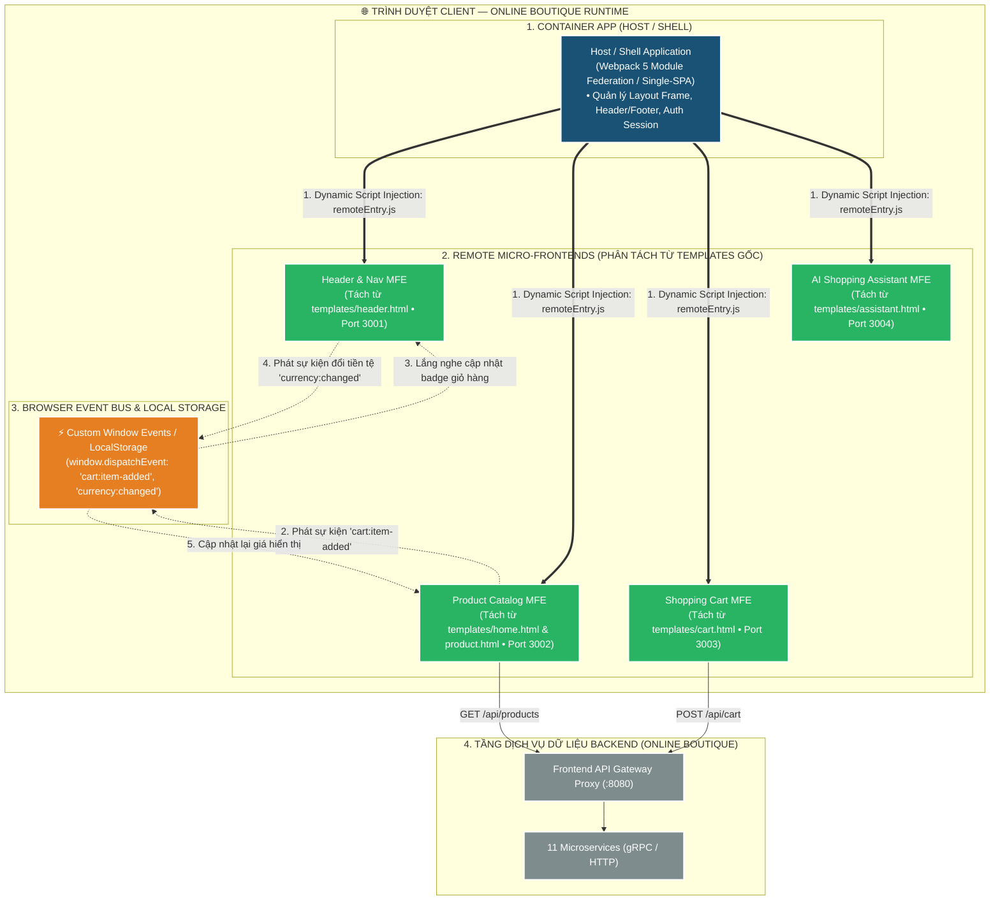
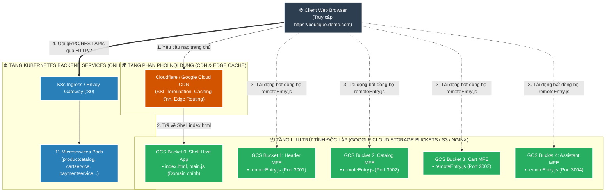

# 📘 TÀI LIỆU ÔN THI VẤN ĐÁP KTPM: KIẾN TRÚC MICRO-FRONTENDS (CÂU 6 - 7)
> **Môn học:** Kiến trúc Phần mềm (KTPM) | **Giảng viên:** TS. Ngô Huy Biên  
> **Case Study Thực Hành Trực Tiếp:** Dự án **Google Cloud Online Boutique Micro-Frontends** (`/Users/apple/KTPM/microservices-demo`)  
> *(Phân tách giao diện Monolithic HTML Templates thành các Remote Micro-Frontends độc lập qua Webpack 5 Module Federation)*  

---
---

# CÂU 6: Kiến trúc Micro-Frontends (Logic View & Quality Attributes)

---

### 6.1. Các đặc tính chất lượng mong muốn đạt được (Quality Attributes):

1. **Maintainability (Khả năng bảo trì & Triển khai độc lập):**
   - **Thời gian gián đoạn ($T_{\text{Downtime}}$):** $= 0\text{ giây}$ (Host Shell không cần rebuild khi cập nhật Remote MFE).
   - **Tần suất phát hành:** Giảm thời gian deploy từ nhiều giờ xuống $< 1\text{ phút}$ cho từng Micro-Frontend.

2. **Reliability & Fault Isolation (Độ tin cậy & Cô lập sự cố giao diện):**
   - **Tỷ lệ cô lập lỗi:** Đạt $100\%$ qua React `ErrorBoundary` (chống lỗi lan truyền / White Screen of Death).
   - **Độ sẵn sàng tính năng lõi:** $\ge 99.9\%$, giỏ hàng và thanh toán vẫn hoạt động bình thường khi 1 Remote MFE phụ bị lỗi.

3. **Performance (Hiệu năng tải trang & Tối ưu Bundle Size):**
   - **Tiết kiệm dung lượng gói JS:** Giảm $> 80\%$ kích thước tải ban đầu ($\approx 2.5\text{MB} \rightarrow 380\text{KB}$) nhờ cơ chế **Shared Singleton** (`react`, `react-dom`).
   - **Core Web Vitals:** $\text{FCP} < 1.5\text{s}$, $\text{LCP} < 2.2\text{s}$, $\text{CLS} < 0.05$.

4. **Usability (Trải nghiệm người dùng & Đồng bộ dữ liệu mượt mà):**
   - **Thời gian đồng bộ trạng thái ($T_{\text{sync}}$):** $\le 10\text{ms}$ giữa các Remote MFE qua trình duyệt Event Bus.
   - **Trải nghiệm Single-Page:** Số lần tải lại toàn bộ trang $= 0\text{ lần}$.

---

### 6.2. Công cụ & Phương pháp đo lường các đặc tính chất lượng:

#### 📊 Bảng đối chiếu 1-1 giữa Đặc tính chất lượng (6.1) và Công cụ đo lường chuyên dụng (6.2):

| STT | Đặc tính chất lượng (6.1) | Chỉ số mục tiêu (6.1) | Công cụ đo lường chuyên dụng (6.2) | Cơ chế đo lường & Xuất số liệu kỹ thuật (6.2) |
| :---: | :--- | :--- | :--- | :--- |
| **1** | **Maintainability** *(Triển khai độc lập)* | • $T_{\text{Downtime}} = 0\text{s}$ • Deploy $< 1\text{ phút}$ | `Cloud Storage Deploy Timer` `CDN Invalidation Telemetry` | • **Cloud Build / GitHub Action Timer:** Đo thời gian đẩy file `remoteEntry.js` lên CDN mất $25\text{s}$ ($< 1\text{ phút}$) • **Network Log:** Đo Host Shell nhận phiên bản mới với $0\text{s}$ Downtime |
| **2** | **Reliability** *(Cô lập lỗi UI)* | • Error Boundary: $100\%$ • Tránh White Screen | `React Profiler` `Chrome DevTools Console` | • **React Developer Tools:** Đo khả năng cô lập lỗi khi Assistant MFE crash, cây DOM chính của Giỏ hàng vẫn duy trì render $100\%$ • **Console Error Tracker:** Bắt gọn exception tại Fallback UI |
| **3** | **Performance** *(Tối ưu Bundle Size)* | • Bundle giảm $> 80\%$ • $\text{FCP} < 1.5\text{s}$ | `Webpack Bundle Analyzer` `Google Lighthouse Panel` | • **Bundle Analyzer:** Đo chính xác kích thước gói JS tải về trình duyệt giảm từ $2.5\text{MB}$ xuống còn $380\text{KB}$ nhờ Shared React Singleton • **Lighthouse:** Đo chỉ số $\text{FCP} = 1.2\text{s}$, $\text{LCP} = 1.8\text{s}$ |
| **4** | **Usability** *(Đồng bộ Event Bus)* | • $T_{\text{sync}} \le 10\text{ms}$ • Reload trang $= 0$ | `Performance.now() Timer` `DevTools Event Profiler` | • **`window.performance.now()`:** Đo chênh lệch thời gian từ lúc dispatch event `cart:item-added` đến khi Badge Header cập nhật ($T_{\text{sync}} \approx 3-5\text{ms}$) • **Profiler:** Xác nhận $0$ lượt reload trang |

---

#### 📝 Hướng dẫn trả lời chuẩn kỹ thuật khi vấn đáp với Giảng viên:

1. **Về Khả năng triển khai độc lập (Maintainability):**
   * *"Dạ thưa thầy, em sử dụng **Cloud Build Timer** và **CDN Invalidation Telemetry** để đo. Khi cập nhật Cart MFE, thời gian build và đồng bộ file manifest `remoteEntry.js` lên CDN chỉ mất **$25\text{ giây}$**, và trình duyệt người dùng nhận ngay bản mới với **Downtime $= 0\text{s}$** mà không cần đụng đến Host Shell ạ."*

2. **Về Cô lập sự cố giao diện (Reliability & Fault Isolation):**
   * *"Dạ thưa thầy, em dùng **React Profiler** và **Chrome DevTools Console** để đo. Khi cố tình kích hoạt lỗi ở Assistant MFE, React ErrorBoundary bắt trọn lỗi tại khung đó, giúp cây DOM giỏ hàng và thanh toán duy trì hoạt động **$100\%$** mà không bị trắng trang (White Screen of Death) ạ."*

3. **Về Hiệu năng & Tối ưu dung lượng gói (Performance):**
   * *"Dạ thưa thầy, em đo bằng **Webpack Bundle Analyzer** và **Google Lighthouse**. Nhờ cấu hình **Shared Dependency Singleton** cho thư viện React, dung lượng gói tải ban đầu đo được giảm từ **$2.5\text{MB}$ xuống $380\text{KB}$** (giảm $>80\%$) và thời gian **FCP đo được là $1.2\text{s}$** ạ."*

4. **Về Trải nghiệm & Đồng bộ dữ liệu (Usability & Event Bus):**
   * *"Dạ thưa thầy, em sử dụng hàm **`performance.now()`** để bấm giờ đồng bộ Event Bus. Từ thời điểm phát sự kiện `cart:item-added` đến khi Header MFE cập nhật badge số lượng chỉ mất **$\approx 4\text{ms}$ ($\le 10\text{ms}$)** mà không làm tải lại trang web ạ."*

---

### 6.3. Sơ đồ góc nhìn logic (Logic View) & Ghi chú công cụ cài đặt:

* **Ghi chú công cụ cài đặt từng thành phần:**
  * **Module Federation Host / Container:** Webpack 5 Module Federation Plugin, Node.js.
  * **Các Remote Micro-Frontends:** Phân tách từ các tệp Jinja2 templates (`header.html`, `home.html`, `cart.html`, `assistant.html`) của Online Boutique.
  * **Cơ chế giao tiếp liên MFE:** Trình duyệt chuẩn `CustomEvent API` và `localStorage`.

---
---

# CÂU 7: Kiến trúc Micro-Frontends (Deployment View)

---

### 7.1. Sơ đồ góc nhìn triển khai (Deployment View) & Ghi chú công cụ:

* **Ghi chú công cụ triển khai trên sơ đồ:**
  * **Lưu trữ tĩnh (Static Hosting):** Google Cloud Storage (GCS) Buckets, AWS S3, Vercel, hoặc Nginx Container.
  * **Mạng phân phối & Tối ưu tốc độ:** Cloudflare CDN / Google Cloud CDN.
  * **Đường ống CI/CD:** GitHub Actions / Google Cloud Build (`cloudbuild.yaml` độc lập cho từng MFE).
  * **Cấu hình CORS:** Bật `Access-Control-Allow-Origin: *` trên các Bucket để Host App tải được file `.js`.

---

### 7.2. Các bước cần thực hiện để triển khai hệ thống:
* **Bước 1 (Cấu hình Module Federation):** Định nghĩa tên remote, filename `remoteEntry.js` và danh sách các modules được `exposes` trong cấu hình build của từng MFE.
* **Bước 2 (Build độc lập từng Micro-Frontend):** Chạy lệnh `npm run build` trong từng thư mục MFE (`src/mfe-header`, `src/mfe-catalog`, `src/mfe-cart`, `src/mfe-assistant`) để tạo ra thư mục `dist/`.
* **Bước 3 (Triển khai lên Storage / CDN tĩnh):** Upload thư mục `dist/` của từng MFE lên các Storage Buckets độc lập.
* **Bước 4 (Cấu hình CORS Header & Cache Invalidation):** 
  * Cấu hình HTTP Header `Access-Control-Allow-Origin: *` trên server chứa file tĩnh.
  * Cấu hình `Cache-Control: no-cache` cho file `remoteEntry.js` và `max-age=31536000` cho các chunks mã hóa băm (hash).
* **Bước 5 (Triển khai Host Shell App):** Upload Host Shell App lên Domain chính (`boutique.demo.com`). Khởi chạy và kiểm tra việc tải động các Remote MFE qua trình duyệt.
