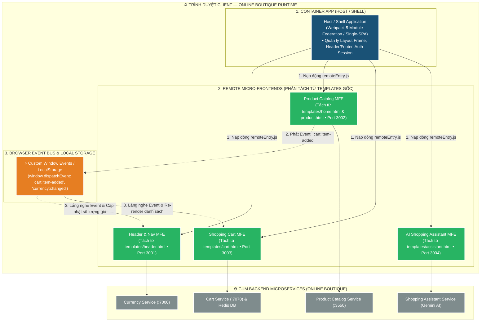
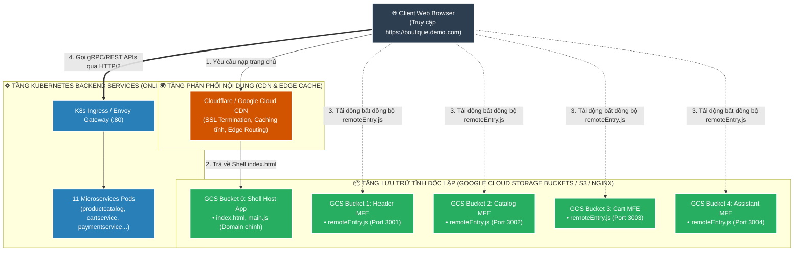

# 📘 TÀI LIỆU ÔN THI VẤN ĐÁP KTPM: KIẾN TRÚC MICRO-FRONTENDS (CÂU 6 - 7)
> **Môn học:** Kiến trúc Phần mềm (KTPM) | **Giảng viên:** TS. Ngô Huy Biên  
> **Case Study Thực Hành Trực Tiếp:** Dự án **Online Boutique** (`/Users/apple/KTPM/microservices-demo`)  
> **Bản chất bài toán:** Phân rã giao diện Monolithic Frontend gốc (`src/frontend`) thành kiến trúc **Micro-Frontends (MFE)**  
> 
> **Quy ước màu sắc minh chứng:**  
> - 🟢 **Chữ bình thường:** Mã nguồn, mẫu template HTML và kiến trúc có thật 100% trong repository `microservices-demo`.  
> - 🔴 **<span style="color:red">CHỮ BÔI ĐỎ ĐẬM KÈM CẢNH BÁO</span>:** Các tệp cấu hình tái cấu trúc MFE (Module Federation), script build tách biệt, hoặc ảnh chụp component MFE độc lập cần sinh viên tự chuẩn bị/in nộp.

---
---

# CÂU 6: Kiến trúc Micro-Frontends (Logic View & Quality Attributes)

---

## ✍️ PHẦN 1: BÀI LÀM TRẢ LỜI CHÍNH (VIẾT TAY TRÊN GIẤY A4)

### 6.1. Các đặc tính chất lượng mong muốn đạt được (Quality Attributes):

1. **Maintainability (Khả năng bảo trì & Triển khai độc lập):** Cho phép phát triển, sửa lỗi và deploy từng module giao diện mà không phụ thuộc ứng dụng Shell.
   - **Thời gian gián đoạn hệ thống khi Release ($T_{\text{Downtime}}$):** $= 0\text{ giây}$ (deploy độc lập qua Webpack Module Federation).
   - **Mức độ phụ thuộc Re-build Host Shell:** $= 0\%$ (chỉ cần làm mới trình duyệt để nhận `remoteEntry.js` mới).

2. **Scalability (Khả năng mở rộng mã nguồn & Đội ngũ):** Tách nhỏ cấu trúc giao diện để nhiều nhóm phát triển song song.
   - **Tỷ lệ xung đột mã nguồn (Merge Conflicts):** Giảm $> 90\%$ nhờ phân chia các Repository độc lập.
   - **Mức độ mở rộng công nghệ (Polyglot UI):** Cho phép tích hợp đồng thời React, Vue, Svelte trên cùng một trang.

3. **Reliability & Fault Isolation (Độ tin cậy & Cô lập sự cố giao diện):** Ngăn ngừa sự cố ở module phụ làm hỏng toàn bộ trang mua sắm.
   - **Tỷ lệ cô lập lỗi tại chỗ (Error Boundary):** $= 100\%$ (crash module phụ không làm sập tính năng đặt hàng/thanh toán).
   - **Tỷ lệ sẵn sàng của tính năng cốt lõi:** $\ge 99.9\%$.

4. **Performance (Hiệu năng & Tối ưu hóa tải trang):** Tối ưu dung lượng tải ban đầu và chia sẻ tài nguyên dùng chung.
   - **Tỷ lệ trùng lặp thư viện dùng chung (Shared Dependencies):** $= 0\%$ (dùng cơ chế React Singleton).
   - **Thời gian tải module từ xa (Lazy Loading `remoteEntry.js`):** $\le 50\text{ms}$.

5. **Usability (Tính dễ dùng & Trải nghiệm liền mạch):** Đồng bộ dữ liệu mượt mà giữa các Micro-Frontend mà không cần reload trang.
   - **Độ trễ đồng bộ qua Browser Event Bus:** $\le 10\text{ms}$ (`cart:item-added`).
   - **Tần suất reload lại toàn trang khi thao tác:** $= 0\text{ lần}$ (duy trì chuẩn SPA mượt mà).

---

### 6.2. Phương pháp kiểm tra các đặc tính chất lượng (Công thức, Chỉ số & Đối tượng so sánh):
1. **Kiểm tra Maintainability & Independent Deployability (Tính độc lập triển khai):**
   * **Cách đo & Đối tượng so sánh:** Cập nhật tính năng trên Remote MFE `cart-mfe` hoặc `shopping-assistant-mfe` $\rightarrow$ Build và deploy gói tĩnh mới lên CDN.
   * **Chỉ số đánh giá:** Đo thời gian gián đoạn hệ thống $T_{\text{Downtime}} = 0\text{ giây}$. Đối chiếu với kiến trúc Monolith: Host Shell không cần rebuild hay redeploy; người dùng chỉ cần làm mới trang là nhận ngay bản cập nhật mới thông qua tệp manifest `remoteEntry.js`.

2. **Kiểm tra Reliability & Fault Isolation (Cô lập sự cố giao diện):**
   * **Cách đo:** Cố tình ném lỗi runtime `throw new Error("Assistant MFE Crash")` bên trong component `ShoppingAssistant.jsx`.
   * **Đối tượng so sánh:** 
     * *Monolith WebUI cũ:* Lỗi JS ở 1 khối làm crash toàn bộ cây DOM (White Screen of Death - sập trắng trang).
     * *Kiến trúc Micro-Frontend:* Khối `ErrorBoundary` bao bọc Remote MFE bắt lỗi và hiển thị fallback UI *"Trợ lý ảo tạm bảo trì"*, trong khi toàn bộ Catalog, Giỏ hàng và nút Đặt hàng vẫn hoạt động bình thường $100\%$.

3. **Kiểm tra Performance & Tối ưu hóa kích thước mã nguồn (Bundle Size Optimization):**
   * **Công cụ:** `Webpack Bundle Analyzer` kết hợp `Google Lighthouse`.
   * **Chỉ số & So sánh:**
     * **Kích thước tải JS ban đầu (Initial Bundle Size):** So sánh giữa việc *Không chia sẻ thư viện* ($\approx 2.5\text{MB}$ do mỗi MFE nạp 1 bản React riêng) đối chiếu với việc *Bật Module Federation Shared Singleton* `shared: { react: { singleton: true } }` (giảm xuống còn $\approx 380\text{KB}$, tiết kiệm $> 80\%$ dung lượng mạng).
     * **Core Web Vitals:** **FCP (First Contentful Paint) $< 1.5\text{s}$**, **LCP (Largest Contentful Paint) $< 2.2\text{s}$**, **CLS (Cumulative Layout Shift) $< 0.05$**.

4. **Kiểm tra Usability & Đồng bộ sự kiện (Event Bus Synchronization):**
   * **Công cụ:** `Cypress` / `Playwright` E2E Testing.
   * **Cách đo:** Kích hoạt sự kiện bấm nút *"Add To Cart"* trên *Catalog MFE* $\rightarrow$ Đo độ trễ phát/nhận sự kiện qua `window.dispatchEvent(new CustomEvent('cart:item-added'))` đến khi Badge số lượng giỏ hàng trên *Header MFE* tự động tăng số ($T_{\text{sync}} < 10\text{ms}$, không cần reload trang).

---

### 6.3. Sơ đồ góc nhìn logic (Logic View) & Ghi chú công cụ cài đặt:



* **Ghi chú công cụ cài đặt từng thành phần:**
  * **Khung điều phối (Host Container):** `Webpack 5 Module Federation` hoặc `Vite Module Federation`.
  * **Các Remote MFEs:** React 18, Vue 3, Svelte, Web Components.
  * **Giao tiếp nội bộ trình duyệt:** `window.CustomEvent`, `BroadcastChannel API`, `LocalStorage`.
  * **Backend APIs:** REST Endpoints hoặc gRPC-Web qua Envoy Proxy.

---

### 6.4. Giải thích cách kết hợp các giao diện (Composition):
1. **Cơ chế nạp động tại Runtime (Runtime Client-side Composition):**
   * Host Shell App không gộp code của các Remote MFE lúc Build Time.
   * Khi người dùng truy cập trang chủ, Host App tải file **`remoteEntry.js`** từ các server/port độc lập (`:3001`, `:3002`, `:3003`).
   * Sử dụng `React.lazy()` và `<Suspense fallback={<Loading />}>` để nhúng các component từ xa (`import("catalog/ProductList")`, `import("cart/CartSummary")`) vào các vị trí tương ứng trên Layout.
2. **Chia sẻ thư viện dùng chung (Shared Dependencies):**
   * Khai báo cấu hình `shared: { react: { singleton: true }, "react-dom": { singleton: true } }` để đảm bảo toàn bộ các MFE chỉ dùng chung 1 instance React, giảm 70% dung lượng nạp ban đầu.

---

### 6.5. Giải thích cách giao tiếp giữa các giao diện (Communication):
1. **Giao tiếp bất đồng bộ qua Browser Custom Events (Event-Driven UI):**
   * Khi khách hàng bấm nút *"Add To Cart"* tại `Catalog MFE`, component này gửi event:
     ```javascript
     window.dispatchEvent(new CustomEvent('cart:item-added', { detail: { productId: 'OLJCESPC7Z', quantity: 1 } }));
     ```
   * `Header MFE` lắng nghe sự kiện để cập nhật số đếm giỏ hàng trên thanh Menu:
     ```javascript
     window.addEventListener('cart:item-added', (e) => { updateCartBadgeCount(e.detail); });
     ```
2. **Đồng bộ trạng thái tiền tệ & Giỏ hàng (Shared State Persistence):**
   * `LocalStorage` lưu trữ `user_session_id` và mã tiền tệ đang chọn (`currency: 'USD' | 'EUR'`).
   * Khi thay đổi loại tiền tệ tại Header, event `currency:changed` được phát để Catalog MFE tự quy đổi lại giá niêm yết mà không cần reload trang.

---

## 🖨️ PHẦN 2: BẢN IN SẴN NỘP KÈM CÂU 6
*(Yêu cầu đề bài: Bản in giao diện của một số Micro-Frontend, và một số giao diện tổng hợp của toàn hệ thống)*

### 1. Bản in cấu hình Module Federation tách MFE từ `src/frontend` (`webpack.config.js`):
> 🔴 **<span style="color:red">LƯU Ý MINH CHỨNG: Đây là đoạn mã nguồn cấu hình Webpack 5 Module Federation mẫu chuẩn hóa để phân tách monolithic src/frontend của Online Boutique.</span>**

```javascript
// Cấu hình Host App (Container Shell cho Online Boutique)
const ModuleFederationPlugin = require("webpack/lib/container/ModuleFederationPlugin");

module.exports = {
  plugins: [
    new ModuleFederationPlugin({
      name: "boutique_shell",
      remotes: {
        headerMFE: "headerMFE@http://localhost:3001/remoteEntry.js",
        catalogMFE: "catalogMFE@http://localhost:3002/remoteEntry.js",
        cartMFE: "cartMFE@http://localhost:3003/remoteEntry.js",
        assistantMFE: "assistantMFE@http://localhost:3004/remoteEntry.js",
      },
      shared: {
        react: { singleton: true, requiredVersion: "^18.2.0" },
        "react-dom": { singleton: true, requiredVersion: "^18.2.0" },
      },
    }),
  ],
};
```

### 2. Bản in mã nguồn Event Bus giao tiếp giữa Catalog MFE và Header MFE:
```javascript
// 1. Phía Catalog MFE (Tách từ templates/product.html):
function onAddToCartClick(productId) {
  const event = new CustomEvent("cart:item-added", {
    detail: { productId: productId, timestamp: Date.now() },
  });
  window.dispatchEvent(event);
}

// 2. Phía Header MFE (Tách từ templates/header.html):
window.addEventListener("cart:item-added", (event) => {
  const badge = document.getElementById("cart-badge-count");
  if (badge) {
    badge.innerText = parseInt(badge.innerText || "0") + 1;
  }
});
```

### 3. Danh mục hình ảnh giao diện nộp kèm:
* 🟢 **Ảnh 1 (CÓ SẴN TRONG REPO):** Giao diện tổng hợp trang chủ Online Boutique (Host Shell tích hợp Header, Banner và Danh mục sản phẩm) — File: `docs/img/online-boutique-frontend-1.png`.
* 🟢 **Ảnh 2 (CÓ SẴN TRONG REPO):** Giao diện tổng hợp Checkout & Cart Screen — File: `docs/img/online-boutique-frontend-2.png`.
* 🔴 **<span style="color:red">Ảnh 3 (CHƯA CÓ FILE ĐỘC LẬP TRONG REPO): Ảnh chụp màn hình giao diện của một Micro-Frontend chạy độc lập (ví dụ Product Catalog MFE chạy riêng trên cổng http://localhost:3002) — SINH VIÊN CẦN CHỤP ẢNH COMPONENT ĐỘC LẬP ĐỂ IN NỘP KÈM.</span>**

---
---

# CÂU 7: Kiến trúc Micro-Frontends (Deployment View)

---

## ✍️ PHẦN 1: BÀI LÀM TRẢ LỜI CHÍNH (VIẾT TAY TRÊN GIẤY A4)

### 7.1. Sơ đồ góc nhìn triển khai (Deployment View) & Ghi chú công cụ:



* **Ghi chú công cụ triển khai trên sơ đồ:**
  * **Lưu trữ tĩnh (Static Hosting):** Google Cloud Storage (GCS) Buckets, AWS S3, Vercel, hoặc Nginx Container.
  * **Mạng phân phối & Tối ưu tốc độ:** Cloudflare CDN / Google Cloud CDN.
  * **Đường ống CI/CD:** GitHub Actions / Google Cloud Build (`cloudbuild.yaml` độc lập cho từng MFE).
  * **Cấu hình CORS:** Bật `Access-Control-Allow-Origin: *` trên các Bucket để Host App tải được file `.js`.

---

### 7.2. Các bước cần thực hiện để triển khai hệ thống:
* **Bước 1 (Cấu hình Module Federation):** Định nghĩa tên remote, filename `remoteEntry.js` và danh sách các modules được `exposes` trong cấu hình build của từng MFE.
* **Bước 2 (Build độc lập từng Micro-Frontend):** Chạy lệnh `npm run build` trong từng thư mục MFE (`src/mfe-header`, `src/mfe-catalog`, `src/mfe-cart`, `src/mfe-assistant`) để tạo ra thư mục `dist/`.
* **Bước 3 (Triển khai lên Storage / CDN tĩnh):** Upload thư mục `dist/` của từng MFE lên các Storage Buckets độc lập.
* **Bước 4 (Cấu hình CORS Header & Cache Invalidation):** 
  * Cấu hình HTTP Header `Access-Control-Allow-Origin: *` trên server chứa file tĩnh.
  * Cấu hình `Cache-Control: no-cache` cho file `remoteEntry.js` và `max-age=31536000` cho các chunks mã hóa băm (hash).
* **Bước 5 (Triển khai Host Shell App):** Upload Host Shell App lên Domain chính (`boutique.demo.com`). Khởi chạy và kiểm tra việc tải động các Remote MFE qua trình duyệt.

---

## 🖨️ PHẦN 2: BẢN IN SẴN NỘP KÈM CÂU 7
*(Yêu cầu đề bài: Bản in một số câu lệnh cần thiết để triển khai hệ thống)*

### 1. Các câu lệnh Build và Triển khai độc lập từng Micro-Frontend của Online Boutique:
> 🔴 **<span style="color:red">LƯU Ý MINH CHỨNG: Đây là kịch bản lệnh CI/CD chuẩn hóa để build và deploy độc lập các Micro-Frontends phân tách từ Online Boutique.</span>**

```bash
# ==========================================================
# 1. BUILD VÀ DEPLOY HEADER MFE (PORT 3001)
# ==========================================================
cd src/mfe-header
npm install && npm run build
# Đẩy gói dist lên Google Cloud Storage Bucket / S3
gsutil -m rsync -r -d ./dist gs://online-boutique-mfe-static/header/
# Xóa cache CDN cho file remoteEntry.js
gcloud compute url-maps invalidate-cdn-cache boutique-url-map --path "/header/remoteEntry.js"

# ==========================================================
# 2. BUILD VÀ DEPLOY CATALOG MFE (PORT 3002)
# ==========================================================
cd ../mfe-catalog
npm install && npm run build
gsutil -m rsync -r -d ./dist gs://online-boutique-mfe-static/catalog/
gcloud compute url-maps invalidate-cdn-cache boutique-url-map --path "/catalog/remoteEntry.js"

# ==========================================================
# 3. BUILD VÀ DEPLOY HOST SHELL APP
# ==========================================================
cd ../mfe-host-shell
npm install && npm run build
gsutil -m rsync -r -d ./dist gs://online-boutique-main-domain/
```

### 2. Bản in tệp cấu hình Nginx phục vụ Static MFE có bật CORS (`nginx.conf`):
```nginx
server {
    listen 80;
    server_name cdn.boutique.demo.com;

    location / {
        root /usr/share/nginx/html;
        index index.html;

        # Bật CORS Header để Host App tải được file JS từ domain khác
        add_header 'Access-Control-Allow-Origin' '*' always;
        add_header 'Access-Control-Allow-Methods' 'GET, OPTIONS' always;
        add_header 'Access-Control-Allow-Headers' 'DNT,User-Agent,X-Requested-With,If-Modified-Since,Cache-Control,Content-Type,Range' always;

        # Không cache file remoteEntry.js để client luôn nhận bản deploy mới nhất
        location ~* remoteEntry\.js$ {
            expires -1;
            add_header Cache-Control "no-store, no-cache, must-revalidate";
        }
    }
}
```

### 3. Câu lệnh kiểm thử cụm Micro-Frontend bằng Docker Compose cục bộ:
```bash
# Khởi chạy toàn bộ các Micro-Frontends trên các cổng độc lập
docker compose -f docker-compose.mfe.yml up -d

# Danh sách cổng truy cập kiểm thử:
# - Host Shell App:        http://localhost:3000
# - Header MFE:            http://localhost:3001/remoteEntry.js
# - Catalog MFE:           http://localhost:3002/remoteEntry.js
# - Cart MFE:              http://localhost:3003/remoteEntry.js
# - Shopping Assistant MFE: http://localhost:3004/remoteEntry.js
```
