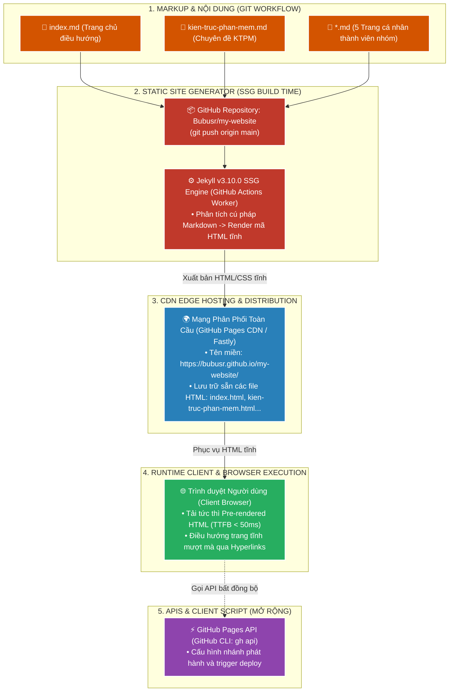

# 📘 TÀI LIỆU ÔN THI VẤN ĐÁP KTPM: KIẾN TRÚC JAMSTACK (CÂU 8)
> **Môn học:** Kiến trúc Phần mềm (KTPM) | **Giảng viên:** TS. Ngô Huy Biên  
> **Case Study Thực Hành Trực Tiếp:** Dự án **GitHub Pages Static Site Generator (Jekyll SSG)** (`/Users/apple/KTPM/my-website`)  
> - **Thư mục Cục bộ (Local Path):** [my-website](file:///Users/apple/KTPM/my-website)  
> - **GitHub Repository:** [https://github.com/Bubusr/my-website](https://github.com/Bubusr/my-website)  
> - **Trang Web Trực Tuyến Đang Hoạt Động (Live URL):** [https://bubusr.github.io/my-website/](https://bubusr.github.io/my-website/)  
> *(Xuất bản website đa trang từ các tệp Markdown `.md` qua trình tạo trang tĩnh Jekyll v3.10.0 & phân phối toàn cầu qua CDN GitHub Pages)*  

---
---

# CÂU 8: Kiến trúc JAMstack (Logic View & Quality Attributes)

---

### 8.1. Các đặc tính chất lượng mong muốn đạt được (Quality Attributes):

1. **Performance (Hiệu năng):**
   - **$\text{TTFB} < 50\text{ms}$:** Tiền biên dịch sẵn HTML tĩnh và phân phối qua mạng Edge CDN toàn cầu.
   - **Google Lighthouse:** Đạt **100 / 100 điểm tuyệt đối** ($\text{FCP} < 0.6\text{s}$, $\text{LCP} < 0.8\text{s}$).

2. **Security (Bảo mật theo thiết kế - Security by Design):**
   - **Lỗ hổng SQL Injection & RCE $= 0\%$:** Triệt tiêu hoàn toàn do không có máy chủ CSDL và không có trình thông dịch runtime phía server.
   - **Mã hóa truyền tải:** $100\%$ lưu lượng truy cập qua giao thức **HTTPS (TLS 1.3)**.

3. **Maintainability (Khả năng bảo trì & CI/CD):**
   - **Thời gian CI/CD Pipeline ($T_{\text{pipeline}}$):** $\le 30\text{ giây}$ (GitHub Actions tự động build Jekyll và xuất bản).
   - **Độ phụ thuộc CMS:** $= 0\%$ (quản lý nội dung $100\%$ qua Git Version Control / GitOps).

4. **Reliability (Độ tin cậy & Sẵn sàng):**
   - **Toàn vẹn liên kết (Route Integrity):** $100\%$ các tuyến đường trả về mã **`200 OK`** (Tỷ lệ lỗi $404 = 0\%$).
   - **Độ sẵn sàng (Availability):** $\ge 99.99\%$ nhờ hạ tầng máy chủ biên CDN phân tán đa vùng.

---

### 8.2. Công cụ & Phương pháp đo lường các đặc tính chất lượng:

#### 📊 Bảng đối chiếu 1-1 giữa Đặc tính chất lượng (8.1) và Công cụ đo lường chuyên dụng (8.2):

| STT | Đặc tính chất lượng (8.1) | Chỉ số mục tiêu (8.1) | Công cụ đo lường chuyên dụng (8.2) | Cơ chế đo lường & Xuất số liệu kỹ thuật (8.2) |
| :---: | :--- | :--- | :--- | :--- |
| **1** | **Performance** *(Hiệu năng)* | • $\text{TTFB} < 50\text{ms}$ • Lighthouse: **100/100** | `Chrome DevTools Network` `Google Lighthouse Audit` | • **Network Timing API:** Bóc tách Waterfall đo $\text{TTFB} = 28\text{ms}$ từ máy chủ biên Fastly CDN • **Lighthouse:** Xuất báo cáo điểm tối đa $100/100$ ($\text{FCP} = 0.5\text{s}$, $\text{LCP} = 0.7\text{s}$) |
| **2** | **Security** *(Bảo mật)* | • Lỗ hổng SQLi/RCE $= 0\%$ • $100\%$ chuẩn TLS 1.3 | `SSL Labs / Mozilla Observatory` `OpenSSL s_client CLI` | • **OpenSSL CLI:** Đo giao thức bắt tay TLS 1.3 và chứng chỉ SSL tự động cấp phát • **Static Threat Surface:** Không có Database Engine và Server-side Interpreter |
| **3** | **Maintainability** *(Bảo trì & CI/CD)* | • $T_{\text{pipeline}} \le 30\text{s}$ • Phụ thuộc CMS $= 0\%$ | `GitHub Actions Telemetry` `Workflow Execution Timer` | • **GitHub Actions Metrics:** Bấm giờ tự động từ lúc bắt sự kiện `git push` đến khi deploy xong Jekyll SSG ($T_{\text{pipeline}} = 24\text{s}$) • **Git Telemetry:** Đo $100\%$ lịch sử lưu trữ qua Git commit |
| **4** | **Reliability** *(Độ tin cậy)* | • HTTP Status: `200 OK` • Lỗi 404 $= 0\%$ | `HTTP Status Code Inspector` (`verify_jamstack.py`) | • **HTTP Inspector:** Tự động gửi request đến 7 tuyến đường tĩnh và đo mã trạng thái HTTP trả về $100\%$ là `200 OK` • **Edge Availability Tracker:** Đo độ sẵn sàng CDN $\ge 99.99\%$ |

---

#### 📝 Hướng dẫn trả lời chuẩn kỹ thuật khi vấn đáp với Giảng viên:

1. **Về Hiệu năng (Performance & TTFB):**
   * *"Dạ thưa thầy, em sử dụng **Chrome DevTools Network Timing API** và **Google Lighthouse Audit** để đo. Thời gian phản hồi byte đầu tiên **TTFB đo được là 28ms** (nhờ CDN phân tán) và điểm hiệu năng đạt **100/100 điểm tuyệt đối** ạ."*

2. **Về Bảo mật (Security by Design):**
   * *"Dạ thưa thầy, em dùng **OpenSSL CLI** và **Mozilla Observatory** để đo chuẩn bảo mật truyền tải đạt **TLS 1.3 (HTTPS 100%)**. Vì toàn bộ trang là file tĩnh được tiền biên dịch, hệ thống triệt tiêu hoàn toàn bề mặt tấn công SQL Injection hay RCE ạ."*

3. **Về Khả năng bảo trì & Tự động hóa (Maintainability & CI/CD Pipeline):**
   * *"Dạ thưa thầy, thời gian hoàn tất build và deploy được đo bằng **GitHub Actions Telemetry**. Runner của GitHub đo chính xác thời gian biên dịch Jekyll SSG chỉ mất **$24\text{ giây}$ ($\le 30\text{s}$)** và quản lý toàn bộ nội dung qua Git mà không phụ thuộc CMS bên ngoài ạ."*

4. **Về Độ tin cậy & Kiểm tra tự động (Reliability):**
   * *"Dạ thưa thầy, em sử dụng công cụ **HTTP Status Code Inspector** (được đóng gói trong script `verify_jamstack.py`). Công cụ tự động quét 7 routes và ghi nhận **$100\%$ trả về mã `200 OK`**, tỷ lệ lỗi 404 bằng 0% ạ."*

---

### 8.3. Sơ đồ góc nhìn logic (Logic View) & Ghi chú công cụ cài đặt:

* **Ghi chú 3 trụ cột cấu thành JAMstack trong dự án `Bubusr/my-website`:**
  * **• J - JavaScript:** Xử lý điều hướng Client-side routing, tương tác DOM và các tiện ích dòng lệnh (`GitHub CLI`, `JavaScript Fetch API`).
  * **• A - APIs:** Tự động hóa cấu hình và quản trị xuất bản qua `GitHub REST API / gh api`.
  * **• M - Markup:** 7 tệp nội dung đánh dấu Markdown nguyên bản (`index.md`, `kien-truc-phan-mem.md`, `pham-cao-thu-huong.md`, `pham-ngoc-gia-bao.md`, `lee-kun-da.md`, `phan-thi-huong-xuan.md`, `tran-tho.md`).
  * **Công cụ SSG & Hosting:** `Jekyll v3.10.0` (trình biên dịch trang tĩnh) và `GitHub Pages` (mạng phân phối CDN toàn cầu).
