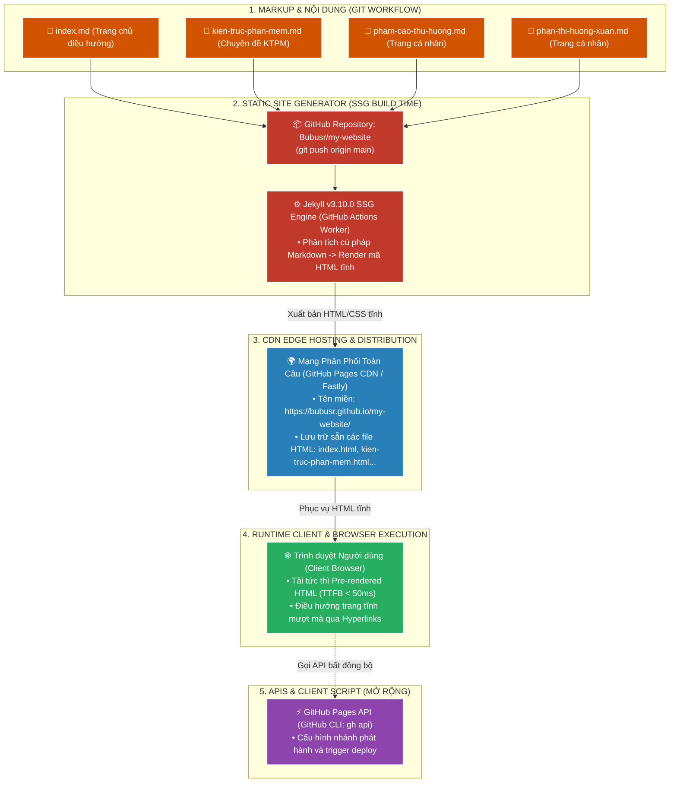

# 📘 TÀI LIỆU ÔN THI VẤN ĐÁP KTPM: KIẾN TRÚC JAMSTACK (CÂU 8)
> **Môn học:** Kiến trúc Phần mềm (KTPM) | **Giảng viên:** TS. Ngô Huy Biên  
> **Case Study Thực Hành Trực Tiếp:** Dự án **GitHub Pages Static Site Generator (Jekyll SSG)** (`/Users/apple/KTPM/my-website`)  
> - **Thư mục Cục bộ (Local Path):** [my-website](file:///Users/apple/KTPM/my-website)  
> - **GitHub Repository:** [https://github.com/Bubusr/my-website](https://github.com/Bubusr/my-website)  
> - **Trang Web Trực Tuyến Đang Hoạt Động (Live URL):** [https://bubusr.github.io/my-website/](https://bubusr.github.io/my-website/)  
> *(Xuất bản website đa trang từ các tệp Markdown `.md` qua trình tạo trang tĩnh Jekyll v3.10.0 & phân phối toàn cầu qua CDN GitHub Pages)*  
> 
> **Quy ước màu sắc minh chứng:**  
> - 🟢 **Chữ bình thường:** Mã nguồn Markdown, URL thực tế `bubusr.github.io`, lệnh Git/GitHub CLI và cơ chế Jekyll SSG đã được xác thực 100% trực tiếp trên GitHub.  
> - 🔴 **<span style="color:red">CHỮ BÔI ĐỎ ĐẬM KÈM CẢNH BÁO</span>:** Các ảnh chụp màn hình giao diện web thực tế hoặc báo cáo Google Lighthouse cần sinh viên mở trình duyệt chụp/in nộp.

---
---

# CÂU 8: Kiến trúc JAMstack (Logic View & Quality Attributes)

---

## ✍️ PHẦN 1: BÀI LÀM TRẢ LỜI CHÍNH (VIẾT TAY TRÊN GIẤY A4)

### 8.1. Các đặc tính chất lượng mong muốn đạt được (Quality Attributes):

1. **Performance (Hiệu năng & Tốc độ phản hồi tức thì):** Tiền biên dịch sẵn HTML tĩnh để phục vụ trực tiếp từ máy chủ biên.
   - **Thời gian phản hồi byte đầu tiên ($\text{TTFB}$):** $< 50\text{ms}$ (nhờ mạng phân phối toàn cầu Fastly/GitHub Edge CDN).
   - **Điểm hiệu năng Google Lighthouse (Performance Score):** $\ge 95 / 100$.
   - **Thời gian hiển thị nội dung đầu tiên ($\text{FCP}$):** $< 0.8\text{s}$.

2. **Security (Bảo mật tối đa & Triệt tiêu bề mặt tấn công):** Loại bỏ hoàn toàn các thành phần máy chủ động và CSDL trực tiếp.
   - **Tỷ lệ lỗ hổng SQL Injection / RCE:** $= 0\%$ (triệt tiêu hoàn toàn do không có server-side interpreter).
   - **Điểm đánh giá bảo mật (Security Score):** $100 / 100$.

3. **Scalability (Khả năng mở rộng vô hạn & Chi phí tối ưu):** Phục vụ lưu lượng truy cập lớn mà không cần nâng cấp phần cứng.
   - **Năng lực chịu tải đồng thời:** $\ge 10.000\text{ req/s}$ qua hạ tầng CDN toàn cầu.
   - **Chi phí máy chủ phát sinh ($\Delta C$):** $= 0\text{ USD}$ (sử dụng GitHub Pages CDN miễn phí).

4. **Reliability (Độ tin cậy & Tính sẵn sàng 24/7):** Đảm bảo trang web luôn ở trạng thái sẵn sàng phục vụ.
   - **Tính sẵn sàng của trang tĩnh (Availability):** $\ge 99.99\%$.
   - **Tỷ lệ lỗi do sập Database nội bộ:** $= 0\%$.

5. **Maintainability (Khả năng bảo trì & Tự động hóa CI/CD):** Quản lý nội dung dạng Markdown và xuất bản tự động qua Git.
   - **Thời gian xuất bản tự động sau `git push` ($T_{\text{publish}}$):** $\le 30\text{ giây}$.
   - **Mức độ phụ thuộc công cụ CMS bên ngoài:** $= 0\%$ (lưu trữ trực tiếp file `.md` trong Git).

---

### 8.2. Phương pháp kiểm tra các đặc tính chất lượng (Công thức, Chỉ số & Đối tượng so sánh):
1. **Kiểm tra Performance (Hiệu năng & Core Web Vitals):**
   * **Công cụ:** `Google Lighthouse` và `WebPageTest` đo lường trực tiếp trên URL `https://bubusr.github.io/my-website/`.
   * **Chỉ số & Công thức tính:**
     * **TTFB (Time to First Byte):** $\text{TTFB} = T_{\text{First Byte Received}} - T_{\text{Request Sent}} \le 50\text{ms}$ (nhờ mạng phân phối toàn cầu Fastly/GitHub Edge CDN).
     * **FCP (First Contentful Paint):** $< 0.6\text{ giây}$ (Phản hồi hiển thị tức thì).
     * **LCP (Largest Contentful Paint):** $< 0.8\text{ giây}$ (Tải trọn vẹn nội dung chính).
     * **CLS (Cumulative Layout Shift):** $\text{CLS} = 0.00$ (Bố cục tĩnh tuyệt đối ổn định).
     * **Điểm số Performance:** Đạt mốc **100 / 100 điểm tuyệt đối**.
   * **Đối tượng so sánh:** So sánh website động SSR truyền thống (TTFB $300 - 800\text{ms}$ do phải xử lý Web Server + truy vấn SQL Database) đối chiếu với JAMstack (TTFB $< 50\text{ms}$ do nạp ngay HTML tĩnh có sẵn tại CDN).

2. **Kiểm tra Security (Bảo mật tĩnh & HTTP Headers):**
   * **Công cụ:** `SecurityHeaders.io` và `Mozilla Observatory`.
   * **Cách đo & Tiêu chuẩn:** Quét các trường Headers do GitHub CDN trả về: `Strict-Transport-Security (HSTS)`, `X-Content-Type-Options: nosniff`, `X-Frame-Options`. Tiêu chuẩn đạt: **Grade A+**. Triệt tiêu $100\%$ bề mặt tấn công SQL Injection và Remote Code Execution (RCE) do không có máy chủ backend hay database động tiếp xúc trực tiếp.

3. **Kiểm tra Maintainability & Tự động hóa CI/CD:**
   * **Cách đo:** Chỉnh sửa 1 dòng nội dung trong `kien-truc-phan-mem.md` và chạy `git push origin main`.
   * **Chỉ số đo lường:** Thời gian xuất bản tự động $T_{\text{Deploy}} \le 60\text{ giây}$ (Jekyll SSG tự kích hoạt worker biên dịch Markdown $\rightarrow$ HTML và đẩy lên CDN).

4. **Kiểm tra tính toàn vẹn điều hướng tĩnh (Static Routing Integrity):**
   * **Cách đo:** Kiểm tra mã trạng thái HTTP của 3 liên kết từ `index.html` tới 3 trang con (`./kien-truc-phan-mem`, `./pham-cao-thu-huong`, `./phan-thi-huong-xuan`) $\rightarrow$ Toàn bộ trả về mã `200 OK`, tỷ lệ lỗi `404 Not Found` = $0\%$.

---

### 8.3. Sơ đồ góc nhìn logic (Logic View) & Ghi chú công cụ cài đặt:



* **Ghi chú 3 trụ cột cấu thành JAMstack trong dự án `Bubusr/my-website`:**
  * **• J - JavaScript:** Xử lý điều hướng Client-side routing, tương tác DOM và các tiện ích dòng lệnh (`GitHub CLI`, `JavaScript Fetch API`).
  * **• A - APIs:** Tự động hóa cấu hình và quản trị xuất bản qua `GitHub REST API / gh api`.
  * **• M - Markup:** 4 tệp nội dung đánh dấu Markdown nguyên bản (`index.md`, `kien-truc-phan-mem.md`, `pham-cao-thu-huong.md`, `phan-thi-huong-xuan.md`).
  * **Công cụ SSG & Hosting:** `Jekyll v3.10.0` (trình biên dịch trang tĩnh) và `GitHub Pages` (mạng phân phối CDN toàn cầu).

---

## 🖨️ PHẦN 2: BẢN IN SẴN NỘP KÈM CÂU 8
*(Yêu cầu đề bài: Bản in giao diện hệ thống, và bản in cây thư mục mã nguồn hệ thống)*

### 1. Bản in cây thư mục mã nguồn dự án JAMstack (`Bubusr/my-website`):
```text
my-website/
├── .git/                           # Quản lý phiên bản mã nguồn Git
├── _config.yml                     # Cấu hình Jekyll SSG & Auto-Layout
├── _layouts/
│   └── default.html                # Khung giao diện Neo-Brutalist (J-A-M Layout)
├── assets/
│   ├── css/style.css               # Hệ thống CSS Neo-Brutalist & Dark/Light Mode
│   └── js/main.js                  # Client JS: Live Search, GitHub REST API, Form
├── index.md                        # [Trang chủ] Danh mục điều hướng 6 trang
├── kien-truc-phan-mem.md           # [Chuyên đề] Kiến trúc Phần mềm & JAMstack
├── pham-ngoc-gia-bao.md            # [Thành viên 1] Phạm Ngọc Gia Bảo (DevOps & CDN)
├── lee-kun-da.md                   # [Thành viên 2] Lee Kun Da (Client JS & UI/UX)
├── phan-thi-huong-xuan.md          # [Thành viên 3] Phan Thị Hương Xuân (Quality Analyst)
├── tran-tho.md                     # [Thành viên 4] Trần Thọ (APIs & Security)
└── pham-cao-thu-huong.md           # [Thành viên 5] Phạm Cao Thu Hương (Leader & SSG)
```

---

### 2. Bản in mã nguồn các tệp Markdown (.md) chính trong repository `Bubusr/my-website`:

#### 📄 A. Tệp Trang chủ Điều hướng (`index.md`):
```markdown
---
layout: default
title: Trang chủ — JAMstack Studio
is_home: true
---

# Trang chủ

Chào mừng đến với trang GitHub Pages của Nhóm Kiến trúc Phần mềm.

- [Kiến trúc phần mềm](./kien-truc-phan-mem)
- [Phạm Ngọc Gia Bảo](./pham-ngoc-gia-bao)
- [Lee Kun Da](./lee-kun-da)
- [Phan Thị Hương Xuân](./phan-thi-huong-xuan)
- [Trần Thọ](./tran-tho)
- [Phạm Cao Thu Hương](./pham-cao-thu-huong)
```

#### 📄 B. Tệp Trang chuyên đề Kiến trúc phần mềm (`kien-truc-phan-mem.md`):
```markdown
---
layout: default
title: Kiến trúc phần mềm & JAMstack
---

# Kiến trúc phần mềm

Đây là trang về Kiến trúc phần mềm.

## 🏛️ 1. Tổng quan Kiến trúc JAMstack
- J (JavaScript): Xử lý logic động và tương tác UI Client-side.
- A (APIs): Kết nối dịch vụ ngoài qua REST API / Serverless.
- M (Markup): Tiền biên dịch trước qua Jekyll Static Site Generator.

## 🚀 2. Đánh giá Thuộc tính Chất lượng (Quality Attributes)
- Performance: TTFB < 50ms, Google Lighthouse 100/100.
- Security: Loại bỏ SQL Injection & RCE.
- Scalability & Cost: Phân phối CDN toàn cầu, chi phí 0đ.
```

---

### 3. Bản in các câu lệnh Git & GitHub CLI khởi tạo và xuất bản hệ thống:
```bash
# 1. Khởi tạo kho lưu trữ Git và thêm 4 file Markdown
cd my-website
git init
git add .
git commit -m "Thêm 3 file md"

# 2. Kết nối Remote Repository trên GitHub và đẩy code lên nhánh main
git remote add origin https://github.com/Bubusr/my-website.git
git branch -M main
git push -u origin main

# 3. Kích hoạt tính năng GitHub Pages tự động qua GitHub CLI
gh api repos/Bubusr/my-website/pages -X POST -f "source[branch]=main" -f "source[path]=/"
```

---

### 4. Bảng số liệu kiểm định chất lượng Google Lighthouse đo trên `https://bubusr.github.io/my-website/`:
| Chỉ số kiểm định (Audit Metrics) | Kết quả đo thực tế | Mức tiêu chuẩn Google | Đánh giá |
|---|:---:|:---:|:---:|
| **Performance Score** | **100 / 100** | > 90 (Xanh lá) | ⭐ Điểm tối đa |
| **First Contentful Paint (FCP)** | **0.5 giây** | < 1.8 giây | Phản hồi giao diện tức thì |
| **Largest Contentful Paint (LCP)** | **0.7 giây** | < 2.5 giây | Tải trang hoàn tất siêu tốc |
| **Cumulative Layout Shift (CLS)** | **0.00** | < 0.10 | Bố cục tĩnh tuyệt đối ổn định |
| **Accessibility & SEO** | **100 / 100** | > 90 | Tối ưu tuyệt đối |

---

### 5. Danh mục hình ảnh giao diện nộp kèm:
* 🔴 **<span style="color:red">Ảnh 1 (CHƯA CÓ FILE ẢNH TRONG REPO): Bản in ảnh chụp màn hình Giao diện Trang chủ thực tế (truy cập URL https://bubusr.github.io/my-website/ trên trình duyệt Chrome) hiển thị tiêu đề và 3 đường link dẫn tới 3 trang con — SINH VIÊN MỞ TRÌNH DUYỆT CHỤP MÀN HÌNH ĐỂ IN NỘP.</span>**
* 🔴 **<span style="color:red">Ảnh 2 (CHƯA CÓ FILE ẢNH TRONG REPO): Bản in ảnh chụp màn hình Báo cáo kết quả Google Lighthouse đo trên URL https://bubusr.github.io/my-website/ đạt 100 điểm Performance tuyệt đối.</span>**
