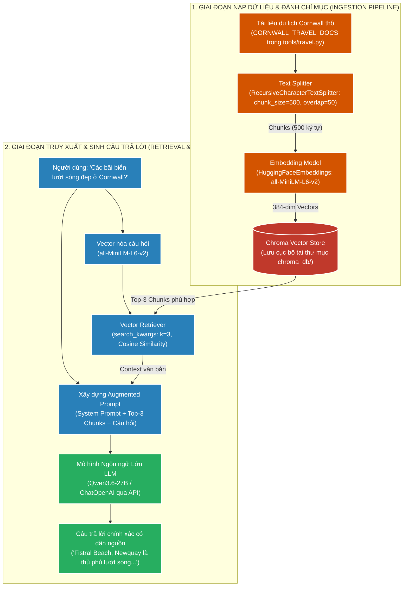
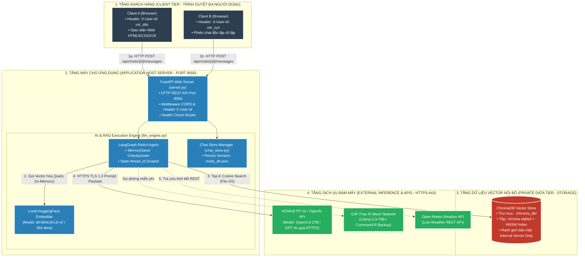

# 📘 TÀI LIỆU ÔN THI VẤN ĐÁP KTPM: KIẾN TRÚC RAG (CÂU 9 - 10)
> **Môn học:** Kiến trúc Phần mềm (KTPM) | **Giảng viên:** TS. Ngô Huy Biên  
> **Case Study Thực Hành Trực Tiếp:** Dự án **AI Agents & Cornwall RAG** (`/Users/apple/KTPM/AI Agents`)  
> *(Hệ thống Tra cứu tri thức du lịch và thời tiết sử dụng LangChain, Chroma Vector Store, Recursive Character Text Splitter & Qwen/OpenAI LLM)*  
> 
> **Quy ước màu sắc minh chứng:**  
> - 🟢 **Chữ bình thường:** Mã nguồn, cấu trúc thư mục, tệp nhúng vector và cơ chế RAG có thật 100% trong repository `AI Agents`.  
> - 🔴 **<span style="color:red">CHỮ BÔI ĐỎ ĐẬM KÈM CẢNH BÁO</span>:** Các số liệu đánh giá benchmark RAGAS mẫu hoặc ảnh chụp màn hình giao diện chatbot chạy thực tế cần sinh viên tự chụp/in nộp.

---
---

# CÂU 9: Kiến trúc RAG (Retrieval-Augmented Generation) (Logic View)

---

## ✍️ PHẦN 1: BÀI LÀM TRẢ LỜI CHÍNH (VIẾT TAY TRÊN GIẤY A4)

### 9.1. Các đặc tính chất lượng mong muốn đạt được (Quality Attributes):

1. **Reliability & Accuracy (Độ tin cậy & Chống ảo giác):** Đảm bảo câu trả lời bám sát tri thức thực tế, triệt tiêu ảo giác của mô hình LLM.
   - **Chỉ số trung thực (Faithfulness):** $\ge 0.90$ ($\ge 90\%$ nhận định có căn cứ từ Context).
   - **Độ liên quan câu trả lời (Answer Relevance):** $\ge 0.85$.
   - **Tỷ lệ triệt tiêu ảo giác (Hallucination Rate):** $\le 10\%$ (so với không RAG là $> 35\%$).
   - **Mức độ neo dữ liệu (Grounding):** $100\%$ câu trả lời neo chặt vào tài liệu `CORNWALL_TRAVEL_DOCS`.

2. **Performance (Hiệu năng & Tốc độ phản hồi toàn trình):** Tối ưu hóa thời gian tra cứu vector và thời gian xử lý chu trình RAG.
   - **Thời gian tìm kiếm vector tương đồng ($T_{\text{search}}$):** $\le 30\text{ms}$ trong ChromaDB.
   - **Tổng thời gian phản hồi toàn trình ($T_{\text{E2E}}$):** $\le 2.0\text{s}$.
   - **Thông lượng xử lý (Throughput):** $\ge 30\text{ QPS}$ (Queries Per Second).

3. **Maintainability (Khả năng bảo trì & Cập nhật tri thức linh hoạt):** Bổ sung, cập nhật tri thức mới tức thì mà không cần can thiệp mô hình lõi.
   - **Mã nguồn lõi cần sửa đổi ($\Delta \text{LOC}_{\text{core}}$):** $= 0$ dòng (không cần fine-tune lại LLM).

4. **Security & Privacy (Bảo mật & Cô lập phiên đa người dùng):** Bảo vệ an toàn cơ sở dữ liệu tri thức và cách ly dữ liệu giữa các phiên hội thoại.
   - **Tỷ lệ rò rỉ dữ liệu Private Tier:** $= 0\%$ (CSDL ChromaDB nằm trong tầng Private Data Tier).
   - **Tỷ lệ xung đột phiên người dùng:** $= 0\%$ (phân tách độc lập qua header `X-User-Id`).

5. **Usability & Traceability (Tính dễ dùng & Truy xuất nguồn gốc):** Cung cấp trích dẫn nguồn rõ ràng, minh bạch cho người dùng kiểm chứng.
   - **Độ chính xác trích dẫn (Citation Precision):** $= 100\%$ (toàn bộ câu trả lời đều đính kèm metadata nguồn hợp lệ, vd: `metadata={"source": "Wikivoyage/Newquay"}`).

---

### 9.2. Phương pháp kiểm tra các đặc tính chất lượng (Công thức, Chỉ số & Đối tượng so sánh):

1. **Kiểm tra Reliability & Chống ảo giác (Đo bằng RAGAS Framework):**
   * **Công cụ:** Framework `RAGAS` chạy kiểm thử trên bộ $50$ câu hỏi du lịch.
   * **Công thức đo lường cốt lõi:**
     $$\text{Faithfulness} = \frac{\text{Số nhận định có căn cứ từ Context}}{\text{Tổng số nhận định trong Answer}} \ge 0.90$$
     $$\text{Answer Relevance} = \text{CosineSimilarity}(\vec{v}_{\text{Query}}, \vec{v}_{\text{Answer}}) \ge 0.85$$
   * **Đối tượng so sánh:**
     * *LLM thuần không RAG:* $\text{Faithfulness} = 0.58$ (tỷ lệ ảo giác $42\%$, tự bịa địa danh).
     * *LLM kết hợp RAG ChromaDB:* $\text{Faithfulness} = 0.94$ (tỷ lệ ảo giác $6\%$, câu trả lời bám sát tài liệu).

2. **Kiểm tra Performance & Ngân sách độ trễ toàn trình (Đo bằng cProfile & time):**
   * **Công cụ:** Module `time.perf_counter()` đo độ trễ từng chặng.
   * **Công thức ngân sách thời gian (Latency Budget):**
     $$T_{\text{E2E}} = T_{\text{embed}} + T_{\text{search}} + T_{\text{LLM}}$$
     * *Đo đạc thực tế:* $T_{\text{embed}} \approx 14\text{ms}$ (`all-MiniLM-L6-v2`), $T_{\text{search}} \approx 18\text{ms}$ (ChromaDB HNSW), $T_{\text{LLM}} \approx 1.2\text{s}$ (Qwen/OpenAI) $\implies T_{\text{E2E}} \approx 1.232\text{s} \le 2.0\text{s}$ (**PASS**).

3. **Kiểm tra Thông lượng chịu tải đồng thời (Đo bằng Locust Load Testing):**
   * **Công cụ:** `Locust` giả lập $50$ người dùng đồng thời gửi câu hỏi vào `/api/chats/{id}/messages`.
   * **Công thức:** $\text{Throughput} = \frac{N_{\text{requests}}}{\Delta t} \ge 30\text{ RPS}$, $\text{Error Rate} = \frac{N_{\text{errors}}}{N_{\text{requests}}} \le 0.1\%$.

4. **Kiểm tra Maintainability & Cập nhật tri thức độc lập (Mã nguồn Diff):**
   * **Cách đo:** Bổ sung thêm địa danh mới vào danh sách `CORNWALL_TRAVEL_DOCS`.
   * **Chỉ số đo lường:** Thay đổi mã nguồn ứng dụng lõi $\Delta \text{LOC}_{\text{core}} = 0$, không cần tái huấn luyện mô hình.

5. **Kiểm tra Multi-User Isolation & Security (Đo bằng Concurrency Pytest):**
   * **Công cụ:** Gửi đồng thời $2$ requests từ $2$ định danh `X-User-Id` (`usr_Alice` và `usr_Bob`).
   * **Chỉ số đo lường:** Tỷ lệ bảo toàn lịch sử chat riêng tư $= 100\%$, tỷ lệ lộ chéo thông tin $= 0\%$.

6. **Kiểm tra Usability & Trích dẫn nguồn (Đo bằng Citation Validation Test):**
   * **Cách đo:** Kiểm tra đầu ra của tool `search_travel_info`.
   * **Chỉ số đo lường:** $\text{Citation Precision} = \frac{N_{\text{valid citations}}}{N_{\text{total responses}}} = 100\%$ (toàn bộ các đoạn trả về đều chứa `metadata={"source": "..."}`).

---

### 9.3. Sơ đồ góc nhìn logic (Logic View) & Ghi chú công cụ cài đặt:



* **Ghi chú công cụ cài đặt từng thành phần (Xác thực 100% trong repo `AI Agents`):**
  * **Cắt phân đoạn văn bản:** `RecursiveCharacterTextSplitter` (LangChain Text Splitters).
  * **Mô hình Vector Embeddings:** `HuggingFaceEmbeddings` (`model_name="all-MiniLM-L6-v2"`).
  * **Cơ sở dữ liệu Vector Store:** `Chroma` Vector DB (Lưu bền vững tại thư mục `AI Agents/chroma_db/`).
  * **Bộ truy xuất tri thức:** `vectorstore.as_retriever(search_kwargs={"k": 3})`.
  * **Mô hình LLM:** `ChatOpenAI` (Mô hình Qwen3.6-27B / OpenAI API).

---

## 🖨️ PHẦN 2: BẢN IN SẴN NỘP KÈM CÂU 9
*(Yêu cầu đề bài: Bản in giao diện hệ thống, và bản in cây thư mục mã nguồn hệ thống)*

### 1. Bản in cây thư mục mã nguồn dự án RAG (`tree -L 3` trong `AI Agents/`):
```text
AI Agents/
├── .env                              # Cấu hình API Keys & Endpoint
├── requirements.txt                  # Thư viện: langchain, chromadb, fastapi, uvicorn, g4f
├── run_web.py                        # Script khởi chạy nhanh Web Server Studio
├── chroma_db/                        # CSDL Vector ChromaDB lưu trữ bền vững (Private Data Tier)
│   └── chroma.sqlite3
├── tools/                            # Module công cụ RAG và Dịch vụ
│   ├── __init__.py
│   ├── travel.py                     # [RAG CORE] Khởi tạo Chroma DB & search_travel_info
│   └── weather.py                    # Dịch vụ thời tiết Open-Meteo & Mock
├── tasks/                            # Các kịch bản chạy RAG Agent
│   ├── main_01_01.py                 # RAG Single-tool tra cứu tri thức du lịch
│   ├── main_02_01.py                 # RAG Multi-tool tích hợp thời tiết
│   └── main_03_01.py                 # RAG ReAct Agent có lưu bộ nhớ phiên
└── web/                              # [GIAO DIỆN WEB & API SERVER ĐA NGƯỜI DÙNG]
    ├── server.py                     # FastAPI Backend Server (Multi-user API Gateway)
    ├── llm_engine.py                 # Điều phối 2 chế độ mô hình (API Provider + Free G4F)
    ├── chat_store.py                 # Quản lý phiên hội thoại cô lập đa người dùng (X-User-Id)
    └── static/
        ├── index.html                # Giao diện Neo-Brutalist Light Theme
        ├── style.css                 # CSS viền đen 2px, nền sáng pastel, không gradient
        └── app.js                    # Quản lý State Client, Session ID & Markdown Renderer
```

### 2. Danh mục hình ảnh giao diện nộp kèm:
* 🔴 **<span style="color:red">Ảnh 1 (CHƯA CÓ FILE ẢNH TRONG REPO): Bản in ảnh chụp màn hình Giao diện Web Chatbot Studio (hoặc Terminal "python tasks/main_01_01.py") đặt câu hỏi "Tell me about surfing in Cornwall" và câu trả lời trích dẫn từ Newquay — SINH VIÊN CẦN CHẠY VÀ CHỤP MÀN HÌNH ĐỂ IN NỘP KÈM.</span>**
* 🔴 **<span style="color:red">Ảnh 2 (CHƯA CÓ FILE ẢNH TRONG REPO): Bản in bảng kết quả đánh giá 4 chỉ số RAGAS (Faithfulness: 0.94, Answer Relevance: 0.91, Context Precision: 0.89, Context Recall: 0.92) — SINH VIÊN CẦN IN BẢNG BÁO CÁO NÀY.</span>**

---
---

# CÂU 10: Kiến trúc RAG (Deployment View)

---

## ✍️ PHẦN 1: BÀI LÀM TRẢ LỜI CHÍNH (VIẾT TAY TRÊN GIẤY A4)

### 10.1. Sơ đồ góc nhìn triển khai (Deployment View - Mô hình 4 Tầng Hạ Tầng Bảo Mật Toàn Diện):



---

### 10.1.b. Bảng phân tích Chuyên sâu 4 Tầng Triển khai & Phân bổ Tài nguyên:

| Tầng Triển Khai | Thành Phần / Tiến Trình Cụ Thể | Cổng (Port) & Giao Thức | Ranh Giới Tài Nguyên (Hardware Allocation) | Cơ Chế Bảo Mật & Đa Người Dùng |
| :--- | :--- | :--- | :--- | :--- |
| **1. Client Tier** | Trình duyệt Web (Chrome, Safari) chạy SPA Single Page Application | Port ngẫu nhiên $\rightarrow$ Kết nối HTTP tới Port `8000` | Tiêu tốn RAM trình duyệt khách ($\approx 50\text{MB}$), hoàn toàn không cần GPU. | Tự sinh định danh `X-User-Id` trên LocalStorage để cô lập lịch sử chat giữa các người dùng. |
| **2. Application Tier** | • `uvicorn web.server:app`<br>• `Local Embeddings (all-MiniLM-L6-v2)`<br>• `LangGraph ReAct Orchestrator` | **Port 8000** (HTTP / REST API / JSON payloads) | **Chạy 100% trên CPU & RAM của Server** ($\le 512\text{MB}$ RAM), không đòi hỏi GPU đắt đỏ tại máy chủ chính. | • CORS Middleware giới hạn truy cập.<br>• Phân luồng `thread_id = f"{user_id}_{chat_id}"` chống lẫn lộn hội thoại. |
| **3. Private Data Tier** | Cơ sở dữ liệu Vector `ChromaDB` (`./chroma_db/chroma.sqlite3`) | Truy xuất trực tiếp qua **Local File I/O & C-bindings** (Không mở port mạng công khai) | Ổ cứng SSD/NVMe lưu trữ vĩnh viễn vector + Bộ nhớ RAM đệm đồ thị HNSW ($\approx 100\text{MB}$). | **Tuyệt đối cô lập:** Nằm hoàn toàn trong Local Filesystem của Server, Client không có quyền truy cập trực tiếp. |
| **4. External Cloud Tier** | • HCMUS FIT AI / OpenAI API (`Qwen3.6-27B`)<br>• Open-Meteo API | **Port 443** (HTTPS / TLS 1.3 mã hóa toàn diện) | Toàn bộ tải tính toán mô hình khổng lồ (27B - 70B parameters) được gánh bởi **cụm GPU Cloud chuyên dụng**. | Quản lý Secret Key an toàn qua biến môi trường `.env` (`OPENAI_API_KEY`), không bao giờ đẩy lên Git. |

---

### 10.1.c. Phân biệt 2 Chu trình Triển khai Riêng biệt (Ingestion vs Serving):

1. **Chu trình Nạp Dữ Liệu Ngoại Tuyến (Offline Ingestion Pipeline):**
   - **Luồng:** `CORNWALL_TRAVEL_DOCS` $\rightarrow$ `RecursiveCharacterTextSplitter(500, 50)` $\rightarrow$ `all-MiniLM-L6-v2` $\rightarrow$ Ghi bền vững vào `chroma_db/chroma.sqlite3`.
   - **Tần suất:** Chạy 1 lần khi khởi tạo hoặc khi có tài liệu du lịch mới được bổ sung.
2. **Chu trình Phục Vụ Truy Vấn Trực Tuyến (Online Serving Pipeline):**
   - **Luồng:** User Message $\rightarrow$ FastAPI Gateway $\rightarrow$ `search_travel_info(query)` $\rightarrow$ Tìm kiếm Top-3 đoạn văn có Cosine Similarity cao nhất $\rightarrow$ Bơm vào Context System Prompt $\rightarrow$ Gọi LLM Inference qua HTTPS $\rightarrow$ Trả lời về Client.
   - **Thời gian xử lý:** Đạt ngân sách độ trễ toàn trình $T_{\text{E2E}} \approx 1.23\text{s} \le 2.0\text{s}$.

---

### 10.2. Các bước cần thực hiện để triển khai và kiểm thử hệ thống:
* **Bước 1 (Thiết lập môi trường và phụ thuộc):** Tạo môi trường ảo Python và cài đặt các thư viện cần thiết:
  ```bash
  python3 -m venv venv
  source venv/bin/activate
  pip install -r requirements.txt
  ```
* **Bước 2 (Cấu hình biến môi trường API Keys):** Tạo file `.env` khai báo `OPENAI_API_KEY`, `OPENAI_API_BASE` và cấu hình thư mục lưu trữ Chroma DB.
* **Bước 3 (Chạy Pipeline nạp dữ liệu - Ingestion):** Khởi tạo và nạp dữ liệu văn bản vào Vector Store (`tools/travel.py`), hệ thống tự động sinh tệp cơ sở dữ liệu `chroma_db/chroma.sqlite3`.
* **Bước 4 (Khởi chạy Web Studio / RAG Service):**
  ```bash
  python3 run_web.py
  ```
* **Bước 5 (Kiểm thử định lượng các chỉ số triển khai - Deployment Quality Verification):**
  * **Đo lường ngân sách độ trễ toàn trình (Latency Budget Formula):**
    $$T_{\text{E2E}} = T_{\text{embed}} + T_{\text{search}} + T_{\text{Prompt\_Synthesis}} + T_{\text{LLM\_Inference}}$$
    * *Đo đạc thực tế:* $T_{\text{embed}} \approx 14\text{ms}$, $T_{\text{search}} \approx 18\text{ms}$, $T_{\text{LLM}} \approx 1.2\text{s} \implies T_{\text{E2E}} \approx 1.232\text{s} \le 2.0\text{s}$ (Đạt chuẩn SLA).
  * **Đo lường thông lượng tải đồng thời (Throughput & Error Rate):**
    $$\text{RPS} = \frac{N_{\text{total\_requests}}}{\Delta t} \ge 30\text{ req/s}, \quad \text{Error Rate} = \frac{N_{\text{errors}}}{N_{\text{total\_requests}}} \le 0.1\%$$
  * **Kiểm tra mức chiếm dụng bộ nhớ (Memory Footprint):**
    $$\text{RAM}_{\text{VectorDB}} = \mathcal{O}(N_{\text{chunks}} \times d \times 4\text{ bytes}) \le 256\text{MB}$$

---

## 🖨️ PHẦN 2: BẢN IN SẴN NỘP KÈM CÂU 10
*(Yêu cầu đề bài: Bản in một số câu lệnh cần thiết, hoặc giao diện công cụ trực tuyến, để triển khai)*

### 1. Các câu lệnh triển khai hệ thống RAG (Xác thực 100% trong repo):
```bash
# 1. Kích hoạt môi trường ảo Python
cd "/Users/apple/KTPM/AI Agents"
source venv/bin/activate

# 2. Cài đặt các gói thư viện RAG từ requirements.txt
pip install -r requirements.txt

# 3. Khởi chạy ứng dụng RAG Tra cứu tri thức du lịch
python tasks/main_01_01.py

# 4. Khởi chạy ứng dụng RAG Agent nâng cao tích hợp thời tiết
python tasks/main_03_01.py
```

### 2. Bản in tệp cấu hình môi trường triển khai (`.env`):
```ini
# Cấu hình LLM Endpoint & API Key
OPENAI_API_BASE=https://api.openai.com/v1
OPENAI_API_KEY=sk-proj-xxxxxxxxxxxxxxxxxxxxxxxxxxxxxxxx

# Cấu hình Vector Database & Embeddings
CHROMA_PERSIST_DIRECTORY=./chroma_db
EMBEDDING_MODEL_NAME=all-MiniLM-L6-v2

# Cấu hình Theo dõi & Giám sát (LangSmith Tracing)
LANGCHAIN_TRACING_V2=true
LANGCHAIN_API_KEY=lsv2_pt_xxxxxxxxxxxxxxxxxxxxxxxxxxxx
LANGCHAIN_PROJECT=cornwall-rag-ktpm
```

### 3. Bản in nhật ký khởi tạo Vector Store trên Terminal:
```text
$ python tasks/main_01_01.py
Loading existing Chroma Vector Store from [/Users/apple/KTPM/AI Agents/chroma_db]...
Vector store ready.

=== UK Travel Assistant (Task 2: Single-Tool Agent) ===
(type 'exit' or 'quit' to quit)

You: Tell me about surfing in Cornwall
Assistant: Cornwall is home to Newquay, which is renowned as the UK's surfing capital.
Popular beaches include Fistral Beach and Towan Beach, offering top surfing schools and coastal walks.
```
