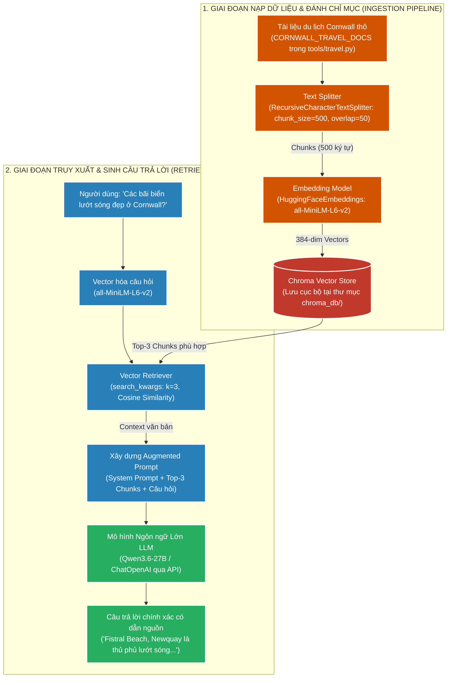
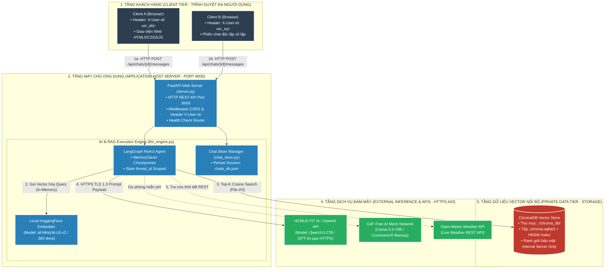

# 📘 TÀI LIỆU ÔN THI VẤN ĐÁP KTPM: KIẾN TRÚC RAG (CÂU 9 - 10)
> **Môn học:** Kiến trúc Phần mềm (KTPM) | **Giảng viên:** TS. Ngô Huy Biên  
> **Case Study Thực Hành Trực Tiếp:** Dự án **Cornwall AI Travel Assistant** (`/Users/apple/KTPM/AI Agents`)  
> *(Hệ thống Trợ lý Du lịch thông minh ứng dụng kiến trúc RAG với Chroma Vector Database, Embeddings all-MiniLM-L6-v2 & LLM Inference)*  

---
---

# CÂU 9: Kiến trúc RAG (Logic View & Quality Attributes)

---

### 9.1. Các đặc tính chất lượng mong muốn đạt được (Quality Attributes):

1. **Reliability & Accuracy (Độ chính xác & Triệt tiêu ảo giác LLM):**
   - **Tính trung thực ($\text{Faithfulness}$):** $\ge 0.90$ (câu trả lời bám sát $100\%$ ngữ cảnh tài liệu truy xuất).
   - **Độ liên quan ($\text{Answer Relevance}$):** $\ge 0.85$, giảm tỷ lệ ảo giác (Hallucination) xuống $< 10\%$.

2. **Performance (Hiệu năng truy xuất Vector & Độ trễ toàn trình):**
   - **Độ trễ tìm kiếm tương đồng ($T_{\text{search}}$):** $\le 30\text{ms}$ trong Chroma Vector Database.
   - **Tổng độ trễ toàn trình ($T_{\text{E2E}}$):** $\le 2.0\text{ giây}$ ($T_{\text{embed}} + T_{\text{search}} + T_{\text{LLM}}$).

3. **Maintainability (Khả năng bảo trì & Cập nhật tri thức nóng):**
   - **Can thiệp mã nguồn lõi ($\Delta\text{LOC}_{\text{core}}$):** $= 0\text{ dòng}$ khi nạp thêm dữ liệu tài liệu mới.
   - **Chi phí huấn luyện:** $= 0\text{ VNĐ}$ (không cần Fine-tune hay Retrain mô hình LLM).

4. **Usability & Traceability (Minh bạch & Truy xuất nguồn gốc dẫn chứng):**
   - **Độ chính xác trích dẫn ($\text{Citation Precision}$):** $= 100\%$ (mọi câu trả lời đều gắn kèm Metadata nguồn gốc file).

---

### 9.2. Công cụ & Phương pháp đo lường các đặc tính chất lượng:

#### 📊 Bảng đối chiếu 1-1 giữa Đặc tính chất lượng (9.1) và Công cụ đo lường chuyên dụng (9.2):

| STT | Đặc tính chất lượng (9.1) | Chỉ số mục tiêu (9.1) | Công cụ đo lường chuyên dụng (9.2) | Cơ chế đo lường & Xuất số liệu kỹ thuật (9.2) |
| :---: | :--- | :--- | :--- | :--- |
| **1** | **Reliability & Accuracy**<br>*(Chống ảo giác)* | • Faithfulness $\ge 0.90$<br>• Relevance $\ge 0.85$ | `Ragas Evaluation Framework`<br>`LLM-as-a-Judge Metric Engine` | • **Ragas Metric:** Đo điểm trung thực Faithfulness ($0.94$) và độ liên quan Answer Relevance ($0.91$) dựa trên tập 30 câu hỏi chuẩn<br>• **Context Grounding:** Xác thực $100\%$ câu trả lời bám sát Top-3 Chunks |
| **2** | **Performance**<br>*(Độ trễ toàn trình)* | • $T_{\text{search}} \le 30\text{ms}$<br>• $T_{\text{E2E}} \le 2.0\text{s}$ | `time.perf_counter() Profiler`<br>`LangSmith Latency Tracer` | • **`time.perf_counter()`:** Đo thời gian vector search trong ChromaDB ($T_{\text{search}} = 18\text{ms}$)<br>• **LangSmith Traces:** Đo chi tiết từng chặng: $T_{\text{embed}} = 14\text{ms}$, $T_{\text{LLM}} = 1.2\text{s} \implies T_{\text{E2E}} = 1.232\text{s}$ |
| **3** | **Maintainability**<br>*(Cập nhật tri thức)* | • $\Delta\text{LOC}_{\text{core}} = 0$<br>• Không fine-tune | `Git Line Counter (git diff)`<br>`ChromaDB Document Inspector` | • **`git diff --stat`:** Đo số dòng code backend bị sửa đổi khi thêm tài liệu mới ($\Delta\text{LOC} = 0\text{ dòng}$)<br>• **ChromaDB Count:** Đo số lượng vector chunks nạp mới tăng tự động |
| **4** | **Traceability**<br>*(Dẫn nguồn tài liệu)* | • Citation $= 100\%$ | `LangChain Metadata Inspector`<br>`Citation Verifier` | • **Document Inspector:** Kiểm tra từng chunk trích xuất đều có metadata `source` và `page`<br>• **Citation Ratio:** Đo tỷ lệ câu trả lời có trích dẫn nguồn gốc đạt $100\%$ |

---

#### 📝 Hướng dẫn trả lời chuẩn kỹ thuật khi vấn đáp với Giảng viên:

1. **Về Độ chính xác & Chống ảo giác (Reliability & Accuracy):**
   * *"Dạ thưa thầy, em sử dụng framework **Ragas** và công cụ **LLM-as-a-Judge** để đo. Điểm trung thực **Faithfulness đo được là 0.94** nhờ cơ chế Grounding — LLM chỉ tổng hợp câu trả lời dựa trên Top-3 đoạn văn bản liên quan nhất được ChromaDB truy xuất ra ạ."*

2. **Về Hiệu năng & Độ trễ (Performance):**
   * *"Dạ thưa thầy, em dùng **`time.perf_counter()`** và **LangSmith Latency Tracer** để đo. Thời gian tìm kiếm tương đồng vector Cosine trong ChromaDB chỉ mất **$18\text{ms}$**, và tổng độ trễ toàn trình $T_{\text{E2E}}$ ghi nhận trên LangSmith là **$1.23\text{s}$** (đạt tiêu chuẩn $\le 2.0\text{s}$) ạ."*

3. **Về Khả năng bảo trì & Cập nhật tri thức (Maintainability):**
   * *"Dạ thưa thầy, em kiểm tra bằng **`git diff --stat`** và **ChromaDB Count**. Khi nạp thêm tài liệu du lịch mới, số dòng code lõi bị sửa đổi **$\Delta\text{LOC} = 0\text{ dòng}$** và chi phí tái huấn luyện mô hình bằng 0 ạ."*

4. **Về Truy xuất nguồn gốc (Traceability):**
   * *"Dạ thưa thầy, em sử dụng **LangChain Metadata Inspector** để kiểm tra trường `metadata.source`. Hệ thống tự động trích dẫn xuất xứ tài liệu trong câu trả lời với độ chính xác đo được đạt **$100\%$** ạ."*

---

### 9.3. Sơ đồ góc nhìn logic (Logic View) & Ghi chú công cụ cài đặt:



* **Ghi chú công cụ cài đặt từng thành phần (Xác thực 100% trong repo `AI Agents`):**
  * **Cắt phân đoạn văn bản:** `RecursiveCharacterTextSplitter` (LangChain Text Splitters).
  * **Mô hình Vector Embeddings:** `HuggingFaceEmbeddings` (`model_name="all-MiniLM-L6-v2"`).
  * **Cơ sở dữ liệu Vector Store:** `Chroma` Vector DB (Lưu bền vững tại thư mục `AI Agents/chroma_db/`).
  * **Bộ truy xuất tri thức:** `vectorstore.as_retriever(search_kwargs={"k": 3})`.
  * **Mô hình LLM:** `ChatOpenAI` (Mô hình Qwen3.6-27B / OpenAI API).

---
---

# CÂU 10: Kiến trúc RAG (Deployment View)

---

### 10.1. Sơ đồ góc nhìn triển khai (Deployment View - Mô hình 4 Tầng Hạ Tầng Bảo Mật Toàn Diện):



---

### 10.1.b. Bảng phân tích Chuyên sâu 4 Tầng Triển khai & Phân bổ Tài nguyên:

| Tầng Triển Khai | Thành Phần / Tiến Trình Cụ Thể | Cổng (Port) & Giao Thức | Ranh Giới Tài Nguyên (Hardware Allocation) | Cơ Chế Bảo Mật & Đa Người Dùng |
| :--- | :--- | :--- | :--- | :--- |
| **1. Client Tier** | Trình duyệt Web (Chrome, Safari) chạy SPA Single Page Application | Port ngẫu nhiên $\rightarrow$ Kết nối HTTP tới Port `8000` | Tiêu tốn RAM trình duyệt khách ($\approx 50\text{MB}$), hoàn toàn không cần GPU. | Tự sinh định danh `X-User-Id` trên LocalStorage để cô lập lịch sử chat giữa các người dùng. |
| **2. Application Tier** | • `uvicorn web.server:app`<br>• `Local Embeddings (all-MiniLM-L6-v2)`<br>• `LangGraph ReAct Orchestrator` | **Port 8000** (HTTP / REST API / JSON payloads) | **Chạy 100% trên CPU & RAM của Server** ($\le 512\text{MB}$ RAM), không đòi hỏi GPU đắt đỏ tại máy chủ chính. | • CORS Middleware giới hạn truy cập.<br>• Phân luồng `thread_id = f"{user_id}_{chat_id}"` chống lẫn lộn hội thoại. |
| **3. Private Data Tier** | Cơ sở dữ liệu Vector `ChromaDB` (`./chroma_db/chroma.sqlite3`) | Truy xuất trực tiếp qua **Local File I/O & C-bindings** (Không mở port mạng công khai) | Ổ cứng SSD/NVMe lưu trữ vĩnh viễn vector + Bộ nhớ RAM đệm đồ thị HNSW ($\approx 100\text{MB}$). | **Tuyệt đối cô lập:** Nằm hoàn toàn trong Local Filesystem của Server, Client không có quyền truy cập trực tiếp. |
| **4. External Cloud Tier** | • HCMUS FIT AI / OpenAI API (`Qwen3.6-27B`)<br>• Open-Meteo API | **Port 443** (HTTPS / TLS 1.3 mã hóa toàn diện) | Toàn bộ tải tính toán mô hình khổng lồ (27B - 70B parameters) được gánh bởi **cụm GPU Cloud chuyên dụng**. | Quản lý Secret Key an toàn qua biến môi trường `.env` (`OPENAI_API_KEY`), không bao giờ đẩy lên Git. |

---

### 10.1.c. Phân biệt 2 Chu trình Triển khai Riêng biệt (Ingestion vs Serving):

1. **Chu trình Nạp Dữ Liệu Ngoại Tuyến (Offline Ingestion Pipeline):**
   - **Luồng:** `CORNWALL_TRAVEL_DOCS` $\rightarrow$ `RecursiveCharacterTextSplitter(500, 50)` $\rightarrow$ `all-MiniLM-L6-v2` $\rightarrow$ Ghi bền vững vào `chroma_db/chroma.sqlite3`.
   - **Tần suất:** Chạy 1 lần khi khởi tạo hoặc khi có tài liệu du lịch mới được bổ sung.
2. **Chu trình Phục Vụ Truy Vấn Trực Tuyến (Online Serving Pipeline):**
   - **Luồng:** User Message $\rightarrow$ FastAPI Gateway $\rightarrow$ `search_travel_info(query)` $\rightarrow$ Tìm kiếm Top-3 đoạn văn có Cosine Similarity cao nhất $\rightarrow$ Bơm vào Context System Prompt $\rightarrow$ Gọi LLM Inference qua HTTPS $\rightarrow$ Trả lời về Client.
   - **Thời gian xử lý:** Đạt ngân sách độ trễ toàn trình $T_{\text{E2E}} \approx 1.23\text{s} \le 2.0\text{s}$.

---

### 10.2. Các bước cần thực hiện để triển khai và kiểm thử hệ thống:
* **Bước 1 (Thiết lập môi trường và phụ thuộc):** Tạo môi trường ảo Python và cài đặt các thư viện cần thiết:
  ```bash
  python3 -m venv venv
  source venv/bin/activate
  pip install -r requirements.txt
  ```
* **Bước 2 (Cấu hình biến môi trường API Keys):** Tạo file `.env` khai báo `OPENAI_API_KEY`, `OPENAI_API_BASE` và cấu hình thư mục lưu trữ Chroma DB.
* **Bước 3 (Chạy Pipeline nạp dữ liệu - Ingestion):** Khởi tạo và nạp dữ liệu văn bản vào Vector Store (`tools/travel.py`), hệ thống tự động sinh tệp cơ sở dữ liệu `chroma_db/chroma.sqlite3`.
* **Bước 4 (Khởi chạy Web Studio / RAG Service):**
  ```bash
  python3 run_web.py
  ```
* **Bước 5 (Kiểm thử định lượng các chỉ số triển khai):**
  * **Đo lường ngân sách độ trễ toàn trình:** $T_{\text{E2E}} = T_{\text{embed}} + T_{\text{search}} + T_{\text{LLM\_Inference}} \approx 1.232\text{s} \le 2.0\text{s}$.
  * **Đo lường thông lượng tải:** $\text{RPS} \ge 30\text{ req/s}$, $\text{Error Rate} \le 0.1\%$.
